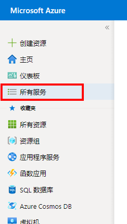
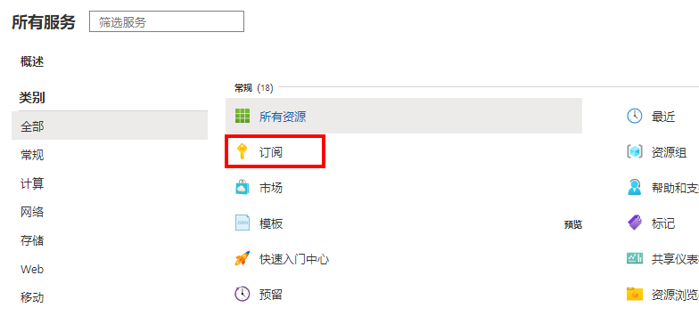
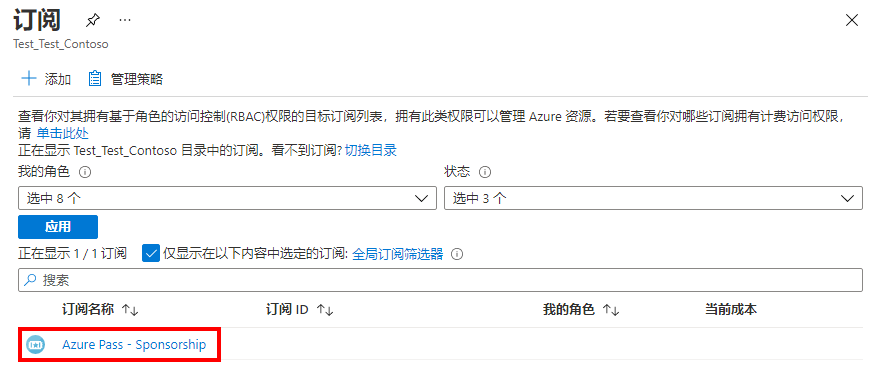
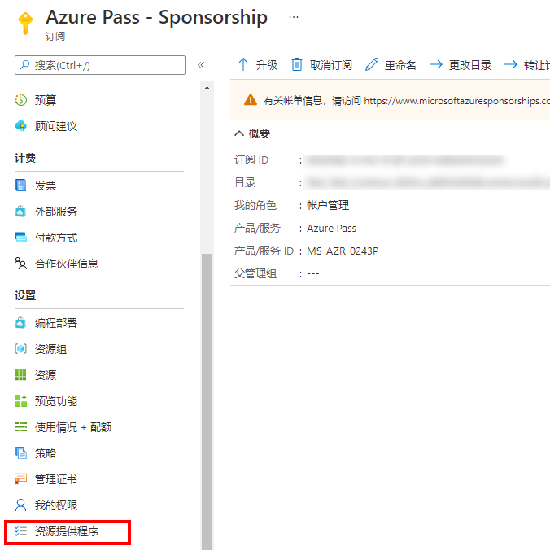
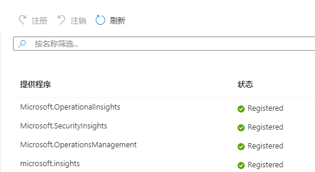

---
lab:
  title: 实验室 03：设置开发环境
  module: 'Module 2: Devices and Device Communication'
ms.openlocfilehash: ff8debfc695c847537f93449f9849775b2945b9c
ms.sourcegitcommit: 7281efeb9cb5654361c2f1aa93aea724a3898966
ms.translationtype: HT
ms.contentlocale: zh-CN
ms.lasthandoff: 05/31/2022
ms.locfileid: "145955879"
---
# <a name="set-up-the-development-environment"></a>设置开发环境

## <a name="lab-scenario"></a>实验室场景

作为 Contoso 的开发人员之一，你知道在开始构建 Azure IoT 解决方案之前设置开发环境是重要的一步。 你还知道 Microsoft 和其他公司提供了许多工具可用于开发和支持你的 IoT 解决方案，而且应做出一些决策来决定你的团队将使用哪些工具。

你决定准备一个开发环境，团队可以使用它来处理你的 IoT 解决方案。 该环境将需要支持你在 Azure 和本地电脑上的工作。 经过一番讨论，你的团队对开发环境做出了以下高层决策：

* 操作系统：Windows 10 将用作操作系统。 大多数团队成员都使用 Windows，因此这是一个合理的选择。 你向团队说明 Azure 服务支持其他操作系统（如 Mac OS 和 Linux），并且 Microsoft 为选择这些备选方案之一的团队成员提供支持文档。
* 一般编码工具：Visual Studio Code 和 Azure CLI 将作为主要的编码工具。 这两种工具均支持利用 Azure IoT SDK 的 IoT 扩展。
* IoT Edge 工具：Docker Desktop Community 和 Python 将用于支持自定义 IoT Edge 模块开发（连同 Visual Studio Code 一起）。

为了支持这些决定，你将设置以下环境：

* Windows 10 64 位：专业版、企业版或教育版（内部版本 15063 或更高版本）。 包括
  * 4GB – 8GB 系统 RAM（对于Docker，RAM 越高越好）
  * 必须启用 Windows 的 Hyper-V 和容器功能。
  * 必须在 BIOS 设置中启用 BIOS 级别硬件虚拟化支持。

  > **注意**：在虚拟机上设置开发环境时，VM 环境必须支持嵌套虚拟化 - [嵌套虚拟化](https://docs.microsoft.com/en-us/virtualization/hyper-v-on-windows/user-guide/nested-virtualization)

* Azure CLI（当前/最新）
* .NET Core 3.1.200（或更高版本）SDK
* VS 代码（最新）
* Python 3.9
* Docker Desktop Community 2.1.0.5（或更高版本）设置为 Linux 容器
* VS Code 和 Azure CLI 的 IoT 扩展
* node.js（最新）

> **重要说明**：为此课程创建了一个虚拟机，该虚拟机提供了上面指定的大多数工具。 以下说明支持使用准备好的 VM 或使用 PC 在本地设置开发环境。

## <a name="in-this-lab"></a>本实验室概览

在此实验室中，你将配置开发环境。 本实验室包括以下练习：

* 对于使用 LOD 虚拟机环境的学生：

    * 在虚拟机环境中安装开发工具扩展

* 对于需要将其本地电脑配置为开发环境的学生：

    * 在本地电脑上安装开发人员工具和产品
    * 在本地电脑上安装开发工具扩展
    * 在本地电脑上设置课程实验室文件和替代工具
    * 在本地电脑上注册资源提供程序

## <a name="lab-instructions"></a>实验室说明

> **重要说明**：对于使用托管虚拟机环境完成本课程实验室的学生，练习 1 是唯一需要完成的练习。 本实验室中的所有其他练习都适用于要在其本地电脑上设置开发环境的学生。 如果要在本地电脑上设置开发环境，请跳至“练习 2”，然后完成其余所有练习。

### <a name="exercise-1-install-tool-extensions-in-the-virtual-machine-environment"></a>练习 1：在虚拟机环境中安装工具扩展

Visual Studio Code 和 Azure CLI 工具（已在虚拟机上安装）均支持 Azure IoT 扩展，可帮助开发人员更有效地创建其解决方案。 这些扩展利用 Azure IoT SDK，通常会在确保安全预配的同时减少开发时间。 你还将添加适用于 Visual Studio Code 的 C# 扩展。

#### <a name="task-1-install-visual-studio-code-extensions-on-the-virtual-machine"></a>任务 1：在虚拟机上安装 Visual Studio Code 扩展

1. 打开 Visual Studio Code。

1. 在“Visual Studio Code”窗口的左侧，单击“扩展”。

    你可以将鼠标指针悬停在按钮上以显示按钮名称。 “扩展”按钮是从上往下数的第六个按钮。

1. 在 Visual Studio Code 扩展管理器中，搜索并安装以下扩展：

    * Microsoft 提供的 [Azure IoT Tools](https://marketplace.visualstudio.com/items?itemName=vsciot-vscode.azure-iot-tools) (`vsciot-vscode.azure-iot-tools`)
    * Microsoft 提供的[适用于 Visual Studio Code 的 C#](https://marketplace.visualstudio.com/items?itemName=ms-vscode.csharp) (`ms-vscode.csharp`)
    * [用于 Visual Studio Code 的 Azure 工具](https://marketplace.visualstudio.com/items?itemName=ms-vscode.vscode-node-azure-pack) (ms-vscode.vscode-node-azure-pack)（提供者：Microsoft）
    * [用于 Visual Studio Code 的 DTDL 编辑器](https://marketplace.visualstudio.com/items?itemName=vsciot-vscode.vscode-dtdl) (vsciot-vscode.vscode-dtdl)（提供者：Microsoft）

1. 关闭 Visual Studio Code。

#### <a name="task-2-install-azure-cli-extension---virtual-machine-environment"></a>任务 2：安装 Azure CLI 扩展 - 虚拟机环境

1. 打开一个新的命令行/终端窗口，安装 Azure IoT CLI 扩展。

    例如，可以使用 Windows 命令提示符命令行应用程序。

1. 在命令提示符下，要安装用于 IoT 的 Azure CLI 扩展，请输入以下命令：

    ```bash
    az extension add --name azure-iot
    ```

1. 在命令提示符下，要安装用于时序见解的 Azure CLI 扩展，请输入以下命令：

    ```bash
    az extension add --name timeseriesinsights
    ```

#### <a name="task-3-install-azure-cli-extension---cloud-environment"></a>任务 3：安装 Azure CLI 扩展 - 云环境

许多实验室将需要通过 Azure Cloud Shell 使用 Azure CLI IoT 扩展。 以下步骤确保安装扩展并运行最新版本。

1. 在虚拟机上打开 Web 浏览器窗口，然后在以下地址导航到 Azure Cloud Shell：

    +++https://shell.azure.com/+++

1. 系统提示时，使用用于本课程的 Azure 订阅登录。

1. 如果系统提示设置 Cloud Shell 的存储，请接受默认设置。

1. 验证 Cloud Shell 是否在使用 Bash。

    Azure Cloud Shell 页面左上角的下拉菜单用于选择环境。 验证所选的下拉值是否为 **Bash**。

1. 在命令提示符下，要安装用于 IoT 的 Azure CLI 扩展，请输入以下命令：

    ```bash
    az extension add --name azure-iot
    ```

    **注意**：如果已安装扩展，则可以通过输入以下命令来确保运行的是最新版本：

    ```bash
    az extension update --name azure-iot
    ```

1. 在命令提示符下，要安装用于时序见解的 Azure CLI 扩展，请输入以下命令：

    ```bash
    az extension add --name timeseriesinsights
    ```

#### <a name="task-4-verify-the-virtual-machine-environment"></a>任务 4：验证虚拟机环境

你应该验证开发环境是否已设置成功。 完成后，你便可开始构建 IoT 解决方案。

1. 打开一个新的命令行/终端窗口。

1. 通过运行以下命令验证 **Azure CLI** 安装，该命令将输出当前安装的 Azure CLI 版本的版本信息。

    ```cmd/sh
    az --version
    ```

    `az --version` 命令将输出已安装的 Azure CLI 的版本信息（`azure-cli` 版本号）。 此命令还会输出所有已安装的 Azure CLI 模块的版本号，包括 IoT 扩展。 应该会看到与下面类似的输出：

    ```cmd/sh
    azure-cli                           2.21.0

    core                                2.21.0
    telemetry                            1.0.6

    Extensions:
    azure-iot                          0.10.10
    timeseriesinsights                   0.2.1
    ```

1. 通过运行以下命令验证 NET Core 3.x SDK 安装，该命令将输出当前安装的 .NET Core SDK 版本的版本号。

    ```cmd/sh
    dotnet --version
    ```

    `dotnet --version` 命令将输出当前安装的 .NET Core SDK 的版本。

1. 验证是否已安装 .NET Core 3.1 或更高版本。

> 注意：如果使用 LOD 虚拟机环境完成本课程中的实验室，则会配置开发环境，并准备好进入下一实验室。

### <a name="exercise-2-install-developer-tools-and-products-on-the-local-pc"></a>练习 2：在本地电脑上安装开发人员工具和产品

> **重要说明**：练习 2 和本实验室中的所有剩余练习都适用于不使用为本课程创建的 LOD 虚拟机的学生。 需要将其本地电脑配置为开发环境的学生可以使用练习 2-5，帮助他们在其本地电脑上安装工具和配置开发环境。

#### <a name="task-1-install-net-core-on-your-local-pc"></a>任务 1：在本地电脑上安装 .NET Core

.NET Core 是 .NET 的跨平台版本，用于生成网站、服务和控制台应用。

1. 要打开 .NET Core 下载页面，请打开新的浏览器选项卡，然后导航到以下页面：

    ```
    https://dotnet.microsoft.com/download
    ```

1. 在 .NET 下载页面上的 .NET Core 下，单击“下载 .NET Core SDK”。

    .NET Core SDK 用于生成 .NET Core 应用。 在本课程的实验室中，你将使用它来生成/编辑代码文件。

1. 在弹出菜单上，单击“运行”，然后按照屏幕上的说明完成安装。

    安装时间应该不超过一分钟。 将安装以下组件：

    * .NET Core SDK 3.1.100 或更高版本
    * .NET Core 运行时 3.1.100 或更高版本
    * ASP.NET Core 运行时 3.1.100 或更高版本
    * .NET Core Windows 桌面运行时 3.1.0 或更高版本

    以下资源可用于获取更多信息：

    * [.NET Core 文档](https://aka.ms/dotnet-docs)
    * [.NET Core 依赖项和要求](https://docs.microsoft.com/en-us/dotnet/core/install/dependencies?tabs=netcore31&pivots=os-windows)
    * [SDK 文档](https://aka.ms/dotnet-sdk-docs)
    * [发行说明](https://aka.ms/netcore3releasenotes)
    * [教程](https://aka.ms/dotnet-tutorials)

#### <a name="task-2-install-visual-studio-code-on-your-local-pc"></a>任务 2：在本地电脑上安装 Visual Studio Code

Visual Studio Code 是一种在桌面上运行的轻型但功能强大的源代码编辑器，适用于 Windows、macOS 和 Linux。 它内置了对 JavaScript、TypeScript 和 Node.js 的支持，并且具有丰富的扩展生态系统，可用于其他语言（如 C++、C#、Java、Python、PHP、Go）和运行时间（如 .NET 和 Unity）。

1. 要打开 Visual Studio Code 下载页面，请打开新的浏览器选项卡，然后导航到以下页面：

    ```
    https://code.visualstudio.com/Download
    ```

    可在[此处](https://code.visualstudio.com/docs/setup/setup-overview)的 Visual Studio Code 设置指南中找到在 Mac OS X 和 Linux 上安装 Visual Studio Code 的说明。 此页面还包括 Windows 安装的更多详细说明和技巧。

1. 在“下载 Visual Studio Code”页面上，单击“Windows”。

    开始下载时，将发生两件事：打开一个弹出对话框，并显示一些入门指南。

1. 在弹出对话框中，要开始设置过程，请单击“运行”，然后按照屏幕上的说明进行操作。

    如果选择将安装程序保存到 Downloads 文件夹中，可打开该文件夹，然后双击 VSCodeSetup 可执行文件来完成安装。

    Visual Studio Code 默认安装在“C:\Program Files (x86)\Microsoft VS Code”文件夹位置（对于 64 位计算机而言）。 设置过程应该只需要一分钟。

    > 注意：在 Windows 上安装时，Visual Studio Code 需要 .NET Framework 4.5。 如果你使用 Windows 7，请确保已安装 [.NET Framework 4.5](https://www.microsoft.com/en-us/download/details.aspx?id=30653)。

    有关安装 Visual Studio Code 的详细说明，请参见以下网站上的《Microsoft Visual Studio Code 安装说明》指南：[https://code.visualstudio.com/Docs/editor/setup](https://code.visualstudio.com/Docs/editor/setup)

#### <a name="task-3-install-azure-cli-on-your-local-pc"></a>任务 3：在本地电脑上安装 Azure CLI

Azure CLI 是一种命令行工具，旨在简化 Azure 相关任务的脚本编写。 它还使你能够灵活地查询数据，并支持长时间运行的操作作为非阻塞过程。

1. 要打开 Azure CLI 工具下载页面，请打开新的浏览器选项卡，然后导航到以下页面：

    ```
    https://docs.microsoft.com/en-us/cli/azure/install-azure-cli?view=azure-cli-latest  
    ```

    你应该安装最新版本的 Azure CLI 工具。 Azure CLI 的当前版本（截至 2022 年 2 月）为 2.33 版，但请注意，新版本每月发布一次，因此最新版本可能已经更改。

1. 在“安装 Azure CLI”页面上，为 OS 选择安装选项（例如“在 Windows 上安装”），然后按照屏幕上的说明安装 Azure CLI 工具 。

    我们将在本课程的实验室中提供有关使用 Azure CLI 工具的详细说明，但是如果你现在想要更多信息，请参阅 [Azure CLI 入门](https://docs.microsoft.com/en-us/cli/azure/get-started-with-azure-cli?view=azure-cli-latest)

#### <a name="task-4-install-python-39-on-your-local-pc"></a>任务 4：在本地 电脑上安装 Python 3.9

你将使用 Python 3.9 以便支持 IoT Edge 和 Docker。

1. 要打开 Python.org 下载页面，请打开新的浏览器选项卡，然后导航到以下页面：

    ```
    https://www.python.org/downloads/
    ```

1. 在 Python 下载页面，选择适合你的操作系统的安装程序文件。

1. 出现提示时，选择该选项以运行安装程序

1. 在“安装 Python”对话框中，单击“将 Python 3.9 添加到 PATH”。

1. 单击“立即安装”  。

1. 出现“安装成功”页面时，单击“禁用路径长度限制”。

1. 要完成安装过程，请单击“关闭”。

#### <a name="task-5-install-docker-desktop-on-your-local-pc"></a>任务 5：在本地电脑上安装 Docker Desktop

你将在涵盖自定义 IoT Edge 模块的创建和部署操作的实验室中使用 Docker Desktop Community（最新稳定版本）。

1. 要打开适用于 Windows 的 Docker Desktop 下载页面，请打开新的浏览器选项卡，然后导航到以下页面：

    ```
    https://docs.docker.com/docker-for-windows/install/ 
    ```

    左侧导航菜单提供对其他操作系统的安装的访问。

1. 确认你的 PC 符合系统要求。

    你可以使用 Windows 设置打开“Windows 功能”对话框，并使用它来验证是否启用了 Hyper-V 和容器。

1. 单击 **Docker Desktop for Windows**，然后按照屏幕上的说明打开并运行下载的安装文件。

    可能需要一段时间才能显示 Docker Desktop 的安装对话框。

1. 出现“安装成功”消息时，单击“关闭”。

    Docker Desktop 在安装后不会自动启动。 要启动 Docker Desktop，请搜索 Docker，然后在搜索结果中选择 Docker Desktop。 当状态栏中的鲸鱼图标保持稳定时，Docker Desktop 将启动并运行，并且可以从任何终端窗口访问。

#### <a name="task-6---install-nodejs-on-your-local-pc"></a>任务 6 - 在本地电脑上安装 node.js

一些示例 Web 应用程序使用 node.js 在本地运行。 以下步骤确保 node.js 已安装并运行最新版本：

1. 要打开 Node.js 下载页面，请打开新的浏览器选项卡，然后导航到以下页面：

    ```
    https://nodejs.org/en/#home-downloadhead
    ```

1. 写入时下载最新的 LTS（长期支持）版本 - 14.16.0。

1. 出现提示时，选择该选项以运行安装程序。

1. 逐步执行安装程序：

   * 最终用户许可协议 - 接受条款，然后单击“下一步” 。
   * 目标文件夹 - 接受默认设置（或根据需要进行更改），然后单击“下一步” 。
   * 自定义设置 - 接受默认设置，然后单击“下一步” 。
   * 本机模块的工具 - 勾选“自动安装”，然后单击“下一步”  。
   * 准备安装 Node.js - 单击“安装” 
     * 在 UAC 对话框中，单击“是”。

1. 等待安装完成，然后单击“完成”。

1. 在“安装 Node.js 的其他工具”命令窗口中，出现提示时按 Enter 继续 。

1. 在 UAC 对话框中，单击“是”。

    将下载并安装多个包。 此操作需要一些时间。

1. 安装完成后，打开新的命令行界面并输入以下命令：

    ```powershell
    node --version
    ```

    如果 Node 安装成功，则会显示安装的版本。

### <a name="exercise-3-install-tool-extensions-for-the-local-pc-environment"></a>练习 3：为本地电脑环境安装工具扩展

Visual Studio Code 和 Azure CLI 工具均支持 Azure IoT 扩展，可帮助开发人员更有效地创建其解决方案。 这些扩展利用 Azure IoT SDK，通常会在确保安全预配的同时减少开发时间。 你还将添加适用于 Visual Studio Code 的 C# 扩展。

#### <a name="task-1-install-visual-studio-code-extensions-on-the-local-pc"></a>任务 1：在本地电脑上安装 Visual Studio Code 扩展

1. 打开 Visual Studio Code。

1. 在“Visual Studio Code”窗口的左侧，单击“扩展”。

    你可以将鼠标指针悬停在按钮上以显示按钮名称。 “扩展”按钮是从上往下数的第六个按钮。

1. 在 Visual Studio Code 扩展管理器中，搜索并安装以下扩展：

    * Microsoft 提供的 [Azure IoT Tools](https://marketplace.visualstudio.com/items?itemName=vsciot-vscode.azure-iot-tools) (`vsciot-vscode.azure-iot-tools`)
    * Microsoft 提供的[适用于 Visual Studio Code 的 C#](https://marketplace.visualstudio.com/items?itemName=ms-vscode.csharp) (`ms-vscode.csharp`)
    * [用于 Visual Studio Code 的 Azure 工具](https://marketplace.visualstudio.com/items?itemName=ms-vscode.vscode-node-azure-pack) (ms-vscode.vscode-node-azure-pack)（提供者：Microsoft）
    * [用于 Visual Studio Code 的 DTDL 编辑器](https://marketplace.visualstudio.com/items?itemName=vsciot-vscode.vscode-dtdl) (vsciot-vscode.vscode-dtdl)（提供者：Microsoft）

1. 关闭 Visual Studio Code。

#### <a name="task-2-install-azure-cli-extension---local-pc-environment"></a>任务 2：安装 Azure CLI 扩展 - 本地电脑环境

1. 打开一个新的命令行/终端窗口，安装 Azure IoT CLI 扩展。

    例如，可以使用 Windows 命令提示符命令行应用程序。

1. 在命令提示符下，要安装用于 IoT 的 Azure CLI 扩展，请输入以下命令：

    ```bash
    az extension add --name azure-iot
    ```

1. 在命令提示符下，要安装用于时序见解的 Azure CLI 扩展，请输入以下命令：

    ```bash
    az extension add --name timeseriesinsights
    ```

#### <a name="task-3-install-azure-cli-extension---cloud-environment"></a>任务 3：安装 Azure CLI 扩展 - 云环境

许多实验室将需要通过 Azure Cloud Shell 使用 Azure CLI IoT 扩展。 以下步骤确保安装扩展并运行最新版本。

1. 在 Web 浏览器中，在以下地址导航到 Azure Cloud Shell：

    本地电脑：[Azure Cloud Shell](https://shell.azure.com/)

1. 系统提示时，使用用于本课程的 Azure 订阅登录。

1. 如果系统提示设置 Cloud Shell 的存储，请接受默认设置。

1. 验证 Cloud Shell 是否在使用 Bash。

    Azure Cloud Shell 页面左上角的下拉菜单用于选择环境。 验证所选的下拉值是否为 **Bash**。

1. 在命令提示符下，要安装用于 IoT 的 Azure CLI 扩展，请输入以下命令：

    ```bash
    az extension add --name azure-iot
    ```

    **注意**：如果已安装扩展，则可以通过输入以下命令来确保运行的是最新版本：

    ```bash
    az extension update --name azure-iot
    ```

1. 在命令提示符下，要安装用于时序见解的 Azure CLI 扩展，请输入以下命令：

    ```bash
    az extension add --name timeseriesinsights
    ```

#### <a name="task-4-verify-development-environment-setup"></a>任务 4：验证开发环境设置

你应该验证开发环境是否已设置成功。

1. 打开一个新的命令行/终端窗口。

1. 通过运行以下命令验证 **Azure CLI** 安装，该命令将输出当前安装的 Azure CLI 版本的版本信息。

    ```cmd/sh
    az --version
    ```

    `az --version` 命令将输出已安装的 Azure CLI 的版本信息（`azure-cli` 版本号）。 此命令还会输出所有已安装的 Azure CLI 模块的版本号，包括 IoT 扩展。 应该会看到与下面类似的输出：

    ```cmd/sh
    azure-cli                           2.21.0

    core                                2.21.0
    telemetry                            1.0.6

    Extensions:
    azure-iot                          0.10.10
    timeseriesinsights                   0.2.1
    ```

1. 通过运行以下命令验证 NET Core 3.x SDK 安装，该命令将输出当前安装的 .NET Core SDK 版本的版本号。

    ```cmd/sh
    dotnet --version
    ```

    `dotnet --version` 命令将输出当前安装的 .NET Core SDK 的版本。

1. 验证是否已安装 .NET Core 3.1 或更高版本。

### <a name="exercise-4-set-up-course-lab-files-and-alternative-tools-on-the-local-pc"></a>练习 4：在本地电脑上设置课程实验室文件和替代工具

本课程中的许多实验室都依赖于预先构建的资源，例如可以用作实验室活动起点的代码项目。 这些实验室资源在 GitHub 项目中提供，你应将其下载到本地电脑开发环境中。

除了直接支持课程实验室的资源（GitHub 项目中包含的资源），还可以选择安装一些可选工具，因为它们支持本课程之外的学习机会。 一个示例是 PowerShell，你可能会在 Microsoft 教程和其他资源中看到对它的引用。

下面的说明将引导你完成这两种资源类型的配置。

#### <a name="task-1-download-course-lab-files-to-the-local-pc"></a>任务 1：将课程实验室文件下载到本地电脑

Microsoft 已经创建了一个 GitHub 存储库来提供对实验室资源文件的访问权限。 在某些情况下，需要将这些文件放在本地开发环境，而在许多其他情况下，这样很方便。 在此任务中，你将在开发环境中下载并提取存储库的内容。

1. 在 Web 浏览器中，导航到以下位置：[https://github.com/MicrosoftLearning/AZ-220-Microsoft-Azure-IoT-Developer](https://github.com/MicrosoftLearning/AZ-220-Microsoft-Azure-IoT-Developer)

1. 打开“代码”下拉列表，然后单击“下载 ZIP” 。

1. 要将 ZIP 文件保存到你的开发环境中，请单击“保存”。

1. 保存文件后，单击“打开文件夹”。

1. 右键单击保存的 ZIP 文件，然后单击“提取所有”

1. 请单击“浏览”，然后导航到方便访问的文件夹位置。

    > **重要说明**：默认情况下，Windows 的 [最大文件路径长度为 260](https://docs.microsoft.com/en-us/windows/win32/fileio/naming-a-file#maximum-path-length-limitation)。 由于 ZIP 中的文件路径已经很长，请避免在具有大文件路径的嵌套文件夹中提取存档。 例如，提示提取 zip 的默认路径可能类似于 c:\users\\[username]\downloads\AZ-220-Microsoft-Azure-IoT-Developer-master - 建议尽量缩短此路径，例如 c:\az220 

1. 要提取文件，请单击“提取”。

    确保记下文件的位置。

#### <a name="task-2-install-azure-powershell-module-on-the-local-pc"></a>任务 2：在本地电脑上安装 Azure PowerShell 模块

> **注意**：本课程中的实验活动不包括使用 PowerShell，但可在使用 PowerShell 的参考文档中看到示例代码。 如果要运行 PowerShell 代码，可以按照以下说明完成安装步骤。

Azure PowerShell 是一组 cmdlet，用于直接从 PowerShell 命令行管理 Azure 资源。 Azure PowerShell 旨在使学习和入门变得轻松，但提供了强大的功能以实现自动化。 以 .NET Standard 编写，Azure PowerShell 在 Windows 上可与 PowerShell 5.1 配合使用，在所有平台上可与 PowerShell 6.x 和更高版本配合使用。

> **警告**：不能同时为 PowerShell 5.1 for Windows 安装 AzureRM 和 Az 模块。 如果需要确保 AzureRM 在系统上可用，请为 PowerShell Core 6.x 或更高版本安装 Az 模块。 为此，请安装 PowerShell Core 6.x 或更高版本，然后在 PowerShell Core 终端中按照这些说明操作。

1. 确定是只为当前用户（建议的方法）还是为所有用户安装 Azure PowerShell 模块。

1. 启动你选择的 PowerShell 终端 - 如果要为所有用户安装，则必须通过以下任一方式启动提升的 PowerShell 会话：在 macOS 或 Linux 上选择“以管理员身份运行”或者运行 sudo 命令。

1. 若要仅为当前用户安装，请输入以下命令：

    ```powershell
    Install-Module -Name Az -AllowClobber -Scope CurrentUser
    ```

    或者，若要为系统上的所有用户安装，请输入以下命令：

    ```powershell
    Install-Module -Name Az -AllowClobber -Scope AllUsers
    ```

1. 默认情况下，PowerShell 库未配置为 PowerShellGet 的受信任存储库。 首次使用 PSGallery 时会看到以下提示：

    ```output
    Untrusted repository

    You are installing the modules from an untrusted repository. If you trust this repository, change
    its InstallationPolicy value by running the Set-PSRepository cmdlet.

    Are you sure you want to install the modules from 'PSGallery'?
    [Y] Yes  [A] Yes to All  [N] No  [L] No to All  [S] Suspend  [?] Help (default is "N"):
    ```

1. 回答“是”或“全部确认”，可继续进行安装。  

    Az 模块是 Azure PowerShell cmdlet 的汇总模块。 安装它时，系统会下载所有可用的 Azure 资源管理器模块并使其 cmdlet 可供使用。

> **注意**：如果已安装 Az 模块，则可运行以下命令将其更新到最新版本：
>
> ```powershell
> Update-Module -Name Az
> ```

### <a name="exercise-5---register-resource-providers-on-the-local-pc"></a>练习 5 - 在本地电脑上注册资源提供程序

在此课程中，将创建许多不同类型的资源，其中一些资源可能尚未注册，无法在当前订阅中使用。 有些资源在首次使用时会自动注册，有些资源必须先注册才能使用，否则会报错。

#### <a name="task-1---register-resource-providers-using-the-azure-cli"></a>任务 1 - 使用 Azure CLI 注册资源提供程序

Azure CLI 提供了许多命令来帮助管理资源提供程序。 在此任务中，你将确保已注册本课程所需的资源提供程序。

1. 使用浏览器，打开 [Azure Cloud Shell](https://shell.azure.com/)，并使用本课程使用的 Azure 订阅登录。

1. 若要查看资源提供程序的当前状态列表，请输入以下命令：

    ```powershell
    az provider list -o table
    ```

    这将显示一个很长的资源列表，类似于：

    ```powershell
    Namespace                                RegistrationPolicy    RegistrationState
    ---------------------------------------  --------------------  -------------------
    Microsoft.OperationalInsights            RegistrationRequired  Registered
    microsoft.insights                       RegistrationRequired  NotRegistered
    Microsoft.DataLakeStore                  RegistrationRequired  Registered
    Microsoft.DataLakeAnalytics              RegistrationRequired  Registered
    Microsoft.Web                            RegistrationRequired  Registered
    Microsoft.ContainerRegistry              RegistrationRequired  Registered
    Microsoft.ResourceHealth                 RegistrationRequired  Registered
    Microsoft.BotService                     RegistrationRequired  Registered
    Microsoft.Search                         RegistrationRequired  Registered
    Microsoft.EventGrid                      RegistrationRequired  Registered
    Microsoft.SignalRService                 RegistrationRequired  Registered
    Microsoft.VSOnline                       RegistrationRequired  Registered
    Microsoft.Sql                            RegistrationRequired  Registered
    Microsoft.ContainerService               RegistrationRequired  Registered
    Microsoft.ManagedIdentity                RegistrationRequired  Registered
    ...
    ```

1. 若要查看返回包含字符串 Event 的命名空间列表，请运行以下命令：

    ```powershell
    az provider list -o table --query "[?contains(namespace, 'Event')]"
    ```

    结果会类似于：

    ```powershell
    Namespace            RegistrationState    RegistrationPolicy
    -------------------  -------------------  --------------------
    Microsoft.EventGrid  NotRegistered        RegistrationRequired
    Microsoft.EventHub   Registered           RegistrationRequired
    ```

1. 若要注册本课程所需的资源，请执行以下命令：

    ```powershell
    az provider register --namespace "Microsoft.EventGrid" --accept-terms
    az provider register --namespace "Microsoft.EventHub" --accept-terms
    az provider register --namespace "Microsoft.Insights" --accept-terms
    az provider register --namespace "Microsoft.TimeSeriesInsights" --accept-terms
    ```

    > 注意：你可能会看到 -accept-terms 处于预览状态的警告 - 可以忽略它。

    > 注意：microsoft.insights 以小写形式列出 - 但是注册/取消注册命令不区分大小写。

1. 若要查看资源的更新状态，请执行以下命令：

    ```powershell
    az provider list -o table --query "[?(contains(namespace, 'insight') || contains(namespace, 'Event') || contains(namespace, 'TimeSeriesInsights'))]"
    ```

    > 注意：尽管注册/取消注册命令不区分大小写，但查询语言需要区分，所以 insight 必须小写。

    现应注册资源。

#### <a name="task-2---register-resource-providers-using-the-azure-portal"></a>任务 2 - 使用 Azure 门户注册资源提供程序

可以通过门户查看注册状态，并注册资源提供程序命名空间。 在此任务中，你将熟悉 UI。

1. 如有必要，使用 Azure 帐户凭据登录到 [portal.azure.com](https://portal.azure.com)。

1. 在门户中，选择“所有服务”。 

    

1. 选择“订阅”。

    

1. 从订阅列表中，选择要用于注册资源提供程序的订阅。

    

1. 对于订阅，选择“资源提供程序”  。

    

1. 查看资源提供程序列表，可以单击相应的操作来注册或取消注册资源。

    

1. 若要筛选列出的资源，请在搜索文本框中输入“insights”。

    请注意，在输入搜索条件时，会对列表进行筛选。 搜索也不区分大小写。
