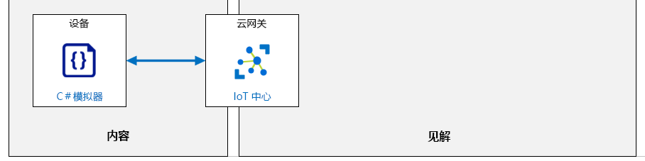

---
lab:
  title: 实验室 04：将 IoT 设备连接到 Azure
  module: 'Module 2: Devices and Device Communication'
ms.openlocfilehash: 1859cc4bc1343476a54b09d8b7cdb69359eb849b
ms.sourcegitcommit: 06dc1e6caa88a09b1246dd1161f15f619db9c6f8
ms.translationtype: HT
ms.contentlocale: zh-CN
ms.lasthandoff: 02/10/2022
ms.locfileid: "138421546"
---
# <a name="connect-an-iot-device-to-azure"></a>将 IoT 设备连接到 Azure

## <a name="lab-scenario"></a>实验室场景

Contoso 以生产高质量的奶酪而闻名。 由于公司的知名度和销售量都在迅速增长，他们希望采取措施来确保其奶酪保持其客户期望的高质量水平。

过去，温度和湿度数据是在每次轮班期间由工厂工人收集。 该公司担心，随着新设施上线，工厂扩建将需要加强监控，而用于收集数据的手动流程将无法缩放。

Contoso 已决定启动使用 IoT 设备监控温度和湿度的自动化系统。 遥测数据的通信速率将可调整，随着批量奶酪通过对环境敏感的处理流程，确保其制造过程受到控制。

为了在全面实施之前评估此资产监视解决方案，你需要将 IoT 设备（包括温度和湿度传感器）连接到 IoT 中心。

> **注意**：基于实验目的，在本实验室中，将创建可模拟物理 IoT 设备和传感器的 .NET Core 控制台应用程序。 模拟设备将实现 IoT 设备 SDK，并采用与物理设备一样的方式连接到 IoT 中心。 模拟设备还将使用物理设备使用的相同 SDK 资源传递遥测值，但传感器读数是生成的值，而不是从温度和湿度传感器读取的实际值。

将创建以下资源：



## <a name="in-this-lab"></a>本实验室概览

在本实验室中，你首先将查看实验室先决条件，并根据需要运行脚本来确保你的 Azure 订阅包含所需的资源。 然后，使用 Azure 门户向 Azure IoT 中心注册设备 ID，并在 Visual Studio Code 中开发相应的模拟设备应用。 然后，将连接字符串（在注册设备时由 IoT 中心创建）插入模拟设备代码中，并运行应用以测试连接，验证遥测是否已按预期到达 IoT 中心。 本实验室包括以下练习：

* 配置实验室先决条件（所需的 Azure 资源）
* 使用 Azure 门户创建 Azure IoT 中心设备 ID
* 创建和测试模拟设备 (C#)

## <a name="lab-instructions"></a>实验室说明

### <a name="exercise-1-configure-lab-prerequisites"></a>练习 1：配置实验室先决条件

本实验室假定以下 Azure 资源可用：

| 资源类型  | 资源名称                |
| :------------- | :--------------------------- |
| Resource Group | rg-az220                     |
| IoT 中心        | iot-az220-training-{your-id} |

若要确保这些资源可用，请完成以下步骤。

1. 在虚拟机环境中，打开 Microsoft Edge 浏览器窗口，然后导航到以下 Web 地址：

    ```text
    https://portal.azure.com/#create/Microsoft.Template/uri/https%3A%2F%2Fraw.githubusercontent.com%2FMicrosoftLearning%2FAZ-220-Microsoft-Azure-IoT-Developer%2Fbicep%2FAllfiles%2FARM%2Flab04.json
    ```

    > 注意：每当看到绿色的“T”符号（例如+++输入此文本+++）时，可以单击关联的文本，信息将键入到虚拟机环境内的当前字段中。

1. 如果系统提示登录到 Azure 门户，请输入将要用于本课程的 Azure 凭据。

    将显示“自定义部署”页。

1. 在“项目详细信息”下的“订阅”下拉列表中，确保你打算在本课程中使用的 Azure 订阅已选中 。

1. 在“资源组”下拉列表中，选择“rg-az220” 。

    > 注意：如果未列出 rg-az220：
    >
    > 1. 在“资源组”下拉列表中，选择“新建”。
    > 1. 在“名称”下，输入 rg-az220 。
    > 1. 单击“确定”  。

1. 在“实例详细信息”下的“区域”下拉列表中，选择离你最近的区域 。

    > 注意：如果 rg-az220 组已存在，则“区域”字段将设置为资源组使用的区域，并且为只读 。

1. 在“你的 ID”字段中，输入在练习 1 中创建的唯一 ID。

1. 在“课程 ID”字段中，输入 az220 。

1. 若要验证模板，请单击“查看并创建”。

1. 验证通过后，单击“创建”。

    将启动部署。

1. 部署完成后，在左侧导航区域中，若要查看模板的任何输出值，请单击“输出”。

    记下输出供稍后使用：

    * connectionString

现已创建资源。

### <a name="exercise-2-create-an-azure-iot-hub-device-id-using-the-azure-portal"></a>练习 2：使用 Azure 门户创建 Azure IoT 中心设备 ID

在本课程中，将使用 IoT 中心的功能来帮助为 Contoso 构建功能齐全的可缩放 IoT 解决方案，但在本实验室中，侧重于使用 IoT 中心在 IoT 中心和 IoT 设备之间建立可靠安全的双向通信。

在本练习中，将在 Azure 门户中打开 IoT 中心，将新的 IoT 设备添加到设备注册表中，然后获取 IoT 中心为设备创建的连接字符串的副本（实验室稍后将在设备代码中使用该字符串）。

#### <a name="task-1-create-the-device"></a>任务 1：创建设备

1. 如有需要，登录 Azure 门户。

    在虚拟机环境中，打开浏览器窗口并导航到：+++https://portal.azure.com+++

    如果有多个 Azure 帐户，请确保使用与本课程要使用的订阅绑定的帐户登录。

1. 验证是否正在显示 AZ-220 仪表板。

1. 在 rg-az220 资源组磁贴上，单击“iot-az220-training-{your-id}” 

1. 在“IoT 中心”边栏选项卡左侧菜单的“设备管理”下，单击“设备” 。

1. 在“IoT 设备”窗格顶部，单击“添加设备” 。

1. 在“设备 ID”字段中，输入“sensor-th-0001” 

    设备标识（设备 ID）用于设备身份验证和访问控制。

    为设备标识创建某种形式的命名约定会很有帮助。 有几个原因，其中一个原因是设备 ID 是 IoT 中心用来表示设备的值。 设备 ID 可以简洁明了地将设备与其他设备进行区分，因此很有用。

    上面建议使用的命名约定 sensor-th-0001 将此设备标识为具有传感功能的设备 (sensor)，该设备报告温度和湿度值 (-th)，并且是该类型的一系列设备（多达 9999 个）中的第一个 (-0001)   。 Contoso 可安装 200 或 5000 个此类设备，用于报告工厂车间的环境状况，设备标识将是可用于识别设备的方式之一。

1. 确保在“身份验证类型”下，选中“对称密钥”。

    请注意，有三种类型的身份验证可用。 在本实验室中，将使用三种中最简单的一种：对称密钥。 X.509 证书及如何在身份验证中使用将在后面的实验室中介绍。

1. 在“自动生成密钥”下，确保选中此复选框。

    选中“自动生成密钥”后，会隐藏“主密钥”和“辅助密钥”字段，系统会在保存记录后自动填充这些字段  。 取消选择“自动生成密钥”后，这些字段会恢复显示状态，可以直接在其中输入值。

1. 在“将此设备连接到 IoT 中心”下，确保选中“启用” 。

    如果要在推出之前创建设备条目，可以在设备初始创建期间在此处选择“禁用”选项。 如果想要保留设备记录，但又想阻止关联的设备连接到 IoT 中心，也可以在将来的某个时间将此值设置为“禁用”。

1. 在“父设备”下，将值保留为“无父设备” 。

    IoT 设备可能会充当其他设备（如 IoT Edge 设备）的父设备。 在本课程的后面部分，你将有机会实现“父-子”设备关系。

1. 要将此设备记录添加到 IoT 中心，请单击“保存”。

    片刻之后，“IoT 设备”窗格将刷新并列出新设备。

    > 提示：可能需要手动刷新 - 单击页面上的“刷新”按钮，而不是刷新浏览器

#### <a name="task-2-get-the-device-connection-string"></a>任务 2：获取设备连接字符串

设备如果要连接到 IoT 中心，它需要先建立连接。 在本实验室中，将使用连接字符串将设备直接连接到 IoT 中心（相应的身份验证通常称为对称密钥身份验证）。 使用对称密钥身份验证时，有两个可用的连接字符串 - 一个使用主密钥，另一个使用辅助密钥。 如上所述，仅在设备记录保存后才生成主密钥和辅助密钥。 因此，要获取其中某个连接字符串，必须先保存记录（在上面的任务中执行的操作），然后重新打开设备记录（要执行的操作）。

1. 在 IoT 中心的“IoT 设备”窗格的“设备 ID”下，单击“sensor-th-0001”  。

1. 花一些时间查看“sensor-th-0001”设备详细信息边栏选项卡中的内容。

    除了设备属性之外，请注意，还可通过设备详细信息边栏选项卡，在边栏选项卡顶部查看一系列设备相关功能（例如“直接方法”和“设备孪生”）。

1. 请注意，密钥和连接字符串值已填充。

    默认情况下，这些值可能稍显混乱，可以单击每个字段右侧的“眼睛”图标来显示这些值或隐藏这些值。

1. 在“主连接字符串”字段右侧，单击“复制” 。

    可以将鼠标指针悬停在按钮图标上以显示其名称；“复制”按钮在最右侧。

    > **注意**：稍后在实验室中需要使用“主连接字符串”值，因此建议将其保存到便于访问的位置（可以将其粘贴到记事本等文本编辑器中）。

    连接字符串采用以下格式：

    ```text
    HostName={IoTHubName}.azure-devices.net;DeviceId=sensor-th-0001;SharedAccessKey={SharedAccessKey}
    ```

### <a name="exercise-3-create-and-test-a-simulated-device-c"></a>练习 3：创建和测试模拟设备 (C#)

借助 Azure IoT 设备 SDK 可以使用设备客户端构建在 IoT 设备上运行的应用。 可借助 SDK 中的工具建立安全连接、打包消息和实现与 IoT 中心的通信。 还可借助设备 SDK 从 IoT 中心接收消息、作业、方法或设备孪生更新。

在本练习中，将使用 Visual Studio Code 和 Azure IoT 设备 SDK 创建模拟设备应用程序。 将使用在上一个练习中创建的设备 ID 和共享访问密钥（主连接字符串）将设备连接到 Azure IoT 中心。 然后，测试安全的设备连接和通信，确保 IoT 中心按预期从设备接收模拟的温度和湿度值。

> **注意**：将使用 C# 编程语言编写模拟设备代码，如果你的编程技能有点生疏或更习惯使用其他编程语言，也无需担心，相关说明中的步骤很容易操作。 重要的是让你了解 IoT 设备 SDK 是如何在代码中实现的（会详细讲解）。

#### <a name="task-1-create-the-initial-project"></a>任务 1：创建初始项目

1. 打开一个新的命令行/终端窗口。

    例如，可以使用 Windows 命令提示符命令行应用程序。

1. 导航到要用于创建模拟设备应用程序的文件夹位置。

    根文件夹的位置并不重要，重点是使用短文件夹路径可以轻松查找内容，这会很有用。

1. 在命令提示符下，输入以下命令，创建一个名为“CaveDevice”的目录并将当前目录更改为该目录：

   ```bash
   mkdir CaveDevice
   cd CaveDevice
   ```

1. 要创建新的 .NET 控制台应用程序，请输入以下命令：

    ```bash
    dotnet new console
    ```

    该命令会在文件夹中创建一个 Program.cs 文件以及一个项目文件。

1. 若要安装模拟设备应用所需的 Azure IoT 设备 SDK 和代码库，请输入以下命令：

    ```bash
    dotnet add package Microsoft.Azure.Devices.Client
    ```

    > **注意**：Microsoft.Azure.Devices.Client 包包含适用于 .NET 的 Azure IoT 设备 SDK，并且有一个作为依赖项的 Newtonsoft.Json 包 。 Newtonsoft.Json 包包含可帮助创建和操作 JSON 的 API。

    在下一个任务中，你将构建并测试你的模拟设备应用。

1. 若要确保下载了所有应用程序依赖项，请输入以下命令

    ```bash
    dotnet restore
    ```

1. 打开 **Visual Studio Code**。

1. 在“文件”菜单上，单击“打开文件夹”。

1. 在“打开文件夹”对话框中，导航到 CaveDevice 目录的创建位置 。

1. 在文件夹列表中，单击“CaveDevice”，然后单击“选择文件夹” 。

    Visual Studio Code 的“资源管理器”窗格现在应列出了两个 C# 项目文件：

    * CaveDevice.csproj
    * Program.cs

    > **注意**：如果看到消息“CaveDevice 中缺少生成和调试所需的资产。是否添加？”，可以单击“是”以继续。

#### <a name="task-2-explore-the-application"></a>任务 2：探究应用程序

如上所述，应用程序目前由两个文件组成：

* CaveDevice.csproj
* Program.cs

在此任务中，将使用 Visual Studio Code 查看这两个应用程序文件的内容和用途。

1. 在“资源管理器”窗格中，单击“CaveDevice.csproj”打开应用程序项目文件 。

    现在，CaveDevice.csproj 文件应已在代码编辑器窗格中打开。

1. 花点时间查看“CaveDevice.csproj”文件的内容。

    文件内容应如下所示：

    ```xml
    <Project Sdk="Microsoft.NET.Sdk">

        <PropertyGroup>
            <OutputType>Exe</OutputType>
            <TargetFramework>netcoreapp3.1</TargetFramework>
        </PropertyGroup>

        <ItemGroup>
            <PackageReference Include="Microsoft.Azure.Devices.Client" Version="1.*" />
        </ItemGroup>

    </Project>
    ```

    > **注意**：文件中的包版本号可以与上面显示的版本号不同。

    项目文件 (.csproj) 是一个 XML 文档，用于指定要使用的项目的类型。 在本例中，项目是一个 SDK 样式的项目。

    正如你所见，项目定义包含两个部分 - PropertyGroup 和 ItemGroup 。

    PropertyGroup 定义构建此项目将产生的输出的类型。 在本例中，你将构建面向.NET Core 3.1 的可执行文件。

    ItemGroup 指定应用程序所需的任何外部库。 这些特定的引用适用于 NuGet 包，每个包引用都指定了包名称和版本。 `dotnet add package` 命令（上述步骤中输入的）将这些引用添加到了项目文件中，而 `dotnet restore` 命令确保了下载所有依赖项。

    > **提示**：可以在[此处](https://docs.microsoft.com/en-us/nuget/what-is-nuget)详细了解 NuGet。

1. 在“资源管理器”窗格中，单击“Program.cs”。

    现在，Program.cs 文件应已在代码编辑器窗格中打开。

1. 花些时间查看 Program.cs 文件的内容。

    文件内容应如下所示：

    ```csharp
    using System;

    namespace CaveSensor
    {
        class Program
        {
            static void Main(string[] args)
            {
                Console.WriteLine("Hello World!");
            }
        }
    }
    ```

    此程序只是将“Hello World!” 写入命令行窗口。 虽然这里没有太多代码，但仍有一些值得注意的地方：

    * `using` 区域 - 源文件会列出代码正在使用的命名空间（通常在文件顶部列出，与这里一样）。 在此示例中，代码指定将使用 `System`。 这意味着当代码使用 System 命名空间中包含的组件时，不必在该代码行中显式列出 System 一词 。 例如，在上面的代码中，`Console` 类用于写出“Hello World!”。 `Console` 类是 System 命名空间的一部分，但在使用 `Console` 时，不必包括 `System` 一词。 如果某些命名空间嵌套得非常深（五个或五个以上的级别很常见），这样做的好处会更明显。 再次参考上面的代码，如果没有指定 `using System;`，则必须将控制台行编写为：

        ```csharp
        System.Console.WriteLine("Hello World!");
        ```

    * `namespace` 区域 - 指定命名空间之后使用 `{ }` 包含的类是该命名空间的一部分。 因此，与控制台是 System 命名空间的一部分类似，在上面的示例中，Program 类是 CaveSensor 命名空间的一部分，其全名是 CaveSensor.Program    。

    * `class` 区域 - 定义 Program 类的内容。 一个源文件中可以有多个类

    > **注意**：开发人员通常会将类分离到他们自己的源文件中（每个源文件一个类），尤其是在较大的项目中。 但是，在本课程的实验室中，每个文件中将包含多个类。 这有助于简化实验室说明，但这并不是最佳做法。

1. 在 Visual Studio Code 的“视图”菜单上，单击“终端”。

    这将在 Visual Studio Code 窗口的底部打开集成终端。 将使用“终端”窗口来编译和运行控制台应用程序。

1. 在“终端”窗格中，确保将当前目录路径设置为 `CaveDevice` 文件夹。

    终端命令提示符包括当前目录路径。 输入的命令在当前位置运行，因此请确保位于 `CaveDevice` 文件夹中。

1. 要生成并运行 CaveDevice 项目，请输入以下命令：

    ```cmd/sh
    dotnet run
    ```

1. 请注意，随即会显示“Hello World！” 。

    稍后，应该会看到 Hello World! 直接显示在输入的 `dotnet run` 命令下的行上。

    将在模拟设备应用程序中使用相同的 `Console.WriteLine` 方法在本地显示信息，这有助于查看发送到 IoT 中心的信息并跟踪设备正在完成的进程。

    虽然此 Hello World 应用演示了一些基本概念，但它显然不是模拟设备。 在下一个任务中，要将此代码替换为模拟设备的代码。

#### <a name="task-3-implement-the-simulated-device-code"></a>任务 3：实现模拟设备代码

在此任务中，将使用 Visual Studio Code 输入利用 Azure IoT 设备 SDK 连接到 IoT 中心资源的代码。

1. 在“资源管理器”窗格中，单击“Program.cs”。

1. 选中所有现有代码，然后将其删除。

1. 在代码编辑器窗格中，为创建模拟设备应用程序的基本结构，输入以下代码：

    > **重要说明**：如果要将代码粘贴到 LODS 等学习环境中，需要注意以下几点：
    >
    > * “键入文本 -> 键入剪贴板文本”缓冲区是有限的，因此它可能会截断复制的代码 - 请仔细检查并添加任何缺失的字符。
    > * 当“键入剪贴板文本”模拟键入操作时，Visual Studio Code 中的默认设置将自动缩进代码并插入右括号（`)`、`}` 和 `]`），这会导致字符重复和错误缩进。 可以使用以下设置关闭这些操作：
    >    * 编辑器：自动插入右括号
    >    * 编辑器：自动缩进
    > * 可以随时使用 F1 并输入“格式化文档”或按 SHIFT + ALT + F 重新格式化源  


    ```csharp
    // INSERT using statements below here

    namespace CaveDevice
    {
        class Program
        {
            // INSERT variables below here

            // INSERT Main method below here

            // INSERT SendDeviceToCloudMessagesAsync method below here

            // INSERT CreateMessageString method below here

        }

        // INSERT EnvironmentSensor class below here

    }
    ```

    > **注意：** 可以看见，命名空间和类已保留，但其他项是占位符注释。 在以下步骤中，将在文件中特定注释下方插入代码。

    > **提示**：要在 Visual Studio Code 中重新格式化粘贴的文本，请按 SHIFT + ALT + F，或按 F1 打开命令面板并搜索“格式化文档”  。

1. 找到 `// INSERT using statements below here` 注释。

1. 若要指定应用程序代码将使用的命名空间，请输入以下代码：

    ```csharp
    using System;
    using System.Text;
    using System.Threading.Tasks;
    using Microsoft.Azure.Devices.Client;
    using Newtonsoft.Json;
    ```

    请注意，除了指定 System 之外，你还声明了代码将使用的其他命名空间，例如用于编码字符串的 System.Text、用于异步任务的 System.Threading.Tasks 和用于之前添加的两个包的命名空间  。

    > **提示**：插入代码时，代码布局可能不理想。 通过在代码编辑器窗格中右键单击，然后单击“设置文档格式”，可以让 Visual Studio Code 为你设置文档格式。 可以通过打开“任务”窗格（按 F1），键入“设置文档格式”，然后按 Enter 来获得相同的结果   。 在 Windows 上，此任务的快捷方式是 Shift+Alt+F。

1. 找到 `// INSERT variables below here` 注释。

1. 若要指定程序正在使用的变量，请输入以下代码：

    ```csharp
    // Contains methods that a device can use to send messages to and receive from an IoT Hub.
    private static DeviceClient deviceClient;

    // The device connection string to authenticate the device with your IoT hub.
    // Note: in real-world applications you would not "hard-code" the connection string
    // It could be stored within an environment variable, passed in via the command-line or
    // stored securely within a TPM module.
    private readonly static string connectionString = "{Your device connection string here}";
    ```

1. 花点时间检查你刚刚输入的代码（和代码注释）。

    deviceClient 变量用于存储 DeviceClient 的实例 - 该类来自 Azure IoT 设备 SDK，并且包含设备可用于向 IoT 中心发送消息和从 IoT 中心接收消息的方法 。

    connectionString 变量将包含之前创建的设备的连接字符串。 DeviceClient 使用此值连接到 IoT 中心。

    > **重要说明**：在本课程中，你将在本实验室和其他实验室中看到相关示例，其中连接字符串、密码和其他配置信息均硬编码到应用程序中。 这样做只是为了简化实验室，我们并不推荐这种做法。 像这样的安全问题将尽可能在其出现在实验室中时得到解决。 安全主题（和其他重要的注意事项）将以支持课程整体流程的方式，在讲师演示和学生手册的内容中进行阐述。 这两者可能并不总是完全一致。 因此，你可能会在实验室中接触到一些直到课程后期才会详细介绍的主题。

    如代码注释中所述，连接字符串和类似的配置值应通过其他方式提供，例如环境变量、命令行参数，或者最好是存储在受信任的平台模块 (TPM) 等安全硬件中。

1. 在刚刚输入的代码中，使用从 IoT 中心复制的主连接字符串更新 connectionString 的值。

    更新后，connectionString 变量行应类似于以下所示：

    ```csharp
    private readonly static string connectionString = "HostName=iot-az220-training-dm200420.azure-devices.net;DeviceId=sensor-th-0001;SharedAccessKey=hfavUmFgoCPA9feWjyfTx23SUHr+dqG9X193ctdEd90=";
    ```

1. 找到 `// INSERT Main method below here` 注释。

1. 要构造模拟设备应用程序的 Main 方法，请输入以下代码：

    ```csharp
    private static void Main(string[] args)
    {
        Console.WriteLine("IoT Hub C# Simulated Cave Device. Ctrl-C to exit.\n");

        // Connect to the IoT hub using the MQTT protocol
        deviceClient = DeviceClient.CreateFromConnectionString(connectionString, TransportType.Mqtt);
        SendDeviceToCloudMessagesAsync();
        Console.ReadLine();
    }
    ```

    Main 方法是应用启动后应用程序运行的第一部分。

1. 花一些时间检查刚输入的代码（和代码注释）。

    下面是一个简单的设备应用的基本结构：

    * 连接到 IoT 中心
    * 将遥测发送到应用（设备到云消息）

    请注意，deviceClient 变量使用 DeviceClient 静态方法 CreateFromConnectionString 的结果进行初始化  。 此方法使用之前指定的连接字符串，并选择设备用于发送遥测的协议 - 在本例中为 MQTT。

    > **注意**：在生产应用程序中，异常处理代码中会包含 CreateFromConnectionString 方法调用，用于合理有效地处理任何连接问题。 此代码和其他实验室代码都很简洁，旨在突出要点，出于此目的省略了大多数错误处理内容。

    连接后，将调用 SendDeviceToCloudMessagesAsync 方法。 你可能会注意到方法名称标有“红色波浪”型下划线，这是因为 Visual Studio Code 已经注意到还未实现 SendDeviceToCloudMessagesAsync。 我们将很快添加该方法。

    最后，应用程序等待用户输入。

    > **信息**：[此处](https://docs.microsoft.com/en-us/dotnet/api/microsoft.azure.devices.client.deviceclient?view=azure-dotnet)介绍了 DeviceClient 类。
    >
    > **信息**：[此处](https://docs.microsoft.com/en-us/dotnet/api/microsoft.azure.devices.client.deviceclient.createfromconnectionstring?view=azure-dotnet#Microsoft_Azure_Devices_Client_DeviceClient_CreateFromConnectionString_System_String_Microsoft_Azure_Devices_Client_TransportType_)介绍了 CreateFromConnectionString 类。
    >
    > **信息**：[此处](https://docs.microsoft.com/en-us/azure/iot-hub/iot-hub-devguide-protocols)介绍了受支持的传输协议。

1. 找到 `// INSERT - SendDeviceToCloudMessagesAsync below here` 注释。

1. 输入以下代码以构造 SendDeviceToCloudMessagesAsync 方法：

    ```csharp
    private static async void SendDeviceToCloudMessagesAsync()
    {
        // Create an instance of our sensor
        var sensor = new EnvironmentSensor();

        while (true)
        {
            // read data from the sensor
            var currentTemperature = sensor.ReadTemperature();
            var currentHumidity = sensor.ReadHumidity();

            var messageString = CreateMessageString(currentTemperature, currentHumidity);

            // create a byte array from the message string using ASCII encoding
            var message = new Message(Encoding.ASCII.GetBytes(messageString));

            // Add a custom application property to the message.
            // An IoT hub can filter on these properties without access to the message body.
            message.Properties.Add("temperatureAlert", (currentTemperature > 30) ? "true" : "false");

            // Send the telemetry message
            await deviceClient.SendEventAsync(message);
            Console.WriteLine("{0} > Sending message: {1}", DateTime.Now, messageString);

            await Task.Delay(1000);
        }
    }
    ```

    请注意，SendDeviceToCloudMessagesAsync 方法的声明包含关键字 `async`。 这指定了该方法包含使用 `await` 关键字的异步代码，并指示编译器处理回调管道。

1. 花一些时间检查刚输入的代码（和代码注释）。

    此方法实现典型的消息循环：

    * 从一个或多个传感器读取
    * 创建要发送的消息
    * 发送消息
    * 等待一段时间，或等待事件发生等。
    * 重复循环

    下面的说明更详细地解释了该方法代码：

    * 该代码执行的第一项操作是创建 EnvironmentSensor 类的实例。 此操作在循环外完成，用于支持模拟循环内的传感器数据。 接着快速添加 EnvironmentSensor 类。

    * 然后启动一个无限循环 - `while(true) {}` 将一直重复，直到用户按下 CTRL+C。

    * 在循环中，执行的第一项操作是从传感器中读取温度和湿度值，并使用这些值来创建消息字符串，稍后将添加 CreateMessageString 的代码。

    * 然后创建要发送到 IoT 中心的真实消息。 可以通过从 Azure IoT 设备 SDK 创建 Message 类的实例来实现此目的 - 数据结构表示用于与 Iot 中心交互的消息（IoT 中心接受特定格式的消息）。 用于 Message 类的构造函数需要将消息字符串编码为字节数组。

    * 接下来，使用其他属性扩充消息 - 例如，在此处，如果 currentTemperature 大于 30，则将 temperatureAlert 属性设置为 true，否则设置为 false 。

    * 然后通过 `await deviceClient.SendEventAsync(message);` 调用来发送遥测消息。 请注意，此行包含 `await` 关键字。 这会指示编译器以下代码是异步的，并将在未来的某个时间完成 - 当它完成时，此方法将继续执行下一行。

    * 最后，将消息字符串写入本地控制台窗口以显示遥测已发送到 IoT 中心，然后等待 1000 毫秒（1 秒）再重复该循环。

    > **信息**：可以在[此处](https://docs.microsoft.com/en-us/dotnet/csharp/async)详细了解 C# 中的 `async`、`await` 和异步编程。

    > **信息**：[此处](https://docs.microsoft.com/en-us/dotnet/api/microsoft.azure.devices.client.message?view=azure-dotnet)介绍了 Message 类。

1. 找到 `// INSERT CreateMessageString method below here` 注释。

1. 为构造根据传感器读数创建 JSON 字符串的 CreateMessageString 方法，输入以下代码：

    ```csharp
    private static string CreateMessageString(double temperature, double humidity)
    {
        // Create an anonymous object that matches the data structure we wish to send
        var telemetryDataPoint = new
        {
            temperature = temperature,
            humidity = humidity
        };

        // Create a JSON string from the anonymous object
        return JsonConvert.SerializeObject(telemetryDataPoint);
    }
    ```

    此方法创建具有温度和湿度属性的匿名对象，并将其分配给 telemetryDataPoint。

    然后，telemetryDataPoint 的值通过 JsonConvert 类转换为 JSON 字符串，该类是之前添加的 Newtonsoft.Json 包的一部分  。 然后返回 JSON 字符串值，充当消息中的有效负载。

1. 找到 `// INSERT EnvironmentSensor class below here` 注释。

1. 为构造 EnvironmentSensor 类，输入以下代码：

    ```csharp
    /// <summary>
    /// This class represents a sensor
    /// real-world sensors would contain code to initialize
    /// the device or devices and maintain internal state
    /// a real-world example can be found here: https://bit.ly/IoT-BME280
    /// </summary>
    internal class EnvironmentSensor
    {
        // Initial telemetry values
        double minTemperature = 20;
        double minHumidity = 60;
        Random rand = new Random();

        internal EnvironmentSensor()
        {
            // device initialization could occur here
        }

        internal double ReadTemperature()
        {
            return minTemperature + rand.NextDouble() * 15;
        }

        internal double ReadHumidity()
        {
            return minHumidity + rand.NextDouble() * 20;
        }
    }
    ```

    这是一个非常简单的类，它使用随机数来返回表示温度和湿度的值。 在实际中，与传感器的交互通常要复杂得多，尤其是需要在较细化的层面与其进行通信并获得度量值（而不是以合适的单位获取直接读数）的情况下。

    > **信息**：可以在[此处](https://bit.ly/IoT-BME280)查看与简单温度、湿度和压力传感器交互的代码的更具代表性的示例。

1. 在“文件”菜单上，单击“保存”。

1. 花一分钟时间浏览已完成的应用程序。

    已完成的应用程序代表一个简单的模拟设备。 它演示如何将设备连接到 IoT 中心以及如何发送从设备到云的消息。

    现已准备好测试应用程序

#### <a name="task-4-test-the-application"></a>任务 4：测试应用程序

1. 在 Visual Studio Code“资源管理器”窗格中的“视图”菜单上，单击“终端” 。

    验证所选的终端 shell 是 Windows 命令提示符。

1. 在“终端”视图的命令提示符下，输入以下命令：

    ```cmd/sh
    dotnet run
    ```

    该命令将生成并运行“模拟设备”应用程序。 确保将终端位置设置为 `CaveDevice.cs` 文件所在的目录。

    > **注意**：如果命令输出 `Malformed Token` 或其他错误消息，请确保将“主连接字符串”值正确配置为 `connectionString` 变量的值。

    如果收到其他错误消息，可以通过参考本实验室的 Final 文件夹中可供参考的完整解决方案代码来验证是否正确构建了代码。 此 Final 文件夹位于在实验室 3 中设置开发环境时下载的实验室资源文件中。 文件夹路径为：

    >
    > * Allfiles
    >   * 实验室
    >      * LAB_AK_04-connect-iot-device-to-azure
    >        * 最后

1. 观察终端中显示的消息字符串输出。

    模拟设备应用程序运行后，会向 Azure IoT 中心发送事件消息，其中包括 `temperature` 和 `humidity` 值，并在控制台中显示消息字符串输出。

    终端输出类似于以下内容：

    ```text
    IoT Hub C# Simulated Cave Device. Ctrl-C to exit.

    10/25/2019 6:10:12 PM > Sending message: {"temperature":27.714212817472504,"humidity":63.88147743599558}
    10/25/2019 6:10:13 PM > Sending message: {"temperature":20.017463779085066,"humidity":64.53511070671263}
    10/25/2019 6:10:14 PM > Sending message: {"temperature":20.723927165718717,"humidity":74.07808918230147}
    10/25/2019 6:10:15 PM > Sending message: {"temperature":20.48506045736608,"humidity":71.47250854944461}
    10/25/2019 6:10:16 PM > Sending message: {"temperature":25.027703996760632,"humidity":69.21247714628115}
    10/25/2019 6:10:17 PM > Sending message: {"temperature":29.867399432634656,"humidity":78.19206098010395}
    10/25/2019 6:10:18 PM > Sending message: {"temperature":33.29597232085465,"humidity":62.8990878830194}
    10/25/2019 6:10:19 PM > Sending message: {"temperature":25.77350195766124,"humidity":67.27347029711747}
    ```

    > **注意**：暂时先让模拟设备应用运行。 下一个任务是验证 IoT 中心是否正在接收遥测消息。

#### <a name="task-5-verify-telemetry-stream-sent-to-azure-iot-hub"></a>任务 5：验证发送到 Azure IoT 中心的遥测数据流

在此任务中，你将使用 Azure CLI 验证 Azure IoT 中心正在接收由模拟设备发送的遥测。

1. 在浏览器窗口中，使用以下 Web 地址导航到 Azure Cloud Shell：

    +++https://shell.azure.com/+++

    如果系统提示，使用用于本课程的 Azure 订阅登录。

1. 为监视 IoT 中心正在接收的事件消息，请在 Azure Cloud Shell 中输入以下命令：

    ```cmd/sh
    az iot hub monitor-events --hub-name {IoTHubName} --device-id sensor-th-0001
    ```

    务必将{IoTHubName} 占位符替换为 Azure IoT 中心的名称。

    > **注意**：在运行 Azure CLI 命令时，如果收到消息指出“需要更新 IoT 扩展版本依赖项”，则按 `y` 键接受更新，然后按 `Enter`。 这将使命令按预期继续执行。

    `monitor-events` 命令（在 `az iot hub` Azure CLI 模块中）提供了监视发送到 Azure IoT 中心的设备遥测和其他类型消息的功能。 该命令在代码开发过程中是一个非常有用的工具，而且命令行接口也非常便捷。

    `--device-id` 参数是可选的，使你可以监视单个设备事件。 如果省略该参数，该命令将监视发送到指定 Azure IoT 中心的所有事件。

1. 请注意，`az iot hub monitor-events` Azure CLI 命令会输出一个到达指定 Azure IoT 中心的事件的 JSON 表示形式。

    通过此命令，你可以监视正在发送到 IoT 中心的事件。 你还正在验证设备能否连接到 IoT 中心并与之通信。

    你会看到类似于以下内容的消息显示：

    ```cmd/sh
    Starting event monitor, filtering on device: sensor-th-0001, use ctrl-c to stop...
    {
        "event": {
            "origin": "sensor-th-0001",
            "payload": "{\"temperature\":25.058683971901743,\"humidity\":67.54816981383979}"
        }
    }
    {
        "event": {
            "origin": "sensor-th-0001",
            "payload": "{\"temperature\":29.202181296051563,\"humidity\":69.13840303623043}"
        }
    }
    ```

1. 一旦确认 IoT 中心正在接收遥测，请在“Azure Cloud Shell”和“Visual Studio Code”窗口中按下“Ctrl-C” 。

    Ctrl-C 用于停止正在运行的应用。 总是记得关闭不必要的应用和作业。
