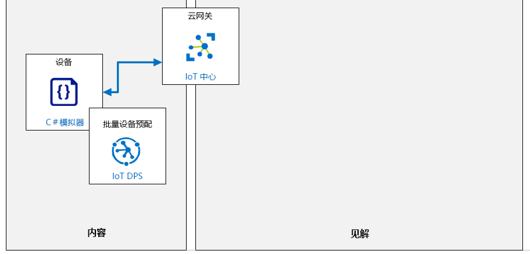

---
lab:
  title: 实验室 05：在 DPS 中单独注册设备
  module: 'Module 3: Device Provisioning at Scale'
ms.openlocfilehash: 6fc4a313720ea0ee30301ab8e8a928bcc9f9a035
ms.sourcegitcommit: 06dc1e6caa88a09b1246dd1161f15f619db9c6f8
ms.translationtype: HT
ms.contentlocale: zh-CN
ms.lasthandoff: 02/10/2022
ms.locfileid: "138421489"
---
# <a name="individual-enrollment-of-a-device-in-dps"></a>在 DPS 中单独注册设备

## <a name="lab-scenario"></a>实验室场景

Contoso 管理层正在推动更新其现有资产监视和跟踪解决方案。 该项更新将使用 IoT 设备来减少当前系统下所需的手动数据输入工作，并在运输过程中提供更高级的监视。 该解决方案依赖于在装载运输容器时预配 IoT 设备和在容器抵达目的地时解除预配设备的能力。 要管理预配要求，最佳的方式似乎是 IoT 中心设备预配服务 (DPS)。

建议的系统将使用具有集成传感器的 IoT 设备来跟踪运输过程中运输容器的位置、温度和压力。 IoT 设备将放在 Contoso 用于运输奶酪的现有运输容器中，并将使用车辆提供的 WiFi 连接到 Azure IoT 中心。 新系统将提供对产品环境的连续监视，并在检测到问题时启用各种通知方案。 遥测发送到 IoT 中心的速率必须是可配置的。

在 Contoso 的奶酪包装设施中，当一个空容器进入系统时，它将配备新的 IoT 设备，然后装载包装好的奶酪产品。 IoT 设备将通过 DPS 自动预配到 IoT 中心。 当容器到达目的地时，将检索 IoT 设备且必须完全解除预配（取消注册并撤销登记）。 恢复的设备将被回收，按照相同的自动预配流程重新用于将来的运输。

你的任务是使用 DPS 验证设备的预配和解除预配过程。 在初始测试阶段，将使用“单个注册”方法。

将创建以下资源：



## <a name="in-this-lab"></a>本实验室概览

在本实验室中，你首先将查看实验室先决条件，并根据需要运行脚本来确保你的 Azure 订阅包含所需的资源。 然后，你将在使用 DPS 中创建新的单个注册，它使用对称密钥证明并指定设备的初始设备孪生状态（遥测速率） 设备注册保存后，你将回到注册，并获取设备证明所需的自动生成的主密钥和辅助密钥。 接下来，需要创建模拟设备，并验证设备是否成功连接到 IoT 中心，以及设备是否按预期应用了初始设备孪生属性。 最后，你将完成解除预配过程，它通过取消注册和撤销登记设备（分别从 DPS 和 IoT 中心）安全地从解决方案中删除设备。 本实验室包括以下练习：

* 配置实验室先决条件（所需的 Azure 资源）
* 在 DPS 中创建新的单个注册（对称密钥）
* 配置模拟设备
* 测试模拟设备
* 解除预配设备

## <a name="lab-instructions"></a>实验室说明

### <a name="exercise-1-configure-lab-prerequisites"></a>练习 1：配置实验室先决条件

本实验室假定以下 Azure 资源可用：

| 资源类型 | 资源名称 |
| :-- | :-- |
| Resource Group | rg-az220 |
| IoT 中心 | iot-az220-training-{your-id} |
| 设备预配服务 | dps-az220-training-{your-id} |

若要确保这些资源可用，请完成以下步骤。

1. 在虚拟机环境中，打开 Microsoft Edge 浏览器窗口，然后导航到以下 Web 地址：
 
    +++https://portal.azure.com/#create/Microsoft.Template/uri/https%3A%2F%2Fraw.githubusercontent.com%2FMicrosoftLearning%2FAZ-220-Microsoft-Azure-IoT-Developer%2Fbicep%2FAllfiles%2FARM%2Flab05.json+++

    > 注意：每当看到绿色的“T”符号（例如 +++输入此文本+++）时，可以单击关联的文本，信息将键入到虚拟机环境内的当前字段中。

1. 如果系统提示登录到 Azure 门户，请输入你在本课程中使用的 Azure 凭据。

    将显示“自定义部署”页。

1. 在“项目详细信息”下的“订阅”下拉列表中，确保你打算在本课程中使用的 Azure 订阅已选中 。

1. 在“资源组”下拉列表中，选择“rg-az220” 。

    > 注意：如果未列出 rg-az220：
    >
    > 1. 在“资源组”下拉列表中，选择“新建”。
    > 1. 在“名称”下，输入 rg-az220 。
    > 1. 单击“确定”  。

1. 在“实例详细信息”下的“区域”下拉列表中，选择离你最近的区域 。

    > 注意：如果 rg-az220 组已存在，则“区域”字段将设置为资源组使用的区域，并且为只读 。

1. 在“你的 ID”字段中，输入在练习 1 中创建的唯一 ID。

1. 在“课程 ID”字段中，输入 az220 。

1. 若要验证模板，请单击“查看和创建”。

1. 验证通过后，单击“创建”。

    将启动部署。

1. 部署完成后，在左侧导航区域中，若要查看模板的任何输出值，请单击“输出”。

    记下输出供稍后使用：

    * connectionString
    * dpsScopeId

现已创建资源。

### <a name="exercise-2-create-new-individual-enrollment-symmetric-keys-in-dps"></a>练习 2：在 DPS 中创建新的单个注册（对称密钥）

在本练习中，将使用 _对称密钥证明_ 在设备预配服务 (DPS) 中为设备创建新的单个注册。 你还将在注册中配置初始设备状态。 保存注册后，你将返回并获取自动生成的证明密钥，它们是在保存注册时创建的。

#### <a name="task-1-create-the-enrollment"></a>任务 1：创建注册

1. 如有必要，使用 Azure 帐户凭据登录到 [portal.azure.com](https://portal.azure.com)。

    如果有多个 Azure 帐户，请确保使用与本课程要使用的订阅绑定的帐户登录。

1. 请注意，已加载 AZ-220 仪表板且已显示你的“资源”磁贴。

    你会同时看到 IoT 中心和列出的 DPS 资源。

1. 在 rg-az220 资源组磁贴上，单击“dps-az220-training-{your-id}” 。

1. 在左侧菜单“设置”下，单击“管理注册”。

1. 在“管理注册”窗格顶部，单击“+ 添加单个注册”。

1. 在“添加注册”边栏选项卡的“机制”下拉菜单中，单击“对称密钥”。

    这会将证明方法设置为使用对称密钥身份验证。

1. 在“机制”设置下方，请注意已选中“自动生成密钥”选项。

    这会将 DPS 设置为自动生成创建设备注册时设备注册的“主键”值和“次关键字”值。 或者，取消选中此选项将允许手动输入自定义键。

    > **注意**：主密钥值和辅助密钥值是在保存此记录后生成的。 在下一个任务中，你将回到此记录来获取值，稍后在本实验室中的模拟设备应用中使用它们。

1. 在“注册 ID”字段中，若要指定用于 DPS 中的设备注册的注册 ID，请输入“sensor-thl-1000”

    默认情况下，从注册中预配设备时，注册 ID 将用作 IoT 中心设备 ID。 如果这些值需要不同，可在该字段中输入所需的 IoT 中心设备 ID。

1. “IoT 中心设备 ID”字段留空。

    将该字段留白可确保 IoT 中心将注册 ID 用作设备 ID。 如果在无法选择的字段中看到默认文本值，请不要担心 - 这是占位符文本，不会被视为输入值。

1. 将“IoT Edge 设备”字段设置为“假”。

    新设备将不会是边缘设备。 本课程稍后将讨论如何使用 IoT Edge 设备。

1. 将“选择要将设备分配给中心的方式”字段继续设置为“均衡加权分布”。

    由于你只有一个与注册关联的 IoT 中心，因此此设置不是很重要。  在拥有多个分布式中心的较大环境中，此设置用来控制如何选择接收此设备注册的 IoT 中心。 支持四种分配策略：

    * **最低延迟**：将设备预配到具有最低延迟的 IoT 中心。
    * **均衡加权分布（默认）** ：链接的 IoT 中心等可能地获得预配到它们的设备。 这是默认设置。 如果只将设备预配到一个 IoT 中心，则可以保留此设置。
    * **通过注册列表进行静态注册**：注册列表中所需 IoT 中心的规范优先于设备预配服务级别的分配策略。
    * **自定义（使用 Azure 函数）** ：设备预配服务调用你的 Azure 函数代码，以提供有关设备和注册的所有相关信息。 将执行函数代码并返回用于预配设备的 IoT 中心信息。

1. 请注意，“选择可供此设备分配的 IoT 中心”下拉菜单指定了你创建的 IoT 中心 iot-az220-training-{your-id}。

    此字段用于指定可供你的设备分配的 IoT 中心。

1. 将“选择重新预配设备请求时如何处理设备数据”字段保留为“重新预配并迁移数据”的默认值。

    通过此字段，可以对重新预配行为进行高级控制。所谓重新预配，是指同一设备（由同一注册 ID 指示）在成功预配至少一次之后再次提交配置请求的行为。 有三个可用选项：

    * **重新预配和迁移数据**：此策略是新注册项的默认策略。 当与注册项关联的设备提交新的预配请求时，此策略将执行操作。 根据注册项配置，可将设备重新分配给其他 IoT 中心。 如果设备正在更改 IoT 中心，则将删除初始 IoT 中心内的设备注册。 来自该初始 IoT 中心的所有设备状态信息都将迁移到新的 IoT 中心。
    * **重新预配并重设为初始配置**：此策略通常用于恢复出厂设置而无需更改 IoT 中心。 当与注册项关联的设备提交新的预配请求时，此策略将执行操作。 根据注册项配置，可将设备重新分配给其他 IoT 中心。 如果设备正在更改 IoT 中心，则将删除初始 IoT 中心内的设备注册。 向新的 IoT 中心提供预配设备时预配服务实例接收到的初始配置数据。
    * **从不重新预配**：设备从不重新分配到不同的中心。 此策略用于管理后向兼容性。

1. 在“初始设备孪生状态”字段中，若要使用值 `"2"` 指定名为 `telemetryDelay` 的属性，请如下更新 JSON 对象：

    最终的 JSON 如下所示：

    ```json
    {
        "tags": {},
        "properties": {
            "desired": {
                "telemetryDelay": "2"
            }
        }
    }
    ```

    此字段包含表示设备所需属性的初始配置的 JSON 数据。 设备将使用输入的数据来设置读取传感器遥测数据并将事件发送到 IoT 中心的时间延迟。

1. 将“启用项”字段保留为“启用”。

    通常需要启用新的注册项并保持启用状态。

1. 在“添加注册”边栏选项卡顶部，单击“保存”。

#### <a name="task-2-review-enrollment-and-obtain-authentication-keys"></a>任务 2：查看注册并获取身份验证密钥

1. 在“管理注册”窗格上，单击“单个注册”以查看单个设备注册列表。

    回忆一下，你将使用注册记录来获取身份验证密钥。

1. 在“设备 ID”下，单击“sensor-thl-1000”。

    通过此边栏选项卡，可查看刚才创建的单个注册的注册详细信息。

1. 找到“身份验证类型”部分。

    你已在创建注册时将身份验证类型指定为对称密钥，因此已创建了主密钥值和辅助密钥值。 请注意，每个文本框右侧都有一个按钮，你可用它来复制这些值。

1. 针对此设备注册复制主密钥值和辅助密钥值，然后将它们保存到文件中供稍后参考。

    这些是设备向 IoT 中心服务进行身份验证的身份验证密钥。

1. 找到“初始设备孪生状态”，注意设备孪生所需状态的 JSON 中包含属性值设为 `"2"` 的 `telemetryDelay`。

1. 关闭名为 sensor-thl-1000 的单个注册边栏选项卡。

### <a name="exercise-3-configure-simulated-device"></a>练习 3：配置模拟设备

在本练习中，你将配置用 C# 写入的模拟设备，并使用在上一个练习中创建的单独注册连接到 Azure IoT。 还要将代码添加到模拟设备中，才能基于 Azure IoT 中心内的设备孪生来读取和更新设备配置。

在本练习中创建的模拟设备代表将要放置于运输容器/运输盒中，并用于监视运输过程中 Contoso 产品情况的 IoT 设备。 从设备发送到 Azure IoT 中心的传感器遥测数据包括容器的温度、湿度、压力和纬度/经度坐标。 该设备是整体资产跟踪解决方案的一部分。

> **注意**：你的印象可能是使用你在上一实验室中创建的内容创建此模拟设备有点多余，但你在此实验室中实现的证明机制与你之前操作的大不相同。 在上一个实验室中，你使用共享访问密钥进行身份验证，这种方式尽管无需进行设备预配，但也没有预配管理的优势（例如使用设备孪生），而且还要对共享密钥进行大范围分配和管理。 在本实验室中，你将通过设备预配服务来预配唯一的设备。

#### <a name="task-1-create-the-simulated-device"></a>任务 1：创建模拟设备

1. 在 dps-az220-training-{your-id} 边栏选项卡的左侧菜单中，单击“概述”。

1. 在边栏选项卡的右上区域，将鼠标指针悬停在分配到 ID 范围的值上，然后单击“复制到剪贴板”。

    你很快将使用该值，因此，如果无法使用剪贴板，请记下该值。 务必区分大写字母“O”和数字“0”。

    “ID 范围”类似于以下值：`0ne0004E52G`

1. 打开 **Visual Studio Code**。

1. 在“文件”菜单上，单击“打开文件夹”，然后导航到实验室 5 的 Final 文件夹 。

    实验室 5 的 Final 文件夹位于在实验室 3 中设置开发环境时下载的实验室资源文件中。 文件夹路径为：

    * Allfiles
      * 实验室
          * 05 - DPS 中设备的单个注册
            * 最后

1. 在“打开文件夹”对话框中，单击“启动程序”，然后单击“选择文件夹”。

    ContainerDevice 文件夹是实验室 5 的 Final 文件夹的子文件夹。 它包含一个 Program.cs 文件和一个 ContainerDevice.csproj 文件。

    > **注意**：如果 Visual Studio Code 提示你加载必需的资产，可单击“是”进行加载。

1. 在“视图”菜单上，单击“终端”。

    验证所选的终端 shell 是 Windows 命令提示符。

1. 在终端命令提示符下，若要还原所有应用程序 NuGet 包，请输入以下命令：

    ```cmd/sh
    dotnet restore
    ```

1. 在 Visual Studio Code 的“资源管理器”窗格中，单击“Program.cs”。

1. 在代码编辑器中，在 Program 类顶部附近找到 dpsIdScope 变量。

1. 使用从设备预配服务复制的 ID 范围更新分配至 dpsIdScope 的值。

    > **注意**：如果没有可用的 ID 范围值，可以在 DPS 服务的“概述”边栏选项卡中（在 Azure 门户中）找到。

1. 找到 registrationId 变量，并使用 sensor-thl-1000 更新所分配的值

    此变量代表你在设备预配服务中创建的单个注册的注册 ID 值。

1. 使用保存的主密钥值和辅助密钥值更新 individualEnrollmentPrimaryKey 和 individualEnrollmentSecondaryKey 变量。

    > **注意**：如果没有可用的这些键值，则可以按以下说明从 Azure 门户复制 -
    >
    > 打开“管理注册”边栏选项卡，单击“单个注册”，然后单击“sensor-thl-1000”。 复制值，然后按如上所述粘贴。

1. 在 Visual Studio Code 的“文件”菜单上，单击“保存”。

    模拟设备当前将使用 Azure IoT 中心的设备孪生属性来设置遥测消息之间的延迟。

    > **注意**：如果想要深入了解应用程序如何通过 DPS 进行连接，则会广泛地注释源代码等。

### <a name="exercise-4-test-the-simulated-device"></a>练习 4：测试模拟设备

在本练习中，你将运行模拟设备并验证其是否在向 Azure IoT 中心发送传感器遥测。 你还将通过更新 Azure IoT 中心内部模拟设备的 telemetryDelay 设备孪生属性，更改将遥测数据发送到 Azure IoT 中心的速率。

#### <a name="task-1-build-and-run-the-device"></a>任务 1：生成并运行设备

1. 确保在 Visual Studio Code 中打开了代码项目。

1. 在“视图”菜单上，单击“终端”。

1. 在“终端”窗格中，确保命令提示符会显示 `Program.cs` 文件的目录路径。

1. 在命令提示符处，要生成并运行模拟设备应用程序，请输入以下命令：

    ```cmd/sh
    dotnet run
    ```

    > **注意**：模拟设备应用程序运行时，会首先将自身的详细状态信息写入控制台（终端窗格）。

1. 请注意，`Desired Twin Property Changed:` 行之后的 JSON 输出包含设备的 `telemetryDelay` 所需的值。

    可以在终端窗格中向上滚动查看输出。 输出应如下所示：

    ```text
    ProvisioningClient AssignedHub: iot-az220-training-{your-id}.azure-devices.net; DeviceID: sensor-thl-1000
    Desired Twin Property Changed:
    {"telemetryDelay":"2","$version":1}
    Reported Twin Properties:
    {"telemetryDelay":"2"}
    Start reading and sending device telemetry...
    ```

1. 请注意，模拟设备应用程序开始向 Azure IoT 中心发送遥测事件。

    遥测事件包括 `temperature`、`humidity`、`pressure`、`latitude` 和 `longitude` 的值，这些值应如下所示：

    ```text
    11/6/2019 6:38:55 PM > Sending message: {"temperature":25.59094770373355,"humidity":71.17629229611545,"pressure":1019.9274696347665,"latitude":39.82133964767944,"longitude":-98.18181981142438}
    11/6/2019 6:38:57 PM > Sending message: {"temperature":24.68789062681044,"humidity":71.52098010830628,"pressure":1022.6521258267584,"latitude":40.05846882452387,"longitude":-98.08765031156229}
    11/6/2019 6:38:59 PM > Sending message: {"temperature":28.087463226675737,"humidity":74.76071353757787,"pressure":1017.614206096327,"latitude":40.269273772972454,"longitude":-98.28354453319591}
    11/6/2019 6:39:01 PM > Sending message: {"temperature":23.575667940813894,"humidity":77.66409506912534,"pressure":1017.0118147748344,"latitude":40.21020096551372,"longitude":-98.48636739129239}
    ```

    注意遥测读数之间的时间戳差异。 通过设备孪生配置的遥测消息之间的延迟应为 `2` 秒，而不是源代码中默认的 `1` 秒。

1. 保持模拟设备应用运行。

    你将在下一个活动中验证设备代码是否符合预期。

#### <a name="task-2-verify-telemetry-stream-sent-to-azure-iot-hub"></a>任务 2：验证发送到 Azure IoT 中心的遥测数据流

在此任务中，你将使用 Azure CLI 验证 Azure IoT 中心正在接收由模拟设备发送的遥测。

1. 使用浏览器，打开 [Azure Cloud Shell](https://shell.azure.com/)，并使用本课程使用的 Azure 订阅登录。

1. 在 Azure Cloud Shell 中，输入以下命令：

    ```cmd/sh
    az iot hub monitor-events --hub-name {IoTHubName} --device-id sensor-thl-1000
    ```

    务必将 {IoTHubName} 占位符替换为 Azure IoT 中心的名称。

1. 请注意，IoT 中心将从 sensor-thl-1000 设备接收遥测消息。

    继续让模拟设备应用程序运行以执行下一个任务。

#### <a name="task-3-change-the-device-configuration-through-its-twin"></a>任务 3：通过孪生更改设备配置

当模拟设备处于运行状态下时，可以通过在 Azure IoT 中心内编辑设备孪生所需状态来更新 `telemetryDelay` 配置。 这可以通过在 Azure 门户的 Azure IoT 中心中配置设备来完成。

1. 打开 Azure 门户（如果尚未打开），然后导航到 Azure IoT 中心服务。

1. 在 IoT Hub 边栏选项卡的“设备管理”下的左侧菜单中，单击“设备” 。

1. 在“设备 ID”下，单击“sensor-thl-1000”。

    > **重要说明**：确保为此实验室选择正在使用的设备。

1. 在 sensor-thl-1000 设备边栏选项卡的顶部单击“设备孪生”。

    “设备孪生”边栏选项卡为编辑器提供了设备孪生的完整 JSON。 这使你能够直接在 Azure 门户中查看和/或编辑设备孪生状态。

1. 找到 `properties.desired` 对象的 JSON。

    这包含设备所需的状态。 请注意，`telemetryDelay` 属性已经存在并设为 `"2"`，因为在基于 DPS 中的单个注册来预配设备时已配置该属性。

1. 要更新分配给 `telemetryDelay` 所需属性的值，请将该值更改为 `"5"`

    该值包括引号 ("")。

1. 在“设备孪生”边栏选项卡的顶部，单击“保存”

    `OnDesiredPropertyChanged` 事件将在模拟设备的代码内自动触发，并且设备将更新其配置来体现设备孪生所需状态的更改。

1. 切换到用于运行模拟设备应用程序的 Visual Studio Code 窗口。

1. 在 Visual Studio Code 中，滚动到“终端”窗格的底部。

1. 请注意，设备可以识别设备孪生属性的更改。

    输出将显示一条消息，该消息指示 `Desired Twin Property Changed` 以及新的 desired`telemetryDelay` 属性值的 JSON。 设备选取设备孪生所需状态的新配置后，将自动更新，开始按当前配置每 5 秒钟发送一次传感器遥测。

    ```text
    Desired Twin Property Changed:
    {"telemetryDelay":"5","$version":2}
    Reported Twin Properties:
    {"telemetryDelay":"5"}
    4/21/2020 1:20:16 PM > Sending message: {"temperature":34.417625961088405,"humidity":74.12403526442313,"pressure":1023.7792049974805,"latitude":40.172799921919186,"longitude":-98.28591913777421}
    4/21/2020 1:20:22 PM > Sending message: {"temperature":20.963297521678403,"humidity":68.36916032636965,"pressure":1023.7596862048422,"latitude":39.83252821949164,"longitude":-98.31669969393461}
    ```

1. 切换到在 Azure Cloud Shell 中运行 Azure CLI 命令的浏览器页面。

    确保仍在运行 `az iot hub monitor-events` 命令。 如果该命令未在运行，请重新启动它。

1. 请注意，发送到 Azure IoT 中心的遥测事件正以 5 秒的新间隔接收。

1. 使用 Ctrl-C 停止 `az` 命令和“模拟设备”应用程序。

1. 切换到 Azure 门户的浏览器窗口。

1. 关闭“设备孪生”边栏选项卡。

1. 还是在 Azure 门户中，在 sensor-thl-1000 边栏选项卡上，单击“设备孪生”。

1. 找到 `properties.reported` 对象的 JSON。

    这部分的 JSON 包含设备报告的状态。 请注意，此处也存在 `telemetryDelay` 属性，并且也设置为 `5`。  还有一个 `$metadata` 值，显示所报告数据的上次更新时间以及所报告特定值的上次更新时间。

1. 关闭“设备孪生”边栏选项卡。

1. 关闭“模拟设备”边栏选项卡，然后关闭“IoT 中心”边栏选项卡。

### <a name="exercise-5-deprovision-the-device"></a>练习 5：解除预配设备

在你的 Contoso 场景中，当运输容器抵达其最终目的地时，将从容器上取下 IoT 设备并寄回 Contoso 所在地。 Contoso 将需要解除设备预配，然后才可测试并将其放入库存。 在将来，该设备可预配至同一 IoT 中心，也可预配在不同区域的 IoT 中心。 彻底解除设备预配是 IoT 解决方案中 IoT 设备生命周期中的重要一步。

在此练习中，你将执行从设备预配服务 (DPS) 和 Azure IoT 中心解除设备预配所需的任务。 要从 Azure IoT 解决方案中完全解除 IoT 设备预配，必须将其从这两项服务中删除。

#### <a name="task-1-disenroll-the-device-from-the-dps"></a>任务 1：从 DPS 取消注册设备

1. 如有必要，请使用 Azure 帐户凭据登录到 Azure 门户。

    如果有多个 Azure 帐户，请确保使用与本课程要使用的订阅绑定的帐户登录。

1. 在“资源组”磁贴上，若要打开设备预配服务，请单击“dps-az220-training-{your-id}”。

1. 在左侧菜单“设置”下，单击“管理注册”。

1. 在“管理注册”窗格上，单击“单个注册”以查看单个设备注册列表。

1. 单击 sensor-thl-1000 左侧的复选框。

    > **注意**：无需打开 sensor-thl-1000 单个设备注册，只需选择它即可。

1. 在边栏选项卡的顶部单击“删除”。

    > **注意**：删除 DPS 中的单个注册将永久删除该注册。 要暂时禁用注册，可以在单个注册的“注册详细信息”中将“启用项”设置为“禁用”。

1. 在“删除注册”提示符处，单击“是”。

    单个注册当前已从设备预配服务 (DPS) 中删除。 要完成解除预配过程，还必须从 Azure IoT 中心服务中删除模拟设备的设备 ID。

#### <a name="task-2-deregister-the-device-from-the-iot-hub"></a>任务 2：从 IoT 中心撤销设备登记

1. 在 Azure 门户中，导航回仪表板。

1. 在“资源组”磁贴上，若要打开“Azure IoT 中心”边栏选项卡，请单击“iot-az220-training-{your-id}”。

1. 在左侧菜单中的“设备管理”下，单击“设备” 。

1. 单击 sensor-thl-1000 左侧的复选框。

    > **重要说明**：确保所选设备能够代表用于本实验室的模拟设备。

1. 在边栏选项卡的顶部单击“删除”。

1. 在“确定要删除选定设备吗”提示符处，单击“是”。

    > **注意**：从 IoT 中心删除设备 ID 将永久删除设备注册。 要暂时禁止设备连接到 IoT 中心，可以在设备属性中将“启用与 IoT 中心的连接”设为“禁用”。

既然设备注册已从设备预配服务中删除，与之匹配的设备 ID 也已从 Azure IoT 中心中删除，模拟设备在解决方案中就完全停用了。
