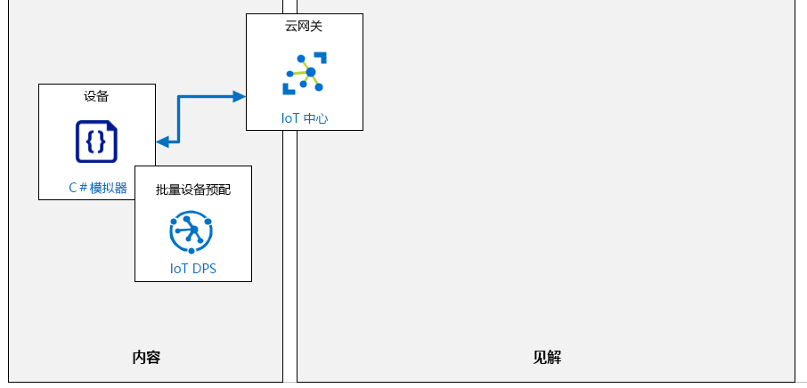

---
lab:
  title: 实验室 6：使用 DPS 安全且大规模地自动预配 IoT 设备
  module: 'Module 3: Device Provisioning at Scale'
ms.openlocfilehash: d8d78212ab65723377fa9262f6c6505d797f2725
ms.sourcegitcommit: 06dc1e6caa88a09b1246dd1161f15f619db9c6f8
ms.translationtype: HT
ms.contentlocale: zh-CN
ms.lasthandoff: 02/10/2022
ms.locfileid: "138421537"
---
# <a name="automatically-provision-iot-devices-securely-and-at-scale-with-dps"></a>使用 DPS 安全且大规模地自动预配 IoT 设备

## <a name="lab-scenario"></a>实验室场景

你目前针对 Contoso 的资产监视和跟踪解决方案所做的工作使你能够使用“单独注册”方法验证设备预配和取消预配流程。 管理团队现在要求你开始测试相关流程以便在更大规模上实施。

要使项目继续进行，你需要证明设备预配服务可用于使用 X.509 证书身份验证自动安全地注册更多设备。 将设置组注册，验证是否满足 Contoso 的要求。

将创建以下资源：



## <a name="in-this-lab"></a>本实验室概览

在本实验室中，你首先将查看实验室先决条件，并根据需要运行脚本来确保你的 Azure 订阅包含所需的资源。 然后，在 Azure Cloud Shell 中使用 OpenSSL 生成 X.509 根 CA 证书，并使用该根证书在设备预配服务 (DPS) 中配置组注册。 之后，使用根证书生成设备证书，后面需要在模拟设备代码中使用该证书将设备预配到 IoT 中心。 在设备代码中，需要实现对用于执行设备初始配置的设备孪生属性的访问。 然后测试模拟设备。 结束本实验室所有操作时，需要取消预配整个组注册。 本实验室包括以下练习：

* 配置实验室先决条件（所需的 Azure 资源）
* 使用 OpenSSL 生成和配置 X.509 CA 证书
* 使用 X.509 证书配置模拟设备
* 测试模拟设备
* 取消预配组注册

## <a name="lab-instructions"></a>实验室说明

### <a name="exercise-1-configure-lab-prerequisites"></a>练习 1：配置实验室先决条件

本实验室假定以下 Azure 资源可用：

| 资源类型 | 资源名称 |
| :-- | :-- |
| Resource Group | rg-az220 |
| IoT 中心 | iot-az220-training-{your-id} |
| 设备预配服务 | dps-az220-training-{your-id} |

若要确保这些资源可用，请完成以下步骤。

1. 在虚拟机环境中，打开 Microsoft Edge 浏览器窗口，然后导航到以下 Web 地址：
 
    +++https://portal.azure.com/#create/Microsoft.Template/uri/https%3A%2F%2Fraw.githubusercontent.com%2FMicrosoftLearning%2FAZ-220-Microsoft-Azure-IoT-Developer%2Fbicep%2FAllfiles%2FARM%2Flab06.json+++

    > 注意：每当看到绿色的“T”符号（例如+++输入此文本+++）时，可以单击关联的文本，信息将键入到虚拟机环境内的当前字段中。

1. 如果系统提示登录到 Azure 门户，请输入将要用于本课程的 Azure 凭据。

    将显示“自定义部署”页。

1. 在“项目详细信息”下的“订阅”下拉列表中，确保你打算在本课程中使用的 Azure 订阅已选中 。

1. 在“资源组”下拉列表中，选择“rg-az220” 。

    > 注意：如果未列出 rg-az220：
    >
    > 1. 在“资源组”下拉列表中，选择“新建”。
    > 1. 在“名称”下，输入 rg-az220 。
    > 1. 单击“确定”  。

1. 在“实例详细信息”下的“区域”下拉列表中，选择离你最近的区域 。

    > 注意：如果 rg-az220 组已存在，则“区域”字段将设置为资源组使用的区域，并且为只读 。

1. 在“你的 ID”字段中，输入在练习 1 中创建的唯一 ID。

1. 在“课程 ID”字段中，输入 az220 。

1. 若要验证模板，请单击“查看并创建”。

1. 验证通过后，单击“创建”。

    将启动部署。

1. 部署完成后，在左侧导航区域中，若要查看模板的任何输出值，请单击“输出”。

    记下输出供稍后使用：

    * connectionString
    * dpsScopeId

现已创建资源。

### <a name="exercise-2-generate-and-configure-x509-ca-certificates-using-openssl"></a>练习 2：使用 OpenSSL 生成和配置 X.509 CA 证书

在本练习中，你将在 Azure Cloud Shell 中使用 OpenSSL 生成 X.509 CA 证书。 此证书将用于在设备预配服务 (DPS) 中配置组注册。

#### <a name="task-1-generate-the-certificates"></a>任务 1：生成证书

1. 如有必要，使用你在本课程中使用的 Azure 帐户凭据登录到 [Azure 门户](https://portal.azure.com)。

    如果有多个 Azure 帐户，请确保使用与本课程要使用的订阅绑定的帐户登录。

1. 在门户窗口的右上角，请单击“Cloud Shell”打开 Azure Cloud Shell。

    Cloud Shell 按钮有一个代表命令提示符的图标 - `>_`。

    Cloud Shell 窗口将在靠近显示屏底部的位置打开。

1. 在 Cloud Shell 窗口的左上角，确保将 Bash 选为环境选项。

    > **注意**：Azure Cloud Shell 的 Bash 和 PowerShell 界面都支持使用 OpenSSL。 在本练习中，你将使用专为 Bash shell 编写的一些帮助程序脚本。

1. 在 Cloud Shell 命令提示符下，要创建并移至新目录中，请输入以下命令：

    ```sh
    # ensure the current directory is the user's home directory
    cd ~

    # make a directory named "certificates"
    mkdir certificates

    # change directory to the "certificates" directory
    cd certificates
    ```

1. 若要下载和准备要使用的 Azure IoT 帮助程序脚本，请在 Cloud Shell 命令提示符下输入以下命令：

    ```sh
    # download helper script files
    curl https://raw.githubusercontent.com/Azure/azure-iot-sdk-c/master/tools/CACertificates/certGen.sh --output certGen.sh
    curl https://raw.githubusercontent.com/Azure/azure-iot-sdk-c/master/tools/CACertificates/openssl_device_intermediate_ca.cnf --output openssl_device_intermediate_ca.cnf
    curl https://raw.githubusercontent.com/Azure/azure-iot-sdk-c/master/tools/CACertificates/openssl_root_ca.cnf --output openssl_root_ca.cnf

    # update script permissions so user can read, write, and execute it
    chmod 700 certGen.sh
    ```

    帮助程序脚本和支持文件是从托管在 Github 上的“Azure/azure-iot-sdk-c”开放源代码项目中下载的，该项目是 Azure IoT 设备 SDK 的一个组件。 可以借助 certGen.sh 帮助程序脚本了解如何使用 CA 证书，而无需深入了解 OpenSSL 配置的细节（这超出了本课程的范围）。

    有关使用此帮助程序脚本的其他说明，或者有关如何使用 PowerShell 而不是 Bash 的说明，请参阅此链接：[https://github.com/Azure/azure-iot-sdk-c/blob/master/tools/CACertificates/CACertificateOverview.md](https://github.com/Azure/azure-iot-sdk-c/blob/master/tools/CACertificates/CACertificateOverview.md)

    > **警告**：由此帮助程序脚本创建的证书禁止用于生产。 它们包含硬编码的密码（“1234”），将在 30 天后过期，并且最重要的是，它们只用于演示目的，旨在帮助你快速了解 CA 证书。 基于 CA 证书构建产品时，应务必按照公司的最佳安全做法来创建证书和管理生命周期。

    如果感兴趣，你可以使用 Cloud Shell 内置的编辑器来快速扫描你下载的脚本文件的内容。

    * 在 Cloud Shell 中，要打开编辑器，请单击 `{}`。
    * 在“文件”列表中，单击“证书”，然后单击“certGen.sh”

    > **注意**：如果你熟悉 Bash 环境中的其他文本文件查看工具，例如 `more` 或 `vi` 命令，你也可以使用这些工具。

    下一步是使用该脚本来创建根证书和中间证书。

1. 要生成根证书和中间证书，请输入以下命令：

    ```sh
    ./certGen.sh create_root_and_intermediate
    ```

    请注意，你使用 `create_root_and_intermediate` 选项运行了脚本。 此命令假设你正在从 `~/certificates` 目录运行脚本。

    此命令生成了名为 `azure-iot-test-only.root.ca.cert.pem` 的根 CA 证书，并将该证书放在了 `./certs` 目录中，该目录位于你创建的证书目录下。

1. 要将根证书下载到本地计算机（以便上传到 DPS），请输入以下命令：

    ```sh
    download ~/certificates/certs/azure-iot-test-only.root.ca.cert.pem
    ```

    系统将提示你将文件保存到本地计算机。 记下文件的保存位置，在下一个任务中将需要用到它。

#### <a name="task-2-configure-dps-to-trust-the-root-certificate"></a>任务 2：配置 DPS 以信任根证书

1. 在 Azure 门户中，打开“设备预配服务”。

    通过单击 `dps-az220-training-{your-id}`，可从仪表板上的“资源”磁贴访问设备预配服务。

1. 在“dps-az220-training-{your id}”边栏选项卡的左侧菜单上，在“设置”下，单击“证书”。

1. 在“证书”窗格的顶部，单击“+ 添加”。

    单击“+ 添加”会启动将 X.509 CA 证书上传到 DPS 服务的过程。

1. 在“添加证书”边栏选项卡的“证书名称”下，输入 root-ca-cert。

    重要的是要提供一个使你能够区分各个证书的名称，例如根证书、中间证书或链中同一层次结构级别的多个证书。

    > **注意**：你输入的根证书名称可以与证书文件的名称相同，也可以不同。 你提供的名称是逻辑名称，与内容 X.509 CA 证书中嵌入的公用名称不相关。

1. 在“证书 .pem 或 .cer 文件”下，在文本框右侧，单击“打开”。

    单击文本字段右侧的“打开”按钮后会打开一个“打开文件”对话框，在该对话框中，可以导航到先前下载的 `azure-iot-test-only.root.ca.cert.pem` CA 证书。

1. 导航到将根 CA 证书文件下载到的文件夹位置，单击“azure-iot-test-only.root.ca.cert.pem”，然后单击“打开”。

1. 在“添加证书”边栏选项卡底部，单击“保存”。

    上传 X.509 CA 证书后，“证书”窗格将显示该证书，并且“状态”值为“未验证”。 在使用此 CA 证书对 DPS 的设备进行身份验证之前，你需要验证证书的“所有权证明” 。

1. 要开始验证证书的“所有权证明”，请单击“root-ca-cert” 。

1. 在“证书详细信息”窗格底部，单击“生成验证码”。

    你可能需要向下滚动才能看到“生成验证码”按钮。

    单击该按钮后，将在“验证码”字段（位于按钮上方）中生成代码。

1. 在“验证码”的右侧，单击“复制到剪贴板”。

    通过上传使用刚刚在 DPS 中生成的验证码从 CA 证书生成的证书，向 DPS 提供 CA 证书的“拥有证明”。 这是如何证明你实际拥有 CA 证书的方法。

    > **重要说明**：生成验证证书时，需要保持打开“证书详细信息”窗格。 如果关闭窗格，将导致验证码无效，并且需要生成一个新的验证码。

1. 如果仍然无法在之前的基础上打开，则打开 Azure Cloud Shell，并导航到 `~/certificates` 目录。

1. 要创建验证证书，请输入以下命令：

    ```sh
    ./certGen.sh create_verification_certificate <verification-code>
    ```

    请务必将 `<verification-code>` 占位符替换为由 Azure 门户生成的验证码。

    例如，你运行的命令将如下所示：

    ```sh
    ./certGen.sh create_verification_certificate 49C900C30C78D916C46AE9D9C124E9CFFD5FCE124696FAEA
    ```

    这会生成一个链接到 CA 证书的验证证书。 证书的主题是验证码。 生成的名为 `verification-code.cert.pem` 的验证证书位于 Azure Cloud Shell 的 `./certs` 目录中。

    下一步是将验证证书下载到本地计算机（类似于之前对根证书执行的操作），以便稍后将其上传到 DPS。

1. 要将验证证书下载到本地计算机，请输入以下命令：

    ```sh
    download ~/certificates/certs/verification-code.cert.pem
    ```

    > **注意**：根据 Web 浏览器的不同，此时系统可能会显示一条提示，让你确定是否允许多次下载。 如果系统对你的下载命令无响应，请确保屏幕上的其他地方没有显示要求你提供允许下载权限的提示。

1. 切换回“证书详细信息”窗格。

    DPS 服务的此窗格在 Azure 门户中应仍为打开状态。

1. 在“证书详细信息”窗格底部，“验证证书 .pem 或 .cer 文件”右侧，单击“打开”。

1. 在“打开文件”对话框中，导航到 downloads 文件夹，单击“verification-code.cert.pem”，然后单击“打开”。

1. 在底部的“证书详细信息”窗格中，单击“验证”。

1. 在“证书”窗格中，确保证书的“状态”现在设置为“已验证”。

    可能需要单击窗格顶部的“刷新”按钮（位于“添加”按钮右侧）才能反映出此更改。

#### <a name="task-3-create-group-enrollment-x509-certificate-in-dps"></a>任务 3：在 DPS 中创建组注册（X.509 证书）

在本练习中，你将在设备预配服务 (DPS) 中使用“X.509 证书证明”新建注册组。

1. 在“dps-az220-training-{your id}”边栏选项卡的左侧菜单上，在“设置”下，单击“管理注册”。

1. 在顶部“管理注册”窗格中，单击“添加注册组”。

    回想一下，注册组基本上是可以通过自动预配进行注册的设备记录。

1. 在“添加注册组”边栏选项卡上的“组名”下，输入“eg-test-simulated-devices”

1. 确保将“认证类型”设置为“证书”。

1. 确保将“证书类型”字段设置为“CA 证书”。

1. 在“初级证书”下拉菜单中，选择之前上传到 DPS 的 CA 证书，如 root-ca-cert。

1. 将“辅助证书”下拉列表设置为“未选择证书”。

    二级证书通常用于证书轮换，以容纳到期的证书或已泄露的证书。 你可以在此处找到有关证书轮换的更多信息：[https://docs.microsoft.com/en-us/azure/iot-dps/how-to-roll-certificates](https://docs.microsoft.com/en-us/azure/iot-dps/how-to-roll-certificates)

1. 将“选择要将设备分配给中心的方式”字段继续设置为“均衡加权分布”。

    在具有多个分布式中心的大型环境中，此设置将控制如何选择应接收此设备注册的 IoT 中心。 你将具备一个与本实验室中的注册相关的  IoT 中心，因此如何将设备分配给 IoT 中心在本实验室方案中并不真正适用。

1. 注意，“选择可以分配给该组的 IoT 中心”下拉菜单中勾选了“iot-az220-training-{your-id}”IoT 中心。

    此字段用于确保在预配设备时将其添加到正确的 IoT 中心。

1. 将“选择重新预配设备请求时如何处理设备数据”字段保留为“重新预配并迁移数据”。

    通过此字段，可以对重新预配行为进行高级控制。所谓重新预配，是指同一设备（由同一注册 ID 指示）在成功预配至少一次之后再次提交配置请求的行为。

1. 在“初始设备孪生状态”字段中，按如下所示修改 JSON 对象：

    ```json
    {
        "tags": {},
        "properties": {
            "desired": {
                "telemetryDelay": "1"
            }
        }
    }
    ```

    此 JSON 数据表示此注册组中所包含任何设备的设备孪生必需属性的初始配置。

    设备将使用 `properties.desired.telemetryDelay` 属性来设置读取遥测数据并将其发送到 IoT 中心的时间延迟。

1. 将“启用输入”保留设置为“启用”。

    通常需要启用新的注册项并保持启用状态。

1. 在“添加注册组”边栏选项卡顶部，单击“保存”。

### <a name="exercise-3-configure-simulated-device-with-x509-certificate"></a>练习 3：使用 X.509 证书配置模拟设备

在本练习中，将使用根证书生成一个设备证书，并配置一个模拟设备，该设备通过使用设备证书进行认证来实现连接。

#### <a name="task-1-generate-a-device-certificate"></a>任务 1：生成设备证书

1. 如有必要，请使用 Azure 帐户凭据登录到 Azure 门户。

    如果有多个 Azure 帐户，请确保使用与本课程要使用的订阅绑定的帐户登录。

1. 在 Azure 门户工具栏上，单击“Cloud Shell”

    Azure 门户工具栏贯穿门户窗口的顶部。 Cloud Shell 按钮是自右往左的第 6 项。

1. 验证 Cloud Shell 是否在使用 Bash。

    Azure Cloud Shell 页面左上角的下拉菜单用于选择环境。 验证所选的下拉值是否为 **Bash**。

1. 在 Cloud Shell 命令提示符处，输入以下命令可导航到 `~/certificates` 目录：

    ```sh
    cd ~/certificates
    ```

    `~/certificates` 目录是下载 `certGen.sh` 帮助程序脚本的目录。 之前在此选项卡中使用这些脚本生成了 DPS 的 CA 证书。 此帮助程序脚本还将用于在 CA 证书链中生成设备证书。

1. 要在 CA 证书链中生成 X.509 设备证书，请输入以下命令：

    ```sh
    ./certGen.sh create_device_certificate sensor-thl-2000
    ```

    此命令将创建一个新的 X.509 证书，该证书由先前生成的 CA 证书签名。 注意，设备 ID (`sensor-thl-2000`) 已传递到 `certGen.sh` 脚本的 `create_device_certificate` 命令。 该设备 ID 将在设备证书的公用名称（即 `CN=`）值中设置。 此证书将为你的模拟设备生成一个叶设备 X.509 证书，并且设备将使用此证书向设备预配服务 (DPS) 进行身份验证。

    完成 `create_device_certificate` 命令后，生成的 X.509 设备证书将命名为 `new-device.cert.pfx`，并将存放在 `/certs` 子目录中。

    > **注意**：此命令将覆盖 `/certs` 子目录中的所有现有设备证书。 如果要为多个设备创建证书，请确保每次运行命令时都保存 `new-device.cert.pfx` 的副本。

1. 要重命名刚创建的设备证书，请输入以下命令：

    ```sh
    mv ~/certificates/certs/new-device.cert.pfx ~/certificates/certs/sensor-thl-2000-device.cert.pfx
    mv ~/certificates/certs/new-device.cert.pem ~/certificates/certs/sensor-thl-2000-device.cert.pem
    ```

1. 若要创建附加设备证书，请输入以下命令：

    ```sh
    ./certGen.sh create_device_certificate sensor-thl-2001
    mv ~/certificates/certs/new-device.cert.pfx ~/certificates/certs/sensor-thl-2001-device.cert.pfx
    mv ~/certificates/certs/new-device.cert.pem ~/certificates/certs/sensor-thl-2001-device.cert.pem
    ```

1. 要将生成的 X.509 设备证书从 Cloud Shell 下载到本地计算机，请输入以下命令：

    ```sh
    download ~/certificates/certs/sensor-thl-2000-device.cert.pfx
    download ~/certificates/certs/sensor-thl-2001-device.cert.pfx
    ```

    在下一个任务中，将开始构建模拟设备，这些设备将使用 X.509 设备证书向设备预配服务进行身份验证。

#### <a name="task-2-configure-a-simulated-device"></a>任务 2：配置模拟设备

在此任务中，将完成以下操作。

* 从 DPS 中获取要放入代码中的 ID 范围
* 将下载的设备证书复制到应用程序的根文件夹中
* 在 Visual Studio Code 中配置应用程序

1. 在 Azure 门户中，打开“设备预配服务”并确保选中了“概述”窗格。

1. 在“概述”窗格中，复制设备预配服务的“ID 范围”，并保存供以后参考。

    将鼠标悬停在值上方时，该值的右侧将显示一个“复制”按钮。

    ID 范围类似于此值：`0ne0004E52G`

1. 打开 Windows 文件资源管理器，然后导航到下载 `sensor-thl-2000-device.cert.pfx` 证书文件的文件夹。

1. 使用文件资源管理器创建 2 个设备证书文件的副本。

    现在复制这两个证书文件可节省一些时间，但在最初构建的代码项目中，只使用第一个文件 `sensor-thl-2000-device.cert.pfx`。

1. 在文件资源管理器中，导航到实验室 6（在 DPS 中自动注册设备）的 Starter 文件夹。

    在“实验室 3:设置开发环境”中，你可以通过下载 ZIP 文件并从本地提取内容来克隆包含实验室资源的 GitHub 存储库。 提取的文件夹结构包括以下文件夹路径：

    * Allfiles
      * 实验室
          * 06 - 在 DPS 中自动注册设备
            * 初学者
              * ContainerDevice

1. 在打开的 ContainerDevice 文件夹中粘贴复制的设备证书文件。

    ContainerDevice 文件夹的根目录包含模拟设备应用的 `Program.cs` 文件。 在向设备预配服务进行身份验证时，模拟设备项目会使用此证书文件。

1. 打开 **Visual Studio Code**。

1. 在“文件”菜单上，单击“打开文件夹”

1. 在“打开文件夹”对话框中，导航到实验室 6（在 DPS 中自动注册设备）的 Starter 文件夹。

1. 单击“ContainerDevice”，然后单击“选择文件夹”。

    你应该会在 Visual Studio Code 的资源管理器窗格中看到以下文件：

    * ContainerDevice.csproj
    * Program.cs
    * sensor-thl-2000-device.cert.pfx

    **注意**：稍后将在本实验室中使用复制到此文件夹的其他设备证书文件，现在重点实现第一个设备证书文件。

1. 在“资源管理器”窗格中，单击“ContainerDevice.csproj”以打开“ContainerDevice.csproj”文件。

1. 在代码编辑器窗格的 `<ItemGroup>` 标记中，按如下方式更新证书文件名：

    ```xml
    <ItemGroup>
        <None Update="sensor-thl-2000-device.cert.pfx" CopyToOutputDirectory="PreserveNewest" />
        <PackageReference Include="Microsoft.Azure.Devices.Client" Version="1.*" />
        <PackageReference Include="Microsoft.Azure.Devices.Provisioning.Transport.Mqtt" Version="1.*" />
        <PackageReference Include="Microsoft.Azure.Devices.Provisioning.Transport.Amqp" Version="1.*" />
        <PackageReference Include="Microsoft.Azure.Devices.Provisioning.Transport.Http" Version="1.*" />
    </ItemGroup>
    ```

    这种配置可确保在编译 C# 代码时将 `sensor-thl-2000-device.cert.pfx` 证书文件复制到版本文件夹，并在程序执行时供其访问。

1. 在 Visual Studio Code 的“文件”菜单上，单击“保存”。

    **注意**：如果 Visual Studio Code 代码提示执行“还原”操作，请立即执行。

1. 在“资源管理器”窗格中，单击“Program.cs”。

    粗略地看一下就会发现，此版本的 ContainerDevice 应用程序实际上与上一个实验室中使用的版本基本相同。 唯一的不同之处与使用 X.509 证书作为证明机制有关。 从应用程序的角度来看，此设备是通过“组注册”还是通过“单独注册”来进行连接并不重要。

1. 找到“GlobalDeviceEndpoint”变量，并注意其值设置为 Azure 设备预配服务的全局设备终结点（`global.azure-devices-provisioning.net`）。

    在公共 Azure 云中，“global.azure-devices-provisioning.net”是设备预配服务 (DPS) 的全局设备终结点。 连接到 Azure DPS 的所有设备都将使用此全局设备终结点 DNS 名称进行配置。 你应该会看到如下所示代码：

    ```csharp
    private const string GlobalDeviceEndpoint = "global.azure-devices-provisioning.net";
    ```

1. 找到“dpsIdScope”变量，并用从设备预配服务的“概述”窗格中复制的ID 范围更新分配的值。

    当你更新完代码后，它应该类似于：

    ```csharp
    private static string dpsIdScope = "0ne000CBD6C";
    ```

1. 找到“certificateFileName”变量，并注意其值设置为你生成的设备证书文件的默认名称 (new-device.cert.pfx) 。

    这次应用程序使用 X.509 证书，而不是像之前的实验室中那样使用对称密钥。 “new-device.cert.pfx”文件是在 Cloud Shell 中使用 `certGen.sh` 帮助程序脚本生成的 X.509 设备证书文件。 此变量告知设备代码哪个文件包含 X.509 设备证书，设备将使用该证书向设备预配服务进行身份验证。

1. 按如下所示更新分配给 certificateFileName 变量的值：

    ```csharp
    private static string certificateFileName = "sensor-thl-2000-device.cert.pfx";
    ```

1. 找到“certificatePassword”变量，注意此变量的值已设置为“certGen.sh”脚本的默认密码。

    “certificatePassword”变量包含 X.509 设备证书的密码。 它设置为 `1234`，因为这是“certGen.sh”帮助程序脚本用于生成 X.509 证书的默认密码。

    > **注意**：在本实验室中，密码是硬编码的。 在 _生产_ 方案中，需要以更安全的方式存储密码，例如存储在 Azure 密钥保管库中。 此外，证书文件 (PFX) 应该使用硬件安全模块 (HSM) 安全地存储在生产设备上。
    >
    > HSM（硬件安全模块）用于安全的、基于硬件的设备机密存储，是最安全的机密存储形式。 X.509 证书和 SAS 令牌都可以存储在 HSM 中。 HSM 可以与预配服务支持的所有证明机制一起使用。 本课程稍后将更详细地介绍 HMS。

1. 在 Visual Studio Code 的“文件”菜单上，单击“保存”。

    模拟设备当前将使用 Azure IoT 中心的设备孪生属性来设置遥测消息之间的延迟。

1. 在“终端”菜单上，单击“新终端”。

1. 在终端命令提示符下，输入“dotnet build”可验证代码是否能正确生成

    如果列出了生成错误，请在继续下一个练习之前先将其解决。 如果需要，请咨询讲师。

### <a name="exercise-4-create-additional-instances-of-your-simulated-device"></a>练习 4：创建更多模拟设备实例

在本练习中，将制作模拟设备项目的副本，然后更新代码以使用创建并添加到项目文件夹中的不同设备证书。

#### <a name="task-1-make-copies-of-your-code-project"></a>任务 1：创建代码项目的副本

1. 打开 Windows 文件资源管理器。

1. 在文件资源管理器中，导航到实验室 6（在 DPS 中自动注册设备）的 Starter 文件夹。

    在“实验室 3:设置开发环境”中，你可以通过下载 ZIP 文件并从本地提取内容来克隆包含实验室资源的 GitHub 存储库。 提取的文件夹结构包括以下文件夹路径：

    * Allfiles
      * 实验室
          * 06 - 在 DPS 中自动注册设备
            * 初学者

1. 右键单击“ContainerDevice”，然后单击“复制”。

    ContainerDevice 文件夹应为包含模拟设备代码的文件夹。

1. 在“ContainerDevice”下面的空白处单击鼠标右键，然后单击“粘贴”

    应会看到已创建名为“ContainerDevice - Copy”的文件夹。

1. 右键单击“ContainerDevice - Copy”，单击“重命名”，然后键入“ContainerDevice2001”

#### <a name="task-2-update-the-certificate-file-references-in-your-code-project"></a>任务 2：更新代码项目中的证书文件引用

1. 如有必要，打开 Visual Studio Code。

1. 在“文件”菜单上，单击“打开文件夹”。

1. 导航到“lab 6 Starter”文件夹。

1. 单击“ContainerDevice2001”，然后单击“选择文件夹”。

1. 在“资源管理器”窗格中，单击“Program.cs”。

1. 在代码编辑器中，找到 certificateFileName 变量，按如下所示更新分配给 certificateFileName 变量的值：

    ```csharp
    private static string certificateFileName = "sensor-thl-2001-device.cert.pfx";
    ```

1. 在“资源管理器”窗格中，单击“ContainerDevice.csproj”以打开“ContainerDevice.csproj”文件。

1. 在代码编辑器窗格的 `<ItemGroup>` 标记中，按如下方式更新证书文件名：

    ```xml
    <ItemGroup>
        <None Update="sensor-thl-2001-device.cert.pfx" CopyToOutputDirectory="PreserveNewest" />
        <PackageReference Include="Microsoft.Azure.Devices.Client" Version="1.*" />
        <PackageReference Include="Microsoft.Azure.Devices.Provisioning.Transport.Mqtt" Version="1.*" />
        <PackageReference Include="Microsoft.Azure.Devices.Provisioning.Transport.Amqp" Version="1.*" />
        <PackageReference Include="Microsoft.Azure.Devices.Provisioning.Transport.Http" Version="1.*" />
    </ItemGroup>
    ```

1. 在“文件”  菜单上，单击“全部保存” 。

### <a name="exercise-5-test-the-simulated-device"></a>练习 5：测试模拟设备

在本练习中，你将运行模拟设备。 首次启动设备时，它将连接到设备预配服务 (DPS)，并使用配置的组注册自动注册。 注册 DPS 组注册后，设备将自动在 Azure IoT 中心设备注册表中注册。 注册并登记后，设备将开始使用配置的 X.509 证书身份验证与 Azure IoT 中心安全通信。

#### <a name="task-1-build-and-run-the-simulated-device-projects"></a>任务 1：生成并运行模拟设备项目

1. 确保已打开 Visual Studio Code。

1. 在“文件”菜单上，单击“打开文件夹”。

1. 导航到“lab 6 Starter”文件夹。

1. 单击“ContainerDevice”，然后单击“选择文件夹”。

1. 在“视图”菜单上，单击“终端”。

    这将在 Visual Studio Code 窗口的底部打开集成终端。

1. 在终端命令提示符下，确保将当前目录路径设置为 `\ContainerDevice` 文件夹。

    此时会看到如下所示的内容：

    `Allfiles\Labs\06-Automatic Enrollment of Devices in DPS\Starter\ContainerDevice>`

1. 要生成并运行“ContainerDevice”项目，请输入以下命令：

    ```cmd/sh
    dotnet run
    ```

    > **注意**：第一次运行模拟设备时，最常见的错误是“证书无效”错误。 如果显示 `ProvisioningTransportException` 异常，则最可能是由于此错误造成的。 如果看到与下面所示类似的消息，在继续操作之前需要先确保 DPS 中的 CA 证书和模拟设备应用程序的设备证书配置正确。
    >
    > ```text
    > localmachine:LabFiles User$ dotnet run
    > Found certificate: AFF851ED016CA5AEB71E5749BCBE3415F8CF4F37 CN=sensor-thl-2000; PrivateKey: True
    > Using certificate AFF851ED016CA5AEB71E5749BCBE3415F8CF4F37 CN=sensor-thl-2000
    > RegistrationID = sensor-thl-2000
    > ProvisioningClient RegisterAsync . . . Unhandled exception. Microsoft.Azure.Devices.Provisioning.Client.ProvisioningTransportException: {"errorCode":401002,"trackingId":"2e298c80-0974-493c-9fd9-6253fb055ade","message":"Invalid certificate.","timestampUtc":"2019-12-13T14:55:40.2764134Z"}
    >   at Microsoft.Azure.Devices.Provisioning.Client.Transport.ProvisioningTransportHandlerAmqp.ValidateOutcome(Outcome outcome)
    >   at Microsoft.Azure.Devices.Provisioning.Client.Transport.ProvisioningTransportHandlerAmqp.RegisterDeviceAsync(AmqpClientConnection client, String correlationId, DeviceRegistration deviceRegistration)
    >   at Microsoft.Azure.Devices.Provisioning.Client.Transport.ProvisioningTransportHandlerAmqp.RegisterAsync(ProvisioningTransportRegisterMessage message, CancellationToken cancellationToken)
    >   at X509CertificateContainerDevice.ProvisioningDeviceLogic.RunAsync() in /Users/User/Documents/AZ-220/LabFiles/Program.cs:line 121
    >   at X509CertificateContainerDevice.Program.Main(String[] args) in /Users/User/Documents/AZ-220/LabFiles/Program.cs:line 55
    > ...
    > ```

1. 请注意，模拟设备应用将输出发送到终端窗口。

    如果模拟设备应用程序运行正常，终端会显示来自应用的控制台输出。

    向上滚动到“终端”窗口中显示的信息的顶部。

    请注意，已加载 X.509 证书，已在设备预配服务中注册设备，并已分配证书用于连接到 iot-az220-training-{your-id} IoT 中心，现已加载设备孪生所需属性。

    ```text
    localmachine:LabFiles User$ dotnet run
    Found certificate: AFF851ED016CA5AEB71E5749BCBE3415F8CF4F37 CN=sensor-thl-2000; PrivateKey: True
    Using certificate AFF851ED016CA5AEB71E5749BCBE3415F8CF4F37 CN=sensor-thl-2000
    RegistrationID = sensor-thl-2000
    ProvisioningClient RegisterAsync . . . Device Registration Status: Assigned
    ProvisioningClient AssignedHub: iot-az220-training-CP1119.azure-devices.net; DeviceID: sensor-thl-2000
    Creating X509 DeviceClient authentication.
    simulated device. Ctrl-C to exit.
    DeviceClient OpenAsync.
    Connecting SetDesiredPropertyUpdateCallbackAsync event handler...
    Loading Device Twin Properties...
    Desired Twin Property Changed:
    {"$version":1}
    Reported Twin Properties:
    {"telemetryDelay":1}
    Start reading and sending device telemetry...
    ```

    要查看模拟设备的源代码，请打开 `Program.cs` 源代码文件。 查找几个 `Console.WriteLine` 语句，这些语句用于将看到的消息输出到控制台。

1. 请注意，JSON 格式的遥测消息已发送到 Azure IoT 中心。

    ```text
    Start reading and sending device telemetry...
    12/9/2019 5:47:00 PM > Sending message: {"temperature":24.047539159212047,"humidity":67.00504162675004,"pressure":1018.8478924248358,"latitude":40.129349260196875,"longitude":-98.42877188146265}
    12/9/2019 5:47:01 PM > Sending message: {"temperature":26.628804161040485,"humidity":68.09610794675355,"pressure":1014.6454375411363,"latitude":40.093269544242695,"longitude":-98.22227128174003}
    ```

    模拟设备通过初始启动后，它将开始向 Azure IoT 中心发送模拟传感器遥测消息。

    请注意，发送到 IoT 中心的每条消息之间的延迟（由 `telemetryDelay` 设备孪生属性定义）当前正是在发送传感器遥测消息之间的延迟 1 秒。

1. 使模拟设备保持运行。

#### <a name="task-2-start-the-other-simulated-device"></a>任务 2：启动其他模拟设备

1. 打开“Visual Studio Code”的新实例。

    可以通过 Windows 10 的“开始”菜单执行此操作，如下所示：在 Windows 10 的“开始”菜单上，右键单击 Visual Studio Code，然后单击“新窗口”。

1. 在新 Visual Studio Code 窗口中的“文件”菜单上，单击“打开文件夹”。

1. 导航到“lab 6 Starter”文件夹。

1. 单击“ContainerDevice2001”，然后单击“选择文件夹”。

1. 在“视图”菜单上，单击“终端”。

    这将在 Visual Studio Code 窗口的底部打开集成终端。

1. 在终端命令提示符下，确保将当前目录路径设置为 `\ContainerDevice2001` 文件夹。

    此时会看到如下所示的内容：

    `Allfiles\Labs\06-Automatic Enrollment of Devices in DPS\Starter\ContainerDevice2001>`

1. 要生成并运行“ContainerDevice”项目，请输入以下命令：

    ```cmd/sh
    dotnet run
    ```

#### <a name="task-3-change-the-device-configuration-through-its-twin"></a>任务 3：通过孪生更改设备配置

当模拟设备处于运行状态下时，可以通过在 Azure IoT 中心内编辑设备孪生所需状态来更新 `telemetryDelay` 配置。

1. 打开 Azure 门户，然后导航到“Azure IoT 中心”服务。

1. 在“IoT 中心”边栏选项卡左侧菜单中的“资源管理器”下，单击“IoT 设备”。

1. 在 IoT 设备列表中，单击“sensor-thl-2000”。

    > **重要说明**：确保从此实验中选择设备。 可能还会看到在课程早期创建的名为“sensor-th-0001”的设备。

1. 在“sensor-thl-2000”设备边栏选项卡的顶部，单击“设备孪生”。

    在“设备孪生”边栏选项卡上，有一个编辑器带有设备孪生的完整 JSON 。 这使你能够直接在 Azure 门户中查看和/或编辑设备孪生状态。

1. 在设备孪生 JSON 中找到 `properties.desired` 节点。

1. 更新 `telemetryDelay` 属性，使其值为 `"2"`。

    这将更新模拟设备的 `telemetryDelay`，变为每隔 2 秒发送一次传感器遥测。

    为此部分设备孪生所需属性生成的 JSON 将类似于以下内容：

    ```json
    "properties": {
        "desired": {
          "telemetryDelay": "2",
          "$metadata": {
            "$lastUpdated": "2019-12-09T22:48:05.9703541Z",
            "$lastUpdatedVersion": 2,
            "telemetryDelay": {
              "$lastUpdated": "2019-12-09T22:48:05.9703541Z",
              "$lastUpdatedVersion": 2
            }
          },
          "$version": 2
        },
    ```

    在 JSON 中保留 `properties.desired` 节点的 `$metadata` 和 `$version` 值。 你只应更新 `telemetryDelay` 值以设置新设备孪生所需属性值。

1. 在边栏选项卡顶部，单击“保存”，为设备应用设备孪生所需属性。

    保存后，更新后的设备孪生所需属性将自动发送到模拟设备。

1. 切换回包含原始 ContainerDevice 项目的 Visual Studio Code 窗口 。

1. 请注意，应用程序已收到有关更新的设备孪生 `telemetryDelay` 所需属性设置的通知。

    该应用程序向控制台输出消息，表明已加载新设备孪生所需属性，并且已设置更改并将其报告回 Azure IoT 中心。

    ```text
    Desired Twin Property Changed:
    {"telemetryDelay":2,"$version":2}
    Reported Twin Properties:
    {"telemetryDelay":2}
    ```

1. 请注意，模拟设备传感器遥测消息现在每隔 _2_ 秒发送到 Azure IoT 中心。

    ```text
    12/9/2019 5:48:07 PM > Sending message: {"temperature":33.89822140284731,"humidity":78.34939097908763,"pressure":1024.9467544610131,"latitude":40.020042418755764,"longitude":-98.41923808825841}
    12/9/2019 5:48:09 PM > Sending message: {"temperature":27.475786026323114,"humidity":64.4175510594703,"pressure":1020.6866468579678,"latitude":40.2089999240047,"longitude":-98.26223221770334}
    12/9/2019 5:48:11 PM > Sending message: {"temperature":34.63600901637041,"humidity":60.95207713588703,"pressure":1013.6262313688063,"latitude":40.25499096898331,"longitude":-98.51199886959347}
    ```

1. 在“终端”窗口中，按“Ctrl-C”退出模拟设备应用。

1. 切换到每个 Visual Studio Code 窗口，然后使用终端提示符关闭模拟设备应用。

1. 切换 Azure 门户窗口。

1. 关闭“设备孪生”边栏选项卡。

1. 在 sensor-thl-2000 边栏选项卡上，单击“设备孪生” 。

1. 向下滚动以找到 `properties.reported` 对象的 JSON。

    这包含设备报告的状态。

1. 注意，这里还有 `telemetryDelay` 属性，并且也设置为 `2`。

    还有一个 `$metadata` 值，用于显示 `reported` 值上次更新的时间。

1. 再次关闭“设备孪生”边栏选项卡。

1. 关闭“sensor-thl-2000”边栏选项卡，然后导航回到 Azure 门户仪表板。

### <a name="exercise-6-deprovision-a-single-device-from-the-group-enrollment"></a>练习 6：从“注册组”取消预配单个设备

有许多原因可能导致需要取消预配一部分在组注册中注册的设备。 例如，可能不再需要某个设备，有一个更新版本的设备可用，或某个设备可能已损坏或遭入侵。

要从注册组中取消预配单个设备，必须执行两项操作：

* 为设备叶（设备）证书创建一个禁用的单独注册。

    这会撤销该设备对预配服务的访问权限，同时仍允许链中具有登记组签名证书的其他设备访问。 请注意，不要删除设备的禁用的单独注册，因为这样做会使设备能够通过注册组来重新注册。

* 从 IoT 中心的标识注册表禁用或删除设备。

    如果解决方案包含多个 IoT 中心，应使用注册组的预配设备的列表来查找设备预配到的 IoT 中心（以便可以禁用或删除设备）。 在本例中，只有一个 IoT 中心，因此不需要查找使用了哪个 IoT 中心。

在本练习中，将从注册组中取消预配单个设备。

#### <a name="task-1-create-a-disabled-individual-enrollment-for-the-device"></a>任务 1：为设备创建禁用的单独注册。

在本任务中，将使用 sensor-thl-2001 设备进行单独注册。

1. 如有必要，请使用 Azure 帐户凭据登录到 Azure 门户。

    如果有多个 Azure 帐户，请确保使用与本课程要使用的订阅绑定的帐户登录。

1. 在 Azure 门户工具栏上，单击“Cloud Shell”

    Azure 门户工具栏贯穿门户窗口的顶部。 Cloud Shell 按钮是自右往左的第 6 项。

1. 验证 Cloud Shell 是否在使用 Bash。

    Azure Cloud Shell 页面左上角的下拉菜单用于选择环境。 验证所选的下拉值是否为 **Bash**。

1. 在 Cloud Shell 命令提示符处，输入以下命令可导航到 `~/certificates` 目录：

    ```sh
    cd ~/certificates
    ```

1. 要将 .pem 设备证书从 Cloud Shell 下载到本地计算机，请输入以下命令：

    ```sh
    download ~/certificates/certs/sensor-thl-2001-device.cert.pem
    ```

1. 切换到 Azure 仪表板。

1. 在“资源”磁贴上，单击“dps-az220-training-{your-id}”。

1. 在 DPS 边栏选项卡左侧菜单中的“设置”下，单击“管理注册”。

1. 在“管理注册”窗格中，单击“添加单独注册”。

1. 在“添加注册”边栏选项卡中的“机制”下，确保选中“X.509”。

1. 在“主证书 .pem 或 .cer 文件”下，单击“打开”。

1. 在“打开”对话框中，导航到 downloads 文件夹。

1. 在 downloads 文件夹中，单击 sensor-thl-2001-device.cert.pem，然后单击“打开” 。

1. 在“添加注册”边栏选项卡的“IoT 中心设备 ID”下，输入“sensor-thl-2001”  

1. 在“启用条目”下，单击“禁用”。

1. 在边栏选项卡顶部单击“保存”。

1. 导航回 Azure 仪表板。

#### <a name="task-2-deregister-the-device-from-iot-hub"></a>任务 2：从 IoT 中心取消注册设备

1. 在“资源”磁贴中，单击“iot-az220-training-{your-id}”。

1. 在“IoT 中心”边栏选项卡左侧菜单的“设备管理”下，单击“设备” 。

1. 在“IoT 设备”窗格的“设备 ID”下，找到“sensor-thl-2001”设备  。

1. 单击 sensor-thl-2001 左侧的复选框。

1. 在“IoT 设备”窗格顶部，单击“删除”，然后单击“是”。

#### <a name="task-3-confirm-that-the-device-is-deprovisioned"></a>任务 3：确认设备已取消预配

1. 切换到包含 ContainerDevice2004 代码项目的“Visual Studio Code”窗口。

    如果在上一练习后关闭了 Visual Studio Code，请使用 Visual Studio Code 打开 ContainerDevice2004 文件夹。

1. 在“视图”菜单上，单击“终端”。

1. 确保命令提示符位于“ContainerDevice2001”文件夹位置。

1. 要开始运行模拟设备应用，请输入以下命令：

    ```cmd/sh
    dotnet run
    ```

1. 请注意设备尝试预配时列出的例外情况。

    当设备尝试连接设备预配服务并对其进行身份验证，该服务会首先查找与设备凭据匹配的单独注册。 然后，服务搜索登记组以确定是否可以预配设备。 如果服务发现设备对应了已禁用的单个登记，它将阻止设备连接。 即使设备的证书链中存在对应于中间或根 CA 的已启用登记组，服务也会阻止连接。

    当应用程序尝试使用配置的 X.509 证书连接 DPS 时，DPS 会报告“DeviceRegistrationResult.Status 不是‘已分配’”。

    ```txt
    Found certificate: 13F32448E03F451E897B681758BAC593A60BFBFA CN=sensor-thl-2001; PrivateKey: True
    Using certificate 13F32448E03F451E897B681758BAC593A60BFBFA CN=sensor-thl-2001
    ProvisioningClient AssignedHub: ; DeviceID:
    Unhandled exception. System.Exception: DeviceRegistrationResult.Status is NOT 'Assigned'
    at ContainerDevice.Program.ProvisionDevice(ProvisioningDeviceClient provisioningDeviceClient, SecurityProviderX509Certificate security) in C:\Users\howdc\Allfiles\Labs\06-Automatic Enrollment of Devices
    in DPS\Starter\ContainerDevice2004\Program.cs:line 107
    at ContainerDevice.Program.Main(String[] args) in C:\Users\howdc\Allfiles\Labs\06-Automatic Enrollment of Devices in DPS\Starter\ContainerDevice2004\Program.cs:line 49
    at ContainerDevice.Program.<Main>(String[] args)
    ```

    如果返回 Azure 门户，启用或删除单独注册，设备可以再次向 DPS 进行身份验证并连接到 IoT 中心。 如果删除单独注册，会将设备自动添加回组注册。

### <a name="exercise-7-deprovision-the-group-enrollment"></a>练习 7：取消预配组注册

在本练习中，将取消预配整个注册组。 同样，这包括从设备预配服务中取消注册以及从 IoT 中心取消设备注册。

#### <a name="task-1-disenroll-the-enrollment-group-from-the-dps"></a>任务 1：从 DPS 中取消注册组的注册


在此任务中，将删除注册组，这也会删除注册的设备。

1. 导航到 Azure 仪表板。

1. 在“资源”磁贴上，单击“dps-az220-training-{your-id}”。

1. 在 DPS 边栏选项卡左侧菜单中的“设置”下，单击“管理注册”。

1. 在“注册组”列表中的“组名”下，单击“eg-test-simulated-devices”。

1. 在“注册组详细信息”边栏选项卡上，向下滚动以找到“启用输入”字段，然后单击“禁用”。

    禁用 DPS 中的组注册可以使你暂时禁用此注册组中的设备。 这提供了这些设备不应使用的 X.509 证书的临时列表。

1. 在边栏选项卡顶部单击“保存”。

    如果您现在运行一个模拟设备，您将看到一条错误消息，与您在禁用的个人注册中看到的类似。

    要永久删除注册组，必须从 DPS 删除注册组。

1. 在“管理注册”窗格的“组名称”下，选中“eg-test-simulated-devices”左侧的复选框。

    如果已选中“simulated-devices”左侧的复选框，请将其保持为选中状态。

1. 在顶部“管理注册”窗格中，单击“删除”。

1. 当系统提示你确认“删除注册”操作时，请单击“是” 。

    删除后，组注册将从 DPS 中完全删除，需要重新创建才能将其添加回 DPS。

    > **注意**：如果删除证书的注册组，根证书或其证书链中更高位置的另一个中间证书仍然存在另一个已启用的注册组，则在其证书链中包含该证书的设备可能仍然可以注册。

1. 返回 Azure 门户仪表板。

#### <a name="task-2-deregister-the-devices-from-the-iot-hub"></a>任务 2：从 IoT 中心取消注册设备

将注册组从设备预配服务 (DPS) 中删除后，设备注册仍存在于 Azure IoT 中心内。 若要完全取消注册设备，还需要删除该注册。

1. 在“资源”磁贴上，单击“iot-az220-training-{your-id}”。

1. 在“IoT 中心”边栏选项卡左侧菜单的“设备管理”下，单击“设备” 。

1. 请注意，Azure IoT 中心设备注册表中仍有 sensor-thl-2000 和其他组注册设备的设备 ID。

1. 若要删除 sensor-thl-2000 设备，请选中“sensor-thl-2000”左侧的复选框，然后单击“删除”。

1. 当出现提示“是否确定要删除选定设备”时，单击“是”。

1. 重复上述步骤 4-5 以删除 sensor-thl-2001 设备。

#### <a name="task-3-confirm-that-your-devices-have-been-deprovisioned"></a>任务 3：确认设备已取消预配

从“设备预配服务”中删除组注册，并从“Azure IoT 中心”设备注册表中删除设备后，该设备便从解决方案中完全删除。

1. 切换到包含 ContainerDevice 代码项目的“Visual Studio Code”窗口。

    如果在上一练习后关闭了 Visual Studio Code，请使用 Visual Studio Code 打开实验室 6 启动程序文件夹。

1. 在 Visual Studio Code 的“视图”菜单上，单击“终端”。

1. 确保命令提示符位于“ContainerDevice”文件夹位置。

1. 要开始运行模拟设备应用，请输入以下命令：

    ```cmd/sh
    dotnet run
    ```

1. 请注意设备尝试预配时列出的例外情况。

    既然组注册和已注册设备已被删除，模拟设备将不能再预配或连接。 当应用程序尝试使用配置的 X.509 证书连接到 DPS 时，它将返回 `ProvisioningTransportException` 错误消息。

    ```txt
    Found certificate: AFF851ED016CA5AEB71E5749BCBE3415F8CF4F37 CN=sensor-thl-2000; PrivateKey: True
    Using certificate AFF851ED016CA5AEB71E5749BCBE3415F8CF4F37 CN=sensor-thl-2000
    RegistrationID = sensor-thl-2000
    ProvisioningClient RegisterAsync . . . Unhandled exception. Microsoft.Azure.Devices.Provisioning.Client.ProvisioningTransportException: {"errorCode":401002,"trackingId":"df969401-c766-49a4-bab7-e769cd3cb585","message":"Unauthorized","timestampUtc":"2019-12-20T21:30:46.6730046Z"}
       at Microsoft.Azure.Devices.Provisioning.Client.Transport.ProvisioningTransportHandlerAmqp.ValidateOutcome(Outcome outcome)
       at Microsoft.Azure.Devices.Provisioning.Client.Transport.ProvisioningTransportHandlerAmqp.RegisterDeviceAsync(AmqpClientConnection client, String correlationId, DeviceRegistration deviceRegistration)
       at Microsoft.Azure.Devices.Provisioning.Client.Transport.ProvisioningTransportHandlerAmqp.RegisterAsync(ProvisioningTransportRegisterMessage message, CancellationToken cancellationToken)
    ```

你已针对设备预配服务完成了 IoT 设备生命周期中的注册、配置和取消预配。
