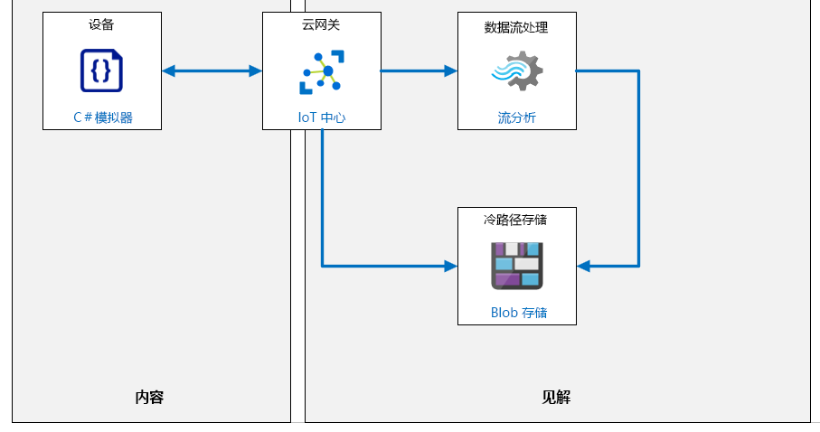

---
lab:
  title: 实验室 07：设备消息路由
  module: 'Module 4: Message Processing and Analytics'
ms.openlocfilehash: 4cdc79c81f29a2f2b5b7821894675a3bd2dc9737
ms.sourcegitcommit: 06dc1e6caa88a09b1246dd1161f15f619db9c6f8
ms.translationtype: HT
ms.contentlocale: zh-CN
ms.lasthandoff: 02/10/2022
ms.locfileid: "138421486"
---
# <a name="device-message-routing"></a>设备消息路由

## <a name="lab-scenario"></a>实验室场景

你使用 DPS 来实现自动设备注册给 Contoso 管理层留下了深刻的印象。 他们现在希望你开发一种与产品包装和运输有关的基于 IoT 的解决方案。

打包和运输奶酪所产生的成本值得注意。 为了最大程度地提高成本效率，Contoso 运营了一个本地包装设备。 工作流程简单直接 - 奶酪切块打包、包裹组装到运输容器中，容器运输到与其目的地关联的特定运输箱中。 传送带系统用于在此过程中传送产品。 运输成功的衡量标准是在给定时间段（通常是工作班次）内离开传送带系统的包裹数量。

传送带系统是此过程中的关键环节，它会被直观监控，确保工作流程以最高效率推进。 该系统具有三种操作员可控速度：停止、慢速和快速。 当然，以低速运输的包裹的数量比以更快速度运输的包裹数量要少。 不过，需要考虑很多其他因素：

* 速度较慢时，传送带系统的振动水平要小得多
* 振动水平高可能导致包裹从传送带上掉落
* 振动水平高已知会加快系统的磨损
* 当振动水平超过阈值限制时，必须停止传送带来进行检查（目的是避免更严重的故障）。

除了将吞吐量最大化，你的自动化 IoT 解决方案还将根据振动水平实施一种预防性维护，它将用于在出现严重系统损坏之前检测是否有早期警告迹象。

> **注意**：预防性维护有时称为防止性维护或预测性维护，它是一种设备维护程序，用于计划在设备正常运行时执行的维护活动。 这种方法的目的是避免意外故障，这些故障通常会导致代价高昂的设备中断。

操作员直观检测异常振动级别并不总是很容易。 因此，你正在寻求一种 Azure IoT 解决方案，该解决方案将有助于测量振动水平和数据异常。 振动传感器将连接到传送带的各个位置，你将使用 IoT 设备将遥测发送到 IoT 中心。 IoT 中心将使用 Azure 流分析和内置的机器学习 (ML) 模型来实时提醒你提防振动异常。 你还计划将所有遥测数据存档，以便将来可开发内部机器学习模型。

你可以使用来自单个 IoT 设备的模拟遥测技术来进行解决方案的原型设计。

为了以逼真的方式模拟振动数据，你可与一位运营部门的工程师一起工作，来稍微了解一下导致振动的原因。 事实证明，有多种不同类型的振动会影响整体振动级别。 例如，“强制振动”可能是由损坏的导轮或者传送带过载引起的。 当超出系统设计限制（例如速度或重量）时，也会引入“持续增加的振动”。 工程师团队同意帮助你为模拟的 IoT 设备开发代码，该设备将生成可接受的振动数据描述（包括异常）。

将创建以下资源：



## <a name="in-this-lab"></a>本实验室概览

在本实验室中，你首先将查看实验室先决条件，并根据需要运行脚本来确保你的 Azure 订阅包含所需的资源。 然后，你将创建一个将振动遥测数据发送到 IoT 中心的模拟设备。 在模拟设备到达 IoT 中心后，你将实施一项“IoT 中心消息路由和 Azure 流分析”作业，它可用于将数据存档。 本实验室包括以下练习：

* 配置实验室先决条件（所需的 Azure 资源）
* 编写代码来生成振动遥测数据
* 创建到 Azure Blob 存储的消息路由
* 日志记录路由 Azure 流分析作业

## <a name="lab-instructions"></a>实验室说明

### <a name="exercise-1-configure-lab-prerequisites"></a>练习 1：配置实验室先决条件

本实验室假定以下 Azure 资源可用：

| 资源类型 | 资源名称 |
| :-- | :-- |
| Resource Group | rg-az220 |
| IoT 中心 | iot-az220-training-{your-id} |
| 设备 ID | sensor-v-3000 |

若要确保这些资源可用，请完成以下步骤。

1. 在虚拟机环境中，打开 Microsoft Edge 浏览器窗口，然后导航到以下 Web 地址：
 
    +++https://portal.azure.com/#create/Microsoft.Template/uri/https%3A%2F%2Fraw.githubusercontent.com%2FMicrosoftLearning%2FAZ-220-Microsoft-Azure-IoT-Developer%2Fbicep%2FAllfiles%2FARM%2Flab07.json+++

    > 注意：每当看到绿色的“T”符号（例如 +++输入此文本+++）时，可以单击关联的文本，信息将键入到虚拟机环境内的当前字段中。

1. 如果系统提示登录到 Azure 门户，请输入你在本课程中使用的 Azure 凭据。

    将显示“自定义部署”页。

1. 在“项目详细信息”下的“订阅”下拉列表中，确保你打算在本课程中使用的 Azure 订阅已选中 。

1. 在“资源组”下拉列表中，选择“rg-az220” 。

    > 注意：如果未列出 rg-az220：
    >
    > 1. 在“资源组”下拉列表中，选择“新建”。
    > 1. 在“名称”下，输入 rg-az220 。
    > 1. 单击“确定”  。

1. 在“实例详细信息”下的“区域”下拉列表中，选择离你最近的区域 。

    > 注意：如果 rg-az220 组已存在，则“区域”字段将设置为资源组使用的区域，并且为只读 。

1. 在“你的 ID”字段中，输入在练习 1 中创建的唯一 ID。

1. 在“课程 ID”字段中，输入 az220 。

1. 若要验证模板，请单击“查看和创建”。

1. 验证通过后，单击“创建”。

    将启动部署。

1. 部署完成后，在左侧导航区域中，若要查看模板的任何输出值，请单击“输出”。

    记下输出供稍后使用：

    * connectionString
    * deviceConnectionString

现已创建资源。

### <a name="exercise-2-write-code-to-generate-vibration-telemetry"></a>练习 2：编写代码来生成振动遥测数据

要自动监视 Contoso 的传送带系统并启用预防性维护，同时需要长期数据分析和实时数据分析。 由于没有历史数据，因此首先将生成以逼真的方式模拟振动数据和数据异常的模拟数据。 Contoso 工程师开发了一种算法来模拟一段时间内的振动情况，并将该算法嵌入到了你将实现的代码类中。 工程师同意对调整该算法所需的任何未来更新提供支持。

在初始原型阶段，你将实现单个 IoT 设备来生成遥测数据。 除了振动数据，你的设备将创建一些额外的值（运输的包裹、环境温度和类似指标），它们将发送至 Blob 存储。 此额外数据将模拟要用于为预防性维护开发机器学习模型的数据。

通过学习本练习，你将能够：

* 加载模拟设备项目
* 为模拟设备上传连接字符串，并查看项目代码
* 测试模拟设备连接和遥测通信
* 确保遥测数据到达你的 IoT 中心

#### <a name="task-1-open-your-simulated-device-project"></a>任务 1：打开模拟设备项目

1. 打开 **Visual Studio Code**。

1. 在“文件”菜单上，单击“打开文件夹”。

1. 在“打开文件夹”对话框中，导航到 07-Device Message Routing 文件夹。

    在“实验室 3: 设置开发环境”中，你可以通过下载 ZIP 文件并从本地提取内容来克隆包含实验室资源的 GitHub 存储库。 提取的文件夹结构包括以下文件夹路径：

    * Allfiles
        * 实验室
            * 07 - 设备消息路由
                * 初学者
                    * VibrationDevice

1. 导航到实验室 7 的 Starter 文件夹。

1. 单击“VibrationDevice”，然后单击“选择文件夹”。

    你应该会在 Visual Studio Code 的资源管理器窗格中看到以下文件：

    * Program.cs
    * VibrationDevice.csproj

    > **注意**：如果系统提示加载所需的资产，可现在进行加载。

1. 在“资源管理器”窗格中，单击“Program.cs”。

    粗略地看一下就会发现，VibrationDevice 应用程序与前面的实验室中使用的应用程序非常相似。 此版本的应用程序使用对称密钥身份验证，将遥测和日志记录消息发送到 IoT 中心，并且具有更复杂的传感器实现。

1. 在“终端”菜单上，单击“新终端”。

    检查指示为命令提示符一部分的目录路径，确保你在正确的位置。 你无需在上一个实验室项目的文件夹结构中开始构建此项目。

1. 在终端命令提示符下，请输入以下命令以验证应用程序版本没有错误：

    ```cmd
    dotnet build
    ```

    输出结果会类似于：

    ```text
    ❯ dotnet build
    Microsoft (R) Build Engine version 16.5.0+d4cbfca49 for .NET Core
    Copyright (C) Microsoft Corporation. All rights reserved.

    Restore completed in 39.27 ms for D:\Az220-Code\AllFiles\Labs\07-Device Message Routing\Starter\VibrationDevice\VibrationDevice.csproj.
    VibrationDevice -> D:\Az220-Code\AllFiles\Labs\07-Device Message Routing\Starter\VibrationDevice\bin\Debug\netcoreapp3.1\VibrationDevice.dll

    Build succeeded.
        0 Warning(s)
        0 Error(s)

    Time Elapsed 00:00:01.16
    ```

在下一个任务中，你将配置连接字符串并查看应用程序。

#### <a name="task-2-configure-connection-and-review-code"></a>任务 2：配置连接并查看代码

你在此任务中构建的模拟设备应用将模拟监视传送带的 IoT 设备。 该应用将模拟传感器读数并每两秒钟报告一次振动传感器数据。

1. 确保 Program.cs 文件已在 Visual Studio Code 中打开。

1. 在 Program 类的顶部附近，找到 `deviceConnectionString` 变量的声明：

    ```csharp
    private readonly static string deviceConnectionString = "<your device connection string>";
    ```

1. 将 `<your device connection string>` 替换为之前保存的设备连接字符串。

    > **注意**：这是你需要对此代码进行的唯一更改。

1. 在“文件”菜单上，单击“保存”。

1. （可选）花点时间查看代码。

#### <a name="task-3-test-your-code-to-send-telemetry"></a>任务 3：测试代码以发送遥测数据

1. 在终端命令提示符下，请输入以下命令运行该应用：

    ```bash
    dotnet run
    ```

   此命令将在当前文件夹中运行 Program.cs 文件。

1. 显示的控制台输出应类似于以下内容：

    ```text
    Vibration sensor device app.

    Telemetry data: {"vibration":0.0}
    Telemetry sent 10:29 AM
    Log data: {"vibration":0.0,"packages":0,"speed":"stopped","temp":60.22}
    Log data sent

    Telemetry data: {"vibration":0.0}
    Telemetry sent 10:29 AM
    Log data: {"vibration":0.0,"packages":0,"speed":"stopped","temp":59.78}
    Log data sent
    ```

    > **注意**：在“终端”窗口中，绿色文本表示工作正常，红色文本表示工作异常。 如果收到错误消息，请先检查设备连接字符串。

1. 让此应用继续运行下一个任务。

    如果你不会继续执行下一个任务，则可以在终端窗口中输入 **Ctrl-C** 停止该应用。 你可以稍后使用 `dotnet run` 命令再次启动它。

#### <a name="task-4-verify-the-iot-hub-is-receiving-telemetry"></a>任务 4：验证 IoT 中心正在接收遥测

在本任务中，你将使用 Azure 门户来验证 IoT 中心是否在接收遥测数据。

1. 打开 [Azure 门户](https://portal.azure.com)。

1. 在“资源”磁贴上，单击“iot-az220-training-{your-id}”。

1. 在“概述”窗格中，向下滚动以查看指标磁贴。

1. 毗邻 “显示最后的数据”，将时间范围更改为一小时。

    “设备到云消息”磁贴应该正在绘制一些当前活动。 如果未显示任何活动，请稍等片刻，因为存在一些延迟。

    设备发出遥测数据且中心接收它后，下一步是将消息路由到正确的终结点。

### <a name="exercise-3-create-a-message-route-to-azure-blob-storage"></a>练习 3：创建到 Azure Blob 存储的消息路由

IoT 解决方案通常要求传入的消息数据根据数据类型或出于业务理由被发送到多个终结点位置。 Azure IoT 中心提供了消息路由功能，它可用它来将传入的数据定向到你的解决方案所需的位置。

我们的系统的体系结构要求将数据发送到两个目标：用于存档数据的存储位置和用于更直接分析的位置。

Contoso 的振动监视方案要求你创建两条消息路由：

* 第一条路由将指向 Azure Blob 存储位置进行数据存档
* 第二条路由将指向 Azure 流分析作业进行实时分析

一次应生成和测试一条消息路由，因此本练习将重点介绍存储路由。 此路由将被称为“日志记录”路由，它涉及到较深入地了解如何创建 Azure 资源。

消息路由的一个重要特征是能够在路由到终结点之前筛选传入的数据。 仅当满足某些条件时，编写为 SQL 查询的筛选器才会沿路由定向输出。

要筛选数据，最简单的方法之一是评估消息属性。 你可能记得在上一练习中向你的设备消息添加了消息属性。 你当时添加的代码如下所示：

```csharp
...
telemetryMessage.Properties.Add("sensorID", "VSTel");
...
loggingMessage.Properties.Add("sensorID", "VSLog");
```

现在，你可在使用 `sensorID` 作为路由条件的消息路径中嵌入一个 SQL 查询。 在本例中，如果分配给 `sensorID` 的值为 `VSLog`（振动传感器日志），则消息用于存储存档。

在本练习中，你将创建并测试日志记录路由。

#### <a name="task-1-define-the-message-routing-endpoint"></a>任务 1：定义消息路由终结点

1. 在 [Azure 门户](https://portal.azure.com/)中，确保 IoT 中心边栏选项卡已打开。

1. 在左侧菜单的“中心设置”下，单击“消息路由” 。

1. 在“消息路由”窗格中，确保选择“路线”选项卡。

1. 若要添加新路由，请单击“+ 添加”。

    现在应会显示“添加路由”边栏选项卡。

1. 在“添加路由”边栏选项卡的“名称”下，输入“vibrationLoggingRoute”

1. 在“终结点”的右侧，单击“+ 添加终结点”，然后在下拉列表中单击“存储”。

    现在应会显示“添加存储终结点”边栏选项卡。

1. 在“添加存储终结点”边栏选项卡的“终结点名称”下，输入“vibrationLogEndpoint”

1. 若要显示与你的订阅关联的存储帐户列表，请单击“选择容器”。

    已列出 Azure 订阅中已存在的存储帐户列表。 此时，你可以选择现有的存储帐户和容器，但对于本实验室，你将创建新的帐户和容器。

1. 若要开始创建存储帐户，请单击“+ 存储帐户”。

    此时应会显示“创建存储帐户”边栏选项卡。

1. 在“创建存储帐户”边栏选项卡的“名称”下，输入“vibrationstore{your-id}”

    例如：vibrationstorecah191211

    > **注意**：此字段只能包含小写字母和数字，必须介于 3-24 个字符之间，并且必须是唯一的。

1. 在“帐户类型”下拉列表中，选择“StorageV2 (常规用途 v2)”。

1. 在“性能”列表中选中“标准”。

    这样可以降低成本，但整体性能会减弱。

1. 在“复制”选项下，确保“本地 - 冗余存储 (LRS)”已选定。

    这样可以降低成本，但有降低缓解灾难恢复能力的风险。 在生产中，你的解决方案可能需要更强大的复制策略。

1. 在“位置”列表中，选择用于本课程中的实验的区域。

1. 在“最低 TLS 版本”下，确保选择了“版本 1.2” 。

1. 若要创建存储帐户终结点，请单击“确定”。

1. 等待直到请求通过验证并且存储帐户部署已完成。

    验证和创建可能需要一两分钟。

    完成后，“创建存储帐户”边栏选项卡将关闭，并将显示“存储帐户”边栏选项卡。 “存储帐户”边栏选项卡应该已自动更新为显示刚刚创建的存储帐户。

#### <a name="task-2-define-the-storage-account-container"></a>任务 2：定义存储帐户容器

1. 在“存储帐户”边栏选项卡上，单击“vibrationstore{your-id}”。

    此时应会显示“容器”边栏选项卡。 这是一个新的存储帐户，因此未列出任何容器。

1. 要创建容器，请单击“+ 容器”。

    此时应会显示“新建容器”对话框。

1. 在“新建容器”对话框的“名称”下，输入 vibrationcontainer

   同样，仅接受小写字母和数字。

1. 在“公共访问级别”下，确保选择“专用(不允许匿名访问)”。

1. 要创建容器，请单击“创建”。

    稍后，容器的“租用状态”将更新显示“可用”。

1. 要为你的解决方案选择此容器，请单击“vibrationcontainer”，然后单击“选择”。

    你应会返回到“添加存储终结点”边栏选项卡。 请注意，Azure 存储容器已设置为你刚刚创建的存储帐户和容器的 URL。

1. 将“批处理频率”和“块大小窗口”字段保留为默认值 100。

1. 在“编码”下，注意有两个选项，并且已选中“AVRO”。

    > **注意**：默认情况下，IoT 中心以 Avro 格式写入内容，该格式同时具有消息正文属性和消息属性。 Avro 格式不会用于其他任何终结点。 尽管 Avro 格式可用于保存数据和消息，但将其用于查询数据将是一项挑战。 比较而言，JSON 或 CSV 格式更容易用来查询数据。 IoT 中心现在支持将数据写入 JSON 中的 Blob 存储以及 AVRO。

1. 花点时间检查一下“文件名格式”字段中指定的值。

    “文件名格式”字段指定用于将数据写入存储中的文件中的模式。 创建文件时，将各个令牌替换为值。

1. 在边栏选项卡的底部，单击“创建”可创建存储终结点。

    验证和后续创建将需要一些时间。 完成后，你应会回到“添加路由”边栏选项卡。

    请注意，现已填充“终结点”。
#### <a name="task-3-define-the-routing-query"></a>任务 3：定义路由查询

1. 在“添加路由”边栏选项卡的“数据源”下，确保选中“设备遥测消息”。

1. 在“启用路由”选项下， 确保“启用”已选定。

1. 在“路由查询”下，将 **true** 替换为以下查询：

    ```sql
    sensorID = 'VSLog'
    ```

    此查询确保只有应用程序属性 `sensorID` 设置为 `VSLog` 的消息将路由到存储终结点。

1. 要保存此路由，请单击“保存”。

    等待成功消息。 完成后，“消息路由”窗格上应会列出该路由。

1. 导航回到 Azure 门户仪表板。

#### <a name="task-4-verify-data-archival"></a>任务 4：验证数据存档

1. 确保你在 Visual Studio Code 中创建的设备应用仍在运行。

    如果未运行，请使用 `dotnet run` 在 Visual Studio Code 终端运行它。

1. 在“资源”磁贴上，单击 vibrationstore{your-id} 打开存储帐户边栏选项卡。

    如果“资源”磁贴没有列出你的存储帐户，请单击资源组磁贴顶部的“刷新”按钮，然后按照上述说明打开你的存储帐户。

1. 在 vibrationstore{your-id} 边栏选项卡的左侧菜单中，单击“存储浏览器(预览版)” 。

    可使用存储资源管理器来验证数据是否正在添加到存储帐户。

    > **注意**：存储资源管理器当前处于预览模式，因此其确切的操作模式可能会更改。

1. 在“存储资源管理器(预览版)”窗格中，展开“BLOB 容器”，然后单击“vibrationcontainer”。

    要查看数据，你需要向下浏览文件夹的层次结构。 第一个文件夹将针对 IoT 中心进行命名。

    > **注意**：如果没有显示数据，请稍等片刻，然后重试。

1. 在右侧窗格的“名称”下，双击 iot-az220-training-{your-id}，然后双击向下导航到层次结构。

    在“IoT 中心”文件夹下，你将看到关于分区的文件夹，再是关于年份、月份和日期数字值的文件夹。 最后一个文件夹表示“小时”，它按 UTC 时间列出。 “小时”文件夹中将有大量的块 Blob，其中包含日志记录消息数据。

1. 双击块 Blob可查看具有最早时间戳的数据。

1. 单击顶部的“下载”菜单。

    名为 {day_num}.avro 的文件（即 22.avro）将下载到 Downloads 文件夹  。

1. 使用 Visual Studio Code 打开下载的文件，然后单击“是否仍要打开” 。

    虽然数据的格式使得它不容易阅读，但你应能够将它识别为你的振动消息。

1. 关闭包含数据的 Visual Studio Code 文档。

1. 返回到你的 Azure 门户仪表板。

### <a name="exercise-4-logging-route-azure-stream-analytics-job"></a>练习 4：日志记录路由 Azure 流分析作业

在此练习中，你将创建一个流分析作业来将日志记录消息输出到 Blob 存储。 然后，你将使用 Azure 门户中的存储资源管理器来查看存储的数据。

这样，你将能够验证你的路由是否包括以下设置：

* 名称 - vibrationLoggingRoute
* 数据源 - DeviceMessages
* 路由查询 - sensorID = 'VSLog'
* 终结点 - vibrationLogEndpoint
* 已启用 - true

> **注意**：在本实验室中，你将数据路由到存储，然后再通过 Azure 流分析将数据发送到存储，这似乎很奇怪。 在生产场景中，这两条路径不会长期存在。 事实上，我们在此处创建的第二条路径很可能不存在。 在实验室环境中，你将使用这种方法来验证你的路由是否正常工作，并展示 Azure 流分析的简单实现。

#### <a name="task-1-create-the-stream-analytics-job"></a>任务 1：创建流分析作业

1. 在 Azure 门户菜单上，单击“+ 创建资源”。

1. 在“新建”边栏选项卡上的“搜索市场”文本框中，键入“流分析”，然后单击“流分析作业”。

1. 在“流分析作业”边栏选项卡上，单击“创建”。

    显示“新建流分析作业”窗格。

1. 在“新建流分析作业”窗格的“名称”下，输入“vibrationJob”。

1. 在“订阅”下，选择将在本实验室中使用的订阅。

1. 在“资源组”下，选择 rg-az220。

1. 在“位置”列表中，选择用于本课程中的实验的区域。

1. 在“托管环境”下，确保选中“云”。

    Edge 托管将在本课程的后面部分讨论。

1. 在“流单元数”下，将数量从 3 减少到 1。

    本实验室不需要 3 个单元，此操作可降低成本。

1. 要创建流分析作业，请单击“创建”。

1. 等待“部署成功”消息，然后打开新资源。

    > **** 提示：如果错过了用于访问新资源的消息，或者需要在任何时间查找资源，请选择“主页/所有资源”。 输入充分的资源名称，使其显示在资源列表中。

1. 花点时间检查新的流分析作业。

    请注意，你有一个不显示任何输入或输出的空作业以及一个框架查询。 下一步是填充这些条目。

#### <a name="task-2-create-the-stream-analytics-job-input"></a>任务 2：创建流分析作业输入

1. 在左侧菜单的“作业拓扑”下，单击“输入”。

    这将显示“输入”窗格。

1. 在“输入”窗格中，单击“+ 添加流输入”，然后单击“IoT 中心”。

    这将显示“IoT 中心 - 新输入”窗格。

1. 在“IoT 中心 - 新输入”窗格的“输入别名”中输入 `vibrationInput` 。

1. 选中“从你的订阅中选择 IoT 中心”。

1. 在“IoT 中心”下，确保已选择 IoT 中心 iot-az220-training-{your-id}。

1. 请确保在“订阅”中选中你先前用于创建 IoT 中心的订阅。

1. 在“IoT 中心”下，确保已选择 IoT 中心 iot-az220-training-{your-id}。

1. 在“使用者组”下，确保选择 $Default。

1. 在“共享访问策略名称”中，确保选中“iothubowner”。

    > **注意**：“共享访问策略密钥”已填充且为只读。

1. 在“终结点”中选中“消息传送”。

1. 将“分区键”留空。

1. 在“事件序列化格式”选项下，确保已选中“JSON”。

1. 在“编码”下，确保选择“UTF-8”。

    你可能需要向下滚动才能看到某些字段。

1. 在“事件压缩类型”下，确保选择“无”。

1. 要保存新输入，请单击“保存”，然后等待输入创建完毕。

    “输入”列表应更新为显示新输入。

#### <a name="task-3-create-the-stream-analytics-job-output"></a>任务 3：创建流分析作业输出

1. 要创建输出，请在左侧菜单的“作业拓扑”选项下，单击“输出”。

    将显示“输出”窗格。

1. 在“输出”窗格，单击“+ 添加”，然后单击“Blob 存储/ADLS Gen2”  。

    “Blob 存储/ADLS Gen2 - 新输出”窗格随即显示。

1. 在“Blob 存储/ADLS Gen2 - 新输出”窗格上，在“输出别名”下输入 `vibrationOutput` 。

1. 确保已选择“从订阅中选择 Blob 存储/ADLS Gen2”。

1. 在“订阅”下，选择要在本实验室中使用的订阅。

1. 在“存储帐户”下，单击“vibrationstore{your-id}”。

1. 在“容器”下，确保选择了“使用现有容器”，并从下拉列表中选择了“振动容器”。

1. 在“身份验证模式”下，选择“连接字符串” 

    > 请注意，将显示“存储帐户密钥” 。

1. 将“路径模式”保留为空。

1. 将“日期格式”和“时间格式”保留为各自的默认值。

1. 在“事件序列化格式”选项下，确保已选中“JSON”。

1. 在“格式”下，确保选择“按行分隔”。

1. 在“编码”下，确保选择“UTF-8”。

    > **注意**：此设置将每条记录整体作为一个 JSON 对象存储在每行上，最终导致文件是一个无效的 JSON 记录。 另一个选项“数组”可确保将整个文档格式化为 JSON 数组，其中每条记录都是数组中的一项。 这样就可以将整个文件解析为有效的 JSON。

1. 将“最小行数”保留为空白。

1. 将“最长时间”下的“小时”和“分钟”保留为空白。

1. 要创建输出，请单击“保存”，然后等待输出创建完毕。

    使用新输出更新 **输出** 列表。

#### <a name="task-4-create-the-stream-analytics-job-query"></a>任务 4：创建流分析作业查询

1. 要编辑查询，请在左侧菜单的“作业拓扑”下，单击“查询”。

1. 在“查询编辑器”窗格中，将现有查询替换为以下查询：

    ```sql
    SELECT
        *
    INTO
        vibrationOutput
    FROM
        vibrationInput
    ```

1. 直接在查询编辑器窗格上方，单击“保存查询”。

1. 在左侧菜单上，单击“概述”。

#### <a name="task-5-test-the-logging-route"></a>任务 5：测试日记记录路线

现在这一部分非常有趣。 你的设备应用抽取出的遥测数据是否会按照路由进行工作并发送到存储容器？

1. 确保你在 Visual Studio Code 中创建的设备应用仍在运行。

    如果未运行，请使用 `dotnet run` 在 Visual Studio Code 终端运行它。

1. 在流分析作业的“概述”窗格中，单击“开始”。

1. 在“开始作业”窗格中，将“作业输出开始时间”保留设置为“立即”，然后单击“开始”。

    可能需要一些时间才能开始作业

1. 在“Azure 门户中心”菜单上，单击“仪表板”。

1. 在“资源”磁贴上，单击“vibrationstore{your-id}”。

    如果看不到你的存储帐户，请使用资源组图块顶部的“刷新”按钮。

1. 在存储帐户的“概述”窗格中，选择“监视”部分 。

1. 在“密钥指标”下的“显示上次的数据”旁边，将时间范围更改为“1 小时”  。

    你应在图表中看到活动。

1. 在左侧菜单上，单击“存储浏览器(预览版)”。

    可使用存储资源管理器进一步确保你的所有数据都将进入存储帐户。

    > **注意**：存储资源管理器当前处于预览模式，因此其确切的操作模式可能会更改。

1. 在“存储浏览器(预览版)”的“BLOB 容器”下，单击 vibrationcontainer  。

1. 若要查看数据，请选择 json 文件并单击“下载”，然后单击“单击此处进行下载” 。

1. 通过 Visual Studio Code 打开下载的文件，然后查看 JSON 数据。

    ```json
    {"vibration":-0.025974767991863323,"EventProcessedUtcTime":"2021-10-22T22:03:10.8624609Z","PartitionId":3,"EventEnqueuedUtcTime":"2021-10-22T22:02:09.1180000Z","IoTHub":{"MessageId":null,"CorrelationId":null,"ConnectionDeviceId":"sensor-v-3000","ConnectionDeviceGenerationId":"637705296662649188","EnqueuedTime":"2021-10-22T22:02:08.7900000Z"}}
    {"vibration":-2.6574811793183173,"EventProcessedUtcTime":"2021-10-22T22:03:10.9718423Z","PartitionId":3,"EventEnqueuedUtcTime":"2021-10-22T22:02:11.1030000Z","IoTHub":{"MessageId":null,"CorrelationId":null,"ConnectionDeviceId":"sensor-v-3000","ConnectionDeviceGenerationId":"637705296662649188","EnqueuedTime":"2021-10-22T22:02:11.0720000Z"}}
    {"vibration":3.9654399589335796,"EventProcessedUtcTime":"2021-10-22T22:03:10.9718423Z","PartitionId":3,"EventEnqueuedUtcTime":"2021-10-22T22:02:13.3060000Z","IoTHub":{"MessageId":null,"CorrelationId":null,"ConnectionDeviceId":"sensor-v-3000","ConnectionDeviceGenerationId":"637705296662649188","EnqueuedTime":"2021-10-22T22:02:13.1500000Z"}}
    {"vibration":0.99447803871677132,"EventProcessedUtcTime":"2021-10-22T22:03:10.9718423Z","PartitionId":3,"EventEnqueuedUtcTime":"2021-10-22T22:02:15.2910000Z","IoTHub":{"MessageId":null,"CorrelationId":null,"ConnectionDeviceId":"sensor-v-3000","ConnectionDeviceGenerationId":"637705296662649188","EnqueuedTime":"2021-10-22T22:02:15.2120000Z"}}
    ```

1. 关闭包含数据的 Visual Studio Code 文档。

1. 返回到你的 Azure 门户仪表板。

1. 导航回到你的仪表板。

1. 在“资源”磁贴上，单击“vibrationJob”。

1. 在“vibrationJob”边栏选项卡中，依次单击“停止”和“是”。

    你已通过设备应用-中心-路由-存储容器跟踪活动。 进展很大！ 在下一个模块（即快速查看数据可视化）中，你将继续此方案的流分析。

1. 切换到 Visual Studio Code 窗口。

1. 在终端命令提示符下，要退出设备模拟器应用，请按 CTRL-C。

> **重要说明**：在完成本课程的数据可视化模块之前，请勿删除这些资源。
