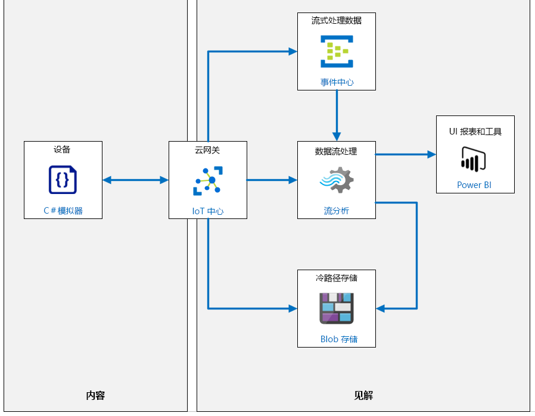
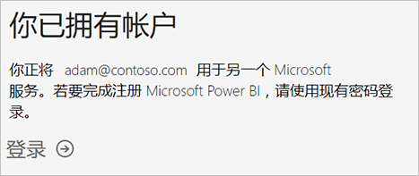
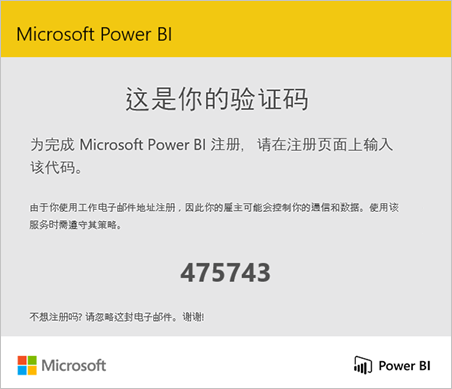
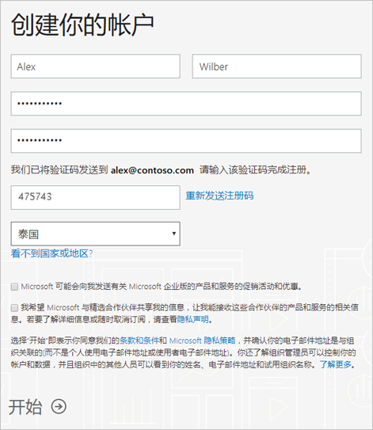

---
lab:
    title: '实验室 08：在 Power BI 中直观呈现数据流'
    module: '模块 5：见解和业务集成'
---

# 在 Power BI 中直观呈现数据流

> **重要说明**： 本实验室具有若干与你为该课程获得的 Azure 订阅无关的服务先决条件：
>
> 1. 能够登录“工作或学校帐户”（Azure Active Directory 帐户）
> 2. 你必须知道自己的帐户登录名，该名称可能不同于你的电子邮件地址。
> 3. 可以通过以下方式访问 Power BI：
>       1. 现有的 Power BI 帐户
>       2. 能够注册 Power BI（一些组织禁止此操作）。
>
> 第一个实验室练习将验证你访问 Power BI 的能力。  如果第一个练习没有成功，则将无法完成该实验室，因为工作或学校帐户访问受阻时没有快速的替代方法。

## 实验室场景

你已经开发了一个模拟 IoT 设备，用来生成振动数据和其他遥测输出，这些信息表示在 Contoso 的奶酪包装过程中使用的传送带系统。你已经生成并测试了将数据发送到 Azure Blob 存储的日志记录路由。现在，你将开始在 IoT 中心内的新路由上进行工作，该路由会将遥测数据发送到 Azure 事件中心服务。

Azure IoT 中心和 Azure 事件中心之间的主要区别在于，事件中心是针对大数据流式处理设计的，而 IoT 中心针对 IoT 解决方案进行了优化。两种服务都支持低延迟、高可靠性的数据引入。Azure 事件中心以类似于 IoT 中心的方式向流分析提供输入，因此这里你选择的事件中心使你能够在解决方案中探索其他 Azure 服务选项。

### 调用内置的机器学习模型

在本实验室中，你将调用一个名为 `AnomalyDetection_SpikeAndDip` 的内置机器学习 (ML) 函数。`AnomalyDetection_SpikeAndDip` 函数使用滑动窗口来分析数据是否存在异常。例如，滑动窗口可以是最近两分钟的遥测数据。该窗口随遥测数据流近乎实时地向前推进。一般来说，如果滑动窗口的大小已增加来包含更多数据，那么异常检测的准确性也将增加（不过，延迟也会增加，因此必须找到一个平衡点）。

该函数会为数据建立一个“正常”范围，然后用它来标识异常并分配评分。其工作原理是：随着函数继续监视数据流，算法会建立值的一个正常范围，然后对照这些规范来比较新值。结果是每个值的分数百分比（表示为一个百分比），可确定给定值为异常的置信度。如你所料，可忽略低置信度水平，但你可能想知道哪个百分比的置信度值是可接受的。在你的查询中，我们将 95% 设置为此转折点。

总是会出现一些复杂情况，例如，当数据中有间隙时（传送带可能会停止一段时间）。该算法通过输入值处理数据中的空隙。

> **备注：** 在统计学中，插补是用替换值替换缺失数据的过程。可在[此处](https://en.wikipedia.org/wiki/Imputation_%28statistics%29)详细了解插补。

遥测数据中的峰值和谷值是暂时性的异常。不过，由于你是使用正弦波来模拟振动数据，因此可能会出现一段“正常”的值，接着是触发异常警报的较高或较低值。操作员可查看在短时间范围内发生的异常的群集，这可能表示出现问题。

还有其他内置 ML 模型，如检测趋势的模型。在此模块中不会介绍这些模型，但欢迎学生进一步研究。

### 使用 Power BI 直观呈现数据

可视化数值数据（特别是它的数量）本身就是一项挑战。我们如何向人类操作员发送一系列警报以推断出现了问题？

我们在此模块中使用的解决方案是使用 Power BI 的某些内置功能，以及 Azure 流分析中以 Power BI 可以引入的实时格式发送数据的功能。

我们使用 Power BI 的仪表板功能来创建大量磁贴。一个磁贴包含实际振动度量值。另一磁贴是仪表，在 0.0 到 1.0 之间显示值为异常的置信度。第三个磁贴指示是否达到 95% 置信度。最后，第四个磁贴显示在过去一小时内检测到的异常数。通过将时间作为 x 轴，此磁贴可以清晰地显示出是否在短时间内连续检测到多个异常值，原因是这些异常值会在水平方向上聚集在一起。

第四个磁贴使你能够将异常值与遥测控制台窗口中的红色文本进行比较。当出现受迫和/或渐增振动时，是否检测到大量异常情况？

将创建以下资源：



## 本实验室概览

在本实验室中，你将完成以下活动：

* 验证是否满足实验室先决条件（具有必需的 Azure 资源）
* 注册 Power BI
* 从模拟设备生成遥测数据
* 实时分析遥测
* 创建 Azure 事件中心服务
* 创建实时消息路由
* 向 IoT 中心添加遥测路由
* 创建 Power BI 仪表板以直观呈现数据异常

让我们创建事件中心，创建第二个路由，更新 SQL 查询，创建 Power BI 仪表板，并让它们全都运行起来！

## 实验室说明

### 练习 1：验证实验室先决条件

本实验室假定以下 Azure 资源可用：

| 资源类型 | 资源名称 |
| :-- | :-- |
| 资源组 | rg-az220 |
| IoT 中心 | iot-az220-training-{your-id} |
| 设备 ID | sensor-v-3000 |
| 存储帐户名称 | vibrationstore{your-id} |
| 存储容器 | vibrationcontainer |
| 事件中心命名空间 | vibrationNamespace{your-id} |
| 事件中心名称 | vibrationeventhubinstance |
| 流式处理作业 | vibrationJob |
| 流式处理作业输入 | vibrationInput |
| 流式处理作业输出 | vibrationOutput |
| 流式处理作业转换 | VibrationJobTransformation |

如果这些资源不可用，请按照以下说明运行 **lab08-setup.azcli** 脚本，然后再前往练习 2。脚本文件包含在本地克隆作为开发环境配置（实验室 3）的 GitHub 存储库中。

写入 **lab08-setup.azcli** 脚本，并在 **Bash**shell 环境中运行，执行此操作最简便的方法是在 Azure Cloud Shell 中。

1. 使用浏览器，打开 [Azure Shell](https://shell.azure.com/)，并使用本课程所使用的 Azure 订阅登录。

    如果系统提示设置 Cloud Shell 的存储，请接受默认设置。

1. 验证 Azure Cloud Shell 是否正在使用 **Bash**。

    Azure Cloud Shell 页面左上角的下拉菜单用于选择环境。验证所选的下拉值是否为 **Bash**。

1. 在 Cloud Shell 工具栏上，单击 **“上传/下载文件”** （从右数第四个按钮）。

1. 在下拉菜单中，单击 **“上传”**。

1. 在“文件选择”对话框中，导航到配置开发环境时下载的 GitHub 实验室文件的文件夹位置。

    在“实验室 3：_设置开发环境_，你可以通过下载 ZIP 文件并从本地提取内容来克隆包含实验室资源的 GitHub 存储库。提取的文件夹结构包括以下文件夹路径：

    * Allfiles
      * 实验室
          * 08-Visualize a Data Stream in Power BI
            * 设置

    lab08-setup.azcli 脚本文件位于实验室 7 的 Setup 文件夹中。

1. 选择 **lab08-setup.zip** 文件，然后单击 **“打开”**。

    文件上传完成后，系统将显示一条通知。

1. 若要验证在 Azure Cloud Shell 中已上传了正确文件，请输入以下命令：

    ```bash
    ls
    ```

    使用 `ls` 命令列出当前目录的内容。你应该会看到列出的 lab08-setup.azcli 文件。

1. 若要为此实验室创建一个包含安装脚本的目录，然后移至该目录，请输入以下 Bash 命令：

    ```bash
    mkdir lab8
    unzip lab08-setup.zip -d ./lab8
    cd lab8
    ```

1. 为了确保 **lab08-setup.azcli** 和 **Create-Job.ps1** 具有执行权限，请输入以下命令：

    ```bash
    chmod +x lab08-setup.azcli
    chmod +x Create-Job.ps1
    ```

1. 在 Cloud Shell 工具栏上，请单击 **“打开编辑器”** （右侧的第二个按钮 - **{ }**）以启用对 lab08-setup.azcli 文件的访问。

1. 在 **“文件”** 列表中，要展开 lab8 文件夹并打开脚本文件，单击 **“lab8”**=，然后单击 **“lab08-setup.azcli”**。

    编辑器现在将显示 **“lab08-setup.azcli”** 文件的内容。

1. 在编辑器中，更新 `{your-id}` 和 `{your-location}` 分配的值。

    以下面的示例为例，需要将 `{your-id}` 设置为在本课程开始时创建的唯一 ID（即 **cah191211**），然后将 `{your-location}` 设置为对你的资源有意义的位置。

    ```bash
    #!/bin/bash

    # Change these values!
    YourID="{your-id}"
    Location="{your-location}"
    ```

    > **备注：**  应将 `{your-location}` 变量设置为要部署所有资源的区域的短名称。输入以下命令，可以看到可用位置及其短名称的列表（**“名称”** 列）：

    ```bash
    az account list-locations -o Table

    DisplayName           Latitude    Longitude    Name
    --------------------  ----------  -----------  ------------------
    East Asia             22.267      114.188      eastasia
    Southeast Asia        1.283       103.833      southeastasia
    Central US            41.5908     -93.6208     centralus
    East US               37.3719     -79.8164     eastus
    East US 2             36.6681     -78.3889     eastus2
    ```

1. 要保存对文件所做的更改并关闭编辑器，请单击编辑器窗口右上角的 “**...**”，然后单击 **“关闭编辑器”**。

    如果提示保存，请单击 **“保存”**，编辑器将会关闭。

    > **备注：** 可以使用 **Ctrl+S** 随时保存，使用 **Ctrl+Q** 关闭编辑器。

1. 要创建本实验室所需的资源，请输入以下命令：

    ```bash
    ./lab08-setup.azcli
    ```

    此脚本将需要几分钟的时间才能运行。每个步骤完成时，你都会看到输出：

    ```text
    Create resource group rg-az220 - Success
    Create IoT Hub iot-az220-training-dm200420 - Success
    Create device sensor-v-3000 - Success
    Create storage account vibrationstoredm200420 - Success
    Create storage container vibrationcontainer - Success
    Create IoT Hub endpoint vibrationLogEndpoint - Success
    Create IoT Hub route vibrationLoggingRoute - Success
    Create routing-endpoint vibrationTelemetryEndpoint - Success
    Create iot hub route  - Success
    Setup Azure Streaming Job - launching PowerShell

    MOTD: Download scripts from PowerShell Gallery: Install-Script <script name>

    VERBOSE: Authenticating to Azure ...
    VERBOSE: Building your Azure drive ...
    Creating job vibrationJob
    Creating job input vibrationInput
    Creating job output vibrationOutput
    Creating job transformation VibrationJobTransformation
    Device Connection String for the application:
    ----------------------------------------------------
    HostName=iot-az220-training-dm200420.azure-devices.net;DeviceId=sensor-v-3000;SharedAccessKey=5p9giH/AnpcykMaM+OYcidtIkNz0o9/KDnZTrgii4cc=
    ```

1. 请注意，脚本完成后，将显示设备的连接字符串。

    连接字符串以 "HostName=" 开头

1. 将连接字符串复制到文本文档中，请注意，该字符串适用于 **sensor-v-3000** 设备。

    将连接字符串保存到容易找到的位置后，就可以继续进行本实验室了。

### 练习 2：注册 Power BI

Power BI 可用作个人数据分析和可视化工具，也可用作小组项目、部门或整个公司的分析和决策引擎。在本实验室后面的部分中，将生成仪表板并使用 Power BI 直观呈现数据。本练习说明了如何以个人身份注册 Power BI。

>**备注：** 如果你已拥有 Power BI 订阅，而且你能够在本课程期间使用它，可跳到练习 2。

#### 任务 1：了解支持的电子邮件地址

在开始注册过程之前，了解哪种电子邮件地址类型可用于注册 Power BI 很重要：

* Power BI 要求使用工作或学校电子邮件地址进行注册。无法使用消费者电子邮件服务或电信提供商提供的电子邮件地址进行注册。这包括 outlook.com、hotmail.com、gmail.com 等。

* 注册后，你可以[邀请来宾用户](https://docs.microsoft.com/azure/active-directory/active-directory-b2b-what-is-azure-ad-b2b)使用包括个人帐户在内的任何电子邮件地址查看 Power BI 内容。

* 你可以使用 .gov 或 .mil 地址注册 Power BI，但过程会有所不同。有关更多信息，请参阅[在 Power BI 服务中注册美国政府组织](https://docs.microsoft.com/zh-cn/power-bi/service-govus-signup)。

#### 任务 2：注册 Power BI 帐户

请按照以下步骤注册 Power BI 帐户。完成注册后，你将获得一个 Power BI（免费）许可，你可以在“我的工作区”中自行试用 Power BI，使用分配给 Power BI Premium 容量的 Power BI 工作区中的内容或启动单个 Power BI Pro 试用版。

1. 在浏览器中，导航到“注册页”[](https://signup.microsoft.com/signup?sku=a403ebcc-fae0-4ca2-8c8c-7a907fd6c235)。

1. 在 **“开始使用”** 页面，输入受支持的电子邮件地址。

1. 如果看到一条要求证明你不是机器人的消息，请选择 **“给我发短信”** 或者 **“给我打电话”**，并提供相关信息以接收验证码，然后继续下一步操作。

    

    相反，如果系统提示你已有帐户，请继续登录并准备使用 Power BI。

    

1. 检查手机短信或等着被呼叫，然后输入收到的验证码，最后单击 **“注册”**。

    

1. 检查电子邮件中是否有类似这样的消息。

    

1. 在下一屏中，输入个人信息和电子邮件中的验证码。选择一个区域，查看与该屏幕链接的策略，然后选择“开始”。

    

1. 然后你将前往[Power BI 登录页](https://powerbi.microsoft.com/landing/signin/)，从这里开始使用 Power BI。

现在，你可以访问 Power BI，因此可以随时将实时遥测数据路由到 Power BI 仪表板。

### 练习 3：从模拟设备生成遥测数据

为了在 Power BI 仪表板中对 IoT 中心的实时流数据实现可视化效果，你需要能够发送遥测消息的真实或模拟 IoT 设备。幸运的是，你已在实验室 7 中创建了满足此要求的模拟设备。

在本练习中，你需要确保上一个实验室中的设备模拟器应用仍在运行。 

> **重要说明**： 如果尚未完成本课程的实验室 7，请立即完成。

#### 任务 1：在 Visual Studio Code 中启动 VibrationDevice 应用

1. 打开 Visual Studio Code。

1. 在 **“文件”** 菜单上，单击 **“打开文件夹”**。

1. 在 **“打开文件夹”** 对话框中，导航到实验室 8 的 Starter 文件夹。

    在“实验室 3：_设置开发环境_，你可以通过下载 ZIP 文件并从本地提取内容来克隆包含实验室资源的 GitHub 存储库。提取的文件夹结构包括以下文件夹路径：

    * Allfiles
      * 实验室
          * 08-Visualize a Data Stream in Power BI
            * 入门
 
1. 单击 **“VibrationDevice”**，然后单击 **“选择文件夹”**。

    你可以看到“资源管理器”窗格中列出的 Program.cs 和 VibrationDevice.csproj 文件。

1. 在 **“资源管理器”** 窗格中，单击 **“Program.cs”**。

1. 在“代码编辑器”窗格中，确保已正确分配连接字符串变量 `deviceConnectionString`。

    可在 IoT 中心找到 sensor-v-3000 设备的连接字符串，也可查看已完成的实验室 7 的项目。 

    代码中的变量分配应如下所示：

    ```csharp
    deviceConnectionString = "HostName=iot-az220-training-cah200509.azure-devices.net;DeviceId=sensor-v-3000;SharedAccessKey=nSUbphUKsS1jEd7INrEtmVWZesMBDIxzjVe4jn01KJI=";
    ```

1. 在 **“文件”** 菜单中，单击 **“保存”**。

1. 在 **“查看”** 菜单中，单击 **“终端”**。

    验证命令提示符是否显示 **VibrationDevice** 文件夹的文件夹路径。
 
1. 要在终端中运行该应用，请输入以下命令：

    ```bash
    dotnet run
    ```

   此命令将在当前文件夹中运行 **“Program.cs”** 文件。

1. 你应该很快就能看到控制台输出，类似于：

    

    > **备注：**  绿色文本表示一切正常，红色文本表示存在异常。如果屏幕上未出现类似图像，请首先检查设备连接字符串。

1. 保持此应用持续运行。

    遥测数据是数据可视化所必需的。

### 练习 4：创建 Azure 事件中心服务

既然遥测数据已经流式传输到 IoT 中心，接下来你就可以将 Azure 事件中心命名空间和 Azure 事件中心实例添加到解决方案中。Azure 事件中心非常适合处理流数据并支持实时仪表板方案 - 非常适合将振动数据传递到 Power BI。

#### 任务 1：创建事件中心命名空间

在此任务中，将使用 Azure 门户创建事件中心资源。

1. 使用你的 Azure 帐户凭据登录到 [portal.azure.com](https://portal.azure.com)。

    如果有多个 Azure 帐户，请确保使用与本课程要使用的订阅绑定的帐户登录。

1. 在 Azure 门户中，单击 **“所有服务”**。

1. 在“搜索”文本框中，键入 **“事件”**

1. 在搜索文本框下的搜索结果窗格，单击 **“事件中心”**。

1. 要开始新建事件中心资源，请单击 **“创建事件中心命名空间”**。

    将显示 **“创建命名空间”** 边栏选项卡。

1. 在 **“创建命名空间”** 边栏选项卡中，使用你为本课程使用的值配置 **“订阅”** 和 **“资源组”** 字段。

    资源组应与你用于 IoT 中心和其他资源的资源组相同，即为 **rg-az220**。

1. 在 **“命名空间名称”** 字段中，键入 **vibrationNamespace**，然后输入唯一标识符 {your-id}。

    例如： **vibrationNamespacecah191212**

    该名称必须全局唯一。

1. 在 **“位置”** 列表中，选择已在用于本课程中的其他实验室的区域。

1. 在 **“定价层”** 下拉列表中，单击 **“标准”**。

   > **备注：**  如果选择标准定价层，将启用 _“Kafka”_。适用于 Kafka 功能的事件中心基于 Azure 事件中心提供协议头，该协议头与 Kafka 1.0 和更高版本二进制兼容，可以读取和写入 Kafka 主题。如需了解有关事件中心和 Apache Kafka 的更多信息，请单击[此处](https://docs.microsoft.com/zh-cn/azure/event-hubs/event-hubs-for-kafka-ecosystem-overview)。本实验室中不会使用 Kafka。

1. 对于 **“吞吐量单位”** 字段，请确保值设置为 1。

    本实验室没有生成足够数据，因此不能增加单位数量。

1. 取消勾选“**启用自动膨胀**”复选框。

    > **备注**：  当流量超出为事件中心命名空间分配的吞吐量单位容量时，“自动膨胀”会自动缩放分配给该命名空间的吞吐量单位数量。你可以指定命名空间自动缩放的限制。本实验室不需要此功能。

1. 在边栏选项卡底部，单击“**查看 + 创建**”。

    你应会看到一条消息，其中指出验证成功。如果不成功，则你需要处理指定的问题。
 
1. 要创建资源，请单击“**创建**”，然后等待资源部署完成。

    部署将花费几分钟时间。可以打开“通知”窗格以监视进度。 

    得到事件中心命名空间后，你可以创建事件中心实例。

#### 任务 2：创建事件中心实例

1. 导航回 Azure 门户仪表板页面。

1. 在“资源”磁贴上，单击 **“vibrationNamespace{your-id}”**。

    如果未列出事件中心命名空间，请刷新磁贴。

    将显示 **“事件中心命名空间”** 边栏选项卡上的 **“概述”** 窗格。

1. 要创建事件中心实例，请在窗格顶部单击 **“+ 事件中心”**。

    将显示 **“创建事件中心”** 边栏选项卡。

1. 在 **“创建事件中心”** 边栏选项卡上的 **“名称”** 字段下，输入 **“vibrationeventhubinstance”**。

1. 将 **“分区计数”** 设为 **“1”**。

    > **备注：** 分区是一种与使用应用程序所需的下游并行性有关的数据组织机制。事件中心中的分区数直接与你期望拥有的并发读取器数相关。你可以通过联系事件中心团队将分区数增加到 32 以上。分区计数不可更改，因此在设置分区计数时应考虑长远缩放。在本实验室中，我们只需要 1。

1. 将 **“消息保留期”** 设为 **“1”**。

    > **备注：**  这是事件的保留期。你可以将保留期设置为 1 到 7 天。对于本实验室，只需最短保留期即可。

1. 保持 **“捕获”** 设置为 **“关闭”** 状态。

    > **备注：** 通过 Azure 事件中心捕获，你可自动向所选的 Azure Blob 存储或 Azure Data Lake Store 帐户传送事件中心的流数据，可更灵活地指定时间或大小间隔。本实验室不需要此功能。

1. 若要创建 Azure 中心实例，请单击 **“创建”** ，然后等待资源部署完成。

### 练习 5：创建实时消息路由

现在你有了事件中心命名空间和事件中心服务，接下来需要将遥测数据从 IoT 中心传递到事件中心。

#### 任务 1：创建遥测路由

在此任务中，你将向 IoT 中心添加消息路由，用于将遥测消息发送到你刚才创建的事件中心实例。

1. 导航回到你的 Azure 门户仪表板。

1. 在“资源”磁贴上，打开你的 IoT 中心，单击 **“iot-az220-training-{your-id}”**。

    将显示 IoT 中心的 **“总览”** 窗格。

1. 在 **“概述”** 窗格左侧菜单中的 **“消息传递”** 下，选择 **“消息路由”**。

1. 在 **“消息路由”** 窗格中单击 **“+ 新增”**，添加新的消息路由。

1. 在 **“添加路由”** 边栏选项卡的 **“名称”** 字段下，输入 **“vibrationTelemetryRoute”**。

1. 在 **“终结点”** 下拉菜单右侧，单击 **“+ 新增终结点”**，然后单击 **“事件中心”**。

1. 在 **“添加事件中心终结点”** 边栏选项卡的 **“终结点名称”** 下，输入 **“vibrationTelemetryEndpoint”**。

1. 在 **“事件中心命名空间”** 下选择之前创建的命名空间。

    它应类似于 **vibrationNamespacecah191212**

1. 在 **“事件中心实例”** 选项下，单击 **“vibrationeventhubinstance”**。

1. 要创建终结点，请单击 **“创建”**，然后等待成功消息。

    你将返回到 **“添加路由”** 边栏选项卡，此时的 **“终结点”** 值已被更新。

1. 在 **“添加路由”** 边栏选项卡的 **“数据源”** 下，确保选中 **“设备遥测消息”**。

1. 在 **“启用路由”** 选项下， 确保 **“启用”** 已选定。

1. 在 **“路由查询”** 选项下，将现有查询替换为：

    ```sql
    sensorID = 'VSTel'
    ```

    你可能还记得上一个查询已将“VSLog”消息发送到日志记录存储。此消息路由将向事件中心实例发送“VSTel”（遥测）。

1. 要创建消息路由，请单击 **“保存”**。

1. 显示 **“消息路由”** 边栏选项卡之后，验证你的两个路由是否符合以下条件：

    | 名称 | 数据源 | 路由查询 | 终结点 | 已启用 |
    |:-----|:------------|:--------------|:---------|:--------|
    |vibrationLoggingRoute|DeviceMessages|sensorID = 'VSLog'|vibrationLogEndpoint|true|
    |vibrationTelemetryRoute|DeviceMessages|sensorID = 'VSTel'|vibrationTelemetryEndpoint|true|

现在，你已准备好更新 Azure 流分析作业来处理实时设备遥测。

### 练习 6：添加遥测路由

添加此全新 IoT 中心路由，并将遥测数据流式传输到事件中心后，你现在需要更新流分析作业。此作业需要使用来自事件中心的数据，并使用 ML 模型 **AnomalyDetection_SpikeAndDip** 执行分析，然后将结果输出到 Power BI。

#### 任务 1：将新输入添加到作业

1. 返回到你的 Azure 门户仪表板。

1. 在“资源”磁贴上，单击 **“vibrationJob”**。

    这是你在上一个实验室中创建的流分析作业。
 
    **“流分析作业”** 边栏选项卡将打开，并显示 **“概述”** 窗格。

    > **备注：** 确保作业状态为 **“已停止”**。

1. 在左侧导航菜单中的 **“作业拓扑”** 下，单击 **“输入”**。

1. 在 **“输入”** 窗格中，单击 **“+ 添加流输入”**，然后单击 **“事件中心”**。

1. 在 **“事件中心”** 窗格的 **“输入别名”** 下，输入 **“vibrationEventInput”**

1. 确保 **“从订阅中选择事件中心”** 已选定。

1. 在 **“订阅”** 选项下，请确保已选择你在本课程中使用的订阅。

1. 在 **“事件中心命名空间”** 选项下，确保已选择你在上一部分中输入的命名空间 **vibrationNamespace[your-id}**。

1. 在 **“事件中心名称”** 选项下， 确保 **“使用现有名称”** 已选定，并且你在上一节中创建的事件中心实例也已选定。

    应该已选择 **vibrationeventhubinstance**。

1. 在“**事件中心使用者组**”选项下，单击“**使用现有组**”，然后确保已选择“**$Default**”。

1. 在身份验证模式下，请确保已在下拉列表中选择“**连接字符串**”。

1. 在“**事件中心策略名称**”选项下，单击“**使用现有名称**”，然后确保已在下拉列表中选择“**RootManageSharedAccessKey**”。

    > **备注**：“**事件中心策略密钥**”已填充且为只读状态。

1. 在“**事件序列化格式**”选项下，确保已选中“**JSON**”。

1. 在“**编码**”选项下， 确保“**UTF-8**”已选定。

1. 在“**事件压缩类型**”选项下， 确保“**无**”已选定。

1. 要保存新输入，请单击“**保存**”，然后等待输入创建完毕。

    更新**输入**列表以显示新输入 **vibrationEventInput**。

#### 任务 2：添加新输出

1. 在左侧菜单的 **“作业拓扑”** 下，单击 **“输出”**。

    将显示 **“输出”** 窗格。

1. 在 **“输出”** 窗格中，单击 **“+ 添加”**，然后单击 **“Power BI”**。

    将显示 **“Power BI”** 窗格。

1. 使用先前创建的 Power BI 帐户（或现有帐户）授权连接。

1. 在 **“Power BI - 新输出”** 窗格中的 **“输出别名”** 选项下，输入 **“vibrationBI”**。

1. 在 **“组工作区”** 选项下，选择要使用的工作区。

    如果是新帐户，此下拉列表将显示为灰色。  如果已有帐户，请选择合适的工作区，或向讲师求助。

1. 在 **“数据集名称”** 选项下，输入 **“vibrationDataset”**

1. 在 **“表名”** 选项下，输入 **“vibrationTable”**

1. 在 **“身份验证模式”** 选项下，单击 **“用户令牌”**，然后阅读有关撤消访问权限的说明。

1. 要创建输出，请单击 **“保存”**，然后等待输出创建完毕。

    使用新输出更新**输出**列表。

#### 任务 3：更新作业的 SQL 查询

1. 在左侧菜单的 **“作业拓扑”** 下，单击 **“查询”**。

1. 复制以下 SQL 查询，然后将其粘贴到现有短查询的*上方*。

    ```sql
    WITH AnomalyDetectionStep AS
    (
        SELECT
            EVENTENQUEUEDUTCTIME AS time,
            CAST(vibration AS float) AS vibe,
            AnomalyDetection_SpikeAndDip(CAST(vibration AS float), 95, 120, 'spikesanddips')
                OVER(LIMIT DURATION(second, 120)) AS SpikeAndDipScores
        FROM vibrationEventInput
    )
    SELECT
        time,
        vibe,
        CAST(GetRecordPropertyValue(SpikeAndDipScores, 'Score') AS float) AS
        SpikeAndDipScore,
        CAST(GetRecordPropertyValue(SpikeAndDipScores, 'IsAnomaly') AS bigint) AS
        IsSpikeAndDipAnomaly
    INTO vibrationBI
    FROM AnomalyDetectionStep
    ```

    > **备注：**  此查询的第一个部分采用振动数据，并检查前 120 秒分值。`AnomalyDetection_SpikeAndDip` 函数将返回一个 `Score` 参数和一个 `IsAnomaly` 参数。分数表示 ML 模型在多大程度上确认给定的值为异常，并指定为百分比。如果分数超过 95%，则 `IsAnomaly` 参数的值为 1，否则 `IsAnomaly` 参数的值为 0。请注意查询第一部分的 120 和 95 参数。查询的第二部分将时间、振动和异常参数发送到 `vibrationBI`。

1. 验证查询编辑器现在是否列出 2 个输入和输出：

    * `Inputs`
      * `vibrationEventInput`
      * `vibrationInput`
    * `Outputs`
      * `vibrationBI`
      * `vibrationOutput`

    如果你看到二者数量皆超过 2 个，可能是在查询中或者输入或输出名称中存在拼写错误，需要先更正错误再继续下一步。

1. 要保存查询，请单击 **“保存查询”**。

1. 在左侧菜单上，单击 **“概述”**。

1. 在边栏选项卡顶部附近，单击 **“添加”**。

1. 在 **“开始作业”** 窗格的 **“作业输出开始时间”** 下，确保已选择 **“立即”**，然后单击 **“开始”**。

为了使人类操作员可轻松解释来自此查询的输出，你需要以易阅读的方式直观呈现数据。执行此可视化的一种方法是创建 Power BI 仪表板。

### 练习 7：创建 Power BI 仪表板

现在进行方案的最终部分 - 数据可视化的实际过程。你已更新作业，来通过 ML 模型处理振动遥测并将结果输出到 Power BI。在 Power BI 中，你需要创建一个包含许多磁贴的仪表板，用于直观呈现结果并为操作员提供决策支持。

#### 任务 1：新建仪表板

1. 在浏览器中，导航到 [https://app.powerbi.com/](https://app.powerbi.com/)。

1. 打开 Power BI 后，在左侧导航菜单上展开 **“工作区”**，然后选择你在上述指定的工作区。

    > **备注：** 写入时，Power BI 预览中会显示 *“新外观”*。此任务中的所有步骤均假设 *“新外观”* 设为 **“关”**。要关闭 *“新外观”*，请确保屏幕顶部工具栏上的切换开关显示为 **“新外观关闭”**。 

1. 在 **“数据集”** 选项卡中，确认显示 **“vibrationDataset”**。

    否则，可能需要等待一小段时间才能填充此列表。

1. 在页面右上角，单击 **“+ 创建”**，然后单击 **“仪表板”**。

1. 在 **“创建仪表板”** 弹出窗口的 **“仪表板名称”** 下，键入 **“Vibration Dash”**，然后单击 **“创建”**。

    新仪表板将显示为基本上是空白的页面。

#### 任务 2：添加振动仪表磁贴

1. 要添加振动仪表，在空白仪表板顶部单击 **“+ 添加磁贴”**。

1. 在 **“添加磁贴”** 窗格中的 **“实时数据”** 下，单击 **“自定义流数据”**，然后单击 **“下一个”**。

1. 在 **“添加自定义流数据磁贴”** 窗格中的 **“你的数据集”** 下，单击 **“vibrationDataset”**，然后单击 **“下一步”**。

    窗格将刷新，使你能够选择可视化类型和字段。

1. 在 **“震动类型”** 下，打开下拉菜单，然后单击 **“仪表”**。

    请注意，更改可视化类型将更改以下字段。

1. 在 **“值”** 下，单击 **“+ 添加值”**，打开下拉菜单，然后单击 **“vibe”**。

    注意，仪表会立即显示在仪表板上，并且其值开始更新！

1. 要显示“磁贴详细信息”窗格，请单击 **“下一步”**。

1. 在 **“磁贴详细信息”** 窗格中，在 **“标题”** 下输入 **“振动”**。

1. 要将其余字段保留为默认值并关闭窗格，请单击 **“应用”**。

    如果看到有关创建电话视图的通知，你可以忽略，它很快就会消失（或者你自行关闭）。

1. 要减小磁贴大小，请将鼠标悬停在磁贴的右下角，然后单击并拖动调整大小的鼠标指针。

    尽可能地缩小磁贴的大小。它将对齐到各种预设大小。

#### 任务 3：添加 SpikeAndDipScore 群集条形图磁贴

1. 若要添加 SpikeAndDipScore 群集条形图，请在仪表板顶部单击 **“+ 添加磁贴”**。

1. 在 **“添加磁贴”** 窗格中的 **“实时数据”** 下，单击 **“自定义流数据”**，然后单击 **“下一个”**。

1. 在 **“添加自定义流数据磁贴”** 窗格中的 **“你的数据集”** 下，单击 **“vibrationDataset”**，然后单击 **“下一步”**。

1. 在 **“可视化效果类型”** 选项下，打开下拉列表，然后单击 **“簇状条形图”**。

    请注意，更改可视化类型将更改以下字段。

1. 在 **“值”** 选项下，单击 **“+ 添加值”**，打开下拉列表，然后单击 **“SpikeAndDipScore”**。

1. 要显示“磁贴详细信息”窗格，请单击 **“下一步”**。

1. 要关闭“磁贴详细信息”窗格，请单击 **“应用”**。

    如果看到有关创建电话视图的通知，你可以忽略，它很快就会消失（或者你自行关闭）。

1. 再次提示，减小磁贴的大小，越小越好。

#### 任务 4：添加 IsSpikeAndDipAnomaly 卡片磁贴

1. 在仪表板的顶部，单击 **“+ 添加磁贴”** 可添加“IsSpikeAndDipAnomaly 卡”可视化效果。

1. 在 **“添加磁贴”** 窗格中的 **“实时数据”** 下，单击 **“自定义流数据”**，然后单击 **“下一个”**。

1. 在 **“添加自定义流数据磁贴”** 窗格中的 **“你的数据集”** 选项下，单击 **“vibrationDatset”**，然后单击 **“下一步”**。

1. 在 **“可视化类型”** 下，打开下拉列表，然后单击 **“卡”**。

1. 在 **“值”** 下，单击 **“+ 添加值”**，打开下拉菜单，然后单击 **“IsSpikeAndDipAnomaly”**。

1. 要显示“磁贴详细信息”窗格，请单击 **“下一步”**。

1. 在 **“磁贴详细信息”** 窗格中的 **“标题”** 下，输入 **“Is anomaly?”**

1. 要关闭“磁贴详细信息”窗格，请单击 **“应用”**。

    如果看到有关创建电话视图的通知，你可以忽略，它很快就会消失（或者你自行关闭）。

1. 再次提示，减小磁贴的大小，越小越好。

#### 任务 5：重新排列磁贴

1. 使用拖放操作，按照以下顺序将磁贴垂直排列在仪表板左侧：

    * SpikeAndDipScore
    * 是异常吗？
    * 振动

#### 任务 6：添加“Anomalies Over The Hour”折线图磁贴

现在创建第四个磁贴，即 `Anomalies Over the Hour` 折线图。  该过程有点复杂。

1. 在仪表板的顶部，单击 **“+ 添加磁贴”**。

1. 在 **“添加磁贴”** 窗格中的 **“实时数据”** 下，单击 **“自定义流数据”**，然后单击 **“下一个”**。

1. 在 **“添加自定义流数据磁贴”** 窗格中的 **“你的数据集”** 下，单击 **“vibrationDataset”**，然后单击 **“下一步”**。

    窗格将刷新，使你能够选择可视化类型和字段。

1. 在 **“可视化效果类型”** 选项下，打开下拉列表，然后单击 **“折线图”**。

    请注意，更改可视化类型将更改以下字段。

1. 在 **“轴”** 下，单击 **“+ 添加值”**，然后从下拉菜单中选择 **“时间”**。

1. 在 **“值”** 下，单击 **“+ 添加值”**，然后从下拉菜单中选择 **“IsSpikeAndDipAnomaly”**。

    注意该图表会立即显示在仪表板上，并且其值开始更新！

1. 在 **“显示时间窗口”** 下， 在 **“持续”** 右边，打开下拉菜单，然后单击 **“60”**

    将单位设置为 **“分钟”**。

1. 要显示“磁贴详细信息”窗格，请单击 **“下一步”**。

1. 在 **“磁贴详细信息”** 窗格中的 **“标题”** 下，输入 **“一小时内的异常”**。

1. 要关闭“磁贴详细信息”窗格，请单击 **“应用”**。

    如果看到有关创建电话视图的通知，你可以忽略，它很快就会消失（或者你自行关闭）。

1. 这次，拉伸磁贴，使其高度与左侧的 3 个磁贴相同，且宽度填满仪表板的剩余空间。

    大量路由和连接会导致延迟，但是你应该会在可视化效果中开始看到振动数据。

    > **备注：**  如果未出现任何数据，请检查你是否在运行设备应用以及分析作业是否在运行。

    让作业运行片刻，在 ML 模型启动前至少运行几分钟时间。对比设备应用和 Power BI 仪表板两者的控制台输出。是否能够将受迫和渐增振动关联到异常情况检测的运行？

如果 Power BI 仪表板开始运转，则表明你已经完成了本实验室的全部内容。做得不错。

> **备注：**  离开之前，请不要忘记关闭 Visual Studio Code，否则它会关闭设备应用。
