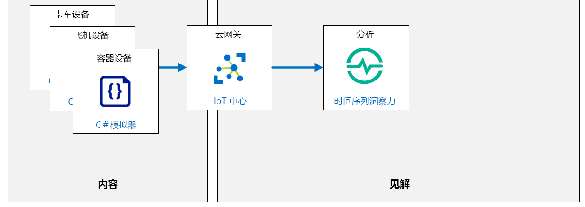

---
lab:
    title: '实验室 10：使用时序见解探索和分析具有时间戳的数据'
    module: '模块 5：见解和业务集成'
---

# 使用时序见解探索和分析具有时间戳的数据

## 实验室场景

你在实现 Azure IoT 服务和工具方面的辛勤工作已经取得了回报。Contoso 已推出其“资产状况跟踪系统”，该系统可在运输过程中监视奶酪集装箱的环境状况。

启动新系统两星期后，它发现特定货物在运输途中出现温度峰值。运输途中一些奶酪受损，但是新系统确保不会将受影响的奶酪交付给客户。由于你比任何人都更加了解监控系统的 Azure IoT，因此你将负责调查工作。

管理层已要求你确定是否可以改进系统，以防将来的产品损失。你可以将从运输过程中使用的卡车和飞机上获取的 IoT 设备的传感器数据相关联。似乎其中一辆卡车特定车辆区域的温度意外升高，导致其中一个集装箱（装有监控温度和湿度的 IoT 设备）内出现温度峰值。

你的团队认为，对监视系统的进一步改进将需要进行近实时的数据探索和根本原因分析。

你建议在 Azure IoT 解决方案中增加时序见解。这将使 Contoso 可以对卡车、飞机和集装箱中的 IoT 设备生成的大量时序数据进行快速存储、直观呈现和查询，并将不同时间的变化直观呈现出来。 

将创建以下资源：



## 本实验室概览

在本实验室中，你将完成以下活动：

* 验证是否满足实验室先决条件（具有必需的 Azure 资源）

    * 该脚本将创建 IoT 中心（如果需要）。
    * 该脚本将为本实验室创建三个新的设备标识。

* 创建 Azure 时序见解 (TSI) 环境
* 使用时序见解 (TSI) 连接到 IoT 中心
* 使用时序见解 (TSI) 资源管理器查看时序数据

## 实验室说明

### 练习 1：验证实验室先决条件

本实验室假定以下 Azure 资源可用：

| 资源类型 | 资源名称 |
| :-- | :-- |
| 资源组 | `rg-az220` |
| IoT 中心 | `iot-az220-training-{your-id}` |
| 设备 ID | `sensor-th-truck0001` |
| 设备 ID | `sensor-th-airplane0001` |
| 设备 ID | `sensor-th-container0001` |

> **重要说明**： 运行设置脚本以创建所需设备。

若要创建任何缺少的资源和新设备，在开始练习 2 之前，需要先按照下面的说明运行 **lab10-setup.azcli** 脚本。脚本文件包含在本地克隆作为开发环境配置（实验室 3）的 GitHub 存储库中。

写入 **lab10-setup.azcli** 脚本，并在 **Bash** shell 环境中运行，执行此操作最简便的方法是在 Azure Cloud Shell 中。

1. 使用浏览器，打开 [Azure Cloud Shell](https://shell.azure.com/)，并使用本课程使用的 Azure 订阅登录。

1. 验证 Cloud Shell 是否在使用 **Bash**。

    Azure Cloud Shell 页面左上角的下拉菜单用于选择环境。验证所选的下拉值是否为 **Bash**。

1. 在 Cloud Shell 工具栏上，单击 **“上传/下载文件”** （从右数第四个按钮）。

1. 在下拉菜单中，单击 **“上传”**。

1. 在“文件选择”对话框中，导航到配置开发环境时下载的 GitHub 实验室文件的文件夹位置。

    在“实验室 3：_设置开发环境_，你可以通过下载 ZIP 文件并从本地提取内容来克隆包含实验室资源的 GitHub 存储库。提取的文件夹结构包括以下文件夹路径：

    * Allfiles
      * 实验室
          * 10-利用时序见解探索和分析时间戳数据
            * 设置

    lab10-setup.azcli 脚本文件位于实验室 10 的 Setup 文件夹中。

1. 选择 **“lab10-setup.azcli”** 文件，然后单击 **“打开”**。

    文件上传完成后，系统将显示一条通知。

1. 若要验证在 Azure Cloud Shell 中已上传了正确文件，请输入以下命令：

    ```bash
    ls
    ```

    使用 `ls` 命令列出当前目录的内容。你应该会看到列出的 lab10-setup.azcli 文件。

1. 若要为此实验室创建一个包含安装脚本的目录，然后移至该目录，请输入以下 Bash 命令：

    ```bash
    mkdir lab10
    mv lab10-setup.azcli lab10
    cd lab10
    ```

1. 为了确保 **lab10-setup.azcli** 具有执行权限，请输入以下命令：

    ```bash
    chmod +x lab10-setup.azcli
    ```

1. 在 Cloud Shell 工具栏上，请单击 **“打开编辑器”** （右侧的第二个按钮 - **{ }**）以启用对 lab10-setup.azcli 文件的访问。

1. 在 **“文件存储”** 列表中，展开 lab10 文件夹并打开脚本文件，单击 **“lab10”**，然后单击 **“lab10-setup.azcli”**。

    编辑器现在将显示 **“lab10-setup.azcli”** 文件的内容。

1. 在编辑器中，更新 `{your-id}` 和 `{your-location}` 分配的值。

    以下面的示例为例，需要将 `{your-id}` 设置为在本课程开始时创建的唯一 ID，即 **cah191211**，然后将 `{your-location}` 设置为对你的资源有意义的位置。

    ```bash
    #!/bin/bash

    # 更改这些值！
    YourID="{your-id}"
    Location="{your-location}"
    ```

    > **备注：**  应将 `{your-location}` 变量设置为要部署所有资源的区域的短名称。输入以下命令，可以看到可用位置及其短名称的列表（**“名称”** 列）：

    ```bash
    az account list-locations -o Table

    DisplayName           Latitude    Longitude    Name
    --------------------  ----------  -----------  ------------------
    East Asia             22.267      114.188      eastasia
    Southeast Asia        1.283       103.833      southeastasia
    Central US            41.5908     -93.6208     centralus
    East US               37.3719     -79.8164     eastus
    East US 2             36.6681     -78.3889     eastus2
    ```

1. 要保存对文件所做的更改并关闭编辑器，请单击编辑器窗口右上角的 “**...**”，然后单击 **“关闭编辑器”**。

    如果提示保存，请单击 **“保存”**，编辑器将会关闭。

    > **备注：**  可以使用 **Ctrl+S** 随时保存，使用 **Ctrl+Q** 关闭编辑器。

1. 要创建本实验室所需的资源，请输入以下命令：

    ```bash
    ./lab10-setup.azcli
    ```

    运行此脚本可能需要几分钟。每个步骤完成时，你都会看到输出。

    该脚本将首先创建一个名为 **rg-az220** 的资源组和一个名为 **iot-az220-training-{your-id}** 的 IoT 中心。如果它们已经存在，将显示相应的消息。然后，该脚本会向 IoT 中心添加三个设备并显示设备连接字符串。设备 ID 为： **Sensor-th-truck0001**、 **sensor-th-airplane0001** 和 **sensor-th-container0001**。

1. 请注意，脚本完成后，将显示每个设备的连接字符串。

    连接字符串以 "HostName=" 开头

1. 将每个设备的连接字符串复制到文本文档中。

    将连接字符串保存到可以轻松找到的位置后，便可以继续进行本实验室的操作。连接字符串指定与其关联的设备的设备 ID。

### 练习 2：设置时序见解

Azure 时序见解 (TSI) 是一种端对端平台即服务产品/服务，用于大规模收集、处理、存储、分析和查询 IoT 解决方案中的数据。TSI 专为临时数据资源管理以及针对时序进行了高度语境化和优化的数据的操作分析而设计。

在本练习中，你将设置时序见解与 Azure IoT 中心的集成。

1. 使用你的 Azure 帐户凭据登录到 [portal.azure.com](https://portal.azure.com)。

    如果有多个 Azure 帐户，请确保使用与本课程要使用的订阅绑定的帐户登录。

1. 在 Azure 门户菜单上，单击 **“+ 创建资源”**。

1. 在 **“新建”** 边栏选项卡的 **“搜索市场”** 文本框中，输入 **“时序见解”**

1. 在搜索结果中，单击 **“时序见解”**。

1. 在 **“时序见解”** 边栏选项卡上，单击 **“创建”**。

1. 在 **“创建时序见解环境”** 边栏选项卡的 **“环境名称”** 字段中，输入 **“tsi-az220-training”**

1. 在 **“订阅”** 下拉列表中，选择你用于本课程的订阅。

1. 在 **“资源组”** 下拉列表中，单击 **“rg-az220”**。

1. 在 **“位置”** 下拉列表中，选择你的资源组使用的 Azure 区域。

1. 在 **“层级”** 字段中，请确保已选中 **“Gen1 (S1)”** 定价层，且 **“容量”** 设置为 **“1”**。

1. 在边栏选项卡底部，单击 **“下一步: 事件源”**。

1. 在 **“事件源详细信息”** 部分，确保 **“创建事件源?”** 设置为 **“是”**。

1. 在 **“名称”** 字段中，输入 **“iot-az220-training-{your-id}”**，为该事件源指定唯一名称。

1. 在 **“源类型”** 下拉列表中，请确保已选中 **“IoT 中心”**。

1. 在 **“选择一个中心”** 下拉列表中，请确保已选中 **“选择现有中心”**。

    这使你能够选择一个已预配的现有 IoT 中心。

1. 在 **“订阅”** 下拉列表中，选择你用于本课程的订阅。

1. 在 **“IoT 中心名称”** 下拉列表中，选择已预配的 **“iot-az220-training-{your-id}”** Azure IoT 中心服务。

1. 在 **“IoT 中心访问策略名称”** 下拉列表中，单击 **“iothubowner”**。

    在生产环境中，最佳做法是在 Azure IoT 中心内创建一个新的“访问策略”__，用于配置对时序见解 (TSI) 的访问。这将使 TSI 的安全性可以独立于连接到同一 Azure IoT 中心的任何其他服务进行管理。  为了方便起见，在这里不这样做。

1. 在 **“使用者组”** 部分下的 **“IoT 中心使用者组”** 下拉列表中，单击 **“新建”**。

1. 在 **“IoT 中心使用者组”** 框中，输入 **“tsievents”**，然后单击 **“添加”**。

    这将添加一个新的“使用者组”__，用于此事件源。使用者组必须专用于此事件源，因为一次只能有一个来自特定使用者组的活动读者。

1. 在 **“时间戳”** 部分，将 **“属性名称”** 留空。

1. 在边栏选项卡底部，单击 **“查看 + 创建”**。

    > **备注：** 如果立即返回到 *“事件源”* 窗格，请再次检查你是否单击了 **“IoT 中心使用者组”** 字段右边的 **“添加”**。在创建使用者组之前，无法创建 TSI 资源。

1. 在边栏选项卡底部，单击 **“创建”**。

    > **备注：**  时序见解 (TSI) 的部署需要几分钟才能完成。

1. 完成时序见解部署后，请导航回到仪表板。

1. 刷新资源组磁贴，然后单击 **“tsi-az220-training”**。

    你可能需要调整仪表板的大小才能看到所有资源。

    > **备注：** 你已将 **“时序见解环境”** 资源命名为 **“tsi-az220-training”**。你还应该能看到你创*建的时序见解事件源*，但你现在想打开 TSI 环境。  
 
1. 在 **“时序见解环境”** 边栏选项卡的左侧菜单中，在 **“设置”** 下方，单击 **“事件源”**。

1. 在 **“事件源”** 窗格中，请注意列表中的 **“iot-az220-training-{your-id}”** 事件源。

    这是创建 TSI 资源时配置的事件源。

1. 要查看事件源的详细信息，请单击 **“iot-az220-training-{your-id}”**。

    请注意，事件源的配置与创建时序见解资源时设置的配置相匹配。

### 练习 3：运行模拟 IoT 设备

在本练习中，你将运行模拟的设备，以便它们开始将遥测事件发送到 Azure IoT 中心。

1. 打开 **Visual Studio Code**。

1. 在 **“文件”** 菜单上，单击 **“打开文件夹”**。

1. 在 **“打开文件夹”** 对话框中，导航到实验室 10 的 Starter 文件夹。

    在“实验室 3：_设置开发环境_，你可以通过下载 ZIP 文件并从本地提取内容来克隆包含实验室资源的 GitHub 存储库。提取的文件夹结构包括以下文件夹路径：

    * Allfiles
      * 实验室
          * 10-利用时序见解探索和分析时间戳数据
            * 入门

1. 在 **“打开文件夹”** 对话框中，单击 **“ContainerSimulation”**，然后单击 **“选择文件夹”**。

    如果出现提示，请加载 C# 扩展和/或执行还原。
 
1. 在“资源管理器”窗格中，请单击 **“Program.cs”** 打开 **“Program.cs”** 文件。

1. 找到用于分配连接字符串的变量

    ```csharp
    private readonly static string connectionStringTruck = "{Your Truck device connection string here}";
    private readonly static string connectionStringAirplane = "{Your Airplane device connection string here}";
    private readonly static string connectionStringContainer = "{Your Container device connection string here}";
    ```

1. 使用你之前在实验室中保存的连接字符串更新变量分配。 

    务必将占位符值替换为相应的 IoT 设备的连接字符串。

1. 在 **“文件”** 菜单中，单击 **“保存”**。

1. 在 **“查看”** 菜单中，单击 **“终端”**。

1. 在 **“终端”** 窗格中，确保命令提示符指定了实验室 10 `/Starter/ContainerSimulation` 目录的路径。

1. 在命令提示符处，要生成并运行 **ContainerSimulation** 应用，请输入以下命令：

    ```cmd/sh
    dotnet run
    ```

1. 请注意“终端”窗格中显示的消息。

    **ContainerSimulation** 应用运行时，它会开始向终端输出遥测数据。这是正在向 Azure IoT 中心发送的遥测数据。

    **ContainerSimulation** 应用运行时，**终端**输出将类似于以下内容：

    ```text
    12/27/2019 8:51:30 PM > Sending TRUCK message: {"temperature":35.15660452608195,"humidity":48.422323938240865}
    12/27/2019 8:51:31 PM > Sending AIRPLANE message: {"temperature":17.126545186374237,"humidity":36.46941012936869}
    12/27/2019 8:51:31 PM > Sending CONTAINER message: {"temperature":21.986403302500637,"humidity":47.847680384455096}
    12/27/2019 8:51:32 PM > Sending TRUCK message: {"temperature":36.10474464823629,"humidity":48.82029906486022}
    12/27/2019 8:51:32 PM > Sending AIRPLANE message: {"temperature":16.55005930170971,"humidity":36.49988437459935}
    12/27/2019 8:51:32 PM > Sending CONTAINER message: {"temperature":21.811727088543286,"humidity":50.0}
    ```

1. 在本实验室的剩余部分内，让 **ContainerSimulation** 应用保持运行状态。

    这将确保三个设备（集装箱、卡车和飞机）的设备遥测数据都会发送到 Azure IoT 中心。

1. 在 **ContainerSimulation** 应用运行 30 秒后，你将看到一条消息，显示**集装箱**设备正在改变运输方式。

    运输方式将每隔 30 秒在**卡车**和**飞机**之间切换。这种情况下，**终端**输出将如下所示：

    ```text
    12/27/2019 8:51:40 PM > CONTAINER transport changed to: TRUCK
    ```

    > **备注：**  在生产中，集装箱仅在正常运输过程中改变运输方式。对于本实验室中的模拟场景，运输方式每 30 秒改变一次，以提供适合本实验室中的步骤执行过程的足够短的数据周期。

### 练习 4：查看 Azure 时序见解资源管理器

本练习将向你介绍如何使用时序见解 (TSI) 资源管理器处理时序数据。

1. 如果需要，请使用你的 Azure 帐户凭据登录到 [portal.azure.com](https://portal.azure.com)。

    如果有多个 Azure 帐户，请确保使用与本课程要使用的订阅绑定的帐户登录。

1. 在“资源组”磁贴中，单击 **“tsi-az220-training”**。

1. 在 **“时序见解环境”** 边栏选项卡的 **“概述”** 窗格顶部，单击 **“转到 TSI 资源管理器”**。

    这将在新的浏览器选项卡中打开 **“Azure 时序见解资源管理器”**。

1. 在左侧菜单上，确保已选中 **“分析”**。

    你可以展开导航菜单，以显示按钮名称。这两个选项是“分析”和“模型”。选择“分析”。

    折叠导航菜单，以确保你可以在页面左侧看到查询编辑区域。

1. 要开始编辑查询，请单击 **“添加新查询”**。

1. 在查询编辑器中的 **“查询 1”** 下，打开 **“度量值”** 下拉列表，然后单击 **“温度”**。

1. 打开 **“拆分方式”** 下拉列表，然后单击 **“iothub-connection-device-id”**。

    运行查询时，将拆分图表，以在图表上单独显示来自每个 IoT 设备的遥测数据。

1. 要自动刷新显示界面，请在页面顶部单击 **“自动刷新”**。

    **“自动刷新”** 启用时，将每隔 30 秒__更新显示界面，以显示最新数据。这仅适用于最后 1 个小时的可用数据。

1. 请注意，该图表现在以折线图__的形式显示来自 Azure IoT 中心内的 IoT 设备**的温度**传感器事件数据。

1. 注意图表左侧的 **“设备 ID”** 列表。 

    将鼠标悬停在某个设备 ID 上时，将在图表显示界面突出显示该设备 ID 的数据。

1. 花点时间检查从三个模拟设备流向系统的遥测数据中的温度数据（图表）。

1. 请注意，**sensor-th-container0001** 的**温度**峰值与 **sensor-th-truck0001** 或 **sensor-th-airplane0001** 的温度峰值相关联。

    这表示当时正在使用卡车或飞机运输 sensor-th-container0001。

1. 要在显示界面中添加第二个查询，请单击 **“添加新查询”**。

1. 在 **“查询 2”** 下，将 **“度量值”** 下拉列表设置为 **“湿度”**，将 **“拆分方式”** 下拉列表设置为 **“iothub-connection-device-id”**，然后单击 **“添加”**。

    请注意，现在显示了两个图表。上图显示**温度**，下图显示**湿度**，两个图使用各自的 Y 轴刻度。

1. 将鼠标指针放在其中一条图形线条上。

    请注意，将鼠标光标悬停在图表上时，将出现一个弹出窗口，显示图表上某个点的详细信息。弹出窗口显示图表中数据点的最小 (**min**)、平均 (**avg**) 和最大 (**max**) 值（该点在短时间内所表示的值）。与所选数据点关联的时间范围显示在显示器底部的时间轴上。

1. 请注意垂直轴线上方可用于控制图表设置的选项。

1. 将间隔设置更改为 15 秒。

    请注意数据的显示情况如何随着间隔的增加而变化。

完成数据资源管理后，务必在终端按 **CTRL+C** 停止集装箱模拟器应用。
