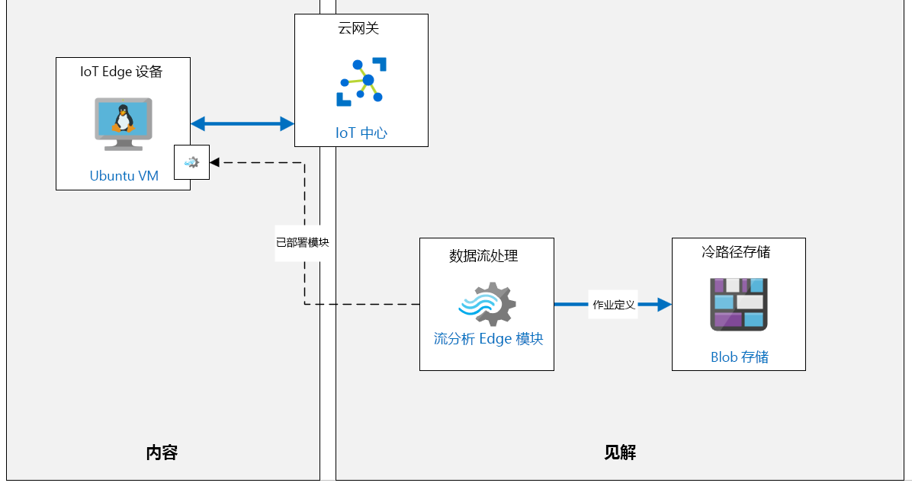

---
lab:
  title: 实验室 11：Azure IoT Edge 简介
  module: 'Module 6: Azure IoT Edge Deployment Process'
ms.openlocfilehash: e68d422adaff8789d45491214f902c6cf62ebe47
ms.sourcegitcommit: eec2943250f1cd1ad2c5202ecbb9c37af71e8961
ms.translationtype: HT
ms.contentlocale: zh-CN
ms.lasthandoff: 03/24/2022
ms.locfileid: "140872838"
---
# <a name="introduction-to-azure-iot-edge"></a>Azure IoT Edge 简介

## <a name="lab-scenario"></a>实验室场景

为鼓励全球市场中的本地消费者，Contoso 已与本地工匠合作在全球新地区生产奶酪。

每个地点都支持多条生产线，这些生产线配备有用于制造本地奶酪的混合与加工机器。 目前，这些设施已将 IoT 设备连接到每台机器。 这些设备将传感器数据流式传输到 Azure，并且所有数据都在云中进行处理。

由于收集了大量数据，并且某些机器上需要急速响应，因此 Contoso 希望使用 IoT Edge 网关设备将某些智能引入 Edge 以进行即时处理。 部分数据仍将发送到云。 将数据智能引入 IoT Edge 还可确保即使在本地网络很差的情况，它们也能处理数据并快速做出反应。

你的任务是 Azure IoT Edge 解决方案原型设计。 首先，将设置一个监视温度的 IoT Edge 设备（模拟连接到其中一台奶酪加工机的设备）。 然后，将在设备上部署一个流分析模块，该模块将用于计算平均温度并在超出过程控制值时生成警报通知。

将创建以下资源：



## <a name="in-this-lab"></a>本实验室概览

在本实验室中，你将完成以下活动：

* 配置实验室先决条件（所需的 Azure 资源）
* 部署已启用 Azure IoT Edge 的 Linux VM
* 使用 Azure CLI 在 IoT 中心中创建 IoT Edge 设备标识
* 将 IoT Edge 设备连接到 IoT 中心
* 将 Edge 模块添加到 Edge 设备
* 将 Azure 流分析作为 IoT Edge 模块进行部署

## <a name="lab-instructions"></a>实验室说明

### <a name="exercise-1-configure-lab-prerequisites"></a>练习 1：配置实验室先决条件

本实验室假定以下 Azure 资源可用：

| 资源类型 | 资源名称 |
| :-- | :-- |
| 资源组 | rg-az220 |
| IoT 中心 | iot-az220-training-{your-id} |

若要确保这些资源可用，请完成以下步骤。

1. 在虚拟机环境中，打开 Microsoft Edge 浏览器窗口，然后导航到以下 Web 地址：
 
    +++https://portal.azure.com/#create/Microsoft.Template/uri/https%3A%2F%2Fraw.githubusercontent.com%2FMicrosoftLearning%2FAZ-220-Microsoft-Azure-IoT-Developer%2Fbicep%2FAllfiles%2FARM%2Flab11.json+++

    > 注意：每当看到绿色的“T”符号（例如 +++输入此文本+++）时，可以单击关联的文本，信息将键入到虚拟机环境内的当前字段中。

1. 如果系统提示登录到 Azure 门户，请输入你在本课程中使用的 Azure 凭据。

    将显示“自定义部署”页。

1. 在“项目详细信息”下的“订阅”下拉列表中，确保你打算在本课程中使用的 Azure 订阅已选中 。

1. 在“资源组”下拉列表中，选择“rg-az220” 。

    > 注意：如果未列出 rg-az220：
    >
    > 1. 在“资源组”下拉列表中，选择“新建”。
    > 1. 在“名称”下，输入 rg-az220 。
    > 1. 单击“确定”  。

1. 在“实例详细信息”下的“区域”下拉列表中，选择离你最近的区域 。

    > 注意：如果 rg-az220 组已存在，则“区域”字段将设置为资源组使用的区域，并且为只读 。

1. 在“你的 ID”字段中，输入在练习 1 中创建的唯一 ID。

1. 在“课程 ID”字段中，输入 az220 。

1. 若要验证模板，请单击“查看和创建”。

1. 验证通过后，单击“创建”。

    将启动部署。

1. 部署完成后，在左侧导航区域中，若要查看模板的任何输出值，请单击“输出”。

    记下输出供稍后使用：

    * connectionString

现已创建资源。

### <a name="exercise-2-create-and-configure-an-iot-edge-vm"></a>练习 2：创建和配置 IoT Edge VM

在此练习中，你将创建一个 IoT Edge 设备标识，然后使用设备连接字符串来配置 IoT Edge 运行时。

#### <a name="task-1-create-an-iot-edge-device-identity-in-iot-hub-using-azure-cli"></a>任务 1：使用 Azure CLI 在 IoT 中心中创建 IoT Edge 设备标识

在此任务中，你将使用 Azure CLI 在 Azure IoT 中心内创建新的 IoT Edge 设备标识。

1. 如有必要，请使用 Azure 帐户凭据登录到 Azure 门户。

    如果有多个 Azure 帐户，请确保使用与本课程要使用的订阅绑定的帐户登录。

1. 在“Azure 门户”工具栏上，要打开 Azure Cloud Shell，请单击“Cloud Shell”，。

    在“Azure 门户”工具栏上，而不是左侧导航菜单上的“Cloud Shell”按钮有一个看起来类似于命令提示符的图标。

1. 确保你在使用 **Bash** 环境选项。

    在 Cloud Shell 左上角的环境下拉列表中选择“Bash”。

1. 在命令提示符处，输入以下命令，即可在 IoT 中心中创建 IoT Edge 设备标识：

    ```bash
    az iot hub device-identity create --hub-name iot-az220-training-{your-id} --device-id sensor-th-0067 --edge-enabled
    ```

    请务必将 `{your-id}` 占位符替换为你在本课程开始时创建的 YOUR-ID 值。

    > **注意**：还可以使用 Azure 门户中的 IoT 中心创建此 IoT Edge 设备：“IoT 中心” -> “IoT Edge” -> “添加 IoT Edge 设备”  。

1. 查看该命令创建的输出。

    请注意，输出中包含为 IoT Edge 设备创建的 **设备标识** 的信息。 例如，可以看到它默认为具有自动生成密钥的 `symmetricKey` 身份验证，并且如指定的 `--edge-enabled` 参数所示，`iotEdge` 功能被设置为 `true`。

    ```json
    {
        "authentication": {
            "symmetricKey": {
                "primaryKey": "jftBfeefPsXgrd87UcotVKJ88kBl5Zjk1oWmMwwxlME=",
                "secondaryKey": "vbegAag/mTJReQjNvuEM9HEe1zpGPnGI2j6DJ7nECxo="
            },
            "type": "sas",
            "x509Thumbprint": {
                "primaryThumbprint": null,
                "secondaryThumbprint": null
            }
        },
        "capabilities": {
            "iotEdge": true
        },
        "cloudToDeviceMessageCount": 0,
        "connectionState": "Disconnected",
        "connectionStateUpdatedTime": "0001-01-01T00:00:00",
        "deviceId": "sensor-th-0067",
        "deviceScope": "ms-azure-iot-edge://sensor-th-0067-637093398936580016",
        "etag": "OTg0MjI1NzE1",
        "generationId": "637093398936580016",
        "lastActivityTime": "0001-01-01T00:00:00",
        "status": "enabled",
        "statusReason": null,
        "statusUpdatedTime": "0001-01-01T00:00:00"
    }
    ```

1. 输入以下命令，显示 IoT Edge 设备的 **连接字符串**：

    ```bash
    az iot hub device-identity connection-string show --device-id sensor-th-0067 --hub-name iot-az220-training-{your-id}
    ```

    请务必将 `{your-id}` 占位符替换为你在本课程开始时创建的 YOUR-ID 值。

1. 从命令的 JSON 输出中复制 `connectionString` 的值，并将其保存以供稍后引用。

    此连接字符串将用于配置 IoT Edge 设备以连接到 IoT 中心。

    ```json
        {
          "connectionString": "HostName={IoTHubName}.azure-devices.net;DeviceId=sensor-th-0067;SharedAccessKey=jftBfeefPsXgrd87UcotVKJ88kBl5Zjk1oWmMwwxlME="
        }
    ```

    > **注意**：还可以通过以下方式在 Azure 门户中访问 IoT Edge 设备连接字符串：导航到“IoT 中心” -> “IoT Edge” -> “你的 Edge 设备” -> “连接字符串(主密钥)”   

#### <a name="task-2-provision-iot-edge-vm"></a>任务 2：预配 IoT Edge VM

在此任务中，你将使用 ARM（Azure 资源管理器）模板来预配 Linux VM，安装 IoT Edge 运行时并配置连接。

1. 在虚拟机环境中，打开 Microsoft Edge 浏览器窗口，然后导航到以下 Web 地址：

    +++https://portal.azure.com/#create/Microsoft.Template/uri/https%3A%2F%2Fraw.githubusercontent.com%2FMicrosoftLearning%2FAZ-220-Microsoft-Azure-IoT-Developer%2Fmaster%2FAllfiles%2FARM%2Flab11a.json+++

1. 如果系统提示，请登录到“Azure 门户”。

    将显示“自定义部署”页。

1. 在“项目详细信息”下的“订阅”下拉列表中，确保你打算在本课程中使用的 Azure 订阅已选中 。

1. 在“资源组”下拉列表中，单击“新建”，然后输入“rg-az220vm”  。

1. 在“区域”字段中，输入之前使用的相同位置。

1. 在“虚拟机名称”文本框中，输入“vm-az220-training-edge0001-{your-id}” 

1. 在“设备连接字符串”字段中，输入前一练习中的连接字符串值。

1. 在“虚拟机大小”字段中，确保输入“Standard_DS1_v2” 。

1. 在“Ubuntu OS 版本”字段中，确保输入了“18.04-LTS” 。

1. 在“管理员用户名”字段中，输入用户名。

1. 在“身份验证类型”字段中，确保选中“密码” 。

1. 在“管理员密码或密钥”字段中，输入要使用的密码。

1. 在“允许 SSH”字段中，确保选中“true” 。

1. 若要验证模板，请单击“查看和创建”。

1. 验证通过后，单击“创建”。

    > **注意**：部署最多可能需要 5 分钟才能完成。

1. 模板完成后，导航到“输出”窗格并记下以下内容：

    * 公用 FQDN
    * 公用 SSH

#### <a name="task-3-connect-to-the-vm"></a>任务 3：连接到 VM

1. 如果仍未打开 Cloud Shell，请单击“Cloud Shell”。

1. 在 Cloud Shell 命令提示符，粘贴前面记下的“公用 SSH”命令，然后按“Enter” 。

    > **注意**：该命令将类似于：

    ```bash
    ssh username@vm-az220-training-edge0001-{your-id}.{region}.cloudapp.azure.com
    ```

1. 当提示“确定要继续连接吗?”时，键入“yes”，然后按 Enter。

    此提示是安全确认，因为用于保护与 VM 的连接的证书为自签名证书。 系统将记住此提示的回答，以便用于后续连接，并且仅在第一次连接时提示。

1. 当系统提示输入密码时，请输入预配 VM 时创建的管理员密码。

1. 连接后，终端命令提示符将更改为显示 Linux VM 的名称，类似于以下内容。

    ```bash
    username@vm-az220-training-edge0001-{your-id}:~$
    ```

    这会告诉你连接的是哪个 VM。

1. 要确保 IoT Edge 守护程序正常运行时，请输入以下命令：

    ```bash
    sudo iotedge system status
    ```

    成功的响应将类似于：

    ```bash
    System services:
        aziot-edged             Running
        aziot-identityd         Running
        aziot-keyd              Running
        aziot-certd             Running
        aziot-tpmd              Ready

    Use 'iotedge system logs' to check for non-fatal errors.
    Use 'iotedge check' to diagnose connectivity and configuration issues.
    ```

1. 要验证已连接的 IoT Edge 运行时，请运行以下命令：

    ```bash
    sudo iotedge check
    ```

    这将运行许多检查并显示结果。 对于本实验室，请忽略“配置检查”警告/错误。 “连接性检查”应该会成功，并且类似于以下内容：

    ```bash
    Connectivity checks
    -------------------
    √ container on the default network can connect to IoT Hub AMQP port - OK
    √ container on the default network can connect to IoT Hub HTTPS / WebSockets port - OK
    √ container on the default network can connect to IoT Hub MQTT port - OK
    √ container on the IoT Edge module network can connect to IoT Hub AMQP port - OK
    √ container on the IoT Edge module network can connect to IoT Hub HTTPS / WebSockets port - OK
    √ container on the IoT Edge module network can connect to IoT Hub MQTT port - OK
    ```

    如果连接失败，请仔细检查 /etc/aziot/config.toml 中的连接字符串值。

### <a name="exercise-3-add-edge-module-to-edge-device"></a>练习 3：将 Edge 模块添加到 Edge 设备

在本练习中，你将添加模拟温度传感器作为自定义 IoT Edge 模块，并将其部署在 IoT Edge 设备上运行。

#### <a name="task-1-configure-module-for-deployment"></a>任务 1：配置用于部署的模块

1. 如有必要，请使用 Azure 帐户凭据登录到 Azure 门户。

    如果有多个 Azure 帐户，请确保使用与本课程要使用的订阅绑定的帐户登录。

1. 在“资源组”磁贴上，单击“iot-az220-training-{your-id}”，打开 IoT 中心。

1. 在“IoT 中心”边栏选项卡左侧的“设备管理”下，单击“IoT Edge”  。

1. 在 IoT Edge 设备列表上，单击“sensor-th-0067”。

1. 请注意，“sensor-th-0067”边栏选项卡上的“模块”选项卡会显示当前为设备配置的模块的列表。

    当前，IoT Edge 设备仅配置了作为 IoT Edge 运行时一部分的 Edge 代理 (`$edgeAgent`) 和 Edge 中心 (`$edgeHub`) 模块。

1. 在“sensor-th-0067”边栏选项卡的顶部，单击“设置模块”。

1. 在“在设备上设置模块: sensor-th-0067”边栏选项卡中，找到“IoT Edge 模块”部分。

1. 在“IoT Edge 模块”下，单击“添加”，然后单击“IoT Edge 模块”。

1. 在“添加 IoT Edge 模块”窗格的“IoT Edge 模块名称”中输入 **tempsensor**

    我们将命名自定义模块“tempsensor”

1. 在“映像 URI”处输入 **asaedgedockerhubtest/asa-edge-test-module:simulated-temperature-sensor**

    > **注意**：此映像是 Docker Hub 上的已发布映像，该映像由产品组提供以支持此测试方案。

1. 若要更改选定的选项卡，请单击“模块孪生设置”。

1. 若要为模块孪生指定所需的属性，请输入以下 JSON：

    ```json
    {
        "EnableProtobufSerializer": false,
        "EventGeneratingSettings": {
            "IntervalMilliSec": 500,
            "PercentageChange": 2,
            "SpikeFactor": 2,
            "StartValue": 20,
            "SpikeFrequency": 20
        }
    }
    ```

    此 JSON 通过设置其模块孪生的所需属性来配置 Edge 模块。

1. 在边栏选项卡底部，单击“添加”。

1. 在“在设备上设置模块: sensor-th-0067”边栏选项卡底部，单击“下一步: 路由 >”。

1. 请注意，已配置了默认路由。

    * 名称：route
    * 值：`FROM /messages/* INTO $upstream`

    此路由会将所有消息从 IoT Edge 设备上的所有模块发送到 IoT 中心

1. 单击“查看 + 创建”。

1. 在“部署”处，请花点时间查看显示的部署清单。

    可以看到，IoT Edge 设备的部署清单格式设置为 JSON，这样更易读取。

    在 `properties.desired` 部分下是声明将要部署到 IoT Edge 设备的 IoT Edge 模块的 `modules` 部分。 这包括所有模块的映像 URI，包括任何容器注册表凭据。

    ```json
    {
        "modulesContent": {
            "$edgeAgent": {
                "properties.desired": {
                    "modules": {
                        "tempsensor": {
                            "settings": {
                                "image": "asaedgedockerhubtest/asa-edge-test-module:simulated-temperature-sensor",
                                "createOptions": ""
                            },
                            "type": "docker",
                            "status": "running",
                            "restartPolicy": "always",
                            "version": "1.0"
                       },
    ```

    JSON 下方是包含 Edge 中心所需属性的 **$edgeHub** 部分。 本部分还包括用于在模块之间路由事件以及路由到 IoT 中心的路由配置。

    ```json
        "$edgeHub": {
            "properties.desired": {
                "routes": {
                  "route": "FROM /messages/* INTO $upstream"
                },
                "schemaVersion": "1.1",
                "storeAndForwardConfiguration": {
                    "timeToLiveSecs": 7200
                }
            }
        },
    ```

    JSON 下方是 tempsensor 模块部分，其中 `properties.desired` 部分包含 Edge 模块配置所需的属性。

    ```json
                },
                "tempsensor": {
                    "properties.desired": {
                        "EnableProtobufSerializer": false,
                        "EventGeneratingSettings": {
                            "IntervalMilliSec": 500,
                            "PercentageChange": 2,
                            "SpikeFactor": 2,
                            "StartValue": 20,
                            "SpikeFrequency": 20
                        }
                    }
                }
            }
        }
    ```

1. 在边栏选项卡底部，单击“创建”，完成设备模块的设置。

1. 请注意，在“sensor-th-0067”边栏选项卡的“模块”下，现已列出“tempsensor”。

    > **注意**：可能需要单击“刷新”才能首次看到列出的模块。

    你可能会注意到未报告 **tempsensor** 运行时状态。

1. 在边栏选项卡顶部，单击“刷新”。

1. 请注意，**tempsensor** 模块的 **运行时状态** 现设置为“运行”。

    如果仍未报告该值，请稍等片刻，然后再次刷新该边栏选项卡。

#### <a name="task-2-confirm-module-deployment"></a>任务 2：确认模块部署

1. 打开 Cloud Shell 会话（如果尚未打开）。

    如果不再连接到 `vm-az220-training-edge0001-{your-id}` 虚拟机，则和以前一样使用 SSH 进行连接。

1. 在 Cloud Shell 命令提示符处，输入以下命令，列出当前在 IoT Edge 设备上运行的模块：

    ```bash
    iotedge list
    ```

1. 命令的输出类似于以下内容。

    ```bash
    demouser@vm-az220-training-edge0001-{your-id}:~$ iotedge list
    NAME             STATUS           DESCRIPTION      CONFIG
    edgeHub          running          Up a minute      mcr.microsoft.com/azureiotedge-hub:1.1
    edgeAgent        running          Up 26 minutes    mcr.microsoft.com/azureiotedge-agent:1.1
    tempsensor       running          Up 34 seconds    asaedgedockerhubtest/asa-edge-test-module:simulated-temperature-sensor
    ```

    请注意，`tempsensor` 被列为正在运行的模块之一。

1. 输入以下命令，查看模块日志：

    ```bash
    iotedge logs tempsensor
    ```

    命令的输出类似于以下内容：

    ```bash
    demouser@vm-az220-training-edge0001-{your-id}:~$ iotedge logs tempsensor
    11/14/2019 18:05:02 - Send Json Event : {"machine":{"temperature":41.199999999999925,"pressure":1.0182182583425192},"ambient":{"temperature":21.460937846433808,"humidity":25},"timeCreated":"2019-11-14T18:05:02.8765526Z"}
    11/14/2019 18:05:03 - Send Json Event : {"machine":{"temperature":41.599999999999923,"pressure":1.0185790159334602},"ambient":{"temperature":20.51992724976499,"humidity":26},"timeCreated":"2019-11-14T18:05:03.3789786Z"}
    11/14/2019 18:05:03 - Send Json Event : {"machine":{"temperature":41.999999999999922,"pressure":1.0189397735244012},"ambient":{"temperature":20.715225311096397,"humidity":26},"timeCreated":"2019-11-14T18:05:03.8811372Z"}
    ```

    `iotedge logs` 命令可用于查看任何 Edge 模块的模块日志。

1. 模拟温度传感器模块将在发送 500 条消息后停止。 可以通过运行以下命令重启。

    ```bash
    iotedge restart tempsensor
    ```

    现在无需重启模块，但是如果发现它之后不再发送遥测数据，则返回到 Cloud Shell、Edge VM 的 SSH，然后运行此命令将其重置。 重置后，模块将再次开始发送遥测数据。

### <a name="exercise-4-deploy-azure-stream-analytics-as-iot-edge-module"></a>练习 4：将 Azure 流分析部署为 IoT Edge 模块

现在，tempSensor 模块已部署并在 IoT Edge 设备上运行，我们可以添加一个流分析模块，该模块可以在将消息发送到 IoT 中心之前处理 IoT Edge 设备上的消息。

#### <a name="task-1-create-azure-storage-account"></a>任务 1：创建 Azure 存储帐户

1. 如有必要，请使用 Azure 帐户凭据登录到 Azure 门户。

    如果有多个 Azure 帐户，请确保使用与本课程要使用的订阅绑定的帐户登录。

1. 在 Azure 门户菜单上，单击“+ 创建资源”。

1. 在“创建资源”边栏选项卡上的搜索文本框中键入“存储”，然后按 Enter  。

1. 在“市场”边栏选项卡上，单击“存储帐户”。

1. 在“存储帐户”边栏选项卡上，单击“创建”。

1. 在“创建存储帐户”边栏选项卡上，确保“订阅”下拉菜单显示的是此课程正使用的订阅。

1. 在“资源组”下拉列表中，单击“rg-az220”。

1. 在“存储帐户名称”文本框中，输入 az220store{your-id}。

    > **注意**：对于此字段，{your-id} 必须以小写形式输入，并且不允许使用短划线或下划线字符。

1. 将“区域”字段设置为用于 Azure IoT 中心的同一 Azure 区域。

1. 将“性能”字段设置为“标准” 。

1. 将“冗余”字段设置为“本地冗余存储(LRS)” 。

1. 所有其他设置保留不变。

1. 在边栏选项卡底部，单击“查看 + 创建”。

1. 等你看到“验证通过”消息后，单击“创建”。

    部署可能需要一些时间才能完成 - 你可以在创建流分析资源的同时继续创建该资源。

#### <a name="task-2-create-an-azure-stream-analytics-job"></a>任务 2：创建 Azure 流分析作业

1. 在 Azure 门户菜单上，单击“+ 创建资源”。

1. 在“创建资源”边栏选项卡上的搜索文本框中键入“流分析作业”，然后按 Enter  。

1. 在“市场”边栏选项卡中，单击“流分析作业” 。

1. 在“流分析作业”边栏选项卡上，单击“创建” 。

1. 在“新建流分析作业”边栏选项卡的“作业名称”字段中，输入“asa-az220-training-{your-id}”

1. 在“资源组”下拉列表中，单击“rg-az220”。

1. 在“位置”下拉列表中，选择与存储帐户和 Azure IoT 中心相同的 Azure 区域。

1. 将“托管环境”字段设置为“Edge”。

    这决定了流分析作业将部署到本地 IoT 网关 Edge 设备。

1. 单击边栏选项卡底部的“创建” 。

    部署此资源可能需要一些时间。

#### <a name="task-3-configure-azure-stream-analytics-job"></a>任务 3：配置 Azure 流分析作业

1. 当你看到“部署已完成”消息时，单击“前往资源”。

    你现在应该在“新建流分析作业”的“概述”窗格中。

1. 在左侧导航菜单的“作业拓扑”下，单击“输入”。

1. 在“输入”窗格中，单击“添加流输入”，然后单击“Edge 中心”。

1. 在“Edge 中心”窗格中的“输入别名”字段，输入“temperature”

1. 请确保在“事件序列化格式”下拉菜单中，选择了“JSON”格式。

    流分析需要了解消息格式。 JSON 是标准格式。

1. 请确认在“编码”下拉菜单中选择了“UTF-8”。

    > **注意**：UTF-8 是编写时唯一支持的 JSON 编码。

1. 请确保在“事件压缩类型”下拉菜单中选择了“无”。

    在本实验室中，将不使用压缩。 该服务还支持 GZip 和 Deflate 格式。

1. 在窗格底部，单击“保存”。

1. 在左侧导航菜单的“作业拓扑”下，单击“输出”。

1. 在“输出”窗格中，单击“+ 添加”，然后单击“Edge 中心”。

1. 在“Edge 中心”窗格中的“输出别名”字段中，输入“警报”

1. 请确保在“事件序列化格式”下拉菜单中，选择了“JSON”格式。

    流分析需要了解消息格式。 JSON 是标准格式，但该服务也支持 CSV。

1. 请确保，在“格式”下拉菜单中选择了“行分隔”。

1. 请确认在“编码”下拉菜单中选择了“UTF-8”。

    > **注意**：UTF-8 是编写时唯一支持的 JSON 编码。

1. 在窗格底部，单击“保存”。

1. 在左侧导航菜单的“作业拓扑”下，单击“查询”。

1. 在“查询”窗格中，使用以下内容替换默认查询：

    ```sql
    SELECT
        'reset' AS command
    INTO
        alert
    FROM
        temperature TIMESTAMP BY timeCreated
    GROUP BY TumblingWindow(second,15)
    HAVING Avg(machine.temperature) > 25
    ```

    该查询查看进入 `temperature` 输入的事件，并通过 15 秒的翻转窗口进行分组，然后检查该分组中的平均温度值是否大于 25。 如果平均值大于 25，则将 `command` 属性设置为 `reset` 值的事件发送到 `alert` 输出。

    有关 `TumblingWindow` 函数的详细信息，请参阅此链接：[https://docs.microsoft.com/en-us/stream-analytics-query/tumbling-window-azure-stream-analytics](https://docs.microsoft.com/en-us/stream-analytics-query/tumbling-window-azure-stream-analytics)

1. 在查询编辑器顶部，单击“保存查询”。

#### <a name="task-4-configure-storage-account-settings"></a>任务 4：配置存储帐户设置

若准备将流分析作业部署到 IoT Edge 设备，则需要将其关联到 Azure Blob 存储容器。 部署作业后，作业定义将导出到存储容器。

1. 在“流分析作业”边栏选项卡上，在“配置”选项的左侧导航菜单处，单击“存储帐户设置”。

1. 在“存储帐户设置”窗格上，单击“添加存储帐户”。

1. 请确保在“存储帐户设置”下选择了“从订阅中选择 Blob 存储/ADLS Gen2” 。

1. 在“存储帐户”下拉菜单中，请确保选择了 **az220store{your-id}** 存储帐户。

1. 在窗格顶部，单击“保存”。

    如果系统提示确认是否要保存更改，请单击“是”

#### <a name="task-5-deploy-the-stream-analytics-job"></a>任务 5：部署流分析作业

1. 在 Azure 门户中，导航到 iot-az220-training-{your-id} IoT 中心资源。

1. 在左侧导航菜单的“设备管理”下，单击“IoT Edge” 。

1. 在“设备 ID”下，单击“sensor-th-0067”。

1. 在“sensor-th-0067”窗格的顶部，单击“设置模块”。

1. 在“在设备上设置模块: sensor-th-0067”窗格中，找到“IoT Edge 模块”部分。

1. 在“IoT Edge 模块”下，单击“添加”，然后单击“Azure 流分析模块”。

1. 在“Edge 部署”窗格的“订阅”下，确保选择了本课程要使用的订阅。

1. 请确保，在“Edge 作业”下拉菜单，选择了“asa-az220-training-{your-id}”流分析作业。

    > **注意**：可能已选择作业，但“保存”按钮处于禁用状态 - 只需再次打开“Edge 作业”下拉菜单，并再次选择“asa-az220-training-{your-id}”作业即可。 之后，“保存”按钮即可处于启用状态。

1. 在窗格底部，单击“保存”。

    部署可能需要一些时间。

1. 请注意，在 Edge 程序包成功发布后，新的 ASA 模块会列在“IoT Edge 模块”部分

1. 在“IoT Edge 模块”下，单击“asa-az220-training-{your-id}”。

    这是刚刚添加到 Edge 设备中的流分析模块。

1. 在“更新 IoT Edge 模块”窗格中，注意 **映像 URI** 指向标准 Azure 流分析映像。

    ```text
    mcr.microsoft.com/azure-stream-analytics/azureiotedge:1.0.8
    ```

    这与部署到 IoT Edge 设备的每个 ASA 作业使用的图像相同

    > **注意**：配置的“映像 URI”末尾的版本号反映了创建流分析模块时的当前最新版本。 在编写本单元时，版本是 `1.0.8`。

1. 将所有值保留为默认值，然后关闭“IoT Edge 自定义模块”窗格。

1. 在“在设备上设置模块: sensor-th-0067”窗格中，单击“下一步: 路由 >”。

    注意，将显示现有路由。

1. 将定义的默认路由替换为以下三个路由：

    * 路由 1
        * 名称：**telemetryToCloud**
        * 值：`FROM /messages/modules/tempsensor/* INTO $upstream`
    * 路由 2
        * 名称：**alertToReset**
        * 值：`FROM /messages/modules/asa-az220-training-{your-id}/* INTO BrokeredEndpoint("/modules/tempsensor/inputs/control")`
    * 路由 3
        * 名称：**telemetryToAsa**
        * 值：`FROM /messages/modules/tempsensor/* INTO BrokeredEndpoint("/modules/asa-az220-training-{your-id}/inputs/temperature")`

    > **注意**：务必将 `asa-az220-training-{your-id}` 占位符替换为 Azure 流分析作业模块的名称。 可以单击“上一步”查看模块列表及其名称，然后单击“下一步”返回到这一步。

    定义的路由如下：

    * telemetryToCloud 路由将所有消息从 `tempsensor` 模块输出发送到 Azure IoT 中心。
    * alertToReset 路由将所有警报消息从流分析模块输出发送到 tempsensor 模块输入。
    * telemetryToAsa 路由将所有消息从 `tempsensor` 模块输出发送到流分析模块输入。

1. 在“在设备上设置模块: sensor-th-0067”边栏选项卡底部，单击“查看 + 创建”。

1. 请注意，在“查看 + 创建”选项卡中，现在使用流分析模块和刚配置的路由定义对部署清单 JSON 进行更新。

1. 请注意，`tempsensor` 模拟温度传感器模块的 JSON 配置：

    ```json
    "tempsensor": {
        "settings": {
            "image": "asaedgedockerhubtest/asa-edge-test-module:simulated-temperature-sensor",
            "createOptions": ""
        },
        "type": "docker",
        "version": "1.0",
        "status": "running",
        "restartPolicy": "always"
    },
    ```

1. 请注意，之前配置的路由的 JSON 配置以及在 JSON 部署定义中如何配置这些路由：

    ```json
    "$edgeHub": {
        "properties.desired": {
            "routes": {
                "telemetryToCloud": "FROM /messages/modules/tempsensor/* INTO $upstream",
                "alertsToReset": "FROM /messages/modules/asa-az220-training-CP122619/* INTO BrokeredEndpoint(\\\"/modules/tempsensor/inputs/control\\\")",
                "telemetryToAsa": "FROM /messages/modules/tempsensor/* INTO BrokeredEndpoint(\\\"/modules/asa-az220-training-CP122619/inputs/temperature\\\")"
            },
            "schemaVersion": "1.0",
            "storeAndForwardConfiguration": {
                "timeToLiveSecs": 7200
            }
        }
    },
    ```

1. 单击边栏选项卡底部的“创建” 。

#### <a name="task-6-view-data"></a>任务 6：查看数据

1. 返回到你通过 **SSH** 连接到 **IoT Edge 设备** 的 **Cloud Shell** 会话。

    如果关闭或超时，请重新连接。 运行 `SSH` 命令并像以前一样登录。

1. 在命令提示符处，输入以下命令，以查看已部署到设备的模块的列表：

    ```bash
    iotedge list
    ```

    将新的流分析模块部署到 IoT Edge 设备可能需要花费一分钟时间。 一旦存在，将在此命令的列表输出中看到它。

    ```bash
    demouser@vm-az220-training-edge0001-{your-id}:~$ iotedge list
    NAME               STATUS           DESCRIPTION      CONFIG
    asa-az220-training-CP1119  running          Up a minute      mcr.microsoft.com/azure-stream-analytics/azureiotedge:1.0.5
    edgeAgent          running          Up 6 hours       mcr.microsoft.com/azureiotedge-agent:1.0
    edgeHub            running          Up 4 hours       mcr.microsoft.com/azureiotedge-hub:1.0
    tempsensor         running          Up 4 hours       asaedgedockerhubtest/asa-edge-test-module:simulated-temperature-sensor
    ```

    > **注意**：如果流分析模块未显示在列表中，请等待一两分钟，然后重试。 在 IoT Edge 设备上更新模块部署可能需要一分钟。

1. 在命令提示符处，输入以下命令，以查看 `tempsensor` 模块从 Edge 设备发送的遥测数据：

    ```bash
    iotedge logs tempsensor
    ```

1. 花一分钟查看输出。

    在查看 tempsensor 发送的温度遥测数据时，请注意，当 `machine.temperature` 达到高于 `25` 的平均值时，由流分析作业发送“重启”命令 。 这是在流分析作业查询中配置的操作。

    此事件输出类似于以下内容：

    ```bash
    11/14/2019 22:26:44 - Send Json Event : {"machine":{"temperature":231.599999999999959,"pressure":1.0095600761599359},"ambient":{"temperature":21.430643635304012,"humidity":24},"timeCreated":"2019-11-14T22:26:44.7904425Z"}
    11/14/2019 22:26:45 - Send Json Event : {"machine":{"temperature":531.999999999999957,"pressure":1.0099208337508767},"ambient":{"temperature":20.569532965342297,"humidity":25},"timeCreated":"2019-11-14T22:26:45.2901801Z"}
    Received message
    Received message Body: [{"command":"reset"}]
    Received message MetaData: {"MessageId":null,"To":null,"ExpiryTimeUtc":"0001-01-01T00:00:00","CorrelationId":null,"SequenceNumber":0,"LockToken":"e0e778b5-60ff-4e5d-93a4-ba5295b995941","EnqueuedTimeUtc":"0001-01-01T00:00:00","DeliveryCount":0,"UserId":null,"MessageSchema":null,"CreationTimeUtc":"0001-01-01T00:00:00","ContentType":"application/json","InputName":"control","ConnectionDeviceId":"sensor-th-0067","ConnectionModuleId":"asa-az220-training-CP1119","ContentEncoding":"utf-8","Properties":{},"BodyStream":{"CanRead":true,"CanSeek":false,"CanWrite":false,"CanTimeout":false}}
    Resetting temperature sensor..
    11/14/2019 22:26:45 - Send Json Event : {"machine":{"temperature":320.4,"pressure":0.99945886361358849},"ambient":{"temperature":20.940019742324957,"humidity":26},"timeCreated":"2019-11-14T22:26:45.7931201Z"}
    ```
