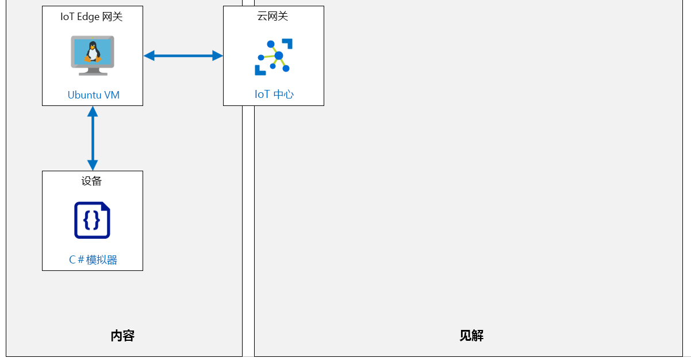

---
lab:
  title: 实验室 12：设置 IoT Edge 网关
  module: 'Module 6: Azure IoT Edge Deployment Process'
ms.openlocfilehash: 70d364787ed2a60596d7e194e9c172b28585d13b
ms.sourcegitcommit: 06dc1e6caa88a09b1246dd1161f15f619db9c6f8
ms.translationtype: HT
ms.contentlocale: zh-CN
ms.lasthandoff: 02/10/2022
ms.locfileid: "138421528"
---
# <a name="setup-an-iot-edge-gateway"></a>设置 IoT Edge 网关

## <a name="lab-scenario"></a>实验室场景

本实验室是理论性实验室，将带你逐步了解如何将 IoT Edge 设备用作网关。

将 IoT Edge 设备用作网关有三种模式：透明、协议转换和标识转换：

透明  – 理论上可以连接到 IoT 中心的设备可以改为连接到网关设备。 下游设备有其自己的 IoT 中心标识，并将使用任一 MQTT、AMQP 或 HTTP 协议。 网关只是在设备与 IoT 中心之间传递通信。 设备不知道它们在通过网关与云通信，而且与 IoT 中心中的设备交互的用户不知道中间网关设备。 因此，网关是透明的。 请参阅创建透明网关，了解有关将 IoT Edge 设备用作透明网关的详细信息。

**协议转换** - 也称为不透明网关模式，不支持 MQTT、AMQP 或 HTTP 的设备可以使用网关设备以它们的名义将数据发送到 IoT 中心。 网关了解下游设备使用的协议，并且是 IoT 中心中唯一具有标识的设备。 所有信息好像都来自一台设备，即网关。 如果云应用程序想要以设备位单位分析数据，则下游设备就必须在其消息中嵌入额外的标识信息。 此外，IoT 中心基元（例如孪生和方法）仅适用于网关设备，而不适用于下游设备。

**标识转换** - 无法连接到 IoT 中心的设备可以改为连接到网关设备。 网关代表下游设备提供 IoT 中心标识和协议转换。 网关非常智能，它能够理解下游设备使用的协议，为其提供标识，并转换 IoT 中心基元。 下游设备作为一流设备出现在 IoT 中心，随附克隆和方法。 用户可以与 IoT 中心中的设备进行交互，而同时不了解中间网关设备。

将创建以下资源：



## <a name="in-this-lab"></a>本实验室概览

在本实验室中，你将完成以下活动：

* 配置实验室先决条件（所需的 Azure 资源）
* 将启用 Azure IoT Edge 的 Linux VM 部署为 IoT Edge 设备
* 生成和配置 IoT Edge 设备 CA 证书
* 使用 Azure 门户在 IoT 中心创建 IoT Edge 设备标识
* 设置 IoT Edge 网关主机名
* 将 IoT Edge 网关设备连接到 IoT 中心
* 打开 IoT Edge 网关设备端口进行通信
* 在 IoT 中心创建下游设备标识
* 将下游设备连接到 IoT Edge 网关
* 验证事件流

## <a name="lab-instructions"></a>实验室说明

### <a name="exercise-1-configure-lab-prerequisites"></a>练习 1：配置实验室先决条件

本实验室假定以下 Azure 资源可用：

| 资源类型 | 资源名称 |
| :-- | :-- |
| Resource Group | rg-az220 |
| IoT 中心 | iot-az220-training-{your-id} |

若要确保这些资源可用，请完成以下任务。

1. 在虚拟机环境中，打开 Microsoft Edge 浏览器窗口，然后导航到以下 Web 地址：
 
    +++https://portal.azure.com/#create/Microsoft.Template/uri/https%3A%2F%2Fraw.githubusercontent.com%2FMicrosoftLearning%2FAZ-220-Microsoft-Azure-IoT-Developer%2Fbicep%2FAllfiles%2FARM%2Flab12.json+++

    > 注意：每当看到绿色的“T”符号（例如 +++输入此文本+++）时，可以单击关联的文本，信息将键入到虚拟机环境内的当前字段中。

1. 如果系统提示登录到 Azure 门户，请输入你在本课程中使用的 Azure 凭据。

    将显示“自定义部署”页。

1. 在“项目详细信息”下的“订阅”下拉列表中，确保你打算在本课程中使用的 Azure 订阅已选中 。

1. 在“资源组”下拉列表中，选择“rg-az220” 。

    > 注意：如果未列出 rg-az220：
    >
    > 1. 在“资源组”下拉列表中，选择“新建”。
    > 1. 在“名称”下，输入 rg-az220 。
    > 1. 单击“确定”  。

1. 在“实例详细信息”下的“区域”下拉列表中，选择离你最近的区域 。

    > 注意：如果 rg-az220 组已存在，则“区域”字段将设置为资源组使用的区域，并且为只读 。

1. 在“你的 ID”字段中，输入在练习 1 中创建的唯一 ID。

1. 在“课程 ID”字段中，输入 az220 。

1. 若要验证模板，请单击“查看和创建”。

1. 验证通过后，单击“创建”。

    将启动部署。

1. 部署完成后，在左侧导航区域中，若要查看模板的任何输出值，请单击“输出”。

    记下输出供稍后使用：

    * connectionString

现已创建资源。

### <a name="exercise-2-deploy-and-configure-a-linux-vm--as-an-iot-edge-gateway"></a>练习 2：部署 Linux VM 并将其配置为 IoT Edge 网关

在本练习中，你将部署 Ubuntu Server VM 并将其配置为 IoT Edge 网关。

#### <a name="task-1-create-iot-edge-gateway-device-identity"></a>任务 1：创建 IoT Edge 网关设备标识

在本任务中，你将使用 Azure IoT 中心创建一个用于 IoT Edge 透明网关（你的 IoT Edge VM）的新的 IoT Edge 设备标识。

1. 如有必要，请使用 Azure 帐户凭据登录到 Azure 门户，然后导航到 Azure 仪表板。

1. 在“rg-az220”资源组磁贴上，打开 IoT 中心，单击“iot-az220-training-{your-id}” 。

1. 在“iot-az220-training-{your-id}”边栏选项卡的左侧导航菜单中的“设备管理”下，单击“IoT Edge”  。

    可通过 IoT Edge 窗格管理连接到 IoT 中心的 IoT Edge 设备。

1. 在窗格顶部，单击“添加 IoT Edge 设备”。

1. 在“创建设备”边栏选项卡的“设备 ID”字段中，输入 vm-az220-training-gw0001-{your-id}。

    请务必将 {your-id} 替换为在该课程开始时创建的值。 这是将用于身份验证和访问控制的设备标识。

1. 在“身份验证类型”处， 确保已选中“对称密钥”，并保留选中“自动生成密钥”框。

    这将使 IoT 中心自动生成对设备进行身份验证的对称密钥。

1. 将其他设置保留为默认值，然后单击“保存”。

    稍后，新的 IoT Edge 设备将添加到 IoT Edge 设备列表中。

1. 在“设备 ID”下，单击“vm-az220-training-gw0001-{your-id}” 。

1. 在“vm-az220-training-gw0001-{your-id}”边栏选项卡上，复制“主连接字符串”。 

    值的右侧提供一个“复制”按钮。

1. 将“主连接字符串”的值复制到文件，并记下与之关联的设备。

1. 在“vm-az220-training-gw0001-{your-id}”边栏选项卡上，请注意“模块”列表仅限于“\$edgeAgent”和“\$edgeHub”   。

    IoT Edge 代理 (\$edgeAgent) 和 IoT Edge 中心 (\$edgeHub) 模块是 IoT Edge 运行时的一部分 。 Edge 中心负责通信，而 Edge 代理部署和监视设备上的模块。

1. 在边栏选项卡顶部，单击“设置模块”。

    “在设备上设置模块”边栏选项卡可用于向 IoT Edge 设备添加其他模块。 目前，将使用此边栏选项卡来确保为 IoT Edge 网关设备正确配置了消息路由。

1. 在“在设备上设置模块”边栏选项卡顶部，单击“路由”。

    在“路由”处，编辑器将显示为 IoT Edge 设备配置的默认路由。 此时，应配置将所有消息从所有模块发送到 Azure IoT 中心的路由。 如果路由配置与此不匹配，请更新以匹配以下路由：

    * NAME：`route`
    * VALUE：`FROM /* INTO $upstream`

    消息路由的 `FROM /*` 部分将匹配所有设备到云的消息，或来自任何模块或叶设备的孪生更改通知。 然后，`INTO $upstream` 将指示路由将这些消息发送到 Azure IoT 中心。

    > **注意**：若要详细了解如何在 Azure IoT Edge 中配置消息路由，请参阅[了解如何在 IoT Edge 中部署模块和建立路由](https://docs.microsoft.com/azure/iot-edge/module-composition#declare-routes#declare-routes)一文。

1. 在边栏选项卡底部，单击“查看 + 创建”。

    “在设备上设置模块”边栏选项卡的标签页上显示 Edge 设备的部署清单。 你会在边栏选项卡顶部看到一条消息，显示“验证通过”

1. 请花费片刻时间查看部署清单。

1. 单击边栏选项卡底部的“创建” 。

#### <a name="task-2-provision-iot-edge-vm"></a>任务 2：预配 IoT Edge VM

在此任务中，你将使用 ARM（Azure 资源管理器）模板来预配 Linux VM、安装 IoT Edge 运行时、配置与 IoT 中心的连接、生成用于加密设备到网关通信的 X509 证书，并将它们添加到 IoT Edge 运行时配置。

> **信息**：若要详细了解已自动执行的步骤，请查看以下资源：
>
> * [安装或卸载适用于 Linux 的 Azure IoT Edge](https://docs.microsoft.com/en-us/azure/iot-edge/how-to-install-iot-edge?view=iotedge-2020-11)
> * [管理 IoT Edge 设备上的证书](https://docs.microsoft.com/en-us/azure/iot-edge/how-to-manage-device-certificates?view=iotedge-2020-11)
> * [创建演示证书用于测试 IoT Edge 设备功能](https://docs.microsoft.com/en-us/azure/iot-edge/how-to-create-test-certificates?view=iotedge-2020-11)

1. 选择“部署到 Azure”：

    [](https://portal.azure.com/#create/Microsoft.Template/uri/https%3A%2F%2Fraw.githubusercontent.com%2FMicrosoftLearning%2FAZ-220-Microsoft-Azure-IoT-Developer%2Fbicep%2FAllfiles%2FARM%2Flab12a.json)

1. 如果系统提示，请登录到“Azure 门户”。

    将显示“自定义部署”页。

1. 在“项目详细信息”下的“订阅”下拉列表中，确保你打算在本课程中使用的 Azure 订阅已选中 。

1. 在“资源组”下拉列表中，选择“创建”并输入 rg-az220vm 。

1. 在“区域”字段中，输入之前使用的相同位置。

1. 在“虚拟机名称”文本框中，输入 vm-az220-training-gw0001-{your-id} 

1. 在“设备连接字符串”字段中，输入上一个练习中的连接字符串值。

1. 在“虚拟机大小”字段中，确保输入 Standard_DS1_v2 。

1. 在“Ubuntu OS 版本”字段中，确保输入 18.04-LTS 。

1. 在“管理员用户名”字段中，输入用户名。

1. 在“身份验证类型”字段中，确保选择了“密码” 。

1. 在“管理员密码或密钥”字段中，输入要使用的密码。

1. 在“允许 SSH”字段中，确保选择了“true” 。

1. 若要验证模板，请单击“查看和创建”。

1. 验证通过后，单击“创建”。

    > **注意**：虽然部署可能很快完成，但 VM 的配置将继续在后台进行。

1. 模板完成后，导航到“输出”窗格并记下以下内容：

    * 公共 FQDN
    * 公共 SSH

####
 任务 3：打开 IoT Edge 网关设备端口进行通信

标准 IoT Edge 设备不需要任何入站连接便可工作，因为与 IoT 中心之间的所有通信都是通过出站连接执行的。 网关设备则不同，因为它们需要从其下游设备接收消息。 如果下游设备与网关设备之间有防火墙，则也需要能够通过防火墙进行通信。 为了使 Azure IoT Edge 网关正常工作，必须至少打开一个 IoT Edge 中心支持的协议，以允许来自下游设备的入站流量。 支持的协议为 MQTT、AMQP 和 HTTPS。

Azure IoT Edge 支持的 IoT 通信协议具有以下端口映射：

| 协议 | 端口号 |
| --- | --- |
| MQTT | 8883 |
| AMQP | 5671 |
| HTTPS<br/>MQTT + WS (Websocket)<br/>AMQP + WS (Websocket) | 443 |

为设备选择的 IoT 通信协议将需要为防火墙打开相应的端口，以保护 IoT Edge 网关设备的安全。 在此实验室中，将使用 Azure 网络安全组 (NSG) 来保护 IoT Edge 网关的安全，因此将在这些端口上打开 NSG 的入站安全规则。

在生产方案中，只需为设备打开最小数量的端口即可进行设备通信。 如果使用的是 MQTT，则仅打开端口 8883 以允许入站通信。 打开其他端口将引入攻击者可以利用的其他安全攻击途径。 最佳安全做法是仅打开解决方案所需的最少端口数。

在本任务中，将配置网络安全组 (NSG)，以确保从 Internet 访问 Azure IoT Edge 网关的安全。 需要打开进行 MQTT、AMQP 和 HTTPS 通信所需的端口，以便下游 IoT 设备可以与网关通信。

1. 如有必要，请使用 Azure 帐户凭据登录到 Azure 门户。

1. 在 Azure 仪表板上，找到“rg-az220vm”资源组磁贴。

    请注意，此资源组磁贴包括指向关联的网络安全组的链接。

1. 在“rg-az220vm”资源组磁贴上，单击“nsg-vm-az220-training-gw0001-{your-id}” 。

1. 在“网络安全组”边栏选项卡左侧菜单的“设置”下，单击“入站安全规则”。

1. 在“入站安全规则”窗格顶部，单击“添加”。

1. 在“添加入站安全规则”窗格中，确保将“源”设置为“任何”  。

    这允许来自任何源的流量 - 在生产环境中，建议将其限制为特定地址等。

1. 在“目标”下，确保将“目标”设置为“任何”  。

    这可确保传出流量可以路由到任何位置。 在生产环境中，建议限制地址。

1. 在“目标端口范围”下，将值更改为 8883 。

    这是 MQTT 协议的端口。

1. 在“协议”下，单击“TCP”。

    MQTT 使用 TCP。

1. 在“操作”下，确保选择了“允许” 。

    由于此规则旨在允许传出流量，因此选择了“允许”。

1. 在“优先级”下，提供了一个默认值。在大多数情况下，该默认值为 1010，此值必须是唯一的  。

    按优先级顺序处理规则；数字越小，优先级越高。 建议在规则之间留出间隔（100、200、300 等），以便更轻松地添加新规则而无需编辑现有规则。

1. 在“名称”下，将值更改为 **MQTT**

1. 将所有其他设置保留为默认值，并单击“添加”。

    这将定义入站安全规则，该规则将允许 MQTT 协议到 IoT Edge 网关的通信。

1. 添加 MQTT 规则后，添加另外两个具有以下值的规则，即可打开 AMQP 和 HTTPS 通信协议的端口：

    | 目标端口范围 | 协议 | 名称 |
    | :--- | :--- | :--- |
    | 5671 | TCP | AMQP |
    | 443 | TCP | HTTPS |

   > **注意**：你可能需要使用窗格顶部工具栏中的“刷新”按钮来查看新规则的出现。

1. 通过在网络安全组 (NSG) 上打开这三个端口，下游设备将能够使用 MQTT、AMQP 或 HTTPS 协议连接到 IoT Edge 网关。

### <a name="exercise-3-download-device-ca-certificate"></a>练习 3：下载设备 CA 证书

在本练习中，你将浏览刚刚创建的 vm-az220-training-gw0001-{your-id} 虚拟机，并将生成的测试证书下载到云 shell。

#### <a name="task-1-connect-to-the-vm"></a>任务 1：连接到 VM

1. 验证 IoT Edge 虚拟机是否已成功部署。

    可以查看 Azure 门户中的“通知”窗格。

1. 验证“rg-az220vm”资源组是否已固定到 Azure 仪表板。

    要将资源组固定到仪表板，请导航到 Azure 仪表板，然后完成以下操作：

    * 在 Azure 门户菜单上，单击“资源组”。
    * 在“资源组”边栏选项卡上的“名称”下，找到“rg-az220vm”资源组。
    * 在“rg-az220vm”行上，在边栏选项卡右侧单击“...”，然后单击“固定到仪表板”  。

    你可能需要编辑仪表板，以使 RG 磁贴和列出的资源更易于访问。

1. 在 Azure 门户工具栏上，单击“Cloud Shell”

1. 在 Cloud Shell 命令提示符处，粘贴在之前的任务中记下的 ssh 命令（类似于 ssh vmadmin@vm-az220-training-edge0001-dm080321.centralus.cloudapp.azure.com），然后按 Enter  。

1. 当提示“确定要继续连接吗?”时，键入“yes”，然后按 Enter。

    此提示是安全确认，因为用于保护与 VM 的连接的证书为自签名证书。 系统将记住此提示的回答，以便用于后续连接，并且仅在第一次连接时提示。

1. 当提示输入密码时，请输入在预配 Edge 网关 VM 时创建的管理员密码。

1. 连接后，终端将更改为显示 Linux VM 的名称，如下所示。 这会告诉你连接的是哪个 VM。

    ``` bash
    username@vm-az220-training-gw0001-{your-id}:~$
    ```

1. 若要确定虚拟机的公共 IP 地址，请输入以下命令：

    ```bash
    nslookup vm-az220-training-gw0001-{your-id}.centralus.cloudapp.azure.com
    ```

    输出结果会类似于：

    ```bash
    Server:         127.0.0.53
    Address:        127.0.0.53#53

    Non-authoritative answer:
    Name:   vm-az220-training-gw0001-{your-id}}.centralus.cloudapp.azure.com
    Address: 168.61.181.131
    ```

    VM 的公共 IP 是最终的“地址”值，在本例中为 168.61.181.131 。

    > **重要说明**：记下此 IP 地址 - 稍后你将需要它。 每次重启 VM 时，IP 地址通常都会更改。

    > **注意**：如果公共 IP 未显示在 Azure Cloud shell 中，请使用 Azure 门户查找 VM 的公共 IP 地址。

#### <a name="task-2-explore-the-iot-edge-configuration"></a>任务 2：浏览 IoT Edge 配置

首次启动 VM 时，执行了一个已配置 IoT Edge 的脚本。 此脚本执行了以下操作：

* 安装了 aziot-identity-service 包
* 安装了 aziot-edge 包
* 将 config.toml（IoT Edge 的配置文件）的初始版本下载到了 /etc/aziot/config.toml 
* 将执行 ARM 模板时提供的设备连接字符串添加到了 /etc/aziot/config.toml
* 将 [Iot Edge git 存储库](https://github.com/Azure/iotedge.git)克隆到了 /etc/gw-ssl/iotedge
* 创建了目录 /tmp/lab12 并从 /etc/gw-ssl/iotedge 复制了 IoT Edge 网关 SSL 测试工具 
* 在 /tmp/lab12 中生成了测试 SSL 证书并将其复制到了 /etc/aziot 
* 将证书添加到了 /etc/aziot/config.toml
* 将更新后的 /etc/aziot/config.toml 应用到了 IoT Edge 运行时

1. 若要确定已安装的 IoT Edge 版本，请输入以下命令：

    ```bash
    iotedge --version
    ```

    在编写本文时安装的版本为 `iotedge 1.2.3`

1. 若要查看 IoT Edge 配置，请输入以下命令：

    ```bash
    cat /etc/aziot/config.toml
    ```

    输出结果会类似于：

    ```s
        [provisioning]
    source = "manual"
    connection_string = "HostName=iot-az220-training-dm080221.azure-devices.net;DeviceId=sensor-th-0067;SharedAccessKey=2Zv4wruDViwldezt0iNMtO1mA340tM8fnmxgoQ3k0II="

    [agent]
    name = "edgeAgent"
    type = "docker"

    [agent.config]
    image = "mcr.microsoft.com/azureiotedge-agent:1.2"

    [connect]
    workload_uri = "unix:///var/run/iotedge/workload.sock"
    management_uri = "unix:///var/run/iotedge/mgmt.sock"

    [listen]
    workload_uri = "fd://aziot-edged.workload.socket"
    management_uri = "fd://aziot-edged.mgmt.socket"

    [moby_runtime]
    uri = "unix:///var/run/docker.sock"
    network = "azure-iot-edge"

    trust_bundle_cert = 'file:///etc/aziot/azure-iot-test-only.root.ca.cert.pem'

    [edge_ca]
    cert = 'file:///etc/aziot/iot-edge-device-ca-MyEdgeDeviceCA-full-chain.cert.pem'
    pk = 'file:///etc/aziot/iot-edge-device-ca-MyEdgeDeviceCA.key.pem'
    ```

    在设置过程中，更新了 connection_string、trust_bundle_cert、cert 和 pk 值   。

1. 要确保 IoT Edge 守护程序正常运行时，请输入以下命令：

    ```bash
    sudo iotedge system status
    ```

    此命令将显示如下输出：

    ```bash
    System services:
        aziot-edged             Running
        aziot-identityd         Running
        aziot-keyd              Running
        aziot-certd             Running
        aziot-tpmd              Ready

    Use 'iotedge system logs' to check for non-fatal errors.
    Use 'iotedge check' to diagnose connectivity and configuration issues.
    ```

1. 要验证已连接的 IoT Edge 运行时，请运行以下命令：

    ```bash
    sudo iotedge check
    ```

    这将运行许多检查并显示结果。 对于本实验室，请忽略“配置检查”警告/错误。 “连接性检查”应该会成功，并且类似于以下内容：

    ```bash
    Connectivity checks (aziot-identity-service)
    --------------------------------------------
    √ host can connect to and perform TLS handshake with iothub AMQP port - OK
    √ host can connect to and perform TLS handshake with iothub HTTPS / WebSockets port - OK
    √ host can connect to and perform TLS handshake with iothub MQTT port - OK

    Configuration checks
    --------------------
    ** entries removed for legibility **

    Connectivity checks
    -------------------
    √ container on the default network can connect to IoT Hub AMQP port - OK
    √ container on the default network can connect to IoT Hub HTTPS / WebSockets port - OK
    √ container on the default network can connect to IoT Hub MQTT port - OK
    √ container on the IoT Edge module network can connect to IoT Hub AMQP port - OK
    √ container on the IoT Edge module network can connect to IoT Hub HTTPS / WebSockets port - OK
    √ container on the IoT Edge module network can connect to IoT Hub MQTT port - OK
    ```

    如果连接失败，请仔细检查 config.toml 中的连接字符串值。

1. 若要退出 VM shell，请输入以下命令：

    ```bash
    exit
    ```

    应关闭与 VM 的连接，并应显示云 shell 提示。

#### <a name="task-3-download-ssl-certs-from-vm-to-cloud-shell"></a>任务 3：将 SSL 证书从 VM 下载到 Cloud Shell

接下来，你需要从 vm-az220-training-gw0001-{your-id} 虚拟机下载 MyEdgeDeviceCA 证书，以便使用该证书来加密叶设备和 IoT Edge 网关之间的通信 。

1. 在 Cloud Shell 命令提示符处，输入以下命令，从 vm-az220-training-gw0001-{your-id} 虚拟机下载 /tmp/lab12 目录到 Cloud Shell 存储  ：

    ```bash
    mkdir lab12
    scp -r -p {username}@{FQDN}:/tmp/lab12 .
    ```

    >**重要说明**：上面的命令包含 `space`，句末以句号 (`.`) 结尾。

    > **注意**：将 {username} 占位符替换为 VM 管理员用户的用户名，并将 {FQDN} 占位符替换为 VM 的完全限定的域名 。 如有必要，请参阅你用来打开 SSH 会话的命令。
    > `scp -r -p vmadmin@vm-az220-training-edge0001-dm080321.centralus.cloudapp.azure.com:/tmp/lab12 .`

1. 出现提示时，请输入 VM 的管理员密码。

    执行该命令后，它会通过 SSH 将带有证书和密钥文件的 /tmp/lab12 目录副本下载到 Cloud Shell 存储中。

1. 若要验证是否已下载文件，请输入以下命令：

    ```bash
    cd lab12
    ls
    ```

    你会看到列出的以下文件：

    ```bash
    certGen.sh  csr        index.txt.attr      index.txt.old  openssl_root_ca.cnf  serial
    certs       index.txt  index.txt.attr.old  newcerts       private              serial.old
    ```

    将文件从 vm-az220-training-gw0001-{your-id} 虚拟机复制到 Cloud Shell 存储后，你将可以根据需要将任一 IoT Edge 设备证书和密钥文件轻松下载到本地计算机。 可以使用 `download <filename>` 命令从 Cloud Shell 下载这些文件。 你将稍后在实验室中执行此操作。

### <a name="exercise-4-create-a-downstream-device"></a>练习 4：创建下游设备

在本练习中，将创建一个下游设备并通过网关连接到 IoT 中心。

#### <a name="task-1-create-device-identity-in-iot-hub"></a>任务 1：在 IoT 中心创建设备标识

在本任务中，将在 Azure IoT 中心为下游 IoT 设备创建一个新的 IoT 设备标识。 你将配置此设备标识，以便 Azure IoT Edge 网关成为此下游设备的父设备。

1. 如有必要，请使用 Azure 帐户凭据登录到 Azure 门户。

1. 在 Azure 仪表板上，单击“iot-az220-training-{your-id}”即可打开 IoT 中心。

1. 在“iot-az220-training-{your-id}”边栏选项卡的左侧导航菜单中的“设备管理”下，单击“设备”  。

    IoT 中心边栏选项卡的此窗格允许你管理连接到 IoT 中心的 IoT 设备。

1. 在窗格顶部，要开始配置新的 IoT 设备，请单击“+ 添加设备”。

1. 在“创建设备”边栏选项卡的“设备 ID”下，输入 sensor-th-0072

    这是用于身份验证和访问控制的设备标识。

1. 确保在“身份验证类型”下，选中“对称密钥”。

1. 在“自动生成密钥”下，保留此框的选中状态。

    这将使 IoT 中心自动生成对设备进行身份验证的对称密钥。

1. 在“父设备”选项下，单击“设置父设备”。

    你将配置此下游设备，以便通过之前在本实验室创建的 IoT Edge 网关设备与 IoT 中心通信。

1. 在“将 Edge 设备设置为父设备”边栏选项卡的“设备 ID”选项下，单击“vm-az220-training-gw0001-{your-id}”，然后单击“确定”。

1. 在“创建设备”边栏选项卡上，单击“保存”，即可创建下游设备的 IoT 设备标识。

1. 在“IoT 设备”窗格顶部，单击“刷新”。

1. 在“设备 ID”下，单击“sensor-th-0072” 。

    这将打开该设备的详细信息视图。

1. 在“IoT 设备摘要”窗格中，在“主连接字符串”字段的右侧，单击“复制”。

1. 保存连接字符串，以便以后引用。

    请务必注意，此是 sensor-th-0072 子设备的连接字符串。

#### <a name="task-2-download-device-x509-xertificate"></a>任务 2：下载设备 x509 证书

在本任务中，你将配置预先构建的下游设备和 Edge 网关设备之间的连接。

1. 如有必要，请使用 Azure 帐户凭据登录到 Azure 门户。

    如果有多个 Azure 帐户，请确保使用与本课程要使用的订阅绑定的帐户登录。

1. 在 Azure 门户工具栏上，单击“Cloud Shell”。

    确保将环境设置为 **Bash**。

    > **注意**：如果 Cloud Shell 已打开，并且你仍然连接到 Edge 设备，请使用 exit 命令关闭 SSH 会话。

1. 在 Cloud Shell 命令提示符处，要下载 IoT Edge 网关虚拟机的根 CA X.509 证书，请输入以下命令：

    ```bash
    download lab12/certs/azure-iot-test-only.root.ca.cert.pem
    ```

    先前已在 /etc/aziot/config.toml 文件中配置了 Azure IoT Edge 网关，以使用此根 CA X.509 证书来加密与连接到该网关的任何下游设备的通信。 此 X.509 证书将需要复制到下游设备，以便下游设备可以使用该证书来加密与网关的通信。

1. 将“azure-iot-test-only.root.ca.cert.pem”X.509 证书文件复制到下游 IoT 设备源代码所在的 /Starter/DownstreamDevice 目录 。

    > **重要说明**：确保文件具有正确的名称。 它的名称可能与以前的实验室不同，例如添加了 (1)，因此如有必要，请在复制后重命名。

#### <a name="task-3-create-hosts-file-entry"></a>任务 3：创建主机文件条目

在本实验室的早期版本中，FQDN 将用作设备连接字符串中 GatewayHostName 的值，但由当前版本的测试脚本生成的测试 x509 证书不再支持此功能。 而是仅使用主机名，并且必须在本地计算机的主机文件中创建一个条目，以将主机名解析为 IP 地址。 完成以下步骤，将所需条目添加到主机文件。

1. 打开 Visual Studio Code。

1. 在“文件”菜单中，单击“打开文件”。

1. 导航到以下文件夹（c:\\Windows\\System32\\Drivers\\etc\\ 文件），然后打开主机文件 。

    > 注意：主机文件没有扩展名 。

1. 将以下行添加到主机文件，后跟一个空行：

    ```text
    {VM Public IP Address} vm-az220-training-gw0001-{your-id}
    {blank line}
    ```

    例如，

    ```text
    168.61.181.131 vm-az220-training-gw0001-dm090821

    ```

1. 保存文件 - 当提示保存失败时，单击“以管理员身份重试...”，然后在“用户帐户控制”对话框中，单击“是”  。

本地计算机现在可以将 VM 名称解析为相应的 IP 地址。

#### <a name="task-4-connect-downstream-device-to-iot-edge-gateway"></a>任务 4：将下游设备连接到 IoT Edge 网关

1. 打开 Visual Studio Code。

1. 在“文件”菜单上，单击“打开文件夹”。

1. 在“打开文件夹”对话框中，导航到实验室 12 的 Starter 文件夹，单击“DownstreamDevice”，然后单击“选择文件夹”   。

    你会看到“资源管理器”窗格中列出的 azure-iot-test-only.root.ca.cert.pem 文件以及 Program.cs 文件。

    > **注意**：如果看到有关还原 dotnet 和/或加载 C# 扩展的消息，则可以完成安装。

1. 在“资源管理器”窗格中，单击“Program.cs”。

    大致回顾一下就会发现，此应用是你在之前的实验室中使用过的 CaveDevice 应用程序的变体。

1. 找到 connectionString 变量的声明，然后将占位符的值替换为 sensor-th-0072 IoT 设备的主连接字符串 。

1. 将分配的 connectionString 值附加到 GatewayHostName 属性，然后将 GatewayHostName 的值设置为 IoT Edge 网关设备的完整 DNS 名称 。

    Edge 网关设备的完整 DNS 名称是在设备 ID（即 vm-az220-training-gw0001-{your-id}）后附加指定的区域和 Azure 商业云域名，例如：.westus2.cloudapp.azure.com 。

    完整的连接字符串值应为以下格式：

    ```text
    HostName=<IoT-Hub-Name>.azure-devices.net;DeviceId=sensor-th-0072;SharedAccessKey=<Primary-Key-for-IoT-Device>;GatewayHostName=<HostName-for-IoT-Edge-Device>
    ```

    > **重要说明**：在 IoTEdge 运行时的早期版本中，GatewayHostName 是完整的 DNS 名称

    请务必使用适当的值替换上述占位符：

    * **\<IoT-Hub-Name\>** ：Azure IoT 中心的名称。
    * **\<Primary-Key-for-IoT-Device\>** ：Azure IoT 中心中 sensor-th-0072 IoT 设备的主键。
    * **\<Hostname-Name-for-IoT-Edge-Device\>** ：vm-az220-training-gw0001-{your-id} Edge 设备的主机名。

    具有组合的连接字符串值的 connectionString 变量将类似于以下内容：

    ```csharp
    private readonly static string connectionString = "HostName=iot-az220-training-abc201119.azure-devices.net;DeviceId=sensor-th-0072;SharedAccessKey=ygNT/WqWs2d8AbVD9NAlxcoSS2rr628fI7YLPzmBdgE=;GatewayHostName=vm-az220-training-gw0001-{your-id}";
    ```

1. 在“文件”菜单上，单击“保存”。

1. 向下滚动以找到 Main 方法，然后花点时间查看代码。

    该方法包含使用配置的连接字符串实例化 DeviceClient 的代码，并将 `MQTT` 指定为用于与 Azure IoT Edge 网关通信的传输协议。

    ```csharp
    deviceClient = DeviceClient.CreateFromConnectionString(connectionString, TransportType.Mqtt);
    SendDeviceToCloudMessagesAsync();
    ```

    Main 方法还会：

    * 调用 InstallCACert 方法，该方法具有一些代码，可以将根 CA X.509 证书自动安装到本地计算机。
    * 调用可从模拟设备发送事件遥测数据的 SendDeviceToCloudMessagesAsync 方法。

1. 找到 SendDeviceToCloudMessagesAsync 方法，然后花点时间查看代码。

    此方法包含生成模拟设备遥测的代码，并将事件发送到 IoT Edge 网关。

1. 找到 **InstallCACert** 并浏览将根 CA X.509 证书安装到本地计算机证书存储的代码。

    > **注意**：请记住，此证书用于确保设备与 Edge 网关之间的通信安全。 设备使用连接字符串中的对称密钥向 IoT 中心进行身份验证。

    此方法中的初始代码负责确保 azure-iot-test-only.root.ca.cert.pem 文件可用。 当然，在生产应用程序中，你可能会考虑使用替代机制来指定 X.509 证书的路径（例如环境变量）或使用 TPM。

    验证存在 X.509 证书之后，将使用 X509Store 类将证书加载到当前用户的证书存储中。 然后，该证书将按需提供，以确保与网关的通信安全 - 这是在设备客户端中自动发生的，因此没有其他代码。

    > **信息**：可以在[此处](https://docs.microsoft.com/en-us/dotnet/api/system.security.cryptography.x509certificates.x509store?view=netcore-3.1)了解有关 X509Store 类的详细信息。

1. 在“终端”菜单上，单击“新终端”。

1. 在“终端”命令提示符下，输入以下命令：

    ```bash
    dotnet run
    ```

    此命令将为要开始发送设备遥测数据的 sensor-th-0072 模拟设备生成并运行代码。

    > **注意**：当应用尝试在本地计算机上安装 X.509 证书（以便可以使用它来向 IoT Edge 网关进行身份验证）时，你可能会看到一个安全警告，询问有关安装证书的问题。 需要单击“是”，以允许该应用继续运行。

1. 如果询问你是否要安装证书，请单击“是”。

1. 模拟设备运行后，控制台输出将显示发送到 Azure IoT Edge 网关的事件。

    终端输出类似于以下内容：

    ```text
    IoT Hub C# Simulated Cave Device. Ctrl-C to exit.

    User configured CA certificate path: azure-iot-test-only.root.ca.cert.pem
    Attempting to install CA certificate: azure-iot-test-only.root.ca.cert.pem
    Successfully added certificate: azure-iot-test-only.root.ca.cert.pem

    10/25/2019 6:10:12 PM > Sending message: {"temperature":27.714212817472504,"humidity":63.88147743599558}
    10/25/2019 6:10:13 PM > Sending message: {"temperature":20.017463779085066,"humidity":64.53511070671263}
    10/25/2019 6:10:14 PM > Sending message: {"temperature":20.723927165718717,"humidity":74.07808918230147}
    10/25/2019 6:10:15 PM > Sending message: {"temperature":20.48506045736608,"humidity":71.47250854944461}
    ```

    > **注意**：如果设备发送在第一次发送时暂停的时间似乎超过了一秒，可能是你之前未正确添加 NSG 传入规则，因此 MQTT 流量被阻止了。  检查 NSG 配置。

1. 让模拟设备保持运行状态，同时继续进行下一个练习。

#### <a name="task-5-verify-event-flow"></a>任务 5：验证事件流

在本任务中，将使用 Azure CLI 监视通过 IoT Edge 网关从下游 IoT 设备发送到 Azure IoT 中心的事件。 这将验证一切是否正常运行。

1. 如有必要，请使用 Azure 帐户凭据登录到 Azure 门户。

    如果有多个 Azure 帐户，请确保使用与本课程要使用的订阅绑定的帐户登录。

1. 如果未运行 Cloud Shell，请在 Azure 门户工具栏上单击“Cloud Shell”。

1. 如果仍通过 Cloud Shell 中的 SSH 连接连接到 Edge 设备，请退出该连接。

1. 在 Cloud Shell 命令提示符处，运行以下命令，即可监视流到 Azure IoT 中心的事件流：

    ```bash
    az iot hub monitor-events -n iot-az220-training-{your-id}
    ```

    请确保将 `-n` 参数的 `{your-id}` 占位符替换为 Azure IoT 中心的名称。

    可使用 `az iot hub monitor-events` 命令监视发送到 Azure IoT 中心的设备遥测和消息。 这将验证 Azure IoT 中心是否已接收到来自模拟设备且发送到 IoT Edge 网关的事件。

    > **注意**：如果提示 `Dependency update (uamqp 1.2) required for IoT extension version: 0.10.13.`，请输入 *Y。

1. 在一切正常运行的情况下，`az iot hub monitor-events` 命令的输出将如下所示：

    ```text
    chris@Azure:~$ az iot hub monitor-events -n iot-az220-training-1119
    Starting event monitor, use ctrl-c to stop...
    {
        "event": {
            "origin": "sensor-th-0072",
            "module": "",
            "interface": "",
            "component": "",
            "payload": "{\"temperature\":29.995470051651573,\"humidity\":70.47896838303608}"
        }
    }
    {
        "event": {
            "origin": "sensor-th-0072",
            "module": "",
            "interface": "",
            "component": "",
            "payload": "{\"temperature\":28.459910635584922,\"humidity\":60.49697355390386}"
        }
    }
    ```

完成本实验室并验证事件流后，请按 CTRL+C，退出控制台应用程序。
