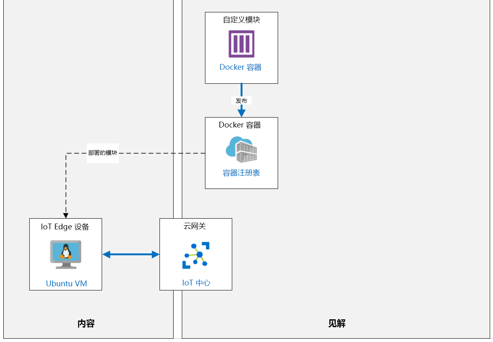

---
lab:
  title: 实验室 13：使用 VS Code 在 Azure IoT Edge 上开发、部署和调试自定义模块
  module: 'Module 7: Azure IoT Edge Modules'
ms.openlocfilehash: 9586c15c0e16a0bdbe7850a0c28af480dcf34086
ms.sourcegitcommit: 7281efeb9cb5654361c2f1aa93aea724a3898966
ms.translationtype: HT
ms.contentlocale: zh-CN
ms.lasthandoff: 05/31/2022
ms.locfileid: "145955882"
---
# <a name="develop-deploy-and-debug-a-custom-module-on-azure-iot-edge-with-vs-code"></a>使用 VS Code 在 Azure IoT Edge 上开发，部署和调试自定义模块

## <a name="lab-scenario"></a>实验室场景

为了帮助管理消费者需求的波动，Contoso 在每个奶酪制造厂的仓库中都保留少量的成熟奶酪滚轮库存。 这些成熟的奶酪圈用蜡密封，并仔细控制了存储环境，以确保奶酪保持最佳状态。 Contoso 使用输送机系统将大型蜡封奶酪轮从仓库移至包装设施。

过去，Contoso 的包装过程一直处于满负荷状态，才能处理系统中放置的所有奶酪。 包装的奶酪中任何多余的数量都不是问题，因为它可以用于促销，并且可以根据需要从库存中提取其他奶酪。 但是，随着 Contoso 的显著发展以及全球需求引起的波动不断，该公司需要以一种有助于管理所包装奶酪量的方式来使系统自动化。

由于你已经实现了用于监视包装和运输区域中的传送带系统的 IoT 解决方案，因此你需要开发一种有助于管理/控制包装量的解决方案。

为确保已处理正确数量的包裹，你需要创建一个简单模块（并将其部署到 IoT Edge 设备），该模块对在传送带系统上检测到的包裹数量进行计数。 你已经有另一个可用于检测程序包的模块（两个模块均部署到同一个 IoT Edge 设备）。

你需要创建和部署自定义 IoT Edge 模块，该模块对另一个模块检测到的包装量进行计数。

对于开发计算机，本实验室包含以下先决条件（实验室主机环境 - VM 或电脑）：

* 已安装带有以下扩展的 Visual Studio Code：
  * Microsoft 的 [Azure IoT Tools](https://marketplace.visualstudio.com/items?itemName=vsciot-vscode.azure-iot-tools)
  * Microsoft [C#](https://marketplace.visualstudio.com/items?itemName=ms-vscode.csharp)
  * [Docker](https://marketplace.visualstudio.com/items?itemName=ms-azuretools.vscode-docker)
* 在 Docker 客户端版本 18.03.0 或更高版本的开发机器上安装了 Docker Community Edition
  * [下载适用于 Mac 和 Windows 的 Docker 桌面](https://www.docker.com/products/docker-desktop)

    > **重要说明**：由于 2020 年 1 月13 日删除了 TLS 版本 1.2 之前的所有 TLS 版本的 Azure 容器注册表支持，因此你必须运行 Docker 客户端 18.03.0 或更高版本。

将创建以下资源：



## <a name="in-this-lab"></a>本实验室概览

在本实验室中，你将完成以下活动：

* 配置实验室先决条件（所需的 Azure 资源）
* 创建容器注册表
* 创建和自定义 Edge 模块
* 将模块部署到 Edge 设备

## <a name="lab-instructions"></a>实验室说明

### <a name="exercise-1-configure-lab-prerequisites"></a>练习 1：配置实验室先决条件

本实验室假定以下 Azure 资源可用：

| 资源类型 | 资源名称 |
| :-- | :-- |
| 资源组 | rg-az220 |
| IoT 中心 | iot-az220-training-{your-id} |

若要确保这些资源可用，请完成以下步骤。

1. 在虚拟机环境中，打开 Microsoft Edge 浏览器窗口，然后导航到以下 Web 地址：
 
    +++https://portal.azure.com/#create/Microsoft.Template/uri/https%3A%2F%2Fraw.githubusercontent.com%2FMicrosoftLearning%2FAZ-220-Microsoft-Azure-IoT-Developer%2Fmaster%2FAllfiles%2FARM%2Flab13.json+++

    > 注意：每当看到绿色的“T”符号（例如 +++输入此文本+++）时，可以单击关联的文本，信息将键入到虚拟机环境内的当前字段中。

1. 如果系统提示登录到 Azure 门户，请输入你在本课程中使用的 Azure 凭据。

    将显示“自定义部署”页。

1. 在“项目详细信息”下的“订阅”下拉列表中，确保你打算在本课程中使用的 Azure 订阅已选中 。

1. 在“资源组”下拉列表中，选择“rg-az220” 。

    > 注意：如果未列出 rg-az220：
    >
    > 1. 在“资源组”下拉列表中，选择“新建”。
    > 1. 在“名称”下，输入 rg-az220 。
    > 1. 单击“确定”  。

1. 在“实例详细信息”下的“区域”下拉列表中，选择离你最近的区域 。

    > 注意：如果 rg-az220 组已存在，则“区域”字段将设置为资源组使用的区域，并且为只读 。

1. 在“你的 ID”字段中，输入在练习 1 中创建的唯一 ID。

1. 在“课程 ID”字段中，输入 az220 。

1. 若要验证模板，请单击“查看和创建”。

1. 验证通过后，单击“创建”。

    将启动部署。

1. 部署完成后，在左侧导航区域中，若要查看模板的任何输出值，请单击“输出”。

    记下输出供稍后使用：

    * connectionString

现已创建资源。

### <a name="exercise-2-install-azure-iot-edgehub-dev-tool"></a>练习 2：安装 Azure IoT EdgeHub 开发工具

在本练习中，你将安装 Azure IoT EdgeHub 开发工具。

1. 验证你的开发环境中是否安装了 Python 3.9（或更高版本）。

    虚拟机环境包括 Python 3.9 和 3.7 版本。 为版本 3.9.2 配置 Windows 环境路径。

    如果要在自己的电脑上而不是虚拟机环境中工作，本课程的实验室 3 提供了有关在本地准备实验室环境的说明，包括 Python 3.9 的安装。 如果未安装 Python，请参考实验室 3 中的安装说明。

    > **注意**：可以通过打开命令提示符并输入以下命令来查看已安装的 Python 版本：python --version

1. 安装 Python 后，打开 Windows 命令提示符。

1. 在命令提示符下，要安装 Python（Pip）软件包管理器，请输入以下命令：

    ```cmd/sh
    curl https://bootstrap.pypa.io/get-pip.py -o get-pip.py
    ```

    ```cmd/sh
    python get-pip.py
    ```

    可忽略有关 pip 版本的警告。 可忽略有关 wheel.exe 的错误。

    在开发计算机上安装 Azure IoT EdgeHub 开发工具需要 Pip。

    > **重要说明**：在下载这样的代码时，你应该在运行代码之前对其进行检查。

    如果你在安装 Pip 时遇到问题，请参考官方 Pip [安装说明](https://pip.pypa.io/en/stable/installing/)。

    > **注意**：在 Windows 上，有时会安装 Python 和/或 Pip，但不是在 PATH 中安装。 如果安装了 Python，但是又不可用，请咨询你的讲师。

1. 若要安装 Azure IoT EdgeHub 开发工具，请输入以下命令：

    ```cmd/sh
    pip install iotedgehubdev --user
    ```

    > **注意**：如果你在开发环境中安装了多个版本的 Python，包括预装的 Python 2.7（例如，在 Ubuntu 或 macOS 上），请确保你使用的是正确的 `pip` 或 `pip3` 来安装 `iotedgehubdev`。

    你可以在此处阅读有关 Azure IoT EdgeHub 开发工具的更多信息：[Azure IoT EdgeHub 开发工具](https://pypi.org/project/iotedgehubdev/)

既然您已经配置了 Python 环境并安装了这些工具，就可以创建一个 Azure 容器注册表了，该注册表将用于存储我们的自定义 IoT Edge 模块。

### <a name="exercise-3-create-an-azure-container-registry"></a>练习 3：创建 Azure 容器注册表

Azure 容器注册表为容器部署提供专用 Docker 映像的存储。 Azure 容器注册表服务是基于开放源代码 Docker 注册表 2.0 管理，专用 Docker 的注册表服务。 Azure 容器注册表用以存储和管理你的专用 Docker 容器图像。

在本练习中，你将使用 Azure 门户创建新的 Azure 容器注册表资源。

#### <a name="task-1-create-the-container-registry"></a>任务 1：创建容器注册表

1. 如有必要，请使用 Azure 帐户凭据登录到 Azure 门户。

    如果有多个 Azure 帐户，请确保使用与本课程要使用的订阅绑定的帐户登录。

1. 在 Azure 门户菜单上，单击“+ 创建资源”。

1. 在“新建”边栏选项卡上的“搜索市场”文本框中输入“容器注册表”，然后按 Enter。

1. 在 **Marketplace** 边栏选项卡上，单击“容器注册表”。

1. 在“容器注册表”边栏选项卡中，单击“创建”。

1. 在“创建容器注册表”边栏选项卡上的“订阅”下，请确保已选择本课程要使用的订阅。

1. 在“资源组”下拉列表中，单击“rg-az220”。

1. 在“创建容器注册表”边栏选项卡中，在“注册表名称”下，输入一个全局唯一的名称。

    要提供全局唯一名称，请输入 +++acraz220training{your-id}+++。

    例如：acraz220trainingcah220531

    Azure 容器注册表的名称必须是全局唯一的，因为它是公共可访问的资源，你必须能够从任何 IP 连接的设备访问该资源。

    为新的 Azure 容器注册表指定唯一名称时，请考虑以下事项：

    * 如上所述，注册表的名称在所有 Azure 中必须是唯一的。 这是正确的，因为分配给名称的值将在分配给服务的域名中使用。 由于 Azure 使你可以从世界各地连接到注册表，因此必须可以通过结果域名从互联网上访问所有容器注册表。

    * 创建了 Azure 容器注册表后，将无法更改注册表名称。 如果确实需要更改名称，则需要创建一个新的容器注册表，重新部署你的容器图像，并删除旧的容器注册表。

    > **注意**：Azure 可确保你输入的名称是唯一的。 如果你输入的名称不唯一，Azure 会在名称字段的末尾显示一个星号作为警告。 你可以根据需要在上面建议的名称后追加 `01` 或 `02`，以获得全局唯一名称。

1. 在“位置”下拉菜单中，选择与用于资源组一样的 Azure 区域。

1. 在“可用性区域”下，将复选框保留在未选中状态 。

    可用性区域是一项高可用性服务，它向特定区域中的容器注册表提供复原能力和高可用性。

1. 在 SKU 下拉菜单中，确保选中“标准”选项。

    Azure 容器注册表在多个服务层（称为SKU）中可用。 这些 SKU 提供可预测的定价和多个选项，用来适应你在 Azure 中的专用 Docker 注册表的容量和使用模式。

1. 在边栏选项卡底部，单击“查看 + 创建”。

    你输入的设置将被确认。

1. 要完成容器注册表的创建，请在边栏选项卡底部单击“创建”。

#### <a name="task-2-connect-docker-to-the-container-registry"></a>任务 2：将 Docker 连接到容器注册表：

1. 在仪表板上刷新“资源”磁贴，然后单击“acraz220training{your-id}”。

1. 在左侧导航菜单中的“设置”菜单下单击“访问密钥”。

1. 在“管理员用户”菜单下，单击“启用”。

    使用此选项，你可以使用注册表名称作为用户名及管理员用户访问密钥作为密码登录到 Azure 容器注册表服务。

1. 记录下列值：

    * **登录服务器**
    * **用户名**
    * **password**

    默认情况下，管理员用户名将与 ACR 名称 acraz220training{your-id} 匹配

    该信息将能使你够通过新注册表的身份验证，后续步骤中执行 Docker 操作需要此验证。

1. 打开命令提示符，然后输入以下命令：

    ```cmd/sh
    docker login <loginserver>
    ```

    请务必将 `<loginserver>` 替换为记录的名称。

    例如：

    ```cmd/sh
    docker login az220acrcah191204.azurecr.io
    ```

1. 当系统提示时，输入前面记录的用户名和密码。

    > **注意**：在命令提示符下输入密码时，不会显示密码。 请勿多次输入该值。

    该命令会将你的凭据记录在本地 Docker 客户端配置文件 (`$HOME/.docker/config.json`) 或操作系统的安全凭据存储机制（取决于 Docker 配置）中，以供 Docker 工具集将来使用。

现在，你已经创建了 Azure 容器注册表并根据它对本地计算机进行了身份验证，你可以创建一个将存储在注册表中的自定义 IoT Edge 模块容器。

### <a name="exercise-4-create-custom-edge-module-in-c"></a>练习 4：在 C# 中创建自定义 Edge 模块

在本练习中，你将创建一个 Azure IoT Edge 解决方案，其中包含用 C# 编写的自定义 Azure IoT Edge 模块。

#### <a name="task-1-create-the-solution"></a>任务 1：创建解决方案

1. 打开 Visual Studio Code。

1. 在“视图”菜单打开 Visual Studio 命令面板，单击“命令面板”。

1. 在命令提示符下，键入“Azure IoT Edge:****新建”，然后单击“Azure IoT Edge:**** New IoT Edge Solution 命令。

1. 浏览到要在其中创建新解决方案的文件夹，然后单击“选择文件夹”。

1. 当提示你输入解决方案名称时，输入“边缘解决方案”

    该名称将作为新建的 **IoT Edge 解决方案** 的目录名称 。

1. 当提示你选择模块模板时，单击 **C# Module**。

    这会将 `C#` 定义为添加到解决方案中的自定义 IoT Edge 模块的开发语言。

1. 当提示你输入自定义 IoT Edge 模块的名称时，输入 **ObjectCountingModule**

    这将是正在创建的新 IoT Edge 模块的名称。

1. 当提示输入模块的 Docker 映像存储库的名称时，请将占位符值更新为以下值：

    将默认 `localhost:5000/objectcountingmodule` 存储库位置的 `localhost:5000` 部分替换为 Azure 容器注册表服务器的名称 - 类似于 `acraz220training{your-id}.azurecr.io`

    Docker 存储库是发布 IoT Edge 模块 docker 映像的地方。

    Docker 映像存储库的位置遵循以下格式：

    ```text
    <acr-name>.azurecr.io/<module-name>
    ```

    确保将占位符替换为适当的值：

    * `<acr-name>`：替换为 Azure 容器注册表服务的名称。
    * `<module-name>`：替换为要创建的自定义 Azure IoT Edge 模块的名称。

    > **注意**：Visual Studio Code 中的默认 Docker 映像存储库设置为 `localhost:5000/<your module name>`。 如果你要使用本地 Docker 注册表进行测试，则可以使用“localhost”。

    > **重要说明**：确保从你的 ACR 引用中删除对端口 `5000` 的任何引用！  该端口用于本地 Docker 存储库，但在 ACR 情况下不使用。

1. 等待 Visual Studio Code 创建解决方案。

    新 IoT Edge 解决方案创建完成后，Visual Studio Code 将打开该解决方案。

    > **注意**：如果 Visual Studio Code 提示你加载所需的资源或 C# 扩展名，请单击“是”

    > **注意**：如果 Visual Studio Code 提示配置 env 文件，请选择“是”，再继续到下面的任务 2 。

#### <a name="task-2-configure-the-solution"></a>任务 2：配置解决方案

1. 花点时间查看一下“资源管理器”窗格的内容。

    请注意作为新 IoT Edge 解决方案的一部分创建的文件和目录。

1. 在“资源管理器”窗格中，若要打开“`.env`”文件，请单击“.env” 。

    该 .env 文件位于 IoT Edge 解决方案的根目录中。 在此处配置用户名和密码以访问你 Docker 注册表。

    > **注意：** Visual Studio Code 可能已为打开此文件。

    用户名和密码使用以下格式存储在此文件中：

    ```text
    CONTAINER_REGISTRY_USERNAME_<registry-name>=<registry-username>
    CONTAINER_REGISTRY_PASSWORD_<registry-name>=<registry-password>
    ```

    上面的占位符的定义如下：

    * `<registry-name>`：Docker 注册表的名称
    * `<registry-username>`：用于访问 Docker 注册表的用户名。
    * `<registry-password>`：用于访问 Docker 注册表的密码。

    在你的 `.env` 文件版本中，请注意 `<registry-name>` 已添加到配置值中。 添加的值应与你在创建 IoT Edge 解决方案时指定的 Docker 注册表名称匹配。

    > **注意**：你可能想知道为什么在此处提供相同凭据之前要运行 `docker login`。  在编写本实验室时，Visual Studio Code工具不会自动使用这些凭据执行 `docker login` 步骤；它们仅用于稍后将凭据作为部署模板的一部分提供给 Edge Agent。

1. 在 `.env` 文件中，将占位符值替换为之前保存的用户名和密码值。

    将 `<registry-username>` 占位符替换为先前创建的 Azure 容器注册表的“注册表名称”（也称为用户名）。
    将 `<registry-password>` 占位符替换为 Azure 容器注册表的密码。

    > **注意**：如果你之前未进行记录，Azure 容器注册表“用户名”和“密码”值可以通过访问 Azure 门户的 “Azure 容器注册表”服务的“访问密钥”窗格找到。

1. 保存更新后的 .env 文件。

1. 在“资源管理器”窗格中，若要打开 `deployment.template.json` 文件，请单击“deployment.template.json” 。

    `deployment.template.json` 文件位于 IoT Edge 解决方案根目录中。 该文件是 IoT Edge 解决方案的部署清单。 部署清单告知 IoT Edge 设备（或一组设备）要安装哪些模块以及如何配置它们。 部署清单包括每个模块孪生“所需的属性”。 IoT Edge 设备会报告每个模块的已报告属性。

    每个部署清单中需要两个模块：`$edgeAgent` 和 `$edgeHub`。 这些模块是 IoT Edge 运行时的一部分，该运行时管理 IoT Edge 设备及其上运行的模块。

1. 滚动浏览 `deployment.template.json` 部署清单文件，注意 `$edgeAgent` 元素的 `properties.desired` 部分中的以下内容：

    * `systemModules` - 这将定义 Docker 映像，以用于作为 IoT Edge 运行时一部分的 `$edgeAgent` 和 `$edgeHub` 系统模块。

    * `modules` - 定义将在 IoT Edge 设备（或一组设备）上部署和运行的各种模块。

1. 请注意，在 `modules` 的 `$edgeAgent` 部分中，定义了两个模块：

    * `ObjectCountingModule`：这是作为此新 IoT Edge 解决方案的一部分而创建的自定义 IoT Edge 模块。

    * `SimulatedTemperatureSensor`：这定义了要部署到 IoT Edge 设备的模拟温度传感器模块。

1. 注意部署清单的 `$edgeHub` 部分。

    本节（通过 `properties.desired` 元素）定义了所需的属性，该属性包括用于在 IoT Edge 模块之间以及最终到 Azure IoT 中心服务之间传递消息的消息路由。

    ```json
        "$edgeHub": {
          "properties.desired": {
            "schemaVersion": "1.0",
            "routes": {
              "ObjectCountingModuleToIoTHub": "FROM /messages/modules/ObjectCountingModule/outputs/* INTO $upstream",
              "sensorToObjectCountingModule": "FROM /messages/modules/SimulatedTemperatureSensor/outputs/temperatureOutput INTO BrokeredEndpoint(\"/modules/ObjectCountingModule/inputs/input1\")"
            },
            ...
          }
        }
    ```

    `sensorToObjectCountingModule` 路由配置为从 `SimulatedTemperatureSensor` 模块（通过 `/messages/modules/SimulatedTemplaratureSensor/outputs/temperatureOutput`）将消息路由到自定义 `ObjectCountingModule` 模块（通过 `BrokeredEndpoint(\"/modules/ObjectCountingModule/inputs/input1\")"`）。

    `ObjectCountingModuleToIoTHub` 路由配置为将从自定义 `ObjectCountingModule` 模块（通过 `/messages/modules/SimulatedTemperatureSensor/outputs/temperatureOutput`）发出的消息路由到 Azure IoT 中心服务（通过 `$upstream`）。

1. 在 Visual Studio Code 中，在“视图”菜单上单击“命令面板”

1. 在命令提示符下，键入“Azure IoT Edge:设置默认值”，然后单击“Azure IoT Edge:为 Edge 解决方案设置默认目标平台”。

1. 要选择目标平台，请单击 **amd64**。

    该目标平台需要设置为 IoT Edge 设备的硬件平台架构。

    > **注意**：由于你正在使用“Ubuntu 上的 IoT Edge”Linux VM，`amd64` 选项很适合。 对于 Windows VM，请使用 `windows-amd64`，对于将在 ARM CPU 架构上运行的模块，请选择 `arm32v7` 选项。

#### <a name="task-3-review-the-module-code"></a>任务 3：查看模块代码

1. 在“资源管理器”窗格中，若要展开 `/modules/ObjectCountingModule` 目录，请单击“模块” 。

    请注意，此目录包含正在开发的新 IoT Edge 模块的源代码文件。

1. 在“资源管理器”窗格中，若要打开 `/modules/ObjectCountingModule/Program.cs` 文件，请单“Program.cs” 。

    该文件包含新创建的自定义 IoT Edge 模块的模板源代码。 此代码为创建自定义 IoT Edge 模块提供了起点。

1. 在 Program.cs 文件中，找到 `static async Task Init()` 方法，然后花一点时间查看代码。

    这个方法初始化 `ModuleClient` 来处理发送到模块的消息，并设置回叫以接收消息。 阅读此方法的代码中的代码注释，并注意代码的每个部分的作用。

1. 找到 `static async Task<MessageResponse> PipeMessage(` 方法，然后花一点时间查看代码。

    每当模块从 Edge 中心接收消息，就会调用此方法。 此方法中源代码的当前状态会接收发送到该模块的消息，并通过管道将这些消息发送到模块输出，而无需进行任何更改。 通读此方法中的代码，并注意它的作用。

    另外，在 `PipeMessage` 方法中，请注意以下代码行及其作用：

    方法中的以下代码行增加一个计数器，该计数器对发送到模块的消息数进行计数：

    ```csharp
    int counterValue = Interlocked.Increment(ref counter);
    ```

    方法中的以下代码行将一条消息写入模块的 `Console`，该消息包含模块接收的消息的总数以及当前消息的主体（如 JSON）。

    ```csharp
    byte[] messageBytes = message.GetBytes();
    string messageString = Encoding.UTF8.GetString(messageBytes);
    Console.WriteLine($"Received message: {counterValue}, Body: [{messageString}]");
    ```

现在，我们已经创建并配置了一个示例自定义模块。 接下来，我们将在 IoT Edge 模拟器中对其进行调试。

### <a name="exercise-5-debug-in-attach-mode-with-iot-edge-simulator"></a>练习 5：使用 IoT Edge 模拟器在附加模式下进行调试

在本练习中，你将使用 Visual Studio Code 中的 IoT Edge 模拟器构建和运行自定义 IoT Edge 模块解决方案。

#### <a name="task-1-create-a-test-iot-edge-device"></a>任务 1：创建测试用 IoT Edge 设备

1. 如有必要，请使用 Azure 帐户凭据登录到 Azure 门户。

    如果有多个 Azure 帐户，请确保使用与本课程要使用的订阅绑定的帐户登录。

1. 在“资源组”磁贴上，单击“iot-az220-training-{your-id}”。

1. 在左侧导航菜单中的“安全性设置”下，单击“共享访问策略” 。

1. 在策略列表中，单击 iothubowner。

    > **重要说明**：Edge 模拟器需要特权角色才能配置。 在正常使用情况下，你不会使用这种特权角色。

1. 在 iothubowner 窗格中，复制“主连接字符串”的值 。

    记录该值，因为下面将需要它。

1. 在左侧导航菜单的“设备管理”下，单击“IoT Edge” 。

    通过该窗格，可以管理连接到 IoT 中心的 IoT Edge 设备。

1. 在窗格顶部，单击“添加 IoT Edge 设备”。

1. 在“创建设备”边栏选项卡上的“设备 ID”下，输入 SimulatedDevice

    这是用于身份验证和访问控制的设备标识。

1. 确保在“身份验证类型”下，选中“对称密钥”。

1. 保持选中“自动生成密钥”复选框。

    这将使 IoT 中心自动生成对设备进行身份验证的对称密钥。

1. 将其他设置保留为默认值，然后单击“保存”。

#### <a name="task-2-configure-the-test-module"></a>任务 2：配置测试模块

1. 切换到包含 IoT Edge 解决方案的 Visual Studio Code 实例。

1. 在“资源管理器”窗格中，右键单击“deployment.debug.template.json”，然后单击“在模拟器中生成并运行 IoT Edge 解决方案”。

    该文件是调试部署清单文件。 它位于 IoT Edge 解决方案的根目录中。

    该过程开始时，你会在窗口的右下角看到一个对话框，上面说：““在启动模拟器之前，请先设置 iotedgehubdev””。

1. 当你看到提示“设置 iotedgehubdev”，单击“设置”。

1. 当提示你输入“IoT 中心连接字符串”， 输入你之前记下的“连接字符串-主键”。

1. 当提示“选择一个 IoT Edge 设备”，单击“模拟设备”。

    > **注意**：如果右下角出现“未授权”错误，请从命令面板运行 `Azure IoT Hub: Set IoT Hub Connection String` 命令以重新配置模拟器连接字符串，然后从命令面板运行 `Azure IoT Edge: Setup IoT Edge Simulator`，并尝试再次选择设备。

    > **注意**：可能会提示你在本地计算机上输入管理员密码（在 Visual Studio Code“终端”窗口中），尤其是在 Linux 或 macOS 上。 在提示符下输入密码，然后按 Enter。 可能要求你输入密码的原因是，正在使用 `sudo` 运行 `iotedgehubdev` 的设置命令，因为它需要提升的权限。

    成功设置 IoT Edge 模拟器后，会在 Visual Studio Code“终端”窗口中显示“已成功设置 IoT Edge 模拟器”消息。

    现在，当你在 IoT Edge 模拟器中生成并运行该模块时，它将按预期运行。

#### <a name="task-3-build-and-run-the-module"></a>任务 3：生成并运行模块

1. 在“资源管理器”窗格中，右键单击“deployment.debug.template.json”，然后单击“在模拟器中生成并运行 IoT Edge 解决方案”。

    > **注意**：如果在 Windows 终端中出现一条消息，其中部分内容为 `open //./pipe/docker_engine: The system cannot find the file specified.`，Docker 可能未启动或未正确运行。  可能需要重启 Docker，甚至完全重启计算机。

    > **注意**：如果看到一条消息，其中部分内容为 `image operating system "linux" cannot be used on this platform`，请更改 Docker 配置以支持 Linux 容器。  （如有必要，请向你的讲师寻求帮助。）

    > **注意**：生成可能需要一些时间，具体取决于计算机上已拥有的 Docker 映像和 Internet 连接速度。  该构建包括下载 Docker 映像（如果不存在）和更新容器实例（如果需要）。

1. 在“终端”窗口中查看构建过程报告。

    下载并生成模拟 IoT Edge 设备和运行模块所需的所有内容可能需要花费几分钟时间，请耐心等待。

    请注意，IoT Edge 模拟器正在运行时，生成的模块将开始发送报告到“终端”窗口的消息输出：

    ```text
    SimulatedTemperatureSensor    |         12/09/2019 15:05:08> Sending message: 4, Body: [{"machine":{"temperature":23.023276334173641,"pressure":1.2304998355387693},"ambient":{"temperature":20.56235126408858,"humidity":24},"timeCreated":"2019-12-09T15:05:08.4596891Z"}]
    ObjectCountingModule           | Received message: 4, Body: [{"machine":{"temperature":23.023276334173641,"pressure":1.2304998355387693},"ambient":{"temperature":20.56235126408858,"humidity":24},"timeCreated":"2019-12-09T15:05:08.4596891Z"}]
    ObjectCountingModule           | Received message sent
    SimulatedTemperatureSensor    |         12/09/2019 15:05:13> Sending message: 5, Body: [{"machine":{"temperature":23.925331861560853,"pressure":1.3332656551145274},"ambient":{"temperature":20.69443827876562,"humidity":24},"timeCreated":"2019-12-09T15:05:13.4856557Z"}]
    ObjectCountingModule           | Received message: 5, Body: [{"machine":{"temperature":23.925331861560853,"pressure":1.3332656551145274},"ambient":{"temperature":20.69443827876562,"humidity":24},"timeCreated":"2019-12-09T15:05:13.4856557Z"}]
    ObjectCountingModule           | Received message sent
    ```

    请注意，ObjectCountingModule 的输出包含文本 `Received message: #`，其中 `#` 是已创建的自定义 ObjectCountingModule IoT Edge 模块已收到的总消息数 。

1. 在 IoT Edge 模拟器仍在运行的情况下，打开 Azure 门户，然后打开 Cloud Shell。

1. 在 Cloud Shell 命令提示符处，请输入以下命令，即可监视从在本地计算机的 IoT Edge 模拟器上运行的 `SimulatedDevice` 发送到 Azure IoT 中心的消息：

    ```cmd/sh
    az iot hub monitor-events --hub-name "iot-az220-training-{your-id}"
    ```

    请确保将上一个命令中的 `iot-az220-training-{your-id}` 值替换为你的 Azure IoT 中心服务的名称。

1. 观察 Cloud Shell 中显示的输出。

    在一切均保持运行的情况下，请注意，Cloud Shell 中上一个命令的输出将显示 Azure IoT 中心所接收消息的 JSON 表示形式。

    输出应如下所示：

    ```json
    {
        "event": {
            "origin": "SimulatedDevice",
            "payload": "{\"machine\":{\"temperature\":88.003809452058647,\"pressure\":8.6333453806142764},\"ambient\":{\"temperature\":21.090260561364826,\"humidity\":24},\"timeCreated\":\"2019-12-09T15:16:32.402965Z\"}"
        }
    }
    {
        "event": {
            "origin": "SimulatedDevice",
            "payload": "{\"machine\":{\"temperature\":88.564600328362815,\"pressure\":8.6972329488008278},\"ambient\":{\"temperature\":20.942187817041848,\"humidity\":25},\"timeCreated\":\"2019-12-09T15:16:37.4355705Z\"}"
        }
    }
    ```

1. 将 Visual Studio Code “终端”中的输出与 Cloud Shell 中的输出进行对比。

    请注意，即使 IoT Edge 设备上运行了 2 个 IoT Edge 模块，并且这些模块都会生成消息，但每条消息的唯一副本仍然发送到 Azure IoT 中心。 IoT Edge 设备定义了消息管道，其中来自 `SimulatedTemperatureSensor` 的消息通过管道传递到 `ObjectCountingModule`，然后再发送到 Azure IoT 中心。

1. 要停止监视 Azure IoT 中心事件，请在 Azure Cloud Shell 中按 Ctrl+C。

#### <a name="task-4-debug-the-module"></a>任务 4：调试模块

1. 切换到“Visual Studio Code”窗口。

1. 在左侧工具栏上，要打开 Visual Studio Code 调试器视图，请单击“运行”。

    “运行”按钮是从上往下数的第四个按钮，并且图标中包含类似 bug 的形状。

1. 在“运行”窗格顶部的下拉菜单中，确保选择“ObjectCountingModule 远程调试(.NET Core)”。

1. 在下拉菜单的左侧，单击“开始调试”。

    你也可以按 F5 开始调试

1. 当提示“选择要附加的进程”时，请单击 dotnet ObjectCountingModule.dll。

1. 在左侧工具栏上，要更改为文件资源管理器视图，请单击“Explorer”

1. 在“资源管理器”窗格中，若要打开 `/modules/ObjectCountingModule/Program.cs` 源代码文件，请单击“Program.cs”。

1. 在代码编辑器中，找到 `static async Task<MessageResponse> PipeMessage(` 方法。

1. 选择 `static async Task<MessageResponse> PipeMessage(` 代码行，然后按 F9 设置断点。

    Visual Studio Code 使你可以在代码中设置断点，方法是单击该行，然后按 F9 键。

1. 请注意，执行在设置的断点处停止，编辑器会突出显示该特定代码行。

1. 若要打开 Visual Studio Code 调试器视图，请在左侧工具栏上单击“运行”。

1. 请注意左侧面板中列出的变量。

1. 若要继续执行，请单击“继续”。

    你也可以按 F5 继续。

1. 请注意，每次遇到断点时，执行都会停止。

1. 要停止调试，请单击“断开”按钮，或按“Shift + F5”。

1. 要停止 IoT Edge 模拟器，请打开“命令面板”，然后选择“Azure IoT Edge: 停止 IoT Edge 模拟器”选项。

已经在 IoT Edge 模拟器中创建并测试了该模块，现在应将其部署到云中。

### <a name="exercise-6-deploy-the-iot-edge-solution"></a>练习 6：部署 IoT Edge 解决方案

在本练习中，你将构建自定义 IoT Edge 模块并将其发布到 Azure 容器注册表 (ACR) 服务中。 一旦发布到 ACR，自定义模块将可用于部署到任何 IoT Edge 设备。

#### <a name="task-1--publish-module-to-the-azure-container-registry"></a>任务 1：将模块发布到 Azure 容器注册表

1. 打开包含 EdgeSolution 项目的 Visual Studio Code 窗口。

1. 要打开 `.env` 文件，请在“资源管理器”视图中单击“.env” 。

    `.env` 文件位于 IoT Edge 解决方案的根目录中。

1. 确保已设置 Azure 容器注册表的凭据。

    正确设置后，`CONTAINER_REGISTRY_USERNAME_<acr-name>` 密钥的值将被设置为 Azure 容器注册表服务名称，`CONTAINER_REGISTRY_PASSWORD_<acr-name>` 密钥的值将被设置为 Azure 容器注册表服务的密码。 请记住，创建 IoT Edge 解决方案时，密钥中的 `<acr-name>` 占位符将被自动设置为 ACR 服务名称（全部为小写）。

    生成的 `.env` 文件内容类将如下所示：

    ```text
    CONTAINER_REGISTRY_USERNAME_acraz220trainingcah191204=acraz220trainingcah191204
    CONTAINER_REGISTRY_PASSWORD_acraz220trainingcah191204=Q8YErJFCtqSe9C7BWdHOKEXk+C6uKSuK
    ```

1. 在“资源管理器”视图中，右键单击“deployment.template.json”，然后单击“生成并推送 IoT Edge 解决方案”。

    Visual Studio Code“终端” 窗口中会显示“生成并推送 IoT Edge 解决方案”操作的状态 。 过程完成后，将生成自定义的 `ObjectCountingModule` IoT Edge 模块 ，然后将 IoT Edge 模块的 Docker 映像发布到 Azure 容器注册表服务。

1. 切换到 Azure 门户窗口。

    如有必要，请使用 Azure 帐户凭据登录到 Azure 门户。

    如果有多个 Azure 帐户，请确保使用与本课程要使用的订阅绑定的帐户登录。

1. 在“资源组”磁贴上，若要打开 Azure 容器注册表 (ACR) 服务，请单击 acraz220training{your-id}。

1. 在左侧导航菜单中的“服务”上单击“储存库”。

1. 在“储存库”窗格中，请注意现在位于 ACR 服务的 `objectcountingmodule` 存储库。

    从 Visual Studio Code 内部发布自定义 `ObjectCountingModule` IoT Edge 模块时创建了这个。

    > **注意**：如果存储库不存在，请查看推送操作的输出，确保你没有在 ACR 引用中留下对 `:5000` 端口号的引用；你可以执行“编辑”、“在文件中查找”操作进行确认 。  还应该在 `.env` 文件中验证凭据，并验证之前是否已在实验室中执行 `docker login` 步骤。

1. 在“存储库”下，单击“objectcountingmodule”。

1. 请注意，在 **objectcountingmodule** 边栏选项卡的“标记”下，有一个名为 **0.0.1-amd64** 的标记。

1. 若要打开此标记的详细信息窗格，请单击 **0.0.1-amd64**。

    请注意列出的属性，包括 _存储库_、_标记_、_标记创建日期_、_标记最近更新日期_ 以及显示有关标记信息的其他属性。

1. 保存 **存储库** 和 **标记** 属性值的副本。

    若要复制这些值，可以单击位于显示值右侧的“复制到剪贴板”的按钮。

    你将需要存储库和标签名称来提取这一特定版本的 Docker 映像，以使自定义 IoT Edge 模块在 IoT Edge 设备中运行。

    Docker 映像存储库和标签名称的组合格式如下所示：

    ```text
    <repository-name>:<tag>
    ```

    IoT Edge 模块 `objectcountingmodule` 的完整 Docker 映像名称的示例如下：

    ```text
    objectcountingmodule:0.0.1-amd64
    ```

#### <a name="task-2-configure-an-iot-edge-device-to-use-the-module"></a>任务 2：配置要使用该模块的 IoT Edge 设备

1. 导航到你的 Azure IoT 中心资源。

    将自定义 `objectcountingmodule` IoT Edge 模块发布到 Azure 容器注册表 (ACR) 后，下一步是在 IoT 中心内创建新的 IoT Edge 设备，并将其配置为运行新的自定义 IoT Edge 模块。

1. 在 iot-az220-training-{your-id} 边栏选项卡上，在左侧导航菜单中的“设备管理”下，单击“IoT Edge”  。

1. 在 IoT Edge 窗格的顶部，单击“添加 IoT Edge 设备”。

1. 在“创建设备”边栏选项卡的“设备 ID”下，输入 objectcountingdevice

1. 在“身份验证类型”下，确保选中“对称密钥”，并确保选中“自动生成密钥”复选框。

    在本单元中，我们将通过选择“对称密钥”身份验证来简化 IoT Edge 模块的注册。 如果选择“自动生成密钥”选项，IoT 中心将自动为此设备生成身份验证密钥。

1. 在边栏选项卡顶部，单击“保存”。

1. 在 IoT Edge 窗格上的“设备 ID”下，单击 objectcountingdevice。

1. 在 objectcountingdevice 边栏选项卡的顶部，单击“设置模块”。

1. 在“在设备上设置模块: objectcountingdevice”边栏选项卡上的“容器注册表设置”下，输入以下值：

    * **名称**：输入 Azure 容器注册表的“注册表名称”（例如 `acraz220trainingcah191204`）
    * **地址**：输入 Azure 容器注册表服务的登录服务器（或 DNS 名称）（例如：`acraz220trainingcah191204.azurecr.io`）
    * **用户名**：输入 Azure 容器注册表服务的“用户名”
    * 密码：输入密码用于 Azure 容器注册表服务

    > **注意**：可在服务的“访问密钥”窗格中找到 Azure 容器注册表 (ACR) 服务的注册表名称、登录服务器、用户名和密码。

1. 在“在设备上设置模块：对象计数设备”边栏选项卡上的“IoT Edge 模块”下，单击“添加” ，然后单击“IoT Edge 模块” 。

1. 在“添加 IoT Edge 模块”窗格的“IoT Edge 模块名称”下，输入“objectcountingmodule”

1. 在 **模块设置** 选项下，要为自定义 IoT Edge 模块的 Docker 映像输入完整的 URI 和标记名称，请使用以下格式：

    ```text
    <container-registry-login-server>/<repository-name>:<tag>
    ```

    请务必将上述映像 URI 格式中的占位符替换为适当的值：

    * `<container-registry-login-server>` * Azure 容器注册表服务的登录服务器或 DNS 名称。
    * `<repository-name>` * 之前复制的自定义 IoT Edge 模块 Docker 映像的存储库名称。
    * `<tag>` * 之前复制用于自定义 IoT Edge 模块的 Docker 映像的标记。

    要输入到字段中的 **映像 URI** 将类似于：

    ```text
    acraz220trainingcah191204.azurecr.io/objectcountingmodule:0.0.1-amd64
    ```

1. 将其余设置保留为默认值，然后单击“添加”。

1. 在“在设备上设置模块: objectcountingdevice”边栏选项卡底部，单击“下一步: 路由 >”。

1. 在“路由”选项卡中，查看默认路由设置。

    编辑器将显示 IoT Edge 设备的配置默认路由。 此时，应配置一个路由，可将所有消息从所有模块发送到 Azure IoT 中心：

    * 名称：route
    * 值：`FROM /messages/* INTO $upstream`

1. 在默认路由的右侧，单击“删除路由”。

1. 添加以下两条路由：

    | 名称 | 值 |
    | --- | --- |
    | `AllMessagesToObjectCountingModule` | `FROM /* INTO BrokeredEndpoint("/modules/objectcountingmodule/inputs/input1")` |
    | `ObjectCountingModuleToIoTHub` | `FROM /messages/modules/objectcountingmodule/outputs/* INTO $upstream` |

1. 查看分配给 AllMessagesToObjectCountingModule 路线的值。

    此路由指定 `/*` 的“资源”值。 这会将路由应用于来自任何模块或叶设备的所有“设备到云”消息或孪生更改通知。

    此路由指定 `BrokeredEndpoint("/modules/objectcountingmodule/inputs/input1")` 的“目标”值。 这会将来自此路由源的所有消息发送到 `objectcountingmodule` IoT Edge 模块的输入。

1. 查看分配给 ObjectCountingModuleToIoTHub 路由的值。

    此路由指定 `/messages/modules/objectcountingmodule/outputs/*` 的“资源”值。 这会将路由应用于 `objectcountingmodule` IoT Edge 模块的所有消息输出。

    此路由指定 `$upstream` 的“目标”值。 这会将来自此路由来源的所有消息发送到 Microsoft Azure 中的 Azure IoT 中心服务。

    > **注意**：若要详细了解如何使用 Azure IoT 中心和 IoT Edge 模块配置消息路由，请参考以下链接：
    > * [了解如何在 IoT Edge 中部署模块和建立路由](https://docs.microsoft.com/en-us/azure/iot-edge/module-composition)
    > * [IoT 中心消息路由查询语法](https://docs.microsoft.com/en-us/azure/iot-hub/iot-hub-devguide-routing-query-syntax)

1. 在边栏选项卡底部，单击“下一步:审阅 + 创建 >”。

1. 查看设备的部署清单，然后单击“创建”。

这完成了自定义 IoT Edge 模块 `objectcountingmodule` 的开发。 现在已注册了 IoT Edge 设备，指定了模块并配置了路由，一旦关联的 IoT Edge 设备连接到 Azure IoT 中心，就可以部署 `objectcountingmodule`，如先前实验所示。
