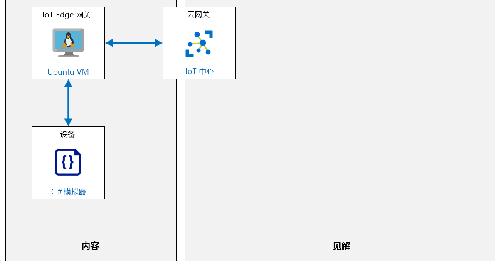

---
lab:
  title: 实验室 14：在受限网络和离线环境中运行 IoT Edge 设备
  module: 'Module 7: Azure IoT Edge Module'
ms.openlocfilehash: 1413872367a9e3f0364b162a1d671fe8d122c469
ms.sourcegitcommit: 06dc1e6caa88a09b1246dd1161f15f619db9c6f8
ms.translationtype: HT
ms.contentlocale: zh-CN
ms.lasthandoff: 02/10/2022
ms.locfileid: "138421534"
---
# <a name="run-an-iot-edge-device-in-restricted-network-and-offline"></a>在受限网络和离线环境中运行 IoT Edge 设备

## <a name="lab-scenario"></a>实验室场景

你在 Contoso 的奶酪包装和运输设施中实施的传送带监控系统正在获得回报。 该系统现在将遥测数据发送到 Azure IoT 中心，以帮助操作人员管理皮带的振动水平，而新的 IoT Edge 设备通过跟踪通过系统的奶酪包装的数量来帮助管理库存。

你的经理希望系统能够灵活应对网络中断，在某些奶酪加工区域这种情况仍然偶有发生。 此外，IT 部门已要求你优化系统以在一天中的特定时间内批量上传所有非关键遥测数据，从而帮助平衡网络使用情况。

你建议将 IoT Edge 配置为在网络中断的情况下支持脱机方案，并将考虑在本地（在设备上）存储来自传感器的遥测，同时将 Edge 设备配置成在给定的时间段内能够定期同步。

将创建以下资源：



## <a name="in-this-lab"></a>本实验室概览

在本实验室中，你将完成以下活动：

* 配置实验室先决条件（所需的 Azure 资源）
* 部署启用 Azure IoT Edge 的 Linux VM
* 设置具有 IoT 子设备的 IoT Edge 父设备
* 将 IoT Edge 设备配置为网关
* 使用 Azure CLI 打开 IoT Edge 网关设备入站端口
* 配置 IoT Edge 网关设备生存时间和消息存储
* 将 IoT 子设备连接到 IoT Edge 网关
* 测试设备连接和脱机支持

## <a name="lab-instructions"></a>实验室说明

### <a name="exercise-1-configure-lab-prerequisites"></a>练习 1：配置实验室先决条件

本实验室假定以下 Azure 资源可用：

| 资源类型 | 资源名称 |
| :-- | :-- |
| Resource Group | rg-az220 |
| IoT 中心 | iot-az220-training-{your-id} |
| IoT Edge 设备 | vm-az220-training-gw0002-{your-id} |
| IoT 设备 | sensor-th-0084 |

若要确保这些资源可用，请完成以下步骤。

1. 在虚拟机环境中，打开 Microsoft Edge 浏览器窗口，然后导航到以下 Web 地址：
 
    +++https://portal.azure.com/#create/Microsoft.Template/uri/https%3A%2F%2Fraw.githubusercontent.com%2FMicrosoftLearning%2FAZ-220-Microsoft-Azure-IoT-Developer%2Fbicep%2FAllfiles%2FARM%2Flab14.json+++

    > 注意：每当看到绿色的“T”符号（例如+++输入此文本+++）时，可以单击关联的文本，信息将键入到虚拟机环境内的当前字段中。

1. 如果系统提示登录到 Azure 门户，请输入将要用于本课程的 Azure 凭据。

    将显示“自定义部署”页。

1. 在“项目详细信息”下的“订阅”下拉列表中，确保你打算在本课程中使用的 Azure 订阅已选中 。

1. 在“资源组”下拉列表中，选择“rg-az220” 。

    > 注意：如果未列出 rg-az220：
    >
    > 1. 在“资源组”下拉列表中，选择“新建”。
    > 1. 在“名称”下，输入 rg-az220 。
    > 1. 单击“确定”  。

1. 在“实例详细信息”下的“区域”下拉列表中，选择离你最近的区域 。

    > 注意：如果 rg-az220 组已存在，则“区域”字段将设置为资源组使用的区域，并且为只读 。

1. 在“你的 ID”字段中，输入在练习 1 中创建的唯一 ID。

1. 在“课程 ID”字段中，输入 az220 。

1. 在“VM 资源组”字段中，输入 rg-az220vm 。

1. 在“管理员用户名”中，输入想要使用的帐户名称。

1. 在“验证类型”字段，选择“密码” 。

1. 在“管理员密码或密钥”字段中，输入要用于管理员帐户的密码。

1. 若要验证模板，请单击“查看并创建”。

1. 验证通过后，单击“创建”。

    将启动部署。

1. 部署完成后，在左侧导航区域中，若要查看模板的任何输出值，请单击“输出”。

    记下输出供稍后使用：
    * connectionString
    * deviceConnectionString
    * gatewayConnectionString
    * devicePrimaryKey
    * publicFQDN
    * publicSSH

现已创建资源。

> **注意**：除了预配 VM 和 IoT Edge，ARM 模板还配置了入站流量的防火墙规则并创建了子设备。

### <a name="exercise-2-download-device-ca-certificate"></a>练习 2：下载设备 CA 证书

在本练习中，你将浏览刚刚创建的 vm-az220-training-gw0002-{your-id} 虚拟机，并将生成的测试证书下载到 Cloud Shell。

#### <a name="task-1-connect-to-the-vm"></a>任务 1：连接到 VM

1. 验证 IoT Edge 虚拟机是否已成功部署。

    可以查看 Azure 门户中的“通知”窗格。

1. 验证“rg-az220vm”资源组是否已固定到 Azure 仪表板。

    要将资源组固定到仪表板，请导航到 Azure 仪表板，然后完成以下操作：

    * 在 Azure 门户菜单上，单击“资源组”。
    * 在“资源组”边栏选项卡上的“名称”下，找到“rg-az220vm”资源组。
    * 在“rg-az220vm”行上，在边栏选项卡右侧单击“…”，然后单击“固定到仪表板”  。

    你可能需要编辑仪表板，以使 RG 磁贴和列出的资源更易于访问。

1. 在 Azure 门户工具栏上，单击“Cloud Shell”

1. 在 Cloud Shell 命令提示符处，粘贴在之前的任务中记下的 ssh 命令（类似于 ssh vmadmin@vm-az220-training-gw0002-dm080321.centralus.cloudapp.azure.com），然后按 Enter  。

1. 当提示“确定要继续连接吗?”时，键入“yes”，然后按 Enter。

    此提示是安全确认，因为用于保护与 VM 的连接的证书为自签名证书。 系统将记住此提示的回答，以便用于后续连接，并且仅在第一次连接时提示。

1. 当提示输入密码时，请输入在预配 Edge 网关 VM 时创建的管理员密码。

1. 连接后，终端将更改为显示 Linux VM 的名称，如下所示。 这会告诉你连接的是哪个 VM。

    ``` bash
    username@vm-az220-training-gw0002-{your-id}:~$
    ```

1. 若要确定虚拟机的公共 IP 地址，请输入以下命令：

    ```bash
    nslookup vm-az220-training-gw0001-{your-id}.centralus.cloudapp.azure.com
    ```

    输出结果会类似于：

    ```bash
    Server:         127.0.0.53
    Address:        127.0.0.53#53

    Non-authoritative answer:
    Name:   vm-az220-training-gw0001-{your-id}}.centralus.cloudapp.azure.com
    Address: 168.61.181.131
    ```

    VM 的公共 IP 是最终的“地址”值，在本例中为 168.61.181.131 。

    > **重要说明**：记下此 IP 地址 - 稍后你将需要它。 每次重启 VM 时，IP 地址通常都会更改。

#### <a name="task-2-explore-the-iot-edge-configuration"></a>任务 2：探索 IoT Edge 配置

首次启动 VM 时，执行了一个已配置 IoT Edge 的脚本。 此脚本执行了以下操作：

* 安装了 aziot-identity-service 包
* 安装了 aziot-edge 包
* 将 config.toml（IoT Edge 的配置文件）的初始版本下载到了 /etc/aziot/config.toml 
* 将执行 ARM 模板时提供的设备连接字符串添加到了 /etc/aziot/config.toml
* 将 [Iot Edge git 存储库](https://github.com/Azure/iotedge.git)克隆到了 /etc/gw-ssl/iotedge
* 创建了目录 /tmp/lab12 并从 /etc/gw-ssl/iotedge 复制了 IoT Edge 网关 SSL 测试工具 
* 在 /tmp/lab12 中生成了测试 SSL 证书并将其复制到了 /etc/aziot 
* 将证书添加到了 /etc/aziot/config.toml
* 将更新后的 /etc/aziot/config.toml 应用到了 IoT Edge 运行时

1. 若要确定已安装的 IoT Edge 版本，请输入以下命令：

    ```bash
    iotedge --version
    ```

    在编写本文时安装的版本为 `iotedge 1.2.3`

1. 若要查看 IoT Edge 配置，请输入以下命令：

    ```bash
    cat /etc/aziot/config.toml
    ```

    输出结果会类似于：

    ```s
    [provisioning]
    source = "manual"
    connection_string = "HostName=iot-az220-training-dm080221.azure-devices.net;DeviceId=sensor-th-0067;SharedAccessKey=2Zv4wruDViwldezt0iNMtO1mA340tM8fnmxgoQ3k0II="

    [agent]
    name = "edgeAgent"
    type = "docker"

    [agent.config]
    image = "mcr.microsoft.com/azureiotedge-agent:1.2"

    [connect]
    workload_uri = "unix:///var/run/iotedge/workload.sock"
    management_uri = "unix:///var/run/iotedge/mgmt.sock"

    [listen]
    workload_uri = "fd://aziot-edged.workload.socket"
    management_uri = "fd://aziot-edged.mgmt.socket"

    [moby_runtime]
    uri = "unix:///var/run/docker.sock"
    network = "azure-iot-edge"

    trust_bundle_cert = 'file:///etc/aziot/azure-iot-test-only.root.ca.cert.pem'

    [edge_ca]
    cert = 'file:///etc/aziot/iot-edge-device-ca-MyEdgeDeviceCA-full-chain.cert.pem'
    pk = 'file:///etc/aziot/iot-edge-device-ca-MyEdgeDeviceCA.key.pem'
    ```

    在设置过程中，更新了 connection_string、trust_bundle_cert、cert 和 pk 值   。

1. 要确保 IoT Edge 守护程序正常运行时，请输入以下命令：

    ```bash
    sudo iotedge system status
    ```

    此命令将显示如下输出：

    ```bash
    System services:
        aziot-edged             Running
        aziot-identityd         Running
        aziot-keyd              Running
        aziot-certd             Running
        aziot-tpmd              Ready

    Use 'iotedge system logs' to check for non-fatal errors.
    Use 'iotedge check' to diagnose connectivity and configuration issues.
    ```

1. 要验证已连接的 IoT Edge 运行时，请运行以下命令：

    ```bash
    sudo iotedge check
    ```

    这将运行许多检查并显示结果。 对于本实验室，请忽略“配置检查”警告/错误。 “连接性检查”应该会成功，并且类似于以下内容：

    ```bash
    Connectivity checks (aziot-identity-service)
    --------------------------------------------
    √ host can connect to and perform TLS handshake with iothub AMQP port - OK
    √ host can connect to and perform TLS handshake with iothub HTTPS / WebSockets port - OK
    √ host can connect to and perform TLS handshake with iothub MQTT port - OK

    Configuration checks
    --------------------
    ** entries removed for legibility **

    Connectivity checks
    -------------------
    √ container on the default network can connect to IoT Hub AMQP port - OK
    √ container on the default network can connect to IoT Hub HTTPS / WebSockets port - OK
    √ container on the default network can connect to IoT Hub MQTT port - OK
    √ container on the IoT Edge module network can connect to IoT Hub AMQP port - OK
    √ container on the IoT Edge module network can connect to IoT Hub HTTPS / WebSockets port - OK
    √ container on the IoT Edge module network can connect to IoT Hub MQTT port - OK
    ```

    如果连接失败，请仔细检查 config.toml 中的连接字符串值。

1. 若要退出 VM shell，请输入以下命令：

    ```bash
    exit
    ```

    应关闭与 VM 的连接，并应显示 Cloud Shell 提示。

#### <a name="task-3-download-ssl-certs"></a>任务 3：下载 SSL 证书

接下来，你需要从 vm-az220-training-gw0002-{your-id} 虚拟机下载 MyEdgeDeviceCA 证书，以便使用该证书来加密叶设备和 IoT Edge 网关之间的通信 。

1. 在 Cloud Shell 命令提示符处，输入以下命令，从 vm-az220-training-gw0002-{your-id} 虚拟机下载 /tmp/lab12 目录到 Cloud Shell 存储  ：

    ```bash
    mkdir lab12
    scp -r -p <username>@<FQDN>:/tmp/lab12 .
    ```

    > **注意**：将 <username> 占位符替换为 VM 管理员用户的用户名，并将 <FQDN> 占位符替换为 VM 的完全限定的域名 。 如有必要，请参阅你用来打开 SSH 会话的命令。
    > `scp -r -p vmadmin@vm-az220-training-edge0001-dm080321.centralus.cloudapp.azure.com:/tmp/lab12 .`

1. 出现提示时，请输入 VM 的管理员密码。

    执行该命令后，它会通过 SSH 将带有证书和密钥文件的 /tmp/lab12 目录副本下载到 Cloud Shell 存储中。

1. 若要验证是否已下载文件，请输入以下命令：

    ```bash
    cd lab12
    ls
    ```

    你会看到列出的以下文件：

    ```bash
    certGen.sh  csr        index.txt.attr      index.txt.old  openssl_root_ca.cnf  serial
    certs       index.txt  index.txt.attr.old  newcerts       private              serial.old
    ```

    将文件从 vm-az220-training-gw0002-{your-id} 虚拟机复制到 Cloud Shell 存储后，你将可以根据需要将任一 IoT Edge 设备证书和密钥文件轻松下载到本地计算机。 可以使用 `download <filename>` 命令从 Cloud Shell 下载这些文件。 你将稍后在实验室中执行此操作。

1. 要下载根证书供稍后在此实验室中使用，请输入以下命令：

    ```bashd
    download ~/lab12/
    ```

### <a name="exercise-3-configure-iot-edge-device-time-to-live-and-message-storage"></a>练习 3：配置 IoT Edge 设备生存时间和消息存储

在针对扩展的脱机方案配置 IoT Edge 设备时，需要指定你可脱机的受支持的时间段（通常称为“生存时间”），并指定本地存储设置。

生存时间 (TTL) 的默认值为 `7200`（7200 秒，即 2 小时）。 这已足够进行快速中断，但在某些情况下，两个小时可能不够长，或者设备或解决方案需要在脱机模式下更长时间运行。 当出现长时间断开连接的情况时，为使解决方案能够执行而不会丢失遥测数据，你可以将 IoT Edge 中心模块的 TTL 属性值配置为 1,209,600 秒（2 周 TTL 周期）。

IoT Edge 中心模块 (`$edgeHub`) 用于协调 Azure IoT 服务与网关设备上运行的 IoT Edge 中心之间的通信。 在模块孪生的所需属性中，`storeAndForwardConfiguration.timeToLiveSecs` 属性会以秒为单位指定当处于与路由终结点断开的状态时（例如 Azure IoT 中心服务），IoT Edge 中心能够保留消息的时间。 可在单个设备或大规模部署期间，在特定设备的部署清单中指定 Edge 中心的 `timeToLiveSecs` 属性。

当处于断开/脱机状态时，IoT Edge 设备将自动存储消息。 可以使用 `HostConfig` 对象配置存储位置。

在本练习中，你将使用适用于 Azure IoT 中心的 Azure 门户用户界面来修改单个 IoT Edge 网关设备上 Edge 中心 `$edgeHub` 模块的 `timeToLiveSecs` 属性。 还将介绍如何在 IoT Edge 设备上配置要在其中存储消息的存储位置。

#### <a name="task-1-configure-the-edgehub-module-twin"></a>任务 1：配置 $edgeHub 模块孪生

1. 如有必要，请使用 Azure 帐户凭据登录到 Azure 门户。

    如果有多个 Azure 帐户，请确保使用与本课程要使用的订阅绑定的帐户登录。

1. 在 rg-az220 资源组磁贴上，单击“iot-az220-training-{your-id}”。

1. 在“IoT 中心”边栏选项卡左侧菜单的“设备管理”下，单击“IoT Edge” 。

    通过该窗格，可以管理连接到 IoT 中心的 IoT Edge 设备。

1. 在“设备 ID”下，单击“vm-az220-training-gw0002-{your-id}”。

1. 在“模组”下，单击“$edgeHub”。

    “Edge 中心”模块的“模块标识详细信息”边栏选项卡可为 IoT Edge 设备提供模块标识孪生和其他资源的访问权限。

1. 在“模块标识详细信息”边栏选项卡，单击“模块身份孪生”。

    该边栏选项卡包含在编辑器窗格中显示为 JSON 的 `vm-az220-training-gw0002-{your-id}/$edgeHub` 的模块标识孪生。

1. 花些时间查看 $edgeHub 模块标识孪生的内容。

    注意，由于这是一个新设备，因此所需的属性基本上为空。

1. 关闭“模块标识孪生”边栏选项卡。

1. 导航回到 vm-az220-training-gw0002-{your-id} 边栏选项卡。

1. 在边栏选项卡顶部，单击“设置模块”。

    借助“在设备上设置模块”边栏选项卡，你可以创建和配置部署到此 IoT Edge 设备的 IoT Edge 模块。

1. 在“设置模块”边栏选项卡的“IoT Edge 模块”下，单击“运行时设置”。

1. 在“运行时设置”窗格中，选择“Edge 中心”选项卡 。

1. 找到“存储和转发配置 - 生存时间(秒)”字段。

1. 在“存储和转发配置 - 生存时间(秒)”文本框中，输入 1209600

    这指定了 IoT Edge 设备的消息生存时间值为“2 周”（即最长时间）。

    > **注意**：在为 Edge 中心 (`$edgeHub`) 模块配置“消息生存时间”(TTL) 时，需要考虑以下几点。 断开 IoT Edge 设备的连接时，消息会存储在本地设备上。 你需要计算在 TTL 期间将存储的数据量，并确保设备上有足够的存储空间可用于存储这些数据。 若要避免丢失重要数据，配置的存储和 TTL 量需要满足解决方案要求。
    >
    > 如果设备的存储空间不足，则需要配置较短的 TTL。 如果消息在生存时间达到 TTL 时间限制后尚未发送到 Azure IoT 中心，则会将其删除。

    当处于断开/脱机状态时，IoT Edge 设备将自动存储消息。 可以使用 `HostConfig` 对象配置存储位置。

1. 找到“环境变量”区域。

    你需要添加一个新的环境变量来完成消息存储位置的配置。

1. 在“环境变量”下的“名称”文本框中，输入 storageFolder

1. 在“环境变量”下的“值”文本框中，输入 **/iotedge/storage/**

1. 找到“容器创建选项”字段。

    请注意，此字段包含可以配置的 JSON 对象 `HostConfig`。 你将创建一个 `HostConfig` 属性和一个环境变量来为 Edge 设备配置存储位置。

1. 在 `HostConfig` 对象中，在 `PortBindings` 属性的右方括号下添加以下 `Binds` 属性：

    ```json
    "Binds": [
        "/etc/aziot/storage/:/iotedge/storage/"
    ]
    ```

    > **注意**：请务必将 `PortBindings` 属性与 `Binds` 属性用逗号隔开。

    在“创建选项”文本框中生成的 JSON 应如下所示：

    ```json
    {
        "HostConfig": {
            "PortBindings": {
                "443/tcp": [
                {
                    "HostPort": "443"
                }
                ],
                "5671/tcp": [
                {
                    "HostPort": "5671"
                }
                ],
                "8883/tcp": [
                {
                    "HostPort": "8883"
                }
                ]
            },
            "Binds": [
                "/etc/aziot/storage/:/iotedge/storage/"
            ]
        }
    }
    ```

    此 `Binds` 值将 Edge 中心模块的 Docker 容器中的 `/iotedge/storage/` 目录配置为映射到物理 IoT Edge 设备上的 `/etc/aziot/storage/` 主机系统目录。

    该值采用 `<HostStoragePath>:<ModuleStoragePath>` 的格式。 `<HostStoragePath>` 值为 IoT Edge 设备上的主机目录位置。 `<ModuleStoragePath>` 为容器内可用的模块存储路径。 这两个值都必须指定绝对路径。

1. 在“运行时设置”窗格底部，单击“应用” 。

1. 在“在设备上设置模块”边栏选项卡上，单击“查看 + 创建”。

1. 花些时间查看部署清单的内容。

    在部署清单中找到你的更新。 你需要在 `$edgeAgent` 和 `$edgeHub` 下查找它们。

1. 单击边栏选项卡底部的“创建” 。

    保存更改后，将通知 **IoT Edge 设备** 有关模块配置的更改，并且将在设备上对新设置进行相应的重新配置。

    将更改传递到 Azure IoT Edge 设备后，它将使用新配置重启 edgeHub 模块。

    >**注意**：在“模块”列表中，$edgeHub 模块的“运行时状态”将显示错误  。

1. 要查看错误消息，请单击“错误”。

    “故障排除”页将显示错误日志。 它将包含类似于以下内容的异常：

    ```log
    Unhandled exception. System.AggregateException: One or more errors occurred. (Access to the path '/iotedge/storage/edgeHub' is denied.)
    ```

    下一个任务将解决此错误。

#### <a name="task-2-update-directory-permissions"></a>任务 2：更新目录权限

在继续之前，必须确保 IoT Edge 中心模块的用户配置文件对 /etc/aziot/storage/ 目录具有所需的读取、写入和执行权限。

1. 在 Azure 门户工具栏上，单击“Cloud Shell”

1. 在 Cloud Shell 命令提示符处，粘贴在之前的任务中记下的 ssh 命令（类似于 ssh vmadmin@vm-az220-training-gw0002-dm080321.centralus.cloudapp.azure.com），然后按 Enter  。

1. 当提示“确定要继续连接吗?”时，键入“yes”，然后按 Enter。

    此提示是安全确认，因为用于保护与 VM 的连接的证书为自签名证书。 系统将记住此提示的回答，以便用于后续连接，并且仅在第一次连接时提示。

1. 当提示输入密码时，请输入在预配 Edge 网关 VM 时创建的管理员密码。

1. 连接后，终端将更改为显示 Linux VM 的名称，如下所示。 这会告诉你连接的是哪个 VM。

    ``` bash
    username@vm-az220-training-gw0002-{your-id}:~$
    ```

1. 若要查看正在运行的 IoT Edge 模块，请输入以下命令：

    ```bash
    iotedge list
    ```

1. 花点时间查看 `iotedge list` 命令的输出：

    你应该会看到 *edgeHub* 启动失败：

    ```text
    NAME             STATUS           DESCRIPTION                 CONFIG
    edgeAgent        running          Up 4 seconds                mcr.microsoft.com/azureiotedge-agent:1.1
    edgeHub          failed           Failed (139) 0 seconds ago  mcr.microsoft.com/azureiotedge-hub:1.1
    ```

    这是由于 edgeHub 进程没有写入 /etc/aziot/storage/ 目录的权限。

1. 若要确认目录权限问题，请输入以下命令：

    ```bash
    iotedge logs edgeHub
    ```

    终端将输出当前日志；如果滚动浏览日志，你将看到如下所示的相关条目：

    ```text
    Unhandled Exception: System.AggregateException: One or more errors occurred. (Access to the path '/iotedge/storage/edgeHub' is denied.) ---> System.UnauthorizedAccessException: Access to the path '/iotedge/storage/edgeHub' is denied. ---> System.IO.IOException: Permission denied
    ```

1. 若要更新目录权限，请输入以下命令：

    ```sh
    sudo chown $( whoami ):iotedge /etc/aziot/storage/
    sudo chmod 775 /etc/aziot/storage/
    ```

    第一个命令将目录的所有者设置为当前用户，将拥有的用户组设置为 iotedge。 第二个命令启用对当前用户及 **iotedge** 组成员的完全访问权限。 这将确保 edgeHub 模块能够在 /etc/iotedge/storage/ 目录中创建目录和文件。

    > 注意：如果看到一条错误消息，指出“chown: 无法访问 '/etc/iotedge/storage/':没有此类文件或目录”，请使用以下命令创建目录，然后重新运行上述命令：

    ```sh
    sudo mkdir /etc/iotedge/storage
    ```

1. 要重启 edgeHub 模块，然后验证它是否已启动，请输入以下命令：

    ```bash
    iotedge restart edgeHub
    iotedge list
    ```

    >**注意**：重启的模块名称区分大小写 - edgeHub

    你应该看到 *edgeHub* 模块现在正在运行：

    ```text
    NAME             STATUS           DESCRIPTION      CONFIG
    edgeAgent        running          Up 13 minutes    mcr.microsoft.com/azureiotedge-agent:1.1
    edgeHub          running          Up 6 seconds     mcr.microsoft.com/azureiotedge-hub:1.1
    ```

现在你可将 IoT 设备（子设备/叶设备）连接到此 IoT Edge 网关设备。

### <a name="exercise-4-connect-child-iot-device-to-iot-edge-gateway"></a>练习 4：将 IoT 子设备连接到 IoT Edge 网关

使用对称密钥向 IoT 中心对常规 IoT 设备进行身份验证的过程也适用于下游（或子/叶）设备。 唯一的区别是，你需要向网关设备添加指针以路由连接，或者在脱机情况下，代表 IoT 中心处理身份验证。

> **注意**：你将使用你之前在实验室中保存的连接字符串值 sensor-th-0084。 如果需要连接字符串的新副本，可以从 Azure 门户内的 Azure IoT 中心访问它。 打开 IoT 中心的“IoT 设备”窗格，单击 sensor-th-0084，复制“主连接字符串”，然后将其保存到文本文件。

#### <a name="task-1-create-hosts-file-entry"></a>任务 1：创建 hosts 文件条目

在本实验室的早期版本中，FQDN 将用作设备连接字符串中 GatewayHostName 的值，但由当前版本的测试脚本生成的测试 x509 证书不再支持此功能。 而是仅使用主机名，并且必须在本地计算机的 hosts 文件中创建一个条目，以将主机名解析为 IP 地址。 完成以下步骤，将所需条目添加到 hosts 文件。

1. 打开 Visual Studio Code。

1. 在“文件”菜单中，单击“打开文件”。

1. 导航到以下文件夹（c:\\Windows\\System32\\Drivers\\etc\\ 文件），然后打开 hosts 文件 。

    > 注意：hosts 文件没有扩展名 。

1. 将以下行添加到 hosts 文件，后跟一个空行：

    ```text
    {VM Public IP Address} vm-az220-training-gw0002-{your-id}
    {blank line}
    ```

    例如，

    ```text
    168.61.181.131 vm-az220-training-gw0002-dm090821

    ```

1. 保存文件 - 当提示保存失败时，单击“以管理员身份重试...”，然后在“用户帐户控制”对话框中，单击“是”  。

本地计算机现在可以将 VM 名称解析为相应的 IP 地址。

#### <a name="task-1-configure-device-app"></a>任务 1：配置设备应用

在此任务中，你将配置下游 IoT 设备（子设备或叶设备），以使用对称密钥连接到 IoT 中心。 设备将配置为使用包含对称密钥（除了父级 IoT Edge 设备的网关主机名）的连接字符串连接到 IoT 中心和父级 IoT Edge 设备。

1. 打开 Windows“文件资源管理器”应用，然后导航到“下载”文件夹。

    你的“下载”文件夹应该包含 X.509 证书文件，该证书文件是在配置 IoT Edge 网关时下载的。 需要将此证书文件复制到 IoT 设备应用的根目录。

1. 在“下载”文件夹中，右键单击 azure-iot-test-only.root.ca.cert.pem，然后单击“复制”。

    > **注意**：如果你的 Downloads 文件夹中已经有 azure-iot-test-only.root.ca.cert.pem 文件，那么你需要的文件可命名为 azure-iot-test-only.root.ca.cert (1).pem。 一旦将它添加到目录文件夹后，就需要将其重命名为 azure-iot-test-only.root.ca.cert.pem。

    该文件是你下载的 X.509 证书文件，将被添加到 lab 14 /Starter/ChildIoTDevice 目录（IoT 子设备的源代码所在的目录）。

1. 导航到实验室 14 的 Starter 文件夹，然后将复制的文件粘贴到 ChildIoTDevice 文件夹。

1. 确保复制的证书文件名为 azure-iot-test-only.root.ca.cert.pem

    如果你的 Downloads 文件夹中已经有 azure-iot-test-only.root.ca.cert.pem 文件，那么此文件可能已经名为 azure-iot-test-only.root.ca.cert (1).pem。

1. 打开“Visual Studio Code”的新实例。

1. 在“文件”菜单上，单击“打开文件夹”。

1. 在“打开文件夹”对话框中导航到实验室 14 “初学者”文件夹，单击 **ChildIoTDevice**，然后单击“选择文件夹” 。

    你现在应会看到“资源管理器”窗格中列出的项目文件。

1. 在 Visual Studio Code 的“资源管理器”窗格中，单击“Program.cs”。

1. 在 Program.cs 文件中，找到 connectionString 变量的声明。

1. 将 IoT 设备 sensor-th-0084 的占位符值替换为主连接字符串。

1. 将分配的 connectionString 值附加到 GatewayHostName 属性，然后将 GatewayHostName 的值设置为 IoT Edge 网关设备的完整 DNS 名称 。

    Edge 网关设备的完整 DNS 名称是在设备 ID（即 vm-az220-training-gw0002-{your-id}）后附加指定的区域和 Azure 商业云域名，例如：.westus2.cloudapp.azure.com 。

    完整的连接字符串值应为以下格式：

    ```text
    HostName=<IoT-Hub-Name>.azure-devices.net;DeviceId=sensor-th-0072;SharedAccessKey=<Primary-Key-for-IoT-Device>;GatewayHostName=<DNS-Name-for-IoT-Edge-Device>
    ```

    请务必使用适当的值替换上述占位符：

    * **\<IoT-Hub-Name\>** ：Azure IoT 中心的名称。
    * **\<Primary-Key-for-IoT-Device\>** ：Azure IoT 中心中 sensor-th-0084 IoT 设备的主键。
    * **\<DNS-Name-for-IoT-Edge-Device\>** ：vm-az220-training-gw0002-{your-id} Edge 设备的主机名。

    connectionString 变量分配代码应如下所示：

    ```csharp
    private readonly static string connectionString = "HostName=iot-az220-training-1119.azure-devices.net;DeviceId=sensor-th-0084;SharedAccessKey=ygNT/WqWs2d8AbVD9NAlxcoSS2rr628fI7YLPzmBdgE=;GatewayHostName=vm-az220-training-gw0002-{your-id}";
    ```

1. 在“文件”菜单上，单击“保存”。

1. 在“视图”菜单上，单击“终端”。

    确保“终端”命令提示符列出 `/Starter/ChildIoTDevice` 目录。

1. 若要生成并运行 **ChildIoTDevice** 模拟设备，请输入以下命令：

    ```cmd/sh
    dotnet run
    ```

    > **注意**：当应用在本地计算机上安装 X.509 证书时（以便它可以使用该证书向 IoT Edge 网关进行身份验证），你可能会看到一个弹出窗口，询问是否要安装该证书。 请单击“是”允许应用安装该证书。

1. 注意终端中显示的输出。

    模拟设备运行后，控制台输出将显示发送到 Azure IoT Edge 网关的事件。

    终端输出类似于以下内容：

    ```cmd/sh
    IoT Hub C# Simulated Cave Device. Ctrl-C to exit.

    User configured CA certificate path: azure-iot-test-only.root.ca.cert.pem
    Attempting to install CA certificate: azure-iot-test-only.root.ca.cert.pem
    Successfully added certificate: azure-iot-test-only.root.ca.cert.pem
    11/27/2019 4:18:26 AM > Sending message: {"temperature":21.768769073192388,"humidity":79.89793652663843}
    11/27/2019 4:18:27 AM > Sending message: {"temperature":28.317862208149332,"humidity":73.60970909409677}
    11/27/2019 4:18:28 AM > Sending message: {"temperature":25.552859350830715,"humidity":72.7897707153064}
    11/27/2019 4:18:29 AM > Sending message: {"temperature":32.81164186439088,"humidity":72.6606041624493}
    ```

1. 让模拟设备保持运行状态，同时继续进行下一个练习。

#### <a name="task-2-test-device-connectivity-and-offline-support"></a>任务 2：测试设备连接和脱机支持

在此任务中，你将监视来自 sensor-th-0084 的事件，这些事件通过 IoT Edge 透明网关 vm-az220-training-gw0002-{your-id} 发送到 Azure IoT 中心 。 然后，你将中断 vm-az220-training-gw0002-{your-id} 和 Azure IoT 中心之间的连接，以查看仍从 IoT 子设备发送到 IoT Edge 网关的遥测。 之后，你将恢复与 Azure IoT 中心的连接，并监视 IoT Edge 网关继续将遥测发送到 Azure IoT 中心。

1. 如有必要，请使用 Azure 帐户凭据登录到 Azure 门户。

    如果有多个 Azure 帐户，请确保使用与本课程要使用的订阅绑定的帐户登录。

1. 在 Azure 门户工具栏上，单击“Cloud Shell”。

    确保将环境下拉列表设置为“Bash”。

1. 在 Cloud Shell 命令提示符处，要开始监视 Azure IoT 中心接收的事件，请输入以下命令：

    ```cmd/sh
    az iot hub monitor-events --hub-name iot-az220-training-{your-id}
    ```

    确保使用你的 Azure IoT 中心实例唯一后缀替换 `{your-id}` 占位符。

1. 注意正被发送到 Azure IoT 中心的 sensor-th-0084 的遥测。

    请记住，sensor-th-0084 模拟设备应用程序配置为将遥测发送到 IoT Edge 透明网关虚拟机 vm-az220-training-gw0002-{your-id}，后者随后再将遥测发送到 Azure IoT 中心。

    Cloud Shell 应该开始显示类似于以下内容的事件消息：

    ```text
    Starting event monitor, use ctrl-c to stop...
    {
        "event": {
            "origin": "sensor-th-0072",
            "module": "",
            "interface": "",
            "component": "",
            "payload": "{\"temperature\":29.995470051651573,\"humidity\":70.47896838303608}"
        }
    }
    {
        "event": {
            "origin": "sensor-th-0072",
            "module": "",
            "interface": "",
            "component": "",
            "payload": "{\"temperature\":28.459910635584922,\"humidity\":60.49697355390386}"
        }
    }
    ```

    > **注意**：接下来，你需要测试脱机功能。 为此，你需要使 vm-az220-training-gw0002-{your-id} 设备脱机。 由于这是在 Azure 中运行的虚拟机，因此可以通过向 VM 的网络安全组添加出站规则对此进行模拟。

#### <a name="task3-add-rule-to-block-traffic"></a>任务 3：添加规则以阻止流量

1. 在 Azure 门户中，导航到仪表板，然后找到 rg-az220vm 资源组磁贴。

1. 在资源列表中，若要打开 vm-az220-training-gw0002-{your-id} 虚拟机的网络安全组，请单击 nsg-vm-az220-training-gw0002-{your-id}  。

1. 在“网络安全组”边栏选项卡，在“设置”下的左侧导航窗格中，单击“出站安全规则”。

1. 在边栏选项卡顶部，单击“+ 添加”。

1. 在“添加出站安全规则”窗格上，设置以下字段值：

    * 目标端口范围：\*
    * 操作：Deny
    * 优先级：100
    * 名称：DenyAll

    “目标端口范围”为 \* 时会将规则应用于所有端口 。

1. 在边栏选项卡底部，单击“添加”。

1. 返回到 Azure 门户中的 **Cloud Shell**。

1. 如果 `az iot hub monitor-events` 命令仍在运行，请按 Ctrl+C 结束该命令。

1. 在 Cloud Shell 命令提示符处，若要使用 `ssh` 连接到 vm-az220-training-gw0002-{your-id} VM，请输入以下命令：

    ```sh
    ssh <username>@<ipaddress>
    ```

    确保使用 `ssh` 命令所需的值替换占位符：

    | 占位符 | 要替换成的值 |
    | :--- | :--- |
    | `<username>` | **IoTEdgeGateaway** 虚拟机的管理员 **用户名**。 这应该是 **vmadmin**。
    | `<ipaddress>` | vm-az220-training-gw0002-{your-id} 虚拟机的公共 IP 地址。

1. 出现提示时，输入 vm-az220-training-gw0002-{your-id} 的管理员密码。

    通过 `ssh` 连接到 vm-az220-training-gw0002-{your-id} VM 后，命令提示符将更新。

1. 要重设 IoT Edge 运行时，请输入以下命令：

    ```sh
    sudo iotedge system restart
    ```

    这将迫使 IoT Edge 运行时与 Azure IoT 中心服务断开连接，然后再尝试重新连接。

1. 要验证 *edgeHub* 模块已正确重启，请输入以下命令：

    ```bash
    iotedge list
    ```

    如果 edgeHub 模块无法成功重启，请输入以下命令重试：

    ```bash
    iotedge restart edgeHub
    iotedge list
    ```

1. 若要结束与 vm-az220-training-gw0002-{your-id} 的 `ssh` 会话，请输入以下命令：

    ```cmd/sh
    exit
    ```

1. 在 Cloud Shell 命令提示符下，若要开始监视 Azure IoT 中心正在接收的事件，请输入以下命令

    ```cmd/sh
    az iot hub monitor-events --hub-name iot-az220-training-{your-id}
    ```

    确保使用你的 Azure IoT 中心实例唯一后缀替换 `{your-id}` 占位符。

1. 请注意，Azure IoT 中心不再接收任何事件。

1. 切换到 Visual Studio Code 窗口。

1. 打开正在运行 sensor-th-0084 模拟设备应用程序的终端，注意其仍在向 vm-az220-training-gw0002-{your-id} 发送设备遥测。

    此时，vm-az220-training-gw0002-{your-id} 已与 Azure IoT 中心断开连接。 它将继续对 sensor-th-0084 发起的连接进行身份验证，并从子设备接收设备遥测。 在此期间，IoT Edge 网关将按配置方式将来自子设备的事件遥测数据存储在 IoT Edge 网关设备存储上。

1. 切换到“Azure 门户”窗口。

1. 回到 vm-az220-training-gw0002-{your-id} 的“网络安全组”边栏选项卡。

1. 在左侧导航菜单中的“设置”下，单击“出站安全规则”。

1. 在“出站安全规则”窗格中，单击“DenyAll”。

1. 在“DenyAll”窗格中，要从 NSG 删除此拒绝规则，单击“删除”。

1. 在“删除安全规则”提示中，单击“是”。

    一旦 IoT Edge 透明网关 vm-az220-training-gw0002-{your-id}能够恢复与 Azure IoT 中心的连接，它就将同步来自所有已连接子设备的事件遥测。 这包括在断开连接时无法发送的已保存遥测，并且所有遥测仍在发送到网关。

    > **注意**：IoT Edge 网关设备可能需要几分钟时间才能重新连接到 Azure IoT 中心并继续发送遥测数据。 等待几分钟后，你将再次在 `az iot hub monitor-events` 命令输出中看到事件显示。

在本实验室中，我们演示了 Azure IoT Edge 网关可以利用本地存储来保留由于 IoT 中心连接中断而无法发送的消息。 重新建立连接后，我们看到消息随后被发送。

> **注意**：完成实验室后，请在终端中按下 CTRL+C，以确保退出设备模拟应用程序。
