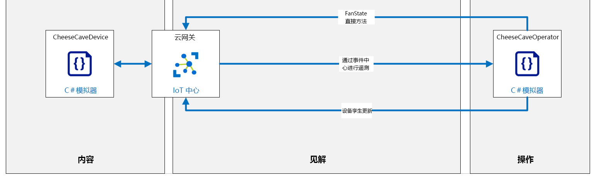

---
lab:
  title: 实验室 15：使用 Azure IoT 中心远程监视和控制设备
  module: 'Module 8: Device Management'
ms.openlocfilehash: f0ebccb4b7c7b415397ba0b36ddbb7c96e59717c
ms.sourcegitcommit: eec2943250f1cd1ad2c5202ecbb9c37af71e8961
ms.translationtype: HT
ms.contentlocale: zh-CN
ms.lasthandoff: 03/24/2022
ms.locfileid: "140872799"
---
# <a name="remotely-monitor-and-control-devices-with-azure-iot-hub"></a>使用 Azure IoT 中心远程监视和控制设备

## <a name="lab-scenario"></a>实验室场景

Contoso 为其屡获殊荣的奶酪产品感到自豪，并在整个制造过程中都保持最佳的温度和湿度，但老化过程中的条件始终受到特别关注。

近年来，Contoso 使用环境传感器来记录其天然奶酪储藏室中发生老化的条件，并使用该数据来识别接近完美的环境。 来自最成功（也称为获奖产品）位置的数据表明，老化奶酪的理想温度约为 50 华氏度 +/- 5 度（10 摄氏度 +/- 2.8 度）。 以最大饱和度的百分比衡量的理想湿度值约为 85% +/- 10%。

这些理想的温度和湿度值适用于大多数类型的奶酪。 但是，对于特别坚硬或特别软的奶酪，需要做出较小的调整。 还必须在老化过程中的关键时间/阶段调整环境条件，以实现特定的结果，例如奶酪皮的理想条件。

Contoso 非常幸运，可以经营奶酪储藏室（在某些地理区域内），这些奶酪储藏室几乎全年都可以自然保持理想的条件。 但是，即使在这些位置，老化过程中的环境管理也至关重要。 同样，天然储藏室通常具有许多不同的洞室，每个洞室的环境可能略有不同。 各种奶酪放置在符合其特定要求的洞室（区域）中。 为了将环境条件保持在期望的限制内，Contoso 使用了同时控制温度和湿度的空气处理/调节系统。

当前，操作员监视储藏室设施每个区域内的环境条件，并在需要保持所需温度和湿度时调整空气处理系统设置。 操作员能够每隔 4 小时访问每个区域并检查环境条件。 在白天高温和夜间低温之间温度急剧变化的地方，条件可能会超出所需的限制。

Contoso 已责成你实现自动化系统，以使储藏室环境保持在控制范围内。

在本实验室中，你将为实现  IoT 设备的奶酪储藏室监控系统进行原型设计。 每个设备都配备了温度和湿度传感器，并连接到空气处理系统，该系统控制设备所在区域的温度和湿度。

### <a name="simplified-lab-conditions"></a>简化的实验室条件

遥测输出的频率是生产解决方案中的重要考虑因素。 制冷单元中的温度传感器可能只需要每分钟报告一次，而飞机上的加速度传感器可能需要每秒报告十次。 在某些情况下，必须发送遥测的频率取决于当前条件。 例如，如果我们的奶酪储藏室环境温度总是在夜间快速下降，日落前两小时会开始更频繁地进行传感器读数。 当然，更改遥测频率的要求不需要是可预测模式的一部分，让我们更改 IoT 设备设置的事件可能是不可预测的。

为了保持在本实验室的简单易行，我们将做出以下假设：

* 设备将每隔几秒向 IoT 中心发送遥测数据（温度和湿度值）。 虽然这种频率对于奶酪储藏室来说是不现实的，但当我们需要经常看到变化时，而不是每 15 分钟一次，它对于实验室环境来说非常重要。
* 空气处理系统是一个风扇，可以处于以下三种状态之一：开、关或失败。
  * 风扇初始化为“关闭”状态。
  * 使用 IoT 设备上的直接方法来控制（打开/关闭）风扇的电源。
  * 设备孪生所需属性值用于设置风扇的所需状态。 所需属性值将覆盖风扇/设备的任何默认设置。
  * 可以通过打开/关闭风扇来控制温度（打开风扇会降低温度）

本实验中的编码分为三个部分：发送和接收遥测，调用和运行直接方法，设置和读取设备孪生属性。

你将首先编写两个应用：一个用于发送遥测的设备，另一个用于后端服务（将在云中运行）以接收遥测。

将创建以下资源：



## <a name="in-this-lab"></a>本实验室概览

在本实验室中，你将完成以下活动：

* 配置实验室先决条件（所需的 Azure 资源）
* 创建模拟设备应用以将设备遥测发送到 IoT 中心
* 创建后端服务应用以侦听遥测数据
* 实现直接方法，以将设置传达给 IoT 设备
* 实现设备孪生功能，以管理 IoT 设备属性

## <a name="lab-instructions"></a>实验室说明

### <a name="exercise-1-configure-lab-prerequisites"></a>练习 1：配置实验室先决条件

本实验室假定以下 Azure 资源可用：

| 资源类型 | 资源名称 |
| :-- | :-- |
| 资源组 | rg-az220 |
| IoT 中心 | iot-az220-training-{your-id} |
| IoT 设备 | sensor-th-0055 |

若要确保这些资源可用，请完成以下步骤。

1. 在虚拟机环境中，打开 Microsoft Edge 浏览器窗口，然后导航到以下 Web 地址：
 
    +++https://portal.azure.com/#create/Microsoft.Template/uri/https%3A%2F%2Fraw.githubusercontent.com%2FMicrosoftLearning%2FAZ-220-Microsoft-Azure-IoT-Developer%2Fmaster%2FAllfiles%2FARM%2Flab15.json+++

    > 注意：每当看到绿色的“T”符号（例如 +++输入此文本+++）时，可以单击关联的文本，信息将键入到虚拟机环境内的当前字段中。

1. 如果系统提示登录到 Azure 门户，请输入你在本课程中使用的 Azure 凭据。

    将显示“自定义部署”页。

1. 在“项目详细信息”下的“订阅”下拉列表中，确保你打算在本课程中使用的 Azure 订阅已选中 。

1. 在“资源组”下拉列表中，选择“rg-az220” 。

    > 注意：如果未列出 rg-az220：
    >
    > 1. 在“资源组”下拉列表中，选择“新建”。
    > 1. 在“名称”下，输入 rg-az220 。
    > 1. 单击“确定”  。

1. 在“实例详细信息”下的“区域”下拉列表中，选择离你最近的区域 。

    > 注意：如果 rg-az220 组已存在，则“区域”字段将设置为资源组使用的区域，并且为只读 。

1. 在“你的 ID”字段中，输入在练习 1 中创建的唯一 ID。

1. 在“课程 ID”字段中，输入 az220 。

1. 若要验证模板，请单击“查看和创建”。

1. 验证通过后，单击“创建”。

    将启动部署。

1. 部署完成后，在左侧导航区域中，若要查看模板的任何输出值，请单击“输出”。

    记下输出供稍后使用：

    * deviceConnectionString
    * devicePrimaryKey
    * eventHubsCompatibleEndpoint
    * eventHubsCompatiblePath
    * iotHubSasKey
    * serviceConnectionString

现已创建资源。

### <a name="exercise-2-review-code-to-send-and-receive-telemetry"></a>练习 2：查看代码以发送和接收遥测

在本练习中，你将完成将遥测发送到 IoT 中心的模拟设备应用（适用于 sensor-th-0055 设备）。

#### <a name="task-1-open-a-simulated-device-that-generates-telemetry"></a>任务 1：打开生成遥测的模拟设备

1. 打开 **Visual Studio Code**。

1. 在“文件”菜单上，单击“打开文件夹”

1. 在“打开文件夹”对话框中，导航到实验室 15 的 Starter 文件夹。

    在“实验室 3: 设置开发环境”中，你可以通过下载 ZIP 文件并从本地提取内容来克隆包含实验室资源的 GitHub 存储库。 提取的文件夹结构包括以下文件夹路径：

    * Allfiles
        * 实验室
            * 15-使用 Azure IoT 中心远程监视和控制设备
                * 初学者
                    * CheeseCaveDevice
                    * CheeseCaveOperator

1. 单击“cheesecavedevice”，然后单击“选择文件夹”。

    你应该会在 Visual Studio Code 的资源管理器窗格中看到以下文件：

    * cheesecavedevice.csproj
    * Program.cs

1. 若要打开代码文件，请单击“Program.cs”。

    粗略地看上一眼即可发现，此应用程序与你在之前的实验中使用过的模拟设备应用程序非常相似。 此版本使用对称密钥身份验证，将遥测和日志记录消息发送到 IoT 中心，并且具有更复杂的传感器实现。

1. 在“终端”菜单上，单击“新终端”。

    注意命令提示符中指示的目录路径。 你无需在上一个实验室项目的文件夹结构中开始构建此项目。

1. 在终端命令提示符下，请输入以下命令以验证应用程序版本：

    ```bash
    dotnet build
    ```

    输出结果会类似于：

    ```text
    > dotnet build
    Microsoft (R) Build Engine version 16.5.0+d4cbfca49 for .NET Core
    Copyright (C) Microsoft Corporation. All rights reserved.

    Restore completed in 39.27 ms for D:\Az220-Code\AllFiles\Labs\15-Remotely monitor and control devices with Azure IoT Hub\Starter\CheeseCaveDevice\CheeseCaveDevice.csproj.
    CheeseCaveDevice -> D:\Az220-Code\AllFiles\Labs\15-Remotely monitor and control devices with Azure IoT Hub\Starter\CheeseCaveDevice\bin\Debug\netcoreapp3.1\CheeseCaveDevice.dll

    Build succeeded.
        0 Warning(s)
        0 Error(s)

    Time Elapsed 00:00:01.16
    ```

在下一个任务中，你将配置连接字符串并查看应用程序。

#### <a name="task-2-configure-connection-and-review-code"></a>任务 2：配置连接并查看代码

你在此任务中构建的模拟设备应用将模拟监视温度和湿度的 IoT 设备。 该应用将模拟传感器读数并每两秒钟传达一次传感器数据。

1. 在 Visual Studio Code 中，确保已打开 Program.cs 文件。

1. 在代码编辑器中，找到以下代码行：

    ```csharp
    private readonly static string deviceConnectionString = "<your device connection string>";
    ```

1. 将 \<your device connection string\> 替换为之前保存的设备连接字符串。

    这是在将遥测发送到 IoT 中心之前唯一需要实现的更改。

1. 在“文件”菜单上，单击“保存”。

1. 花点时间查看一下应用程序的结构。

    请注意，该应用程序的结构与之前的实验室中使用的应用程序类似：

    * 使用语句
    * 命名空间定义
      * Program 类 - 负责连接到 Azure IoT 并发送遥测
      * CheeseCaveSimulator 类 -（代替 EnvironmentSensor）而不仅仅是生成遥测，该类还模拟了一个运行中的奶酪储藏室环境，该环境受冷却风扇运行的影响。
      * ConsoleHelper - 将编写不同彩色文本封装到控制台的类

1. 查看 Main 方法。

    与前面的实验室中一样，Main 方法用于建立与 IoT 中心的连接。 你可能已经注意到，它将用于与设备孪生属性更改集成，在本例中，还将集成直接方法。

1. 简要查看一下 SendDeviceToCloudMessagesAsync 方法。

    请注意，它与你在之前的实验中创建的先前版本非常相似。

1. 看看 CheeseCaveSimulator 类。

   它由在之前的实验室中使用的 EnvironmentSensor 类演变而来。 主要差异在于引入风扇 - 如果风扇处于“开启”状态，则温度和湿度将逐渐达到所需值，而如果风扇处于“关闭”（或“故障”）状态，则温度和湿度将逐渐靠近环境值  。 值得注意的是，在读取温度时，有 1% 可能性将风扇设置为“故障”状态。

#### <a name="task-3-test-your-code-to-send-telemetry"></a>任务 3：测试你的代码以发送遥测

1. 在 Visual Studio Code 中，确保“终端”仍处于打开状态。

1. 在终端命令提示符下，输入以下命令以运行模拟设备应用：

    ```bash
    dotnet run
    ```

   此命令将在当前文件夹中运行 Program.cs 文件。

1. 注意输出已发送到终端。

    你应该很快就能看到控制台输出，类似于：

    

    > **注意**：绿色文本表示一切正常。 红色文本表示存在异常。 如果你看到的屏幕与上图并不相似，请首先检查设备连接字符串。

1. 保持此应用持续运行。

    在本实验的后部分，你需要将遥测发送到 IoT 中心。

### <a name="exercise-3-complete-a-second-app-to-receive-telemetry"></a>练习 3：完成第二个应用以接收遥测

现在，你已有将遥测发送到 IoT 中心的（模拟）奶酪储藏室设备，你需要完成一个可连接到 IoT 中心并“侦听”该遥测的后端应用。 最终，此后端应用将用于自动控制奶酪储藏室中的温度。

#### <a name="task-1-complete-an-app-to-receive-telemetry"></a>任务 1：创建一个应用以接收遥测

在此任务中，你将开始使用后端应用，该应用用于从 IoT 中心事件中心终结点接收遥测。

1. 打开“Visual Studio Code”的新实例。

    由于模拟设备应用正在已打开的 Visual Studio Code 窗口中运行，因此你需要为后端应用提供一个新的 Visual Studio Code 实例。

1. 在“文件”菜单上，单击“打开文件夹”

1. 在“打开文件夹”对话框中，导航到实验室 15 的 Starter 文件夹。

1. 单击“CheeseCaveOperator”，然后单击“选择文件夹”。

    事先已准备好的 CheeseCaveOperator 应用程序是一个简单的控制台应用程序，其中包括几个 NuGet 包库和一些用于指导你完成构建代码的过程的注释。 你需要先向项目添加代码块，然后才能运行应用程序。

#### <a name="task-3-enable-the-telemetry-receiver-code"></a>任务 3：启用遥测接收方代码

1. 在“资源管理器”窗格中，单击“Program.cs”。

1. 查找并查看 using 语句 - 大多数语句已在前面的实验室中使用过。 但是，添加了两个新的命名空间：

    ```csharp
    using Azure.Messaging.EventHubs;
    using Azure.Messaging.EventHubs.Consumer;
    ```

    这两个命名空间都源自 [Azure.Messaging.EventHubs NuGet 包](https://www.nuget.org/packages/Azure.Messaging.EventHubs/)。 此客户端库允许使用 Azure 事件中心发布和使用事件。 在本实验室中，库将配置为连接到 IoT 中心内置的 EventHub 兼容终结点。

    > **注意**：可使用 `dotnet add package Azure.Messaging.EventHubs` 命令安装 NuGet 包，可以在以下链接中找到更多信息：
    > * [适用于 .NET 的 Azure 事件中心客户端库 - 版本 5.5.0](https://docs.microsoft.com/en-us/dotnet/api/overview/azure/messaging.eventhubs-readme?view=azure-dotnet)

1. 找到 `Global variables.` 注释。

1. 花点时间查看全局变量。

    eventHubsCompatibleEndpoint 变量用于存储 IoT 中心面向服务的内置终结点（消息/事件）的 URI，该终结点与事件中心兼容。

    eventHubsCompatiblePath 变量包含事件中心实体的路径。

    iotHubSasKey 变量包含命名空间或实体的相应共享访问策略规则的密钥名称。

    iotHubSasKeyName 变量包含命名空间或实体的相应共享访问策略规则的密钥。

    eventHubClient 变量包含将用于从 IoT 中心接收消息的事件中心客户端实例。

    serviceClient 变量包含将用于从应用向 IoT 中心（以及从 IoT 中心向目标设备等）发送消息的服务客户端实例。

    serviceConnectionString 变量包含用于支持操作员应用连接到 IoT 中心的连接字符串。

    deviceId 变量包含 CheeseCaveDevice 应用程序使用的设备 ID (`"sensor-th-0055"`) 。

1. 找到用于分配服务连接字符串的代码行

    ```csharp
    private readonly static string serviceConnectionString = "<your service connection string>";
    ```

1. 将 \<your service connection string\> 替换为之前在本实验室中保存的 IoT 中心服务连接字符串。

    应已保存由你之前在练习 1 中运行的 ARM 模板生成的 iothubowner 共享访问策略主要连接字符串。

    > **注意**：你可能会好奇为什么使用 iothubowner 共享策略而不是使用服务共享策略。 答案与分配给每个策略的 IoT 中心权限有关。 **服务** 策略具有 **ServiceConnect** 权限，通常由后端云服务使用。 它具有以下权利：
    >
    > * 授予对面向云服务的通信和监视终结点的访问权限。
    > * 授予接收设备到云消息、发送云到设备消息和检索相应传送确认的权限。
    > * 授予检索文件上传的传送确认的权限。
    > * 授予访问孪生以更新标记和所需属性、检索报告属性和运行查询的权限。
    >
    > 在实验室的第一部分中，serviceoperator 应用程序调用直接方法来切换风扇状态，服务策略具有足够的权限。 但在实验室的后半部分，将查询设备注册表。 这是通过“RegistryManager”类实现的。 为了使用“RegistryManager”类查询设备注册表，用于连接到 IoT 中心的共享访问策略必须具有“注册表读取”权限，并授予了以下权限 ：
    >
    > * 授予对标识注册表的读取访问权限。
    >
    > 由于 iothubowner 策略已被授予“注册表写入”权限，同时它还继承了“注册表读取”权限，因此它适合你的需要  。
    >
    > 在生产方案中，你可以考虑添加一个新的仅具有 **服务连接** 和 **注册读取** 权限的共享访问策略。

1. 将 \<your event hub endpoint\>、\<your event hub path\> 和 \<your event hub SaS key\> 替换为之前在本实验室中保存的值  。

1. 找到 Main 方法并花点时间查看代码（和代码注释）。

    请注意连接字符串是如何根据之前输入的值构造的。 这与默认使用者组一起用于创建和配置 EventHubConsumerClient 的实例。

    > **注意**：此代码 `var consumerGroup = EventHubConsumerClient.DefaultConsumerGroupName;` 将字符串 `"$Default` 分配给 consumerGroup。 通常的做法是创建自定义使用者组，在本例中，此处将改用使用者组的名称。

    > **信息**：可在 [此处](https://docs.microsoft.com/en-us/azure/event-hubs/event-hubs-features#consumer-groups)详细了解使用者组

    此 EventHubConsumerClient 类用于从 EventHub（在本例中为 IoT 中心的内置事件中心终结点）读取值 。

    EventHubConsumerClient 引用存储在 consumer 变量中 。 接下来，使用 consumer 变量检索分区 ID 字符串的数组，然后将其存储在 d2cPartitions 变量中。 该数组将用于创建将从每个分区接收消息的任务列表。

    > **信息**：可在 [此处](https://docs.microsoft.com/en-us/azure/iot-hub/iot-hub-scaling#partitions)详细了解分区用途。

    由于从设备向 IoT 中心发送的消息可能由任意分区处理，因此应用必须从每个分区中检索消息。 代码的下一部分创建异步任务列表 - 每个任务将接收来自特定分区的消息。 最后一行将等待所有任务完成 - 由于每个任务将进去无限循环，此行可阻止应用程序退出。

1. 找到并查看 ReceiveMessagesFromDeviceAsync 方法。

    此方法包含用于定义目标分区的参数。 回想一下，默认配置指定了 4 个分区，因此调用 4 次此方法，每次调用异步并行运行，每个分区一个。

    接下来，指定分区中出现的第一个事件的起始位置。

    > **信息**：尽管 `EventPosition.Earliest` 可能看起来像是枚举，但 `EventPosition` 实际上是一个结构，后者不仅提供了 `Earliest` 和 `Latest` 的定义，而且还提供了返回根据排队时间、偏移量和序列号计算出的事件位置的方法。 可以在[此处](https://docs.microsoft.com/dotnet/api/azure.messaging.eventhubs.consumer.eventposition?view=azure-dotnet)详细了解 EventPosition 结构。

    下一部分从请求的分区读取事件作为异步枚举，从而允许事件在分区上可用时进行迭代，如果没有可用的事件，则在必要时等待。

    > **信息**：可以在 [此处](https://docs.microsoft.com/dotnet/csharp/whats-new/csharp-8#asynchronous-streams)详细了解异步流

    如果接收到事件，则二进制正文数据将转换为字符串并写入控制台 - 当然，在“现实世界”中，JSON 可能会被反序列化等等。 然后循环访问事件数据属性，并且在本例中，应检查事件数据属性以查看值是否为 true - 在当前场景中，这表示警报。 如果发现警报，则将其写入控制台。

1. 在“文件”菜单，将你的更改保存到 Program.cs 文件，单击“保存”。

#### <a name="task-3-test-your-code-to-receive-telemetry"></a>任务 3：测试你的代码以接收遥测

此测试很重要，请检查后端应用是否正在接收模拟设备发送的遥测数据。 请记住，设备应用仍在运行，且仍在发送遥测数据。

1. 要在终端中运行“CheeseCaveOperator”后端应用，请打开“终端”窗格，然后输入以下命令：

    ```bash
    dotnet run
    ```

   此命令将在当前文件夹中运行 Program.cs 文件。

   > **注意**：你可以忽略有关未使用变量 serviceConnectionString 的警告，很快将添加代码来使用该变量。

1. 花一分钟时间观察到终端的输出。

    你应该快速看到控制台输出，如果该应用成功连接到 IoT 中心，该应用将几乎立即显示遥测消息数据。

    如果没有，请仔细检查你的 IoT 中心服务连接字符串，注意该字符串应该是服务连接字符串，而不是任何其他字符串：

    

    > **注意**：绿色文本表示一切正常，红色文本表示存在异常。 如果屏幕上未出现类似图像，请首先检查设备连接字符串。

1. 让此应用运行更长的时间。

1. 在操作员应用和设备应用都运行的情况下，验证前者显示的遥测与后者发送的遥测同步。

    直观地比较正在发送的遥测与正在接收的遥测。

    * 是否有确切的数据匹配？
    * 从发送数据到接收数据之间是否有很大的延迟？

1. 在验证遥测数据后，停止运行应用并关闭两个 VS Code 实例中的“终端”窗格，但不关闭 Visual Studio Code 窗口。

你现在有一个应用从设备发送遥测数据，还有一个后端应用确认收到数据。 在下一个练习中，你将开始执行处理控制端的步骤 - 数据出现问题时该怎么办。

### <a name="exercise-4-include-code-to-invoke-a-direct-method"></a>练习 4：添加代码以调用直接方法

用于从后端应用调用直接方法的调用可以在有效负载中包含多个参数。 直接方法通常用于打开和关闭设备功能或指定设备的设置。

在 Contoso 场景中，你将在设备上实现一种直接方法来控制奶酪储藏室中风扇的运行（通过打开或关闭风扇模拟控制温度和湿度）。 操作员应用程序将与 IoT 中心通信，以调用设备上的直接方法。

当奶酪储藏室设备收到运行直接方法的指令时，需要检查一些错误条件。 其中一项检查是在风扇处于故障状态时响应错误。 需要进行报告的另一个错误条件是接收到无效参数。 考虑到设备的潜在远程性，清晰的错误报告非常重要。

直接方法要求后端应用准备参数，然后进行调用，以指定在其上调用方法的单个设备。 然后，后端应用将等待并报告响应。

设备应用包含直接方法的函数代码。 函数名称已注册到设备的 IoT 客户端。 此过程可确保客户端知道当调用来自 IoT 中心时所要运行的函数（可能涉及许多直接方法）。

在本练习中，将通过添加直接方法的代码来更新设备应用，该方法将模拟在奶酪储藏室中打开风扇。 接下来，将代码添加到后端服务应用以调用此直接方法。

#### <a name="task-1-enable-code-to-define-a-direct-method-in-the-device-app"></a>任务 1：启用代码以在设备应用中定义直接方法

1. 返回到包含 cheesecavedevice 应用程序的 Visual Studio Code 实例。

    > **注意**：如果应用仍在运行，请使用“终端”窗格退出应用（在“终端”窗格内单击以设置焦点，然后按 CTRL+C 退出正在运行的应用程序）。

1. 确保 Program.cs 在代码编辑器中打开。

1. 找到 `UNCOMMENT register direct method code below here` 注释。

1. 要注册直接方法，请取消注释以下代码：

    ```csharp
    deviceClient.SetMethodHandlerAsync("SetFanState", SetFanState, null).Wait();
    ```

    请注意，SetFanState 直接方法处理程序也由此代码设置。 正如你所见，deviceClient 的 SetMethodHandlerAsync 方法将远程方法名称 `"SetFanState"`，以及要调用的实际本地方法和用户上下文对象（在本例中为 null）作为参数。

1. 找到 `UNCOMMENT SetFanState method below here` 注释。

1. 取消注释 SetFanState 直接方法，并查看代码和注释。

    这是在通过 IoT 中心调用关联的远程方法（也称为 SetFanState）时，设备上运行的方法。 请注意，除了接收 MethodRequest 实例之外，它还接收在注册直接消息回叫时定义的 userContext 对象（在本例中为 null） 。

    此方法的第一行确定奶酪储藏室风扇当前是否处于“故障”状态 - 奶酪储藏室模拟器制定的假设是，一旦风扇处于故障状态，任何后续命令都将自动失败。 因此，将创建一个“result”属性设置为“Fan Failed”的 JSON 字符串 。 然后会构造一个新的 MethodResponse 对象，该对象的结果字符串编码为一个字节数组和一个 HTTP 状态代码 - 本例中使用 400，在 REST API 的上下文中表示发生一般性客户端错误 。 由于需要直接方法回调才可返回 Task\<MethodResponse\>，因此将创建和返回新任务。

    > **信息**：可在 [此处](https://restfulapi.net/http-status-codes/)详细了解如何在 REST API 中使用 HTTP 状态代码。

    如果风扇状态并非“故障”，则代码将继续处理在方法请求中发送的数据。 “methodRequest.Data”属性中包含字节数组形式的数据，因此它首先转换为字符串。 在此场景中，该数据应为以下两个值（包括引号）：

    * "On"
    * "Off"

    假定接收的数据映射到 StateEnum 的成员：

    ```csharp
    internal enum StateEnum
    {
        Off,
        On,
        Failed
    }
    ```

    为了分析数据，必须先去除引号，然后使用 Enum.Parse 方法来查找匹配的枚举值。 如果此操作失败（数据需要完全匹配），则会引发异常，下面捕获了该异常。 请注意，异常处理程序创建并返回的错误方法响应与为风扇故障状态创建的响应类似。

    如果在 StateEnum 中发现了匹配的值，则会调用奶酪储藏室模拟器 UpdateFan 方法 。 在本例中，该方法仅仅将“FanState”属性设置为提供的值 - 实际实现将与风扇交互，以更改状态并确定状态更改是否成功。 但在本场景中，假定状态更改成功，并创建和返回相应的 result 和 MethodResponse - 此次使用 HTTP 状态代码 200 来指示操作成功  。

1. 在“文件”菜单中，单击“保存”，保存 Program.cs 文件。

现在即已经完成了设备端所需的编码。 接下来，需要将代码添加到将调用直接方法的后端操作员应用程序。

#### <a name="task-2-add-code-to-call-your-direct-method"></a>任务 2：添加代码以调用直接方法

1. 返回到包含 CheeseCaveOperator 应用程序的 Visual Studio Code 实例。

    > **注意**：如果应用仍在运行，请使用“终端”窗格退出应用（在“终端”窗格内单击以设置焦点，然后按 CTRL+C 退出正在运行的应用程序）。

1. 确保 Program.cs 在代码编辑器中打开。

1. 应用程序定义了一个全局变量来保存服务客户端实例：

    ```csharp
    private static ServiceClient serviceClient;
    ```

    ServiceClient 用于向设备发送消息。

1. 找到 `UNCOMMENT create service client instance below here` 注释。

1. 取消注释以下代码：

    ```csharp
    // Create a ServiceClient to communicate with service-facing endpoint
    // on your hub.
    serviceClient = ServiceClient.CreateFromConnectionString(serviceConnectionString);
    // Invokes a Direct Method on the device
    await InvokeMethod();
    ```

    请注意，ServiceClient 如何使用前面定义的 serviceConnectionString 进行连接 。 然后调用 InvokeMethod。

1. 找到 `UNCOMMENT InvokeMethod method below here` 注释。

1. 取消注释并查看调用直接方法的代码。

    CloudToDeviceMethod 类封装有关直接方法的信息 - 方法名称、超时和有效负载。 然后使用之前创建的 ServiceClient 实例通过 IoT 中心调用直接方法，并返回一个响应对象。 `response.Status` 属性值为 `200` 表示成功。

    > **信息**：ServiceClient 类封装与基础 Azure REST API 的交互。 可以在此处详细了解用于调用直接方法的基础 REST API - [了解并从 IoT 中心调用直接方法](https://docs.microsoft.com/en-us/azure/iot-hub/iot-hub-devguide-direct-methods)。 还可以找到记录的其他状态代码：
    > * 200 表示成功执行直接方法；
    > * 404 表示设备 ID 无效，或者设备在调用直接方法时以及之后的 connectTimeoutInSeconds 时处于未联机状态（使用随附的错误消息来了解根本原因）；
    > * 504 表示设备在 responseTimeoutInSeconds 内没有响应直接方法调用导致网关超时。

    此代码用于调用设备应用上的 SetFanState 直接方法。

1. 在“文件”菜单中，单击“保存”，保存 Program.cs 文件。

现在已经完成了代码更改，以支持 SetFanState 直接方法。

#### <a name="task-3-test-the-direct-method"></a>任务 3：测试直接方法

若要测试直接方法，需要以正确的顺序启动应用。 你不能调用尚未注册的直接方法！

1. 切换到包含 cheesecavedevice 设备应用的 Visual Studio Code 实例。

1. 要启动 cheesecavedevice 设备应用，请打开“终端”窗格，然后输入 `dotnet run` 命令。

    它将开始写入终端，并且将显示遥测消息。

1. 切换到包含 CheeseCaveOperator 后端应用的 Visual Studio Code 实例。

1. 要启动 CheeseCaveOperator 后端应用，请打开“终端”窗格，然后输入 `dotnet run` 命令。

    > **注意**：如果看到 `Direct method failed: timed-out` 消息，请仔细检查是否已将更改保存在 CheeseCaveDevice 中并启动了该应用。

    CheeseCaveOperator 后端应用将立即调用直接方法。

    请注意，输出如下所示：

    

1. 现在检查 **cheesecavedevice** 设备应用的控制台输出，你会看到风扇已打开。

   

现在，你已成功监视和控制远程设备。 已在设备上实现了可从云中调用的直接方法。 在 Contoso 场景中，直接方法用于打开风扇，这将使储藏室中的环境达到我们所需的设置。 你应注意到，温度和湿度读数会随着时间的推移而降低，最终会消除警报（除非风扇故障）。

但如果你希望远程指定奶酪储藏室环境的所需设置，该怎么办？ 也许你想在老化过程中的某个时刻为奶酪储藏室设置特定的目标温度。 可以使用直接方法（这是一种有效方法）指定所需的设置，也可以使用 IoT 中心专为此目的设计的另一个功能：设备孪生。 在下一个练习中，你将在解决方案中实现设备孪生属性。

### <a name="exercise-5-implement-the-device-twin-functionality"></a>练习 5：实现设备孪生功能

提醒一下，一对设备孪生包含四种类型的信息：

* **标记**：设备上的信息，但对设备不可见。
* **所需属性**：后端应用指定的所需设置。
* **报告属性**：设备上设置的报告值。
* **设备标识属性**：标识设备的只读信息。

通过 IoT 中心管理的设备孪生专为查询而设计，并且它们与真实的 IoT 设备同步。 可随时通过后端应用查询设备孪生。 该查询可以返回设备的当前状态信息。 获取此数据不涉及对设备的调用，因为设备和孪生将同步。 设备孪生的许多功能由 Azure IoT 中心提供，因此无需编写太多代码即可使用它们。

孪生设备的功能和直接方法之间存在一些重叠。 可以使用直接方法设置设备属性，这似乎是一种直观的处理方式。 但是，如果需要访问设置，使用直接方法就会要求后端应用对这些设置进行显式记录。 如果使用设备孪生，默认情况下会存储和维护此信息。

在本练习中，你将在后端服务应用中启用一些代码，以显示设备孪生同步的运行情况（用于孪生同步的设备代码已添加并已在前面实验室中介绍过）。

#### <a name="task-1-enable-code-to-use-device-twins-to-synchronize-device-properties"></a>任务 1：启用代码以使用用于同步设备属性的设备孪生

1. 返回到正在运行 CheeseCaveOperator 后端应用的 Visual Studio Code 实例。

1. 如果应用仍在运行，请将输入焦点放在终端上，然后按 Ctrl+C 退出应用。

1. 确保 Program.cs 打开。

1. RegistryManager 实例的全局变量已定义：

    ```csharp
    private static RegistryManager registryManager;
    ```

    RegistryManager 类封装一些 IoT 中心服务 REST API，其中包括对设备标识注册表的操作、查询设备孪生和导入/导出作业。 在本练习中，将使用该类更新设备孪生。


1. 找到 `UNCOMMENT device twin management below here` 注释。

1. 要添加创建注册表管理器实例并设置孪生属性的功能，请输入以下代码：

    ```csharp
    // A registry manager is used to access the digital twins.
    registryManager = RegistryManager
        .CreateFromConnectionString(serviceConnectionString);
    await SetTwinProperties();
    ```

    请注意，serviceConnectionString 值用于连接到具有适当访问级别的 IoT 中心。 然后调用 SetTwinProperties。

1. 找到 `UNCOMMENT Device twins section below here` 注释。

1. 若要添加更新设备孪生所需属性的功能，请取消注释 SetTwinProperties 并查看代码和注释：

    SetTwinProperties 方法创建一段 JSON，用于定义将添加到设备孪生的标记和属性，然后更新孪生。 该方法的下一部分演示如何执行查询以列出 cheeseCave 标记设置为“CheeseCave1”的设备。 此查询要求连接具有“注册表读取”权限。

1. 在“文件”菜单中，单击“保存”，保存 Program.cs 文件。

#### <a name="task-2-enable-code-to-synchronize-device-twin-settings-for-the-device"></a>任务 2：启用代码以同步设备的设备孪生设置

1. 返回到包含 cheesecavedevice 应用的 Visual Studio Code 实例。

1. 如果应用仍在运行，请将输入焦点放在终端上，然后按 Ctrl+C 退出应用。

1. 确保 Program.cs 文件在“代码编辑器”窗格中打开。

1. 找到 `UNCOMMENT register desired property changed handler code below here` 注释。

1. 要注册所需属性更改处理程序，请取消注释以下代码：

    ```csharp
    // Get the device twin to report the initial desired properties.
    Twin deviceTwin = await deviceClient.GetTwinAsync();
    ConsoleHelper.WriteGreenMessage("Initial twin desired properties: " + deviceTwin.Properties.Desired.ToJson());

    // Set the device twin update callback.
    await deviceClient.SetDesiredPropertyUpdateCallbackAsync(OnDesiredPropertyChanged, null);
    ```

1. 找到 `UNCOMMENT OnDesiredPropertyChanged method below here` 注释。

1. 要启用用于响应设备孪生属性更改的代码，请取消注释 OnDesiredPropertyChanged 方法并查看代码：

    此代码定义在设备孪生中所需属性更改时调用的处理程序。 请注意，然后将新值报告回 IoT 中心以确认更改。

1. 在“文件”菜单中，单击“保存”，保存 Program.cs 文件。

    > **注意**：现在，你已经在应用中添加了对设备孪生的支持，可以重新考虑使用显式变量，例如 desiredHumidity。 你可以改用设备孪生对象中的变量。

#### <a name="task-3-test-the-device-twins"></a>任务 3：测试设备孪生

要测试管理设备孪生所需属性更改的代码，请按正确的顺序启动应用，先启动设备应用程序，然后启动后端应用程序。

1. 切换到包含 cheesecavedevice 设备应用的 Visual Studio Code 实例。

1. 要启动 cheesecavedevice 设备应用，请打开“终端”窗格，然后输入 `dotnet run` 命令。

    它将开始写入终端，并且将显示遥测消息。

1. 切换到包含 CheeseCaveOperator 后端应用的 Visual Studio Code 实例。

1. 要启动 CheeseCaveOperator 后端应用，请打开“终端”窗格，然后输入 `dotnet run` 命令。

1. 切换回包含 cheesecavedevice 设备应用的 Visual Studio Code 实例。

1. 检查控制台输出，并确认设备孪生已正确同步。

    

    如果让风扇工作，则最终可看到红色警报关闭（除非风扇故障）

    

1. 对于这两个 Visual Studio Code 实例，请停止应用，然后关闭“Visual Studio Code”窗口。

在本实验室中实现的代码并未达到生产质量要求，但确实演示了使用直接方法和设备孪生属性的组合来监视和控制 IoT 设备的基础知识。 你应该认识到，在此实现中，仅在首次运行后端服务应用时才发送操作员控制消息。 通常，后端服务应用需要浏览器界面，以便操作员在需要时发送直接方法或设置设备孪生属性。
