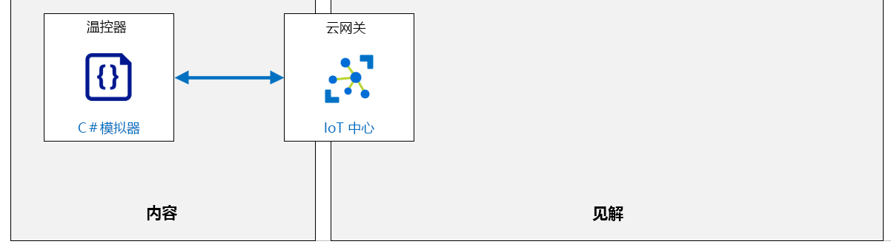

---
lab:
    title: '实验室 16：使用 Azure IoT 中心自动化 IoT 设备管理'
    module: '模块 8：设备管理'
---

# 使用 Azure IoT 中心自动化 IoT 设备管理

IoT 设备通常使用优化的操作系统，甚至直接在芯片上运行代码（无需实际操作系统）。为了更新在此类设备上运行的软件，最常用的方法是刷写全套新版软件包，包括 OS 以及在 OS 上运行的应用（称为“固件”）。

由于每个设备都有特定用途，因此其固件也非常具体，并针对设备用途以及可用受限资源进行了优化。

固件更新过程也可特定于硬件以及硬件制造商的制板方式。这意味着部分固件更新过程不通用，你需要联系设备制造商以获取固件更新过程的详细信息（除非你正自行开发硬件，这意味着你很可能知道固件更新过程的详细信息） 。

尽管过去通常将固件更新手动应用于单个设备，但考虑到典型 IoT 解决方案中所使用的设备数量，这种做法不再适用。现在，更为常见的做法是通过无线 (OTA) 方式，从云端远程管理新固件的部署来完成固件更新。

以下是 IoT 设备的所有无线固件更新的常见共同特征：

1. 固件版本使用唯一标识
1. 固件采用二进制文件格式，设备需从联机源获取固件
1. 固件是存储在本地的某种物理存储形式（ROM 存储器、硬盘驱动器...）
1. 设备制造商提供了更新固件所需设备操作的描述。

Azure IoT 中心提供高级支持，用于在单个设备和设备集合上实现设备管理操作。“自动设备管理”[](https://docs.microsoft.com/azure/iot-hub/iot-hub-auto-device-config)功能使你可以方便地配置和触发一组操作，然后监视其进度。

## 实验室场景

你在 Contoso 的奶酪储藏室中实现的自动化空气处理系统帮助该公司在原本的高标准基础上进一步提高了质量标准。该公司因此产出了更多优质奶酪。

你的基本解决方案包括与传感器和气候控制系统集成的 IoT 设备，以对多室储藏室系统中的温度和湿度进行实时控制。你还开发了一个简单的后端应用，用来演示使用直接方法和设备孪生属性管理设备的能力。

Contoso 对你的初始解决方案中的简单后端应用进行了扩展，以包含一个操作员可用来监视和远程管理储藏室环境的在线门户。借助新门户，操作员甚至可以根据奶酪类型或奶酪老化过程中的特定阶段自定义储藏室内的温度和湿度。储藏室内的每个房间或区域都可以单独控制。

IT 部门将维护他们为操作员开发的后端门户，而你的经理已同意管理该解决方案的设备端。 

对你来说，这意味着两件事： 

1. Contoso 运营团队一直在寻找改进方法。通常，这些改进意味着为设备软件开发更多新功能的请求。 

1. 部署到储藏室位置的 IoT 设备需要最新的安全补丁，以确保隐私并防止黑客控制系统。为了维护系统安全性，你需要通过远程更新固件来使设备保持最新状态。

你计划实现 IoT 中心功能，以便能够实现自动设备管理和大规模设备管理。

将创建以下资源：



## 本实验室概览

在本实验室中，你将完成以下活动：

* 验证是否满足实验室先决条件（具有必需的 Azure 资源）
* 为实现固件更新的模拟设备写入代码
* 使用 Azure IoT 中心自动设备管理在单个设备上测试固件更新过程

## 实验室说明

### 练习 1：验证实验室先决条件

本实验室假定以下 Azure 资源可用：

| 资源类型 | 资源名称 |
| :-- | :-- |
| 资源组 | rg-az220 |
| IoT 中心 | iot-az220-training-{your-id} |
| IoT 设备 | sensor-th-0155 |

> **重要说明**： 运行设置脚本以创建所需设备。

若要创建任何缺少的资源和新设备，在开始练习 2 之前，需要先按照下面的说明运行 **lab16-setup.azcli** 脚本。脚本文件包含在本地克隆作为开发环境配置（实验室 3）的 GitHub 存储库中。

>**备注：** 你将需要 **“sensor-th-0155”** 设备的连接字符串。如果你已经在 Azure IoT 中心注册了此设备，则可以通过在 Azure Cloud Shell 中运行以下命令来获取连接字符串
>
> ```bash
> az iot hub device-identity connection-string show --hub-name iot-az220-training-{your-id} --device-id sensor-th-0050 -o tsv
> ```

写入 **lab16-setup.azcli** 脚本，并在 **Bash** shell 环境中运行，执行此操作最简便的方法是在 Azure Cloud Shell 中。

1. 使用浏览器，打开 [Azure Cloud Shell](https://shell.azure.com/)，并使用本课程使用的 Azure 订阅登录。

    如果系统提示设置 Cloud Shell 的存储，请接受默认设置。

1. 验证 Cloud Shell 是否在使用 **Bash**。

    Azure Cloud Shell 页面左上角的下拉菜单用于选择环境。验证所选的下拉值是否为 **Bash**。

1. 在 Cloud Shell 工具栏上，单击 **“上传/下载文件”** （从右数第四个按钮）。

1. 在下拉菜单中，单击 **“上传”**。

1. 在“文件选择”对话框中，导航到配置开发环境时下载的 GitHub 实验室文件的文件夹位置。

    在“实验室 3：_设置开发环境_，你可以通过下载 ZIP 文件并从本地提取内容来克隆包含实验室资源的 GitHub 存储库。提取的文件夹结构包括以下文件夹路径：

    * Allfiles
      * 实验室
          * 16-使用 Azure IoT 中心实现自动化 IoT 设备管理
            * 设置

    lab16-setup.azcli 脚本文件位于实验室 16 的 Setup 文件夹中。

1. 选择 **“lab16-setup.azcli”** 文件，然后单击 **“打开”**。

    文件上传完成后，系统将显示一条通知。

1. 若要验证在 Azure Cloud Shell 中已上传了正确文件，请输入以下命令：

    ```bash
    ls
    ```

    使用 `ls` 命令列出当前目录的内容。你应该会看到列出的 lab16-setup.azcli 文件。

1. 若要为此实验室创建一个包含安装脚本的目录，然后移至该目录，请输入以下 Bash 命令：

    ```bash
    mkdir lab16
    mv lab16-setup.azcli lab16
    cd lab16
    ```

1. 为了保证 **lab16-setup.azcli** 具有执行权限，请输入以下命令：

    ```bash
    chmod +x lab16-setup.azcli
    ```

1. 在“Cloud Shell”工具栏上，请单击 **“打开编辑器”** （右侧的第二个按钮 - **{ }**）以启用对 lab16-setup.azcli 文件的访问。

1. 在 **“文件存储”** 列表中，展开 lab16 文件夹并打开脚本文件，单击 **“lab16”**，然后单击 **“lab16-setup.azcli”**。

    编辑器现在将显示 **“lab16-setup.azcli”** 文件的内容。

1. 在编辑器中，更新 `{your-id}` 和 `{your-location}` 分配的值。

    在以下引用示例中，你需要将 `{your-id}` 设置为你在本课程开始时创建的唯一 ID，即 **cah191211**，然后将 `{your-location}` 设置为对资源而言合理的位置。

    ```bash
    #!/bin/bash

    # 更改这些值！
    YourID="{your-id}"
    Location="{your-location}"
    ```

    > **备注：**  应将 `{your-location}` 变量设置为要部署所有资源的区域的短名称。输入以下命令，可以看到可用位置及其短名称的列表（**“名称”** 列）：

    ```bash
    az account list-locations -o Table

    DisplayName           Latitude    Longitude    Name
    --------------------  ----------  -----------  ------------------
    East Asia             22.267      114.188      eastasia
    Southeast Asia        1.283       103.833      southeastasia
    Central US            41.5908     -93.6208     centralus
    East US               37.3719     -79.8164     eastus
    East US 2             36.6681     -78.3889     eastus2
    ```

1. 要保存对文件所做的更改并关闭编辑器，请单击编辑器窗口右上角的 “**...**”，然后单击 **“关闭编辑器”**。

    如果提示保存，请单击 **“保存”**，编辑器将会关闭。

    > **备注：**  可以使用 **Ctrl+S** 随时保存，使用 **Ctrl+Q** 关闭编辑器。

1. 要创建本实验室所需的资源，请输入以下命令：

    ```bash
    ./lab16-setup.azcli
    ```

    运行此脚本可能需要几分钟。每个步骤完成时，你都会看到输出。

    该脚本将首先创建一个名为 **rg-az220** 的资源组和一个名为 **iot-az220-training-{your-id}** 的 IoT 中心。如果它们已经存在，将显示相应的消息。然后，脚本会将 ID 为 **“sensor-th-0155”** 的设备添加到 IoT 中心并显示设备连接字符串。

1. 请注意，脚本完成后，将显示设备的连接字符串。

    连接字符串以 "HostName=" 开头

1. 将连接字符串复制到文本文档中，请注意，该字符串适用于 **sensor-th-0155** 设备。

    将连接字符串保存到容易找到的位置后，就可以继续进行本实验室了。

### 练习 2：为实现固件更新的模拟设备编写代码

在本练习中，你将创建一个负责管理设备孪生所需属性更改的简单模拟器，还将触发一个模拟固件更新的本地过程。这一要实现的用于启动固件更新的过程与在实际设备上用于启动固件更新的过程相似。这一下载新固件版本、安装固件更新和重新启动设备的过程是模拟的过程。

你将通过 Azure 门户，使用设备孪生属性配置和执行固件更新。你将配置设备孪生属性，以便将配置更改请求传输到设备并监视进度。

#### 任务 1：创建设备模拟器应用

在此任务中，你将使用 Visual Studio Code 新建一个控制台应用。

1. 打开 Visual Studio Code。

    如果你已完成本课程的实验室 3，你应当将 [.NET Core](https://dotnet.microsoft.com/download) 和[C# 扩展](https://marketplace.visualstudio.com/items?itemName=ms-vscode.csharp)安装到你的开发环境中。

1. 在 **“终端”** 菜单中，单击 **“新建终端”**。

1. 在“终端”命令提示符下，输入以下命令：

    ```cmd/sh
    mkdir fwupdatedevice
    cd fwupdatedevice
    ```

    第一个命令将创建一个名为 **“fwupdatedevice”** 的文件夹。第二个命令导航到 **“fwupdatedevice”** 文件夹。

1. 要新建控制台应用，输入以下命令：

    ```cmd/sh
    dotnet new console
    ```

    > **备注：** 新建 .NET 控制台应用时，应该已将 `dotnet restore` 作为创建后的过程运行。如果在“终端”窗格中没有看到指示此情况已发生的消息，应用可能就无法访问所需的 .NET 包。为此，请输入以下命令：`dotnet restore`

1. 要安装你的应用所需的库，请输入以下命令：

    ```cmd/sh
    dotnet add package Microsoft.Azure.Devices.Client
    dotnet add package Microsoft.Azure.Devices.Shared
    dotnet add package Newtonsoft.Json
    ```

    查看“终端”窗格中的消息，确保所有三个库均已安装。

1. 在 **“文件”** 菜单上，单击 **“打开文件夹”**

1. 在 **“打开文件夹”** 对话框中，导航到“终端”窗格中指定的文件夹位置，单击 **“fwupdatedevice”**，然后单击 **“选择文件夹”**

    “资源管理器”窗格应该可以在 Visual Studio Code 中打开，并且你应该可以看到列出的 `Program.cs` 和 `fwupdatedevice.csproj` 文件。

1. 在 **“资源管理器”** 窗格中，单击 **“Program.cs”**。

1. 在“代码编辑器”窗格中，删除 Program.cs 文件的内容。

#### 任务 2：将代码添加到应用

在此任务中，你将输入用于在设备上模拟固件更新的代码，以响应 IoT 中心生成的请求。

1. 确保 **Program.cs** 文件在 Visual Studio Code 中处于打开状态。

    “代码编辑器”窗格应该会显示一个空的代码文件。

1. 将以下代码复制并粘贴到“代码编辑器”窗格中：

    ```cs
    // 版权所有 (c) Microsoft。保留所有权利。
    // 已获得 MIT License 颁发的许可证。有关完整的许可信息，请参阅项目根目录中的许可文件。

    using Microsoft.Azure.Devices.Shared;
    using Microsoft.Azure.Devices.Client;
    using System;
    using System.Threading.Tasks;

    namespace fwupdatedevice
    {
        class SimulatedDevice
        {
            // 用于通过 IoT 中心对设备进行身份验证的设备连接字符串。
            static string s_deviceConnectionString = "";

            // 设备 ID 变量
            static string DeviceID="unknown";

            // 固件版本变量
            static string DeviceFWVersion = "1.0.0";

            // 简单的控制台记录功能
            static void LogToConsole(string text)
            {
                // 将设备 ID 作为前缀添加到日志
                Console.WriteLine(DeviceID + ": " + text);
            }

            // 从OS/HW 检索固件版本的函数
            static string GetFirmwareVersion()
            {
                // 在这里，你将从硬件获取实际固件版本。出于仿真目的，只发回 FWVersion 变量值
                return DeviceFWVersion;
            }

            // 用于更新设备孪生报告属性以报告当前固件（更新）状态的函数
            // 这些值属于“固件”更新属性，用于 IoT 中心中的固件更新配置
            // currentFwVersion：设备上当前正在运行的固件版本。
            //  pendingFwVersion：下一个目标更新版本，应该与
            //                    在所需属性中指定。空白，条件是
            // 没有挂起更新（fwUpdateStatus 为 'current'）。
            //  fwUpdateStatus：   定义更新进度，以便
            // 从摘要视图中对其进行分类。即以下之一：
            //         - current：     无挂起固件更新。currentFwVersion 应该
            // 与所需属性中的 fwVersion 一致。
            //         - 正在下载：正在下载固件更新图片。
            //         - 正在验证：   验证图像文件校验和，以及其他任何验证。
            //         - 正在应用：    正在更新到新的映像文件。
            //         - 重启：   设备正在重启，这是更新过程的一部分。
            //         - 错误：       更新过程发生错误。其他详细信息
            //                    应该在 fwUpdateSubstatus 中指定。
            //         - rolledback：  由于出现错误，更新回滚到以前的版本。
            //  fwUpdateSubstatus：关于 fwUpdateStatus 的所有其他详细信息。可能包括
            //                     错误原因、回滚状态或下载百分比。
            //
            // reported: {
            //       firmware: {
            //         currentFwVersion: '1.0.0',
            //         pendingFwVersion: '',
            //         fwUpdateStatus: 'current',
            //         fwUpdateSubstatus: '',
            //         lastFwUpdateStartTime: '',
            //         lastFwUpdateEndTime: ''
            //   }
            // }

            static async Task UpdateFWUpdateStatus(DeviceClient client, string currentFwVersion, string pendingFwVersion, string fwUpdateStatus, string fwUpdateSubstatus, string lastFwUpdateStartTime, string lastFwUpdateEndTime)
            {
                TwinCollection properties = new TwinCollection();
                if (currentFwVersion!=null)
                    properties["currentFwVersion"] = currentFwVersion;
                if (pendingFwVersion!=null)
                    properties["pendingFwVersion"] = pendingFwVersion;
                if (fwUpdateStatus!=null)
                    properties["fwUpdateStatus"] = fwUpdateStatus;
                if (fwUpdateSubstatus!=null)
                    properties["fwUpdateSubstatus"] = fwUpdateSubstatus;
                if (lastFwUpdateStartTime!=null)
                    properties["lastFwUpdateStartTime"] = lastFwUpdateStartTime;
                if (lastFwUpdateEndTime!=null)
                    properties["lastFwUpdateEndTime"] = lastFwUpdateEndTime;

                TwinCollection reportedProperties = new TwinCollection();
                reportedProperties["firmware"] = properties;

                await client.UpdateReportedPropertiesAsync(reportedProperties).ConfigureAwait(false);
            }

            // 在设备上执行固件更新
            static async Task UpdateFirmware(DeviceClient client, string fwVersion, string fwPackageURI, string fwPackageCheckValue)
            {
                LogToConsole("A firmware update was requested from version " + GetFirmwareVersion() + " to version " + fwVersion);
                await UpdateFWUpdateStatus(client, null, fwVersion, null, null, DateTime.UtcNow.ToString("yyyy-MM-ddTHH:mm:ssZ"), null);

                // 获取新的固件二进制文件。这里你将按照设备说明从源中下载或检索二进制文件，然后使用哈希值仔细检查下载的二进制文件的完整性
                LogToConsole("Downloading new firmware package from " + fwPackageURI);
                await UpdateFWUpdateStatus(client, null, null, "downloading", "0", null, null);
                await Task.Delay(2 * 1000);
                await UpdateFWUpdateStatus(client, null, null, "downloading", "25", null, null);
                await Task.Delay(2 * 1000);
                await UpdateFWUpdateStatus(client, null, null, "downloading", "50", null, null);
                await Task.Delay(2 * 1000);
                await UpdateFWUpdateStatus(client, null, null, "downloading", "75", null, null);
                await Task.Delay(2 * 1000);
                await UpdateFWUpdateStatus(client, null, null, "downloading", "100", null, null);
                // 报告二进制文件已下载完成
                LogToConsole("The new firmware package has been successfully downloaded.");

                // 检查二进制完整性
                LogToConsole("Verifying firmware package with checksum " + fwPackageCheckValue);
                await UpdateFWUpdateStatus(client, null, null, "verifying", null, null, null);
                await Task.Delay(5 * 1000);
                // 报告二进制文件已下载完成
                LogToConsole("The new firmware binary package has been successfully verified");

                // 应用新固件
                LogToConsole("Applying new firmware");
                await UpdateFWUpdateStatus(client, null, null, "applying", null, null, null);
                await Task.Delay(5 * 1000);

                // 在实际设备上，你可在过程结束时重新启动，设备在启动时会报告实际固件版本，如果启动成功，固件版本就应该是新版本。
                // 为方便模拟，我们只需稍作等待，并报告新的固件版本。
                LogToConsole("Rebooting");
                await UpdateFWUpdateStatus(client, null, null, "rebooting", null, null, DateTime.UtcNow.ToString("yyyy-MM-ddTHH:mm:ssZ"));
                await Task.Delay(5 * 1000);

                // 在真实设备上，你将发出命令以重新启动设备。在这里，我们只是在运行 init 函数
                DeviceFWVersion = fwVersion;
                await InitDevice(client);

            }

            // 用于响应所需属性更改的回调
            static async Task OnDesiredPropertyChanged(TwinCollection desiredProperties, object userContext)
            {
                LogToConsole("Desired property changed:");
                LogToConsole($"{desiredProperties.ToJson()}");

                // 执行固件更新
                if (desiredProperties.Contains("firmware") && (desiredProperties["firmware"]!=null))
                {
                    // 在所需属性中，将找到以下信息：
                    // fwVersion：待刷入新固件的版本号
                    // fwPackageURI：下载新固件二进制文件的 URI
                    // fwPackageCheckValue：用于验证所下载二进制文件完整性的哈希值
                    // 假定固件版本为新版本
                    TwinCollection fwProperties = new TwinCollection(desiredProperties["firmware"].ToString());
                    await UpdateFirmware((DeviceClient)userContext, fwProperties["fwVersion"].ToString(), fwProperties["fwPackageURI"].ToString(), fwProperties["fwPackageCheckValue"].ToString());

                }
            }

            static async Task InitDevice(DeviceClient client)
            {
                LogToConsole("Device booted");
                LogToConsole("Current firmware version: " + GetFirmwareVersion());
                await UpdateFWUpdateStatus(client, GetFirmwareVersion(), "", "current", "", "", "");
            }

            static async Task Main(string[] args)
            {
                // 从命令行获取设备连接字符串
                if (string.IsNullOrEmpty(s_deviceConnectionString) && args.Length > 0)
                {
                    s_deviceConnectionString = args[0];
                } else
                {
                    Console.WriteLine("Please enter the connection string as argument.");
                    return;
                }

                DeviceClient deviceClient = DeviceClient.CreateFromConnectionString(s_deviceConnectionString, TransportType.Mqtt);

                if (deviceClient == null)
                {
                    Console.WriteLine("Failed to create DeviceClient!");
                    return;
                }

                // 获取设备 ID
                string[] elements = s_deviceConnectionString.Split('=',';');

                for(int i=0;i<elements.Length; i+=2)
                {
                    if (elements[i]=="DeviceId") DeviceID = elements[i+1];
                }

                // 运行设备 init 例程
                await InitDevice(deviceClient);

                // 附加所需属性更改的回调
                await deviceClient.SetDesiredPropertyUpdateCallbackAsync(OnDesiredPropertyChanged, deviceClient).ConfigureAwait(false);

                // 等待按键以结束应用
                // TODO
                while (true)
                {
                    Console.ReadLine();
                    return;
                }
            }
        }
    }
    ```

    > **备注：** 
    > 通读代码中的注释，注意设备如何响应设备孪生更改以根据所需的“固件”属性中共用的配置执行固件更新。还请注意通过设备孪生的报告的属性来报告当前固件更新状态的函数。

1. 在 **“文件”** 菜单中，单击 **“保存”**。

设备端代码现已完成。接下来，你将测试此模拟设备的固件更新过程是否符合预期。

### 练习 3：测试单个设备上的固件更新

在本练习中，将使用 Azure 门户新建设备管理配置，并将其应用于单个模拟设备。

#### 任务 1：启动设备模拟器

1. 如有必要，请在 Visual Studio Code 中打开 **fwupdatedevice** 项目。

1. 确保已打开“终端”窗格。

    命令提示符的文件夹位置为 `fwupdatedevice` 文件夹。

1. 要运行 `fwupdatedevice` 应用，请输入以下命令：

    ``` bash
    dotnet run "<device connection string>"
    ```

    > **备注：** 记得将占位符替换为实际的设备连接字符串，并确保将连接字符串置于英文双引号 "" 中间。 
    > 
    > 例如： `"HostName=iot-az220-training-{your-id}.azure-devices.net;DeviceId=sensor-th-0155;SharedAccessKey={}="`

1. 查看“终端”窗格的内容。

    终端中应会显示以下输出（其中，“mydevice”是创建设备标识时所用的设备 ID）：

    ``` bash
        mydevice: Device booted
        mydevice: Current firmware version: 1.0.0
    ```

#### 任务 2：创建设备管理配置

1. 如有必要，请使用 Azure 帐户凭据登录到 [Azure 门户](https://portal.azure.com/learn.docs.microsoft.com?azure-portal=true)。

    如果有多个 Azure 帐户，请确保使用与本课程要使用的订阅绑定的帐户登录。

1. 在 Azure 门户仪表板上，单击 **“iot-az220-training-{your-id}”**。

    现在应显示 IoT 中心边栏选项卡。
 
1. 在左侧导航菜单中的 **“自动设备管理”** 下，单击 **“IoT 设备配置”**。

1. 在 **“IoT 设备配置”** 窗格中，单击 **“+添加设备配置”**。

1. 在 **“创建设备孪生配置”** 边栏选项卡的 **“名称”** 下，输入 **“firmwareupdate”**

    确保你在配置的必填字段 **“名称”** 处，而不是在 **“标签”** 处输入“`firmwareupdate`”。 

1. 在边栏选项卡底部，单击 **“下一步: 孪生设置 >**。

1. 在 **“设备孪生设置”** 下的 **“设备孪生属性”** 字段中，输入 **“properties.desired.firmware”**

1. 在 **“设备孪生属性内容”** 字段中，输入以下内容：

    ``` json
    {
        "fwVersion":"1.0.1",
        "fwPackageURI":"https://MyPackage.uri",
        "fwPackageCheckValue":"1234"
    }
    ```

1. 在边栏选项卡底部，单击 **“下一步: 指标 >**.

    你将使用自定义指标来跟踪固件更新是否有效。 

1. 在 **“指标”** 选项卡的 **“指标名称”** 下，输入 **“fwupdated”**

1. 在 **“指标条件”** 下，输入以下内容：

    ``` SQL
    SELECT deviceId FROM devices
        WHERE properties.reported.firmware.currentFwVersion='1.0.1'
    ```

1. 在边栏选项卡底部，单击 **“下一步: 目标设备 >**。

1. 在 **“目标设备”** 选项卡上的 **“优先级”** 下的 **“优先级（更高的值 ...）”** 字段中，输入 **“10”**。

1. 在 **“目标条件”** 的 **“目标条件”** 字段中，输入以下查询：

    ``` SQL
    deviceId='<your device id>'
    ```

    > **备注：** 请务必将 `'<your device id>'` 替换为你用来创建设备的设备 ID。例如： `'sensor-th-0155'`

1. 在边栏选项卡底部，单击 **“下一步: 查看 + 创建 >**

    在 **“查看 + 创建”** 选项卡打开后，你应该会看到新配置“已通过验证”的消息。 

1. 在 **“查看 + 创建”** 选项卡上，如果显示“通过验证”消息，请单击 **“创建”**。

    如果显示“通过验证”消息，则需要先返回并检查工作，然后才能创建配置。

1. 在 **“IoT 设备配置”** 窗格上的 **“配置名称”** 下，确认已列出新 **“firmwareupdate”** 配置。  

    创建新配置后，IoT 中心将查找与配置的目标设备标准匹配的设备，并将自动应用固件更新配置。

1. 切换到 Visual Studio Code 窗口，然后查看“终端”窗格的内容。

    “终端”窗格应包括你的应用生成的新输出，其中列出了触发的固件更新过程的进度。

1. 停止模拟应用，然后关闭 Visual Studio Code。

    你只需按下终端中的 Enter 键即可停止设备模拟器。

