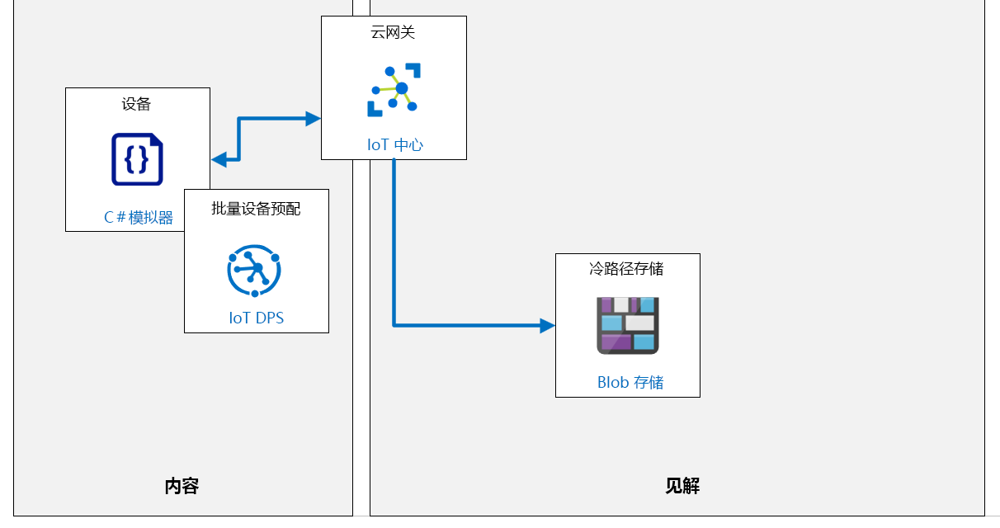

---
lab:
  title: 实验室 17：如何管理你的 Azure IoT 中心
  module: 'Module 9: Solution Testing, Diagnostics, and Logging'
ms.openlocfilehash: 9dbc3dff6579d885bb88cb1f83275b7df589ee56
ms.sourcegitcommit: 7874419a1f0f346f972914893b4b3644ba84a267
ms.translationtype: HT
ms.contentlocale: zh-CN
ms.lasthandoff: 03/04/2022
ms.locfileid: "139262454"
---
# <a name="how-to-manage-your-azure-iot-hub"></a>如何管理你的 Azure IoT 中心

## <a name="lab-scenario"></a>实验室场景

Contoso 的资产监视和跟踪解决方案运行良好。 该系统在整个包装和运输过程中提供持续监控。 你已经在 DPS 中实现了组注册，以大规模预配设备，并且当集装箱到达目的地时，IoT 设备通过 DPS“解除授权”，以便可以将其重新用于以后的装运。

为了帮助管理设备利用率和解决方案的其他特征，IT 部门已要求你的团队在 IoT 解决方案中实现 Azure 监视和日志记录服务。

你同意首先实现一些简单的指标，这些指标可以在你承担任何其他工作负荷之前由 IT 人员进行审查。

在本实验室中，你将实现监视以跟踪已连接的设备和已发送的遥测消息的数量，并将连接事件发送到日志。 此外，你还将创建一个警报，当已连接设备数小于 1 时会触发该警报。 若要测试系统，你将连接单个设备并流式传输遥测，然后断开设备以生成警报。

将创建以下资源：



## <a name="in-this-lab"></a>本实验室概览

在本实验室中，你将完成以下活动：

* 配置实验室先决条件（所需的 Azure 资源）
* 下载并运行一个应用，用于模拟 IoT 设备将消息发送到中心的情形。
* 运行应用以生成遥测。
* 启用诊断日志。
* 启用指标。
* 针对这些指标设置警报。
* 退出应用以发出警报。
* 观察指标并检查诊断日志。

## <a name="lab-instructions"></a>实验室说明

### <a name="exercise-1-configure-lab-prerequisites"></a>练习 1：配置实验室先决条件

本实验室假定以下 Azure 资源可用：

| 资源类型 | 资源名称 |
| :-- | :-- |
| 资源组 | rg-az220 |
| IoT 中心 | iot-az220-training-{your-id} |
| 存储帐户 | staz220training{your-id} |
| 设备 ID | sensor-thl-2001 |

若要确保这些资源可用，请完成以下步骤。

1. 在虚拟机环境中，打开 Microsoft Edge 浏览器窗口，然后导航到以下 Web 地址：

    +++https://portal.azure.com/#create/Microsoft.Template/uri/https%3A%2F%2Fraw.githubusercontent.com%2FMicrosoftLearning%2FAZ-220-Microsoft-Azure-IoT-Developer%2Fmaster%2FAllfiles%2FARM%2Flab17.json+++

    > 注意：每当看到绿色的“T”符号（例如 +++输入此文本+++）时，可以单击关联的文本，信息将键入到虚拟机环境内的当前字段中。

1. 如果系统提示登录到 Azure 门户，请输入你在本课程中使用的 Azure 凭据。

    将显示“自定义部署”页。

1. 在“项目详细信息”下的“订阅”下拉列表中，确保你打算在本课程中使用的 Azure 订阅已选中 。

1. 在“资源组”下拉列表中，选择“rg-az220” 。

    > 注意：如果未列出 rg-az220：
    >
    > 1. 在“资源组”下拉列表中，选择“新建”。
    > 1. 在“名称”下，输入 rg-az220 。
    > 1. 单击 **“确定”** 。

1. 在“实例详细信息”下的“区域”下拉列表中，选择离你最近的区域 。

    > 注意：如果 rg-az220 组已存在，则“区域”字段将设置为资源组使用的区域，并且为只读 。

1. 在“你的 ID”字段中，输入在练习 1 中创建的唯一 ID。

1. 在“课程 ID”字段中，输入 az220 。

1. 若要验证模板，请单击“查看和创建”。

1. 验证通过后，单击“创建”。

    将启动部署。

1. 部署完成后，在左侧导航区域中，若要查看模板的任何输出值，请单击“输出”。

    记下输出供稍后使用：

    * connectionString
    * deviceConnectionString
    * devicePrimaryKey
    * storageAccountName

现已创建资源。

### <a name="exercise-2-simulate-devices"></a>练习 2：模拟设备

在本练习中，你将使用上面生成的设备连接字符串配置设备模拟器，用于连接到 IoT 中心。 执行时，应用程序将创建活动连接（视为已连接设备）并生成遥测。

#### <a name="task-1-configure-and-run-device-simulator"></a>任务 1：配置并运行设备模拟器

现在将配置并运行设备模拟器。

1. 打开 Visual Studio Code。

1. 在“文件”菜单上，单击“打开文件夹”。

1. 在“打开文件夹”对话框中，导航到实验室 17 的“Starter”文件夹，单击“Starter”，然后单击“选择文件夹”。

    > **注意**：如果 Visual Studio Code 建议加载资产或执行还原，请遵循建议。

1. 在“资源管理器”窗格中，请单击“Program.cs”打开“Program.cs”文件。

    你还会看到列出的证书文件。

1. 确保 Program.cs 文件已在 Visual Studio Code 中打开。

1. 在 Program 类的顶部附近，找到 `connectionString` 变量的声明：

    ```csharp
    private readonly static string connectionString = "<your device connection string>";
    ```

1. 将 `<your device connection string>` 替换为之前保存的设备连接字符串。

    > **注意**：这是你需要对此代码进行的唯一更改。

1. 在“文件”菜单上，单击“保存”。

1. （可选）花点时间查看代码。

此应用与前面实验室中使用的应用非常相似。

#### <a name="task-2-run-the-simulator"></a>任务 2：运行模拟器

1. 在 Visual Studio Code 中，单击“终端”菜单上的“新建终端”。

1. 在终端命令提示符下，请输入以下命令运行该应用：

    ```bash
    dotnet run
    ```

   此命令将在当前文件夹中运行 Program.cs 文件。

1. 显示的控制台输出应类似于以下内容：

    ```text
    ❯ dotnet run
    IoT Hub C# Simulated Cave Device. Ctrl-C to exit.
    9/21/2021 5:29:03 PM > Sending message: {"temperature":21.709826510264456,"humidity":69.90892255208871,"pressure":1013.2884857487113,"latitude":39.866200822820204,"longitude":-98.44082869457793}
    9/21/2021 5:29:04 PM > Sending message: {"temperature":27.536429445043407,"humidity":79.17065790815775,"pressure":1020.8587537331547,"latitude":40.150104471097904,"longitude":-98.40412401158297}
    9/21/2021 5:29:05 PM > Sending message: {"temperature":30.732068391857702,"humidity":65.15873178148583,"pressure":1017.6406480895312,"latitude":40.09271254628759,"longitude":-98.26298329932496}
    ```

让应用保持运行，以便连接设备并发送遥测。

### <a name="exercise-3-set-up-and-use-metrics-and-diagnostic-logs-with-an-iot-hub"></a>练习 3：通过 IoT 中心设置和使用指标和诊断日志

Azure 资源日志是 Azure 资源发出的描述内部操作的平台日志。 所有资源日志共享通用的顶级架构，且每个服务都能灵活地为各自的事件发出唯一属性。

如果有 IoT 中心解决方案在生产中运行时，你需要设置各种指标并启用诊断日志。 然后，如果出现问题，则可以查看数据，这将有助于你诊断问题并更快地解决问题。

在本练习中，将启用诊断日志并使用该日志检查错误。 还将设置一些要监视的指标，并在指标达到特定边界标准时发出警报。

#### <a name="task-1-enable-diagnostics"></a>任务 1：启用诊断

1. 如有必要，请使用 Azure 帐户凭据登录到 Azure 门户。

    如果有多个 Azure 帐户，请确保使用与本课程要使用的订阅绑定的帐户登录。

1. 在 Azure 仪表板上，单击“iot-az220-training-{your-id}”。

    你的仪表板应在 rg-az220 资源组磁贴上具有指向 IoT 中心的链接。

1. 在左侧菜单中，在“监视”下，单击“诊断设置”。

    > **注意**：当前文档建议默认情况下可能禁用“诊断”。 如果是这样，你可能需要“打开诊断”才能为 IoT 中心收集诊断数据。 单击“打开诊断”时，会打开“诊断设置”窗格。

1. 在“诊断设置”窗格的“名称”下，单击“添加诊断设置”。

1. 在“诊断设置名称”文本框中，输入“diags-hub”

1. 花一点时间查看“目标详细信息”下面列出的选项。

    你会看到有 4 个可用于路由指标的选项 - 你可以通过以下链接了解每个指标的详细信息：

    * [将 Azure 资源日志存档到存储帐户](https://docs.microsoft.com/en-us/azure/azure-monitor/platform/resource-logs-collect-storage)
    * [将 Azure 监视数据流式传输到事件中心](https://docs.microsoft.com/en-us/azure/azure-monitor/platform/stream-monitoring-data-event-hubs)
    * [在 Azure Monitor 的 Log Analytics 工作区中收集 Azure 资源日志](https://docs.microsoft.com/en-us/azure/azure-monitor/platform/resource-logs-collect-workspace)
    * [发送给合作伙伴解决方案](https://docs.microsoft.com/en-us/azure/azure-monitor/partners)

    在本实验室中，将使用存储帐户选项。

1. 在“目标详细信息”下，单击“存档到存储帐户”。

    选择此目标选项后，其他字段将变为可用，包括用于指定日志类别的“保留期(天)”的选项。

    > **注意**：花一点时间查看有关存储帐户和成本的备注。

1. 对于“订阅”字段，请选择用于创建 IoT 中心的订阅。

1. 对于“存储帐户”字段，选择 staz220training{your-id} 存储帐户 。

    该帐户是由 lab17-setup.azcli 脚本创建的。 如果下拉列表中未列出该帐户，则可能需要手动创建一个帐户（请与你的讲师联系）。

1. 在“诊断设置”边栏选项卡的“类别详细信息”下，单击“连接”，然后单击“DeviceTelemetry”。

1. 对于你选择的每个日志类别，在“保留期(天)”字段中，输入“7”

1. 在边栏选项卡顶部，单击“保存”，然后关闭边栏选项卡

    你现在应该处于 IoT 中心的“诊断设置”窗格中，并应该看到“诊断设置”已更新，用以显示你刚刚创建的“diags-hub”设置。

    随后在查看诊断日志时，就可以看到设备的遥测和连接/断开连接日志记录。

#### <a name="task-2-setup-metrics"></a>任务 2：设置指标

在本任务中，你将设置各种指标，以监视何时将消息发送到你的 IoT 中心。

> **注意**：为了确保可以快速获得结果，本练习将使用较短的时间线。 在生产环境中，较长的时间间隔可能会更合适。

1. 确保已打开 IoT 中心边栏选项卡。

    在上一任务结束时，你停留在 IoT 中心边栏选项卡的“诊断设置”窗格。

1. 在左侧菜单中，在“监控”下方，单击“指标”。

    将显示一个显示新的空图表的“指标”窗格。

1. 在屏幕右上角，要更改图表的时间范围和时间粒度，请单击“过去 24 小时（自动）” 。

1. 在出现的上下文菜单的“时间范围”下，单击“过去 30 分钟” 。

1. 在同一上下文菜单的“时间粒度”中，确保选择了“本地” 。

1. 要保存你的时间设置，请单击“应用”。

1. 花一分钟时间检查用于指定图表指标的设置。

    在“图表标题”和图表工具栏下，你将看到一个指定指标的区域。

    * 请注意，“范围”已经设置为“iot-az220-training-{your-id}”。
    * 请注意，“指标命名空间”已经设置为“IoT 中心标准指标”。

    > **注意**：默认情况下，只有一个指标命名空间可用。 命名空间可将类似的指标分类或分组到一起。 使用命名空间能够在可收集不同见解或性能指标的指标组之间实现隔离。 例如，你可能有一个名为“az220memorymetrics”的命名空间，用于跟踪应用配置文件的内存使用指标。 另一个命名空间称为“az220apptransaction”可能会跟踪有关应用程序中用户交易的所有指标。 你可以在[此处](https://docs.microsoft.com/en-us/azure/azure-monitor/platform/metrics-custom-overview?toc=%2Fazure%2Fazure-monitor%2Ftoc.json#namespace)了解有关自定义指标和命名空间的更多信息。

    接下来的步骤是添加一个指标，用于监控已发送到 IoT 中心的遥测消息的数量。

1. 在“指标”下拉列表中，单击“已发送遥测信息” 。

    请注意，你可以从中选择大量指标！

1. 在“聚合”下，确保选中“总和”。

    请注意，有 4 个聚合操作可用 - *平均值*、*最小值*、*最大值* 和 *总和*。

1. 请花费片刻时间查看你的图表。

    请注意，图表标题已更新以体现所选的指标。

    你已完成对第一个指标的说明。 接下来，你将添加另一个指标来监视连接的设备数量。

1. 在图表标题的工具栏上，单击“添加指标”。

    将会出现一个新指标。 请注意，“范围”和“指标命名空间”值已预先填充。

1. 在“指标”下拉列表中，单击“已连接的设备” 。

1. 在“聚合”下，确保选中“平均值”。

    你的屏幕现在应会显示发送的遥测消息的最小指标，以及平均连接设备的新指标。 请注意，图表标题已更新以反映两个指标。

    > **注意**：要编辑图表标题，请单击标题右侧的铅笔。

1. 在工具栏右侧的“图表标题”下，单击“固定到仪表板” ，然后单击“固定到当前仪表板”

    > **注意**：为了保留刚创建的图表，必须将其固定到仪表板上。

1. 导航到上面选择的仪表板并验证该图表是否显示。

    > **注意**：你可以使用拖放操作来自定义图表的大小和位置。

    如果设备模拟器正在运行，应会看到遥测消息已发送并且设备已连接：

    

现在，你已启用日志记录并设置图表以监控指标，现在是设置警报的好时机。

### <a name="exercise-4-configure-an-alert"></a>练习 4：配置警报

警报用于在监控数据中发现重要情况时主动通知你。 有了警报，你就可以在系统的用户注意到问题之前确定和解决这些问题。

在你的资产跟踪方案中，你使用传感器来跟踪要配送给客户的容器。 每次在装运容器中添加传感器时，都会通过 DPS 自动配置传感器。 在生产环境中，你希望在传输中的传感器数量超过预定容量时发送警报。

但是，对于即将进行的概念验证演示，为了简单起见，你希望创建一个当容器数量低于 1 时触发的警报。 要触发警报，你将使用 IoT 中心的“已连接设备”事件数量。

在本练习中，你将添加一个将在连接 5 个或更多设备时触发的警报。

1. 如有必要，请使用 Azure 帐户凭据登录到 Azure 门户。

    如果有多个 Azure 帐户，请确保使用与本课程要使用的订阅绑定的帐户登录。

1. 在 Azure 仪表板上，单击“iot-az220-training-{your-id}”。

    你的仪表板应在 rg-az220 资源组磁贴上具有指向 IoT 中心的链接。

1. 在左侧菜单中，在“监控”下方，单击“警报”。

    将显示空的“警报”窗格。 请注意，“订阅”、“资源组”、“资源”和“时间范围”字段已预先填充。

1. 在“时间范围”下拉列表中，单击“过去一个小时” 。

1. 在“警报”窗格顶部，单击“+新建警报规则”

    此时应显示“创建警报规则”边栏选项卡。

1. 花点时间查看“创建警报规则”边栏选项卡。

    边栏选项卡包括四个部分：“范围”、“条件”、“操作组”和“警报规则详细信息”。 在“范围”部分可以看到两个字段 -“资源”和“层次结构”。 请注意，这些字段已预填充 IoT 中心的属性。 如果需要，可以编辑预选资源。

1. 在“条件”下单击“添加条件”。

    此时应显示“配置信号逻辑” 窗格。 请注意，显示了可用信号的分页表。 表格上方的字段用于筛选表格，以帮助查找所需的信号类型。

1. 在“信号类型”下，确保选中“全部”。

    如果打开“信号类型”下拉列表，则会看到有 3 个可用选项：“全部”、“指标”和“活动日志” 。

    > **注意**：用于监测的信号类型因所选目标而异。 信号类型可以是指标，日志搜索查询或活动日志。

1. 在“监视器服务”下，确保选中“全部”。

    如果打开“监视服务”下拉菜单，你会看到有 3 个可用选项：“所有”、“平台”和“活动日志 - 管理” 。

    > **注意**：平台服务提供有关服务利用率的指标，活动日志跟踪管理活动。

1. 在“按信号名称搜索”文本框中，键入“已连接”

1. 请注意，信号列表会根据你的输入立即进行筛选。

1. 在“信号名称”下，单击“连接的设备”。

    窗格将更新以显示与你为“指标”创建的图表类似的图表。 图表显示与选定信号相关的值（在本例中为“已连接设备(预览)”）。

    图表下方是定义“警报逻辑”的区域。

1. 花些时间查看“警报逻辑”下的选项

    注意，**阈值** 有两个可能的选择 - *静态* 和 *动态*。 另请注意，**静态** 处于选中状态，而 **动态** 不适用于该信号类型。

    > **注意**：顾名思义，*静态阈值* 为阈值指定一个常量表达式，而 *动态阈值* 检测利用高级机器学习 (ML) 来学习指标的历史行为，识别指示可能的服务问题的模式和异常。 你可以在[此处](https://docs.microsoft.com/en-us/azure/azure-monitor/platform/alerts-dynamic-thresholds)详细了解动态阈值。

    将创建一个静态阈值，它会在每次“连接的设备数(预览)”信号等于或大于 5 时触发警报。

1. 在“运算符”下拉列表中，单击“小于” 。

    你可能需要记录此字段和其他字段的其他选项。

1. 在“聚合类型”选项下，确保“平均值”已选定。

1. 在“阈值”文本框中，输入 1 

    > **注意**：****“条件预览”向你显示用于刷新显示内容的条件，显示内容会根据你输入的“运算符”、“聚合类型”和“阈值”设置来进行刷新。 “条件预览”下面是“评估依据”区域。 这些值确定使用上面选择的“聚合类型”聚合的历史时间段，以及评估条件的频率。

1. 在“单元”下，选择“计数”。

1. 在“聚合粒度(周期)”下，确保选择“1 分钟” 。

1. 在“评估频率”下，确保选择“每 1 分钟”。

    > **注意**：由于“计算频率”要比“聚合粒度(周期)”短，这会导致出现滑动窗口计算 。 例如，如果“聚合粒度(周期)”为 5 分钟，“计算频率”为 1 分钟，则意味着每分钟都会聚合过去 5 分钟的值（在本例中为平均值），然后根据条件进行计算 。 一分钟后，前 5 分钟的数据将再次聚合 - 包括一分钟的新数据和四分钟的已计算数据。 因此，滑动窗口每次向前移动一分钟，但始终包含 4 分钟在上一个窗口已计算的数据。

1. 若要配置警报条件，请在“配置信号逻辑”窗格的底部，单击“完成”。

    “配置信号逻辑”窗格关闭，并显示“创建警报规则”边栏选项卡。 请注意，“条件”现已填充，并且显示“每月预估成本”。 写入时，警报条件的预估成本为 0.10 美元 (USD)。

    接下来，你需要配置满足警报条件时采取的操作。

1. 花点时间查看一下“操作组”区域。

    请注意，未选择任何操作组。 有一个“选择操作组”选项。

    > **注意**：操作组是 Azure 订阅的所有者定义的通知首选项的集合。 操作组名称必须是关联的资源组内唯一的。 Azure Monitor 和服务运行状况警报使用操作组来通知用户某个警报已触发。 各种警报可以使用相同的操作组或不同的操作组，具体取决于用户的要求。 可以在订阅中最多配置 2,000 个操作组。 你可以[在此](https://docs.microsoft.com/en-us/azure/azure-monitor/platform/action-groups)了解有关创建和管理操作组的更多信息。

1. 在“操作”下，单击“添加操作组”。

    随即显示“选择要附加到此警报规则的操作组”窗格。 如果所选订阅中有可用的现有操作组，窗格中会列出。 请注意，可更改订阅并筛选列表。 在此实验室中，将创建一个新操作组。

1. 在“选择要附加到此警报规则的操作组”窗格上，单击“创建操作组”。

    随即显示“创建操作组”窗格。

1. 在“基本信息”选项卡的“订阅”下，确保选择了本实验室要使用的订阅。

1. 在“资源组”下拉列表中，单击“rg-az220”。

    > **注意**：操作组通常可在整个订阅范围内共享，并且可能由 Azure 订阅所有者集中管理。 这样，它们更有可能包含在公共资源组中，而不是项目特定的资源组（例如“rg-az220”）中。 我们正在使用“rg-az220”来简化实验室结束后清理资源的过程。

    下一个区域“实例详细信息”用于指定组的完整名称和显示名称。

1. 在“操作组名称”下，输入 **AZ-220 电子邮件操作组**

    > **注意**：操作组名称在与其关联的资源组中必须是唯一的。

1. 在“显示名称”下，输入“AZ220EmailAG”

    > **注意**：当使用此组发送通知时，将使用显示名称代替完整的操作组名称，并且最大限制为 12 个字符。

1. 单击“下一步:通知”，查看操作组通知字段。

1. 打开“通知类型”下拉菜单，然后查看可用选项。

1. 在“通知类型”下拉菜单中，单击“电子邮件/短信/推送/语音”。

    > **注意**：选择通知类型后，将添加一个新的空白行，用于添加多个通知。 具有值的每行的右侧显示有“编辑详细信息”和“删除”图标。

    > **注意**：“电子邮件/SMS 消息/推送/语音”边栏选项卡将自动打开。

1. 在“名称”下，输入“AZ220Notifications”

1. 在“电子邮件/短信/推送/语音”边栏选项卡上，选择“电子邮件”，然后输入你可以轻松访问的电子邮件地址 。

1. 单击“短信”，然后为你希望用于接收短信警报的手机输入“国家/地区代码”和“电话号码”。

1. 跳过“Azure 应用推送通知”和“语音”。

1. 在“启用通用警报架构”下，单击“是”。

   > **注意**：使用通用警报架构好处众多。 它将当今 Azure 中警报通知的使用体验标准化。 从历史上看，目前 Azure 中的三种警报类型（指标、日志、活动日志）一直有其自己的电子邮件模板、Webhook 架构等。现在，使用通用警报架构时可以收到架构一致的警报通知。 欲进一步了解通用 ALert6 架构，请点击[这里](https://docs.microsoft.com/en-us/azure/azure-monitor/platform/alerts-common-schema)。

   > **重要提示：** 鉴于通用警报架构有这么多好处，你可能在想为什么不设置为默认启用模式呢 - 嗯，那是因为当选择“是”时，你会看到一个警告“启用通用警报架构可能会破坏任何现有的集成”。 在自己的环境中请记住这点。

1. 在“电子邮件/短信/推送/语音”边栏选项卡底部，单击“确定”，保存操作配置。

    通知行中现在应显示了已选择的电子邮件和短信。 如果需要进一步更改，可以单击“编辑详细信息”图标。

1. 单击“下一步:操作”，查看操作组操作字段。

1. 打开“操作类型”下拉菜单，然后查看可用选项。

    此时，如果我们需要通过“WebHook”或“Azure 函数”启动一些业务集成，则可以添加多个操作，但对本实验室而言，一个简单的通知已经足够。

1. 在“添加操作组”边栏选项卡底部，单击“查看 + 创建”以验证此操作组。

1. 验证完成后，单击“创建”。

    同时会发生一些事情。 首先，“添加操作组”边栏选项卡会关闭，你会留在“创建规则”边栏选项卡，且新的操作组已添加到“操作”列表。

    然后，你将很快收到一则短信通知和一封电子邮件，这两者都会通知你已被添加到“AZ220EmailAG”操作组。 在短信中，你将注意到你可以回复此消息以停止接收今后的通知等（[可在此处](https://docs.microsoft.com/en-us/azure/azure-monitor/platform/alerts-sms-behavior)深入了解各种选项）。 电子邮件中包含可以单击并查看操作组详细信息的链接，在电子邮件底部（在小字体处），可以看到取消订阅选项。

    接下来，将配置“警报规则详细信息”。

1. 在“创建预警规则”边栏选项卡的“预警规则名称”字段中，输入“已连接设备数小于 1”  

    名称应具有充分的描述性，以便能够识别警报。

1. 在“说明”字段中，输入“当连接到 iot-az220-training-{your-id} 中心的设备数小于 1 时，触发此警报” 。

    描述字段是可选的，但建议填写。

1. 在“将警报保存到资源组”字段中，确保选择了所需的资源组 - 即“rg-az220”。

1. 请确保在“严重性”字段中选择了“3 - 信息性”。

    在我们的情形下，此警报是信息性的，并不表示有任何严重故障，因此“严重性 3”是正确的选择。

    > **注意**：严重性级别选项的范围为“0 严重”到“4 - 详细”。

1. 对于“创建时启用警报规则”字段，确保勾选（选中）相应的复选框。

    > **注意**：指标警报规则可能需要 10 分钟才能激活。

1. 对于“自动解决警报”字段，确保勾选（选中）相应的复选框。

    > **注意**：如果不再满足条件，这可确保警报已解决。

1. 在边栏选项卡底部，单击“创建预警规则”。

    现在应显示 IoT 中心的“警报”窗格。 中间的消息应该会告诉你没有警报，你应该会看到在该状态消息下面添加了一个“管理警报规则(1)”按钮。

    > 注意：如果窗格尚未自动更新，请单击“刷新”。

### <a name="exercise-5-review-metrics-alerts-and-archive"></a>练习 5：查看指标、警报和存档

在本练习中，你将检查之前在本实验室中配置的一些报告和日志记录资源，并查看在过去的短时间内记录的事件数据。

#### <a name="task-1-see-the-metrics-in-the-portal"></a>任务 1：在门户中查看指标

若要在已连接设备数小于 1 时生成警报，必须关闭设备模拟器应用。

1. 返回到 Visual Studio Code 并退出正在运行的应用。

    等待 30 秒后继续下一步。

1. 在 Azure 门户中，单击图表标题，以打开固定到仪表板的“指标”图表。

    图表将打开并在页面上显示。

1. 将时间值更改为“最近 30 分钟”。

    请注意，你可以看到“已发送的遥测消息”和“已连接设备*”值，最新数字位于图表底部，将鼠标指针悬停在图表上即可查看特定时间点的值 。 应会注意到遥测和已连接设备的折线已减少到零。

    

#### <a name="task-2-see-the-alerts"></a>任务 2：查看警报

若要使用 Azure 门户查看警报，请完成以下步骤。

1. 在 Azure 门户中，导航回仪表板。

1. 在 Azure 门户工具栏的搜索框中，键入“monitor”

1. 在搜索结果窗格的“服务”下，单击“监控器”。

    此时将显示“监控器 - 概述”页面。 这是当前订阅的所有监控活动的概述。

1. 在左侧菜单中的列表顶部附近，单击“警报”。

    此警报视图显示所有订阅的所有警报。 让我们将此过滤到 IoT 中心。

1. 在边栏选项卡顶部附近的“订阅”下，选择用于该课程的订阅。

1. 在“资源组”下拉列表中，单击“rg-az220”。

1. 在“资源”下拉列表中，单击“iot-az220-training-{your-id}”。

1. 在“时间范围”下拉列表中，单击“过去一个小时” 。

    现在，你应该会看到过去一小时的警报摘要。 在“总警报规则”下，你应该会看到“1”，即你之前创建的警报。 在下面，你将看到严重性类别的列表以及每个类别的警报计数。 我们关注的警报是“3 - 信息性”。 你应该至少看到一个（如果已停止并重新启动设备模拟器，则可能会生成多个警报）。

    > **注意**：如果你还没有看到警报，请再等几分钟 - 有时会延迟发出警报。

1. 在严重性列表中，单击“3 - 信息性”。

    “所有警报”页面将会打开。 在页面顶部，你会看到许多筛选器字段 - 这些字段已填充上一屏幕中的值，因此仅显示所选 IoT 中心的“3 - 信息性”警报。 此时会显示处于活动状态的警报，以及是否存在任何警告。

1. 在“名称”下，要选择“3 - 参考性”警报，请单击“已连接设备数大于或等于 1” 。

    将打开一个窗格，显示警报详细信息的“摘要”。 其中包括一个说明警报触发原因的图表，虚线标示了受监视指标的阈值以及当前值。 以下是“条件”的详细信息和其他详细信息。

1. 在窗格顶部，单击标题下方的“历史记录”。

    在此视图中，可以看到警报触发时间、调用的操作组以及任何其他更改，例如警报解决时间等。

1. 在窗格顶部，单击标题下方的“诊断”。

    如果存在与警报相关的任何问题，则会在此处显示其他详细信息。

1. 现在，请检查电子邮件和/或文本，并确认收到了警报消息。

1. 若要自动解决警报，请返回到 Visual Studio Code 并重启应用。

    > **注意**：由于解决警报需要几分钟时间，因此请继续执行其余任务。

#### <a name="task-3-see-the-diagnostic-logs"></a>任务 3：查看诊断日志

在本实验的前面部分，你将设置诊断日志以导出到 Blob 存储。 现在是检查并查看所写内容的好时机。

1. 导航到仪表板，然后找到“g-az220”资源组磁贴。

1. 在资源列表中，选择之前创建的存储帐户 (staz220training{your-id})。

    将会显示该存储帐户的“概述”。

1. 若要查看存储指标，请在“概述”页上选择“监视”选项卡 。

1. 向下滚动，直到你可以看到存储帐户的指标图表：*总出口*、*总入口*、*平均延迟* 和 *要求明细*。

    你应该看到显示了活动。

1. 在左侧菜单上，单击“存储资源管理器（预览版）”以查看已记录的数据。

1. 在“存储资源管理器”窗格中，展开“BLOB 容器”节点。

    当 Azure Monitor 首次将数据发送到存储帐户时，它将创建一个名为“insights-logs-connection”的容器。

1. 在“BLOB 容器”下，单击“insights-logs-connection”。

    容器的内容将在右侧列出。

    日志以非常嵌套的方式写入容器。 你将需要依次打开每个子文件夹以导航到实际的日志数据。 结构与以下所示类似：

    * resourceId=
      * SUBSCRIPTIONS
        * \<GUID\> - 这是生成日志的订阅的 ID
          * RESOURCEGROUPS - 包含一个文件夹，其中包含生成日志的每个资源组
            * RG-AZ220 - 包含 IoT 中心的资源组
              * PROVIDERS
                * MICROSOFT.DEVICES
                  * IOTHUBS
                    * IOT-AZ220-TRAINING-{YOUR-ID} - 包含一个文件夹，其中包含每年生成的日志
                      * Y=2019 - 包含一个文件夹，其中包含每个月生成的日志
                        * m=12 - 包含一个文件夹，其中包含每天生成的日志
                          * d=15 - 包含一个文件夹，其中包含每小时生成的日志
                            * h=15 - 包含一个文件夹，其中包含每分钟生成的日志
                              * m=00 - 包含当时的日志文件

    向下钻取到当前日期，然后选择最近的文件。

1. 选中文件后，在窗格顶部的工具栏上，单击“下载”。

1. 在 Visual Studio Code 中打开已下载的文件。

    你应该会看到几行 JSON。

1. 要使 JSON 更易读取，请按 F1，输入“设置文档格式”，然后从选项列表中选择“设置文档格式”。

    JSON 将显示连接和断开连接事件的列表，类似于：

    ```json
    {
        "time": "2021-09-21T22:16:00Z",
        "resourceId": "/SUBSCRIPTIONS/AE82FF3B-4BD0-462B-8449-D713DD18E11E/RESOURCEGROUPS/RG-AZ220/PROVIDERS/MICROSOFT.DEVICES/IOTHUBS/IOT-AZ220-TRAINING-DM092121",
        "operationName": "deviceConnect",
        "category": "Connections",
        "level": "Information",
        "properties": "{\"deviceId\":\"sensor-thl-2001\",\"sdkVersion\":\".NET/1.38.0 (.NET Core 3.1.19; Microsoft Windows 10.0.22000 WindowsProduct:0x00000030; X64; {FF88E933-1C12-457D-A098-A5093B53FBA2})\",\"protocol\":\"Mqtt\",\"authType\":null,\"maskedIpAddress\":\"24.9.142.XXX\",\"statusCode\":null,\"errorMessage\":\"\"}",
        "location": "centralus"
    }
    {
        "time": "2021-09-21T22:33:34Z",
        "resourceId": "/SUBSCRIPTIONS/AE82FF3B-4BD0-462B-8449-D713DD18E11E/RESOURCEGROUPS/RG-AZ220/PROVIDERS/MICROSOFT.DEVICES/IOTHUBS/IOT-AZ220-TRAINING-DM092121",
        "operationName": "deviceDisconnect",
        "category": "Connections",
        "level": "Error",
        "resultType": "404104",
        "resultDescription": "DeviceConnectionClosedRemotely",
        "properties": "{\"deviceId\":\"sensor-thl-2001\",\"protocol\":\"Mqtt\",\"authType\":null,\"maskedIpAddress\":\"24.9.142.XXX\",\"statusCode\":\"404\",\"errorMessage\":\"Device disconnected, see cause and resolution at https://aka.ms/iothub404104\"}",
        "location": "centralus"
    }
    ```

    请注意，每个单独的条目都是一个 JSON 记录，但整个文档不是有效的 JSON 文档，因为 JSON 对象未在 JSON 数组 `[]` 中删除并以逗号分隔。 在每个记录中，可以查看与始发 IoT 中心相关的详细信息以及每个事件的“属性”。 在“属性”对象内，可以看到正在连接（或正在断开连接）的“deviceId”。

#### <a name="task-4-review-resolved-alert"></a>任务 4：查看已解决的警报

此时，应已收到一封电子邮件或短信，该邮件或短信表示已解决监视警报。 完成以下步骤，在门户中查看已解决的警报。

> **注意**：如果尚未收到电子邮件/短信，请等到收到后再继续。

1. 在 Azure 门户中，导航回仪表板。

1. 在 Azure 门户工具栏的搜索框中，键入“monitor”

1. 在搜索结果窗格的“服务”下，单击“监控器”。

    此时将显示“监控器 - 概述”页面。 这是当前订阅的所有监控活动的概述。

1. 在左侧菜单中的列表顶部附近，单击“警报”。

    此警报视图显示所有订阅的所有警报。 让我们将此过滤到 IoT 中心。

1. 在严重性列表中，单击“3 - 信息性”。

    “所有警报”页面将会打开。 在页面顶部，你会看到许多筛选器字段 - 这些字段已填充上一屏幕中的值，因此仅显示所选 IoT 中心的“3 - 信息性”警报。 此时会显示处于活动状态的警报，以及是否存在任何警告。

1. 在“名称”下，要选择“3 - 参考性”警报，请单击最新的“已连接设备数小于 1”警报 。

    将打开一个窗格，显示警报详细信息的“摘要”。 同样，其中包括一个说明警报触发原因的图表，虚线标示了受监视指标的阈值以及当前值。 以下是“条件”的详细信息和其他详细信息。

1. 在窗格顶部，单击标题下方的“历史记录”。

    在此视图中，可以查看警报触发的时间、调用的操作组以及警报的解决时间等。

完成本练习后，可以关闭设备模拟器应用。
