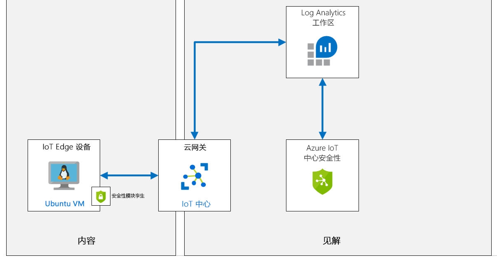
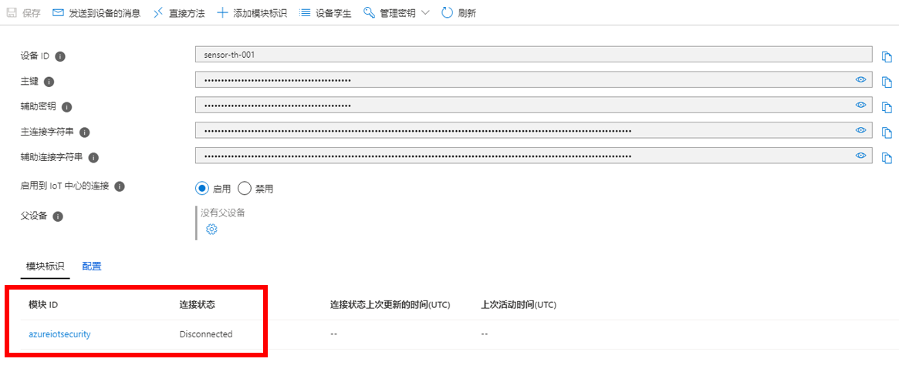
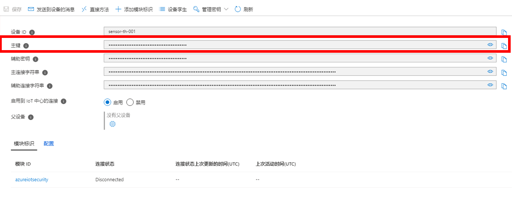
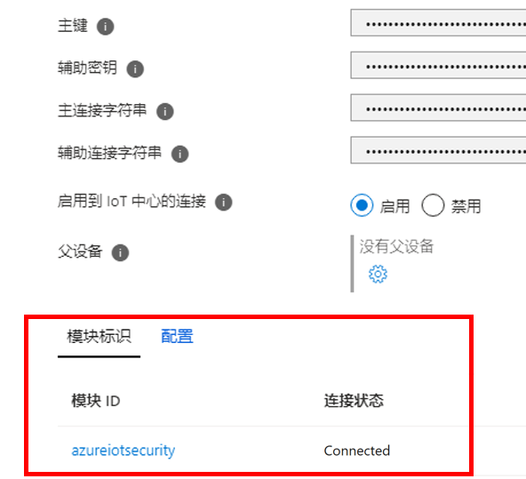

---
lab:
  title: 实验室 18：使用 Azure Defender for IoT 检测 IoT 设备是否被篡改
  module: 'Module 10: Azure Defender and IoT Security'
---

# <a name="detect-device-tampering-with-azure-defender-for-iot"></a>使用 Azure Defender for IoT 检测设备篡改情况

## <a name="lab-scenario"></a>实验室场景

Contoso 在构建所有解决方案时都考虑到了安全性。 但是，他们希望了解如何更好地在其所有本地和云工作负载（包括其 Azure IoT 解决方案）中获得安全性的统一视图。 另外，在加入新设备时，该公司希望跨工作负载（Leaf 设备、Microsoft Edge 设备、IoT 中心）应用安全策略，以确保符合安全标准并改善安全状况。

Contoso 正在增加一条配备了新 IoT 设备的全新装配线，以帮助解决增加新订单带来的运输和包装需求。 你希望确保所有新设备都受到保护，并且还希望能够看到可帮助继续提高解决方案安全性的安全建议（考虑完整的端到端 IoT 解决方案）。 你将开始针对解决方案使用 Azure IoT Center for IoT 进行调查。

Contoso 还正在安装新连接的恒温器，以提高对不同奶酪储藏室温度的监视和控制能力。 作为 Contoso 安全要求的一部分，你将创建一个自定义警报，以监视恒温器是否超出了预期的遥测传输频率。

将创建以下资源：



> 提示：Azure Defender for IoT 之前被称为适用于 IoT 的 Azure 安全中心 。 由于更名是分阶段开展的，因此可能会在在线文档、GitHub 资源和本内容中发现一些不一致的地方。

## <a name="in-this-lab"></a>本实验室概览

在本实验室中，你将完成以下活动：

* 配置实验室先决条件（所需的 Azure 资源）
* 启用 Azure Defender for IoT
* 创建并注册新设备
* 创建一个安全模块孪生
* 在 Linux 设备上安装基于 C# 的安全代理
* 配置受监视的资源
* 创建自定义警报
* 创建控制台应用以触发警报
* 在 Azure Defender for IoT 查看警报

## <a name="lab-instructions"></a>实验室说明

### <a name="exercise-1-configure-lab-prerequisites"></a>练习 1：配置实验室先决条件

本实验室假定以下 Azure 资源可用：

| 资源类型 | 资源名称 |
| :-- | :-- |
| 资源组 | rg-az220 |
| IoT 中心 | iot-az220-training-{your-id} |

若要确保这些资源可用，请完成以下步骤。

1. 在虚拟机环境中，打开 Microsoft Edge 浏览器窗口，然后导航到以下 Web 地址：
 
    +++https://portal.azure.com/#create/Microsoft.Template/uri/https%3A%2F%2Fraw.githubusercontent.com%2FMicrosoftLearning%2FAZ-220-Microsoft-Azure-IoT-Developer%2Fmaster%2FAllfiles%2FARM%2Flab18.json+++

    > 注意：每当看到绿色的“T”符号（例如 +++输入此文本+++）时，可以单击关联的文本，信息将键入到虚拟机环境内的当前字段中。

1. 如果系统提示登录到 Azure 门户，请输入你在本课程中使用的 Azure 凭据。

    将显示“自定义部署”页。

1. 在“项目详细信息”下的“订阅”下拉列表中，确保你打算在本课程中使用的 Azure 订阅已选中 。

1. 在“资源组”下拉列表中，选择“rg-az220” 。

    > 注意：如果未列出 rg-az220：
    >
    > 1. 在“资源组”下拉列表中，选择“新建”。
    > 1. 在“名称”下，输入 rg-az220 。
    > 1. 单击 **“确定”** 。

1. 在“实例详细信息”下的“区域”下拉列表中，选择离你最近的区域 。

    > 注意：如果 rg-az220 组已存在，则“区域”字段将设置为资源组使用的区域，并且为只读 。

1. 在“你的 ID”字段中，输入在练习 1 中创建的唯一 ID。

1. 在“课程 ID”字段中，输入 az220 。

1. 若要验证模板，请单击“查看和创建”。

1. 验证通过后，单击“创建”。

    将启动部署。

1. 部署完成后，在左侧导航区域中，若要查看模板的任何输出值，请单击“输出”。

    记下输出供稍后使用：

    * connectionString

现已创建资源。

### <a name="exercise-2-enable-azure-defender-for-iot-hub"></a>练习 2：启用 Azure Defender for IoT 中心

借助 Azure Defender for IoT，你能够统一安全管理，同时对混合云工作负载以及 Azure IoT 解决方案启用端到端的威胁检测和分析。

Azure Defender for IoT 由以下组件构成：

* IoT 中心集成
* 设备代理（可选）
* 发送安全消息 SDK
* 分析管道

#### <a name="task-1-enable-azure-defender-for-iot"></a>任务 1：启用 Azure Defender for IoT

在此任务中，你将为 IoT 中心启用 Azure Defender for IoT。

1. 如有必要，请使用 Azure 帐户凭据登录到 Azure 门户。

    如果有多个 Azure 帐户，请确保使用与本课程要使用的订阅绑定的帐户登录。

1. 在 Azure 仪表板上，单击“iot-az220-training-{your-id}”。

    仪表板上的 rg-az220 资源组磁贴应该具有指向你的 IoT 中心的链接。

1. 在左侧菜单的“Defender for IoT”下，单击“概述” 。

    首次打开“安全性”窗格时，会载入 Azure Defender for IoT 中心。

1. 如果显示“保护 IoT 解决方案”按钮，请单击“保护 IoT 解决方案”，然后在出现提示时刷新浏览器窗口 。

    片刻之后，你会看到消息“成功载入此 IoT 中心，请刷新以使更改生效”

1. 花费片刻时间查看“安全概述”窗格上的内容。

    > **注意**：载入 Azure Defender for IoT 的第一时间是无法立即检测到威胁的，在本实验室结束前，你将看到此“概览”窗格上报告威胁检测。

#### <a name="task-2-log-analytics-creation"></a>任务 2：创建 Log Analytics

启用 Azure Defender for IoT 以后，应创建 Azure Log Analytics 工作区，以用于存储 IoT 设备、IoT Edge 和 IoT 中心的原始安全事件、警报和建议。

在此任务中，你将快速查看 Log Analytics 的工作区配置。

1. 在 Defender for IoT 下的左侧导航区域中，单击“设置” 。

    随后显示“设置”页面，其中列出了可配置的四个部分：

    * 数据收集
    * 推荐配置
    * 受监视资源
    * 自定义警报

1. 要查看默认“数据收集”设置，请单击“数据收集” 。

1. 在“工作区配置”部分的“选择要连接到的 Log Analytics 工作区:”下，确保切换按钮设置为“开”  。

1. 在“订阅”下拉列表中，确保已选择于本实验室要使用的订阅。

1. 在“工作区”下拉列表下，单击“创建新工作区” 。

1. 在“Log Analytics 工作区”窗格的“Log Analytics 工作区”下，输入“log-az220-training-{your-id}”  。

1. 在“订阅”下，请确保已选择本课程要使用的订阅。

1. 在“资源组”下拉列表中，单击“rg-az220”。

1. 在“位置”下拉列表中，选择离你最近或已经预配 Azure IoT 中心的 Azure 区域。

    要查看可用区域，请参阅 [https://azure.microsoft.com/global-infrastructure/services/?products=monitor&regions=all](https://azure.microsoft.com/global-infrastructure/services/?products=monitor&regions=all)。

1. 在“定价层”下，确保已选择“即用即付” 。

1. 要创建工作区，请单击“确定”。

    片刻之后，将创建工作区并关闭窗格。

1. 返回“设置 | 数据收集”页面，在“工作区”下拉列表中，选择 log-az220-training-{your-id}  

1. 确保已勾选“访问原始安全数据”。

1. 确保已勾选“深度安全建议和自定义警报”。

1. 确保已勾选“IP 数据收集”。

1. 要保存“数据收集”配置，请单击“保存”，要关闭页面，请单击页面右上方的“关闭”按钮 。

### <a name="exercise-3-create-and-register-a-new-device"></a>练习 3：创建并注册新设备

在本练习中，你将设置一个之后用于模拟 IoT 设备的虚拟机。 在本实验室后面的部分中，你将使用此设备测量传送带上的振动。

#### <a name="task-1-create-a-new-iot-device"></a>任务 1：新建 IoT 设备

在此任务中，你将创建代表你的 IoT 设备的虚拟机。 你将在这个实验室中使用 VM 而不是模拟设备代码，因为你要在 IoT 设备 (VM) 上安装一个安全模块。

1. 使用你的 Azure 帐户凭据登录到 [portal.azure.com](https://portal.azure.com)。

1. 在“搜索资源、服务和文档”字段中，输入“虚拟机” 。

1. 在搜索结果的“服务”下，单击“虚拟机” 。

1. 在“虚拟机”页面上，单击“+ 创建”并选择“虚拟机”  。

1. 在“创建虚拟机”边栏选项卡的“订阅”下拉菜单中，请确保已选择将用于本课程的订阅。

1. 在“资源组”下拉列表中，单击 rg-az220vm 。

    > **注意**：我们将使用一个资源组来跟踪和管理本课程中创建的所有虚拟机资源。 如果 rg-az220vm 资源组还没有创建，请使用下面的说明立即创建：

    * 在“资源组”下拉列表中，选择“新建”。
    * 在上下文菜单中的“名称”下，输入“rg-az220vm”，然后单击“确定”

    > **注意**：你可能会遇到建议为每个 VM 创建一个单独的资源组的指导。 为每个虚拟机创建一个单独的资源组可以帮助你管理添加到虚拟机的任何额外资源。 但由于在本课程中 VM 的使用方式比较简单，因此为每个 VM 建立单独的资源组是不必要的，也是不实际的。

1. 在“实例详细信息”的“虚拟机名称”文本框中，输入“vm-az220-training-edge0002-{your-id}”

1. 在“区域”下拉列表中，选择离你最近或已经预配 Azure IoT 中心的 Azure 区域。

1. 在“可用性选项”下拉列表中，确保选中“无需基础架构冗余”。

    > **提示**：Azure 提供一系列的选项，用于管理应用程序的可用性和复原能力。 将解决方案构建为使用可用性区域或可用性集中的已复制 VM，使应用和数据免受事件中心中断和维护事件的影响。 在本实验室中，我们不需要任何高可用性功能。

1. 在“映像”字段，选择“Ubuntu 服务器 18.04 LTS - Gen2”映像 。

1. 将“Azure Spot 实例”字段保留未勾选状态。

1. 在“大小”右侧，单击“改变大小”。

1. 在“选择 VM 大小”边栏选项卡的“VM 大小”下，单击 DS1_v2，然后单击“选择”   。

    可能需要选择“查看所有大小”链接来选择此大小。

    > **注意**：并非所有 VM 大小都可在所有区域中使用。 如果在后续步骤中无法选择 VM 大小，请尝试其他区域。 例如，如果“美国西部”没有可用的尺寸，请尝试“美国西部 2”。

1. 在“管理员帐户”下的“身份验证类型”右侧，单击“密码”。

1. 对于 VM 管理员帐户，输入用户名、密码和确认密码字段的值。

    > **重要提示：** 请勿遗失/忘记这些值 - 没有这些值就无法连接到 VM。

1. 请注意，“入站端口规则”配置为启用入站 SSH 访问 VM 的权限。

    这将用于远程连接到 VM 进行配置/管理。

1. 单击“查看 + 创建”。

1. 等待将显示在边栏选项卡顶部的“验证通过”消息，然后单击“创建”。

    > **注意**：部署最多可能需要 5 分钟才能完成。 可以在部署时继续进行下一个练习。

#### <a name="task-2-register-new-devices"></a>任务 2：注册新设备

由于必须先将设备注册到 IoT 中心才能进行连接，我们来创建注册。

1. 在“Azure 门户中心”菜单上，单击“仪表板”。

1. 在 rg-az220 资源组磁贴上，单击“iot-az220-training-{your-id}”。

    还有许多其他方法可以打开 IoT 中心边栏选项卡，可以使用你喜欢的任何方法。

1. 在左侧菜单中的“设备管理”下，单击“设备” ****  **** 。

1. 在“设备”窗格顶部，单击“+ 添加设备” 

1. 在“设备 ID”下，输入“vm-az220-training-edge0002-{your-id}” 

    是的，你要使用分配给 VM 的名称作为设备 ID。

    你将使用**对称密钥**进行身份验证，因此可以保留其他设置的默认值。

1. 在边栏选项卡顶部，单击“保存”。

### <a name="exercise-4-create-a-security-module-twin"></a>练习 4:创建一个安全模块孪生

Azure Defender for IoT 可与现有的 IoT 设备管理平台完全集成，使你能够管理设备的安全状态，以及利用现有的设备控制功能。

Azure Defender for IoT 利用模块孪生机制，并为每个设备维护一个名为 azureiotsecurity 的安全模块孪生。 该安全模块孪生保存每个设备的所有设备安全性相关信息。 为了充分利用 Azure Defender for IoT 功能，你需要为新的 IoT Edge 设备创建、配置和使用这些安全模块孪生。

可使用以下两种方法中的任意一种创建安全模块孪生 (azureiotsecurity)：

* 使用[模块批处理脚本](https://github.com/Azure/Azure-IoT-Security/tree/master/security_module_twin)。 该脚本使用默认配置自动为新设备（或没有模块孪生的设备）创建模块孪生。
* 使用每个设备的特定配置分别手动编辑每个模块孪生。

在此任务中，你将手动创建一个安全模块孪生。

1. 在 Azure 门户中，如有必要，导航到 IoT 中心的“IoT 设备”窗格。

    要打开 IoT 中心边栏选项卡的“IoT 设备”窗格，请在左侧菜单中的“设备管理”下，单击“设备”  。

1. 在“设备 ID”下，单击“vm-az220-training-edge0002-{your-id}” 。

    你可能需要单击“加载更多”以查看所列设备。

1. 在“vm-az220-training-edge0002-{your-id}”边栏选项卡顶部附近，单击“+ 添加模块标识”。

1. 在“添加模块标识”窗格的“模块标识名称”下，输入“azureiotsecurity”

    由于你将使用对称密钥进行身份验证，因此可以将所有字段保留为默认值。

1. 在窗格底部，单击“保存”。

1. 在“vm-az220-training-edge0002-{your-id}”边栏选项卡的“模块标识”下，现在应该可以看到列出的 azureiotsecurity 设备  。

    请注意，连接状态为“已断开”。

    > **重要说明**：模块标识名称必须是“azureiotsecurity”，不能是其他唯一名称。

    

1. 在“vm-az220-training-edge0002-{your-id}”边栏选项卡上，在“主键”右侧单击“复制”，然后保存该值供以后使用  。

    > **注意**：确保复制设备的“主键”而不是连接字符串。

    

1. 回到 IoT 中心边栏选项卡。

1. 在左侧菜单上，单击“概述”。

1. 在边栏选项卡顶部附近的“概要”区域中，在“主机名”右边，单击“复制到剪贴板”，然后保存该值以备后用。

    > **注意**：IoT 中心的主机名类似于：iot-az220-training-cah102119.azure-devices.net

### <a name="exercise-5-deploy-azure-defender-for-iot-c-security-agent"></a>练习 5：部署 Azure Defender for IoT C# 安全代理

Azure Defender for IoT 为通过 IoT 中心记录、处理、聚合和发送安全数据的安全代理提供了参考体系结构。 有基于 C 和 C# 的代理。 对于具有更多受限或最少设备资源的设备，建议使用 C 代理。

安全代理不支持以下功能：

* 从基础操作系统（Linux、Windows）收集原始安全事件。 如需了解有关可用安全数据收集器的更多信息，请参阅《Azure Defender for IoT 代理配置》。
* 将原始安全事件聚合到通过 IoT 中心发送的消息中。
* 使用现有的设备标识或专用模块标识进行身份验证。 要了解更多信息，请参阅《安全代理身份验证方法》。
* 使用 azureiotsecurity 模块孪生远程配置。 如需了解更多信息，请参阅《配置 Azure Defender for IoT 代理》。

在本练习中，你将添加用于 C# 的安全代理，并将其部署到模拟设备 (Linux VM)。

#### <a name="task-1-logging-into-iot-device---linux-vm"></a>任务 1：登录 IoT 设备：Linux VM

1. 如有必要，请使用 Azure 帐户凭据登录到 Azure 门户。

    如果有多个 Azure 帐户，请确保使用与本课程要使用的订阅绑定的帐户登录。

1. 在 Azure 门户菜单中，单击“所有资源”。

    请务必选择“所有资源”，而非“所有服务”。

1. 在“所有资源”边栏选项卡，在“按名称筛选”文本框，输入“vm-az220-training-edge0002”

1. 在“名称”下，单击“vm-az220-training-edge0002-{your-id}” 。

    新创建的虚拟机 (vm-az220-training-edge0002-{your-id}) 的“概述”窗格现在应该已打开。

1. 在边栏选项卡顶部，单击“连接”，然后单击“SSH”。

1. 花点时间查看“连接”窗格的内容

    正如在本教程前面看到的，向你提供了用于打开 SSH 连接的示例命令。

1. 使用示例 SSH 命令来创建一个用于连接虚拟机的命令。

    将示例命令复制到文本编辑器，然后从命令中删除 `-i <private key path>。 你应该会看到以下格式的命令：

    ```cmd\sh
    ssh <admin user>@<ip address>
    ```

    命令应类似于：`ssh demouser@52.170.205.79`

1. 在 Azure 门户工具栏上，单击“Cloud Shell”。

    确保在 Cloud Shell 中选择“Bash”环境。

1. 在 Cloud Shell 命令提示符处，输入在上面创建的 `ssh` 命令，然后按 Enter。

1. 当提示“确定要继续连接吗?”时，键入“yes”，然后按 Enter。

    此提示是安全确认，因为用于保护与 VM 的连接的证书为自签名证书。 系统将记住此提示的回答，以便用于后续连接，并且仅在第一次连接时提示。

1. 当提示输入密码时，输入你为 VM 创建的管理员密码。

    请注意，连接后终端命令提示符将更改为显示 Linux VM 名称，类似于以下内容。

    ```cmd/sh
    demouser@vm-az220-training-edge0002-{your-id}:~$
    ```

    这有助于你跟踪连接到哪个 VM 和跟踪当前用户。

#### <a name="task-3-add-symmetric-keys-to-your-device"></a>任务 3：将对称密钥添加到设备

你可以使用安全代理的 C# 版本连接到 IoT 中心。 要实现连接，你将需要设备的对称密钥或证书信息。

在本实验室中，你将使用对称密钥作为身份验证，并需要将其存储在设备上的临时文本文档中。

1. 确认你是否拥有可用的 vm-az220-training-edge0002-{your-id} 设备的主键值。

    你之前在本实验室应已保存主键值。 如果没有，请完成以下操作：

    1. 打开新的浏览器标签页，在该新标签页中导航到 Azure 门户。
    1. 在 Azure 门户菜单上，单击“仪表板”，然后打开 IoT 中心。
    1. 在左侧菜单的“资源管理器”下，单击“IoT 设备”。
    1. 在“设备 ID”下，单击“vm-az220-training-edge0002-{your-id}” 。
    1. 复制详细信息列表中的主键。
    1. 返回 Azure Cloud Shell 浏览器选项卡 - 此时你应该仍与 vm-az220-training-edge0002-{your-id} 虚拟机处于连接状态。

1. 在 Cloud Shell 命令提示符下输入以下命令：

    ```cmd/sh
    echo "<primary_key>" > s.key
    ```

    此命令将使用 vm-az220-training-edge0002-{your-id} 设备的主键创建设备身份验证类型文件 。

    > **注意**：要检查是否向文件添加了正确的主键，请使用 `nano s.key` 命令打开文件。 检查设备的主键是否在文件中。 要退出 nano 编辑器，请按住 `Ctrl` 和 `X`。 按住 `shift` 和 `Y` 保存文件。 然后按 Enter。

#### <a name="task-4-installing-security-agent"></a>任务 4：安装安全代理

1. 确保 Cloud Shell 会话仍然通过 SSH 连接到你的 VM。

1. 在 Cloud Shell 命令提示符下，要将最新版本的 C# 安全代理下载到设备，请输入以下命令：

    ```bash
    wget https://github.com/Azure/Azure-IoT-Security-Agent-CS/releases/download/0.0.6/ubuntu-18.04-x64.tar.gz
    ```

    > **注意**：请注意，上述命令面向 Ubuntu Server 18.04 LTS

1. 在 Cloud Shell 命令提示符处，要提取包的内容并导航到 `/Install` 文件夹，请输入以下命令：

    ```bash
    tar -xzvf ubuntu-18.04-x64.tar.gz && cd Install
    ```

1. 在 Cloud Shell 命令提示符处，要向 `InstallSecurityAgent` 脚本添加执行权限，请输入以下命令：

    ```bash
    chmod +x InstallSecurityAgent.sh
    ```

1. 在 Cloud Shell 命令提示符下，自定义并输入以下命令：

    你需要将这些占位符值替换为你的身份验证参数。

    ```bash
    sudo ./InstallSecurityAgent.sh -i -aui Device -aum SymmetricKey -f <Insert file location of your s.key file> -hn <Insert your full IoT Hub host name> -di vm-az220-training-edge0002-{your-id}
    ```

    该命令应如下所示：

    `sudo ./InstallSecurityAgent.sh -i -aui Device -aum SymmetricKey -f ../s.key -hn iot-az220-training-ab200213.azure-devices.net -di vm-az220-training-edge0002-{your-id}`

    > **注意**：确保指定你的 IoT 中心主机名，而不是列出的那个主机名

    > **重要说明**：确保使用完整的 IoT 中心主机名（即 iot-az220-training-ab200213.azure-devices.net）作为 `-hn` 开关值。

    此脚本可执行以下功能：

    * 安装必备组件。
    * 添加服务用户（在禁用交互式登录的情况下）。
    * 安装用作守护程序的代理 - 假设设备使用 **systemd** 进行服务管理。
    * 配置 **sudo 用户**以允许代理以 root 身份执行某些任务。
    * 使用提供的身份验证参数配置代理。

1. 通过查看 Cloud Shell 终端中的输出观察命令进度。

    请注意，需要重启才能完成代理安装。

1. 在 Cloud Shell 终端中，输入“y”开始重启

    设备重启后，SSH 会话将丢失。

1. 在 Cloud Shell 命令提示符下，请输入你先前使用的 SSH 命令重新连接到虚拟机。

    Azure Defender for IoT 代理现在应该处于活动状态并正在运行。

1. 在 Cloud Shell 命令提示符下，请输入以下命令检查 Azure Defender for IoT 代理的部署状态。

    ```cmd/sh
    systemctl status ASCIoTAgent.service
    ```

    此时会看到与下面类似的输出：

    ```log
    ● ASCIoTAgent.service - Azure Security Center for IoT Agent
       Loaded: loaded (/etc/systemd/system/ASCIoTAgent.service; enabled; vendor preset: enabled)
       Active: active (running) since Wed 2020-01-15 19:08:15 UTC; 3min 3s ago
     Main PID: 1092 (ASCIoTAgent)
        Tasks: 7 (limit: 9513)
       CGroup: /system.slice/ASCIoTAgent.service
            └─1092 /var/ASCIoTAgent/ASCIoTAgent
    ```

    具体来说，你应该验证该服务是否是 Loaded: loaded 和 Active: active (running)。

    > **注意**：如果 Azure Defender for IoT 代理未运行或未处于活动状态，请查看[为 Linux 部署 Defender for IoT 基于 C# 的安全代理](https://docs.microsoft.com/en-us/azure/defender-for-iot/device-builders/how-to-deploy-linux-cs)。 常见问题是可能会造成服务 Active: activating 的键值错误或未指定完整的 IoT 中心主机名。

1. 在 Azure 门户中，导航回 IoT 中心边栏选项卡，然后打开 vm-az220-training-edge0002-{your-id} 设备边栏选项卡。

    打开 IoT 中心边栏选项卡，在“设备管理”下的“导航菜单”上，单击“设备”，然后单击 vm-az220-training-edge0002-{your-id}  。

1. 在“模块标识”下，请注意“azureiotsecurity”模块的当前状态为“已连接”。

    

现在，设备上已安装了 Azure Defender for IoT 设备代理，这些代理将能够收集、聚合和分析设备中的原始安全事件。

### <a name="exercise-6-configure-solution-management"></a>练习 6：配置解决方案管理

Azure Defender for IoT 为基于 Azure 的 IoT 解决方案提供端到端安全性。

使用 Azure Defender for IoT 时，可在一个仪表板中监视整个 IoT 解决方案，并显示 Azure 中你的所有 IoT 设备、IoT 平台和后端资源。

在 IoT 中心启用后，Azure Defender for IoT 会自动识别也已连接到你的 IoT 中心的，以及与你的 IoT 解决方案相关的其他 Azure 服务。

除了自动关系检测以外，还可以选择要将其他哪些 Azure 资源组标记为 IoT 解决方案的一部分。 做出选择后，可以添加整个订阅、资源组或单个资源。

#### <a name="task-1-open-iot-hub"></a>任务 1：打开 IoT 中心

1. 在浏览器中，打开 Azure 门户并导航到 IoT 中心。

1. 在左侧菜单的 Defender for IoT 下，单击“设置” 。

    “设置”页面会列出以下部分：

    * 数据收集
    * 推荐配置
    * 受监视资源
    * 自定义警报

1. 要查看资源列表，请单击“受监视资源”。

    请注意，资源列表已包括你的 IoT 中心、之前激活 Azure Defender for IoT 时创建的工作区以及当前订阅。

1. 在窗格顶部，单击“编辑”。

    “解决方案管理”窗格会打开，在其中可以通过选择其他 Azure 资源的所属资源组来将这些资源连接到安全解决方案。

1. 在“订阅”下，请确保已选择本课程要使用的订阅。

    > **注意：** 你可以将多个订阅中的资源添加到安全解决方案中。

1. 在“资源组”下拉列表中，单击“rg-az220vm”。

    现在，你应该选择了两个资源组。 请注意，“资源”列表已更新，以反映你刚刚添加的资源组中的其他资源。

1. 在“解决方案管理”窗格中，单击“应用”。

    如果“应用”按钮不可用，不用担心，已经添加资源。

1. 关闭“解决方案管理”窗格。

定义所有资源关系后，Azure Defender for IoT 会利用 Azure Defender 来提供安全建议，并针对这些资源发出警报。

#### <a name="task-2-view-azure-defender-for-iot-in-action"></a>任务 2：查看运行中的 Azure Defender for IoT

现在，你已在设备上安装了安全代理，并配置了解决方案。 现在非常适合检查 Azure Defender for IoT 的不同视图。

1. 在左侧菜单的“Defender for IoT”下，单击“概述” 。

    你将看到两个图表上显示的设备、中心和其他资源的运行状况概述。 你可以看到在开启 Azure IoT Defender 时立即启用的内置实时监视、建议和警报。

    

1. 在左侧菜单的“安全性”下，要查看受监视资源，请单击“设置”，然后单击“受监视资源”  

    此窗格列出了当前为你的 IoT 解决方案监视的所有资源。 你可以一目了然地查看 IoT 解决方案中资源的总体运行状况，然后可以深入了解每个资源，查看更多的详细信息。 如果想添加额外的资源，可以单击“编辑”，然后选择要添加其中资源的订阅和资源组。

    > **重要说明**：IoT 资源安全性配置的评估过程可能需要多达 24 小时的时间，因此仪表板上显示的初始状态无法反映资源的实际状态。

    下图显示了执行安全评估后的仪表板状态。

    

### <a name="exercise-7-introduce-custom-alerts"></a>练习 7：引入自定义警报

自定义安全组和警报可用于在整个 IoT 解决方案中充分利用端到端安全信息和分类设备知识。 这将帮助你为解决方案提供更好的安全性。

#### <a name="why-use-custom-alerts"></a>为何要使用自定义警报？

你比现成算法更了解你的 IoT 设备。

对于完全了解其预期设备行为的用户，通过 Azure Defender for IoT，可以将这种了解转化为设备行为策略，并对与预期正常行为偏离的任何情况发出警报。

#### <a name="task-1---customize-an-alert"></a>任务 1 - 自定义警报

如上所述，了解其解决方案的特定所需行为的客户可以配置自定义警报，这些警报将在超出所需行为时触发。 在本练习中，你将创建一个自定义警报，用于监控通过 **MQTT** 协议发送的“设备到云”消息。

在正常情况下，Contoso 的奶酪储藏室监控系统不会以很高的速率发送 IoT 中心温度和湿度数据。 你希望每台设备在五分钟的时间内发送一到五个设备到云的消息。 此范围适用于傍晚时段，此时温度变化可能更快，并且可能需要更高频率的数据以确保各值不超出既定边界值。

在此任务中，你将创建一个自定义警报。

1. 在 Azure 门户中，导航到“IoT 中心”边栏选项卡。

1. 在左侧菜单的 Defender for IoT 下，单击“设置” 。

    “设置”页面会列出以下部分：

    * 数据收集
    * 推荐配置
    * 受监视资源
    * 自定义警报

1. 要查看自定义警报列表，请单击“自定义警报”。

1. 花点时间检查一下“自定义提醒”窗格。

    该窗格乍看可能是空的，但“名称”下列出的项目实际上是为你自动创建的**默认**安全组。

    使用安全组可以定义设备的逻辑组，并集中管理设备的安全状态。 这些组可以表示具有特定硬件的设备、部署在某个位置的设备，或适合具体需求的其他任何组。

1. 要将自定义警报添加到默认安全组，请单击“默认”。

    “设备安全组”边栏选项卡列出所有处于活动状态的自定义警报。 由于这是你第一次访问边栏选项卡，因此它将是空的。

1. 在边栏选项卡顶部，单击“创建自定义警报规则”。

    “创建自定义警报规则”窗格将打开。 请注意“设备安全组”字段中填充了“默认”组。

1. 在“自定义警报”下拉菜单中，单击“设备到云消息的数量（MQTT 协议）不在允许范围内”。

    > **提示**：查看许多可用的自定义警报。 考虑如何使用它们来保护你的解决方案。

    > **注意**：“描述”和“必需的属性”会根据所选的“自定义警报”而变化。

1. 在“必需的属性”下的“最小阈值”字段，输入“1”。

    这满足了在 5 分钟内至少发送一条消息的期望。

1. 在“最大阈值”下，输入“5”。

    这使得 5 分钟内的预期消息发送数量不超过五个。

1. 在“时间窗口大小”下拉列表中，单击“00:05:00”。

    这符合已设定的五分钟时长。

    > **注意**：有 4 个可用时间窗口：
    > * 5 分钟
    > * 10 分钟
    > * 15 分钟
    > * 30 分钟

1. 在“创建自定义预警规则”窗格底部，单击“确定”。

1. 在“默认”（设备安全组）边栏选项卡顶部，单击“保存”。

    如果不保存新警报，下一次关闭 IoT 中心时会删除该警报。

    你将返回到自定义警报列表。 下图显示了一些自定义警报：

    

### <a name="exercise-8-configure-the-device-app"></a>练习 8：配置设备应用

在本练习中，你将配置一个 IoT 中心设备和一个 .Net Core 控制台应用程序 (C#)，它们将利用 Microsoft.Azure.Devices.Client nuget 包连接到 IoT 中心。 控制台应用程序将每 10 秒钟发送一次遥测，其目的是超过（你在上一个练习中创建的）自定义警报中配置的“设备到云”消息阈值。

#### <a name="task-1-register-new-iot-device"></a>任务 1：注册新的 IoT 设备

必须先将设备注册到 IoT 中心，然后该设备才能进行连接。

1. 在 Azure 门户菜单上，单击“仪表板”，然后打开 IoT 中心。

1. 在左侧菜单中的“设备管理”下，单击“设备” ****  **** 。

1. 在“IoT 设备”窗格顶部，单击“+ 添加设备” 

1. 在“创建设备”边栏选项卡的“设备 ID”下，输入 sensor-th-0070  

    你将使用“对称密钥”进行身份验证，因此将其他值保留为默认值。

1. 在边栏选项卡顶部，单击“保存”。

1. 在“IoT 设备”窗格的“设备 ID”下，单击“sensor-th-0070”。

    你可能需要单击“加载更多”以访问 sensor-th-0070 设备。

1. 要显示设备孪生，请单击“设备孪生”。

    此时会显示现有的设备孪生 JSON，如下所示：

    ```json
    {
        "deviceId": "sensor-th-0070",
        "etag": "AAAAAAAAAAE=",
        "deviceEtag": "Mjg2NzY5NzAw",
        "status": "enabled",
        "statusUpdateTime": "0001-01-01T00:00:00Z",
        "connectionState": "Disconnected",
        "lastActivityTime": "0001-01-01T00:00:00Z",
        "cloudToDeviceMessageCount": 0,
        "authenticationType": "sas",
        "x509Thumbprint": {
            "primaryThumbprint": null,
            "secondaryThumbprint": null
        },
        "version": 2,
        "tags": {
            "SecurityGroup": "default"
        },
        "properties": {
            "desired": {
                "$metadata": {
                    "$lastUpdated": "2020-06-11T13:09:38.4712899Z"
                },
                "$version": 1
            },
            "reported": {
                "$metadata": {
                    "$lastUpdated": "2020-06-11T13:09:38.4712899Z"
                },
                "$version": 1
            }
        },
        "capabilities": {
            "iotEdge": false
        }
    }
    ```

1. 要将设备添加到默认安全组，请在“版本”和“属性”字段之间插入以下 JSON  ：

    ```json
    "tags": {
        "SecurityGroup": "default"
    },
    ```

    产生的 JSON 会类似于：

    ```json
    {
        "deviceId": "sensor-th-0070",
        "etag": "AAAAAAAAAAE=",
        "deviceEtag": "Mjg2NzY5NzAw",
        "status": "enabled",
        "statusUpdateTime": "0001-01-01T00:00:00Z",
        "connectionState": "Disconnected",
        "lastActivityTime": "0001-01-01T00:00:00Z",
        "cloudToDeviceMessageCount": 0,
        "authenticationType": "sas",
        "x509Thumbprint": {
            "primaryThumbprint": null,
            "secondaryThumbprint": null
        },
        "version": 2,
        "tags": {
            "SecurityGroup": "default"
        },
        "properties": {
            "desired": {
                "$metadata": {
                    "$lastUpdated": "2020-06-11T13:09:38.4712899Z"
                },
                "$version": 1
            },
            "reported": {
                "$metadata": {
                    "$lastUpdated": "2020-06-11T13:09:38.4712899Z"
                },
                "$version": 1
            }
        },
        "capabilities": {
            "iotEdge": false
        }
    }
    ```

1. 要应用更新的 JSON，请单击“保存”。

1. 关闭“设备孪生”窗格，并返回“sensor-th-0070”详细信息视图 。

1. 在“主连接字符串”右侧，单击“复制”，然后将值保存到文本文件。

    请务必注意，这是 sensor-th-0070 设备的连接字符串。 你将需要设备应用的连接字符串值。

#### <a name="task-2-configure-a-cave-device-app"></a>任务 2：配置 Cave Device 应用

1. 打开 **Visual Studio Code**。

1. 在“文件”菜单上，单击“打开文件夹”

1. 在“打开文件夹”对话框中，导航到“实验室 18 初学者”文件夹。

1. 单击“CaveDevice”，然后单击“选择文件夹”。

    你应该会在 Visual Studio Code 的资源管理器窗格中看到以下文件：

    * Program.cs
    * CaveDevice.csproj

1. 打开 **Program.cs** 文件。

    粗略地看一下就会发现，CaveDevice 应用程序与前面的实验室中使用的应用程序非常相似。 此版本增加了延迟，因此每 10 秒就会发送一次消息：`await Task.Delay(10000);`

1. 在“终端”菜单上，单击“新终端”。

    注意命令提示符中指示的目录路径。 你无需在上一个实验室项目的文件夹结构中开始构建此项目。

1. 在终端命令提示符下，请输入以下命令以验证应用程序版本：

   ```bash
   dotnet build
   ```

    输出结果会类似于：

    ```text
    ❯ dotnet build
    Microsoft (R) Build Engine version 16.5.0+d4cbfca49 for .NET Core
    Copyright (C) Microsoft Corporation. All rights reserved.

    Restore completed in 39.27 ms for D:\Az220-Code\AllFiles\Labs\15-Remotely monitor and control devices with Azure IoT Hub\Starter\CheeseCaveDevice\CheeseCaveDevice.csproj.
    CheeseCaveDevice -> D:\Az220-Code\AllFiles\Labs\15-Remotely monitor and control devices with Azure IoT Hub\Starter\CheeseCaveDevice\bin\Debug\netcoreapp3.1\CheeseCaveDevice.dll

    Build succeeded.
        0 Warning(s)
        0 Error(s)

    Time Elapsed 00:00:01.16
    ```

1. 在代码编辑器窗格中，查找以下代码行：

    ```csharp
    private readonly static string deviceConnectionString = "<your device connection string>";
    ```

1. 将 `<your device connection string>` 替换为 sensor-th-0070 设备的主要连接字符串。

1. 在“文件”菜单上，单击“保存”。

1. 在终端命令提示符下，要生成和运行该应用程序，请输入以下命令：

    ```bash
    dotnet run
    ```

1. 验证遥测信息是否已成功发送至 IoT 中心。

    输出应如下所示：

    ```text
    IoT Hub C# Simulated Thermostat Device. CTRL+C to exit.

    2/28/2020 1:32:21 PM > Sending message: {"temperature":25.7199231282435,"humidity":79.50078555359542}
    2/28/2020 1:32:31 PM > Sending message: {"temperature":21.877205091005752,"humidity":61.30029373862794}
    2/28/2020 1:32:41 PM > Sending message: {"temperature":21.245898961204055,"humidity":71.36471955634873}
    2/28/2020 1:32:51 PM > Sending message: {"temperature":32.61750500072609,"humidity":66.07430422961447}
    2/28/2020 1:33:01 PM > Sending message: {"temperature":31.100763578946125,"humidity":79.93955616836416}
    2/28/2020 1:33:11 PM > Sending message: {"temperature":25.02041019034591,"humidity":70.50569472392355}
    ```

    你可以在本实验的其余部分中使该应用运行，以生成多个警报。

### <a name="exercise-9-review-azure-defender-for-iot-alerts"></a>练习 9：查看 Azure Defender for IoT 警报

此时，你的控制台应用将发送足够的遥测数据，以触发先前创建的自定义警报。

> **提示**：警报设置为在 5 分钟内从设备发送到云的消息少于 1 条且多于 5 条时触发。

#### <a name="task-1-review-the-azure-defender-for-iot-dashboard"></a>任务 1：查看 Azure Defender for IoT 仪表板

1. 在 Azure 门户菜单上，单击“仪表板”，然后打开 IoT 中心。

1. 在左侧菜单的“Defender IoT”下，单击“概述” 。

    查看“威胁检测”部分。 你应该看到一个或多个警报显示在“设备安全警报”图表中：

    

    你还应该在“警报最多的设备”磁贴中看到“sensor-th-0070”设备的条目：

    

    > **注意**：警报最多可能需要 30 分钟才会在仪表板上显示。

1. 在“威胁检测”下，单击“警报最多的设备”磁贴。

    此操作将打开“警报”边栏选项卡，你也可以单击左侧菜单中“安全性”下的“安全警报”打开相同的边栏选项卡。

    你将看到一个安全警报列表：

    

    最新警报将标有“新”标签。

1. 单击最新警报。

    将打开一个详细信息窗格。 “一般信息”提供有关警报的高级信息。 在其下方，“最近 10 个受影响的设备”应该列出“sensor-th-0070”设备。

    

1. 返回到 Visual Studio Code 并退出设备应用。

    你可以将输入焦点放在“终端”窗口上并按 **CTRL+C** 来关闭应用。
