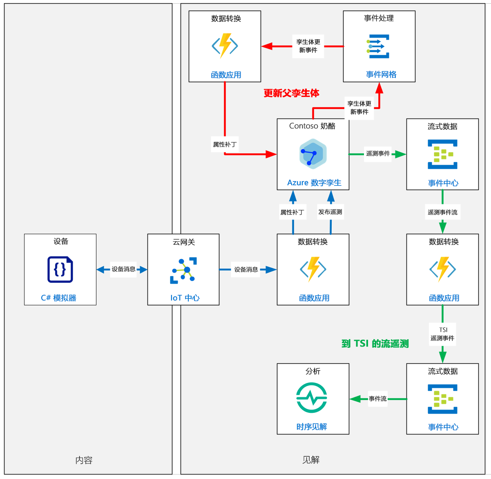
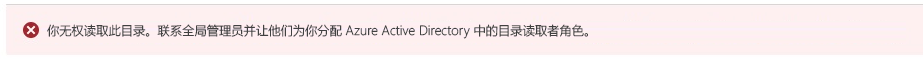
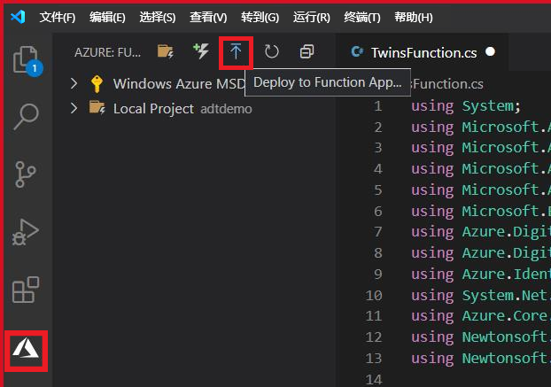
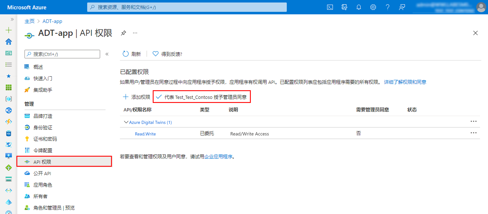
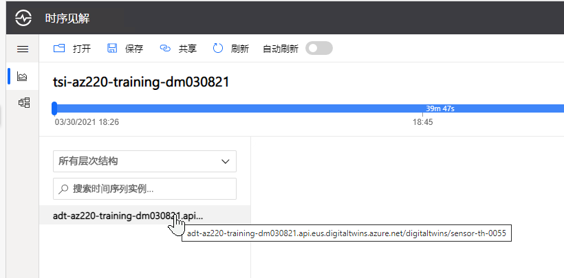
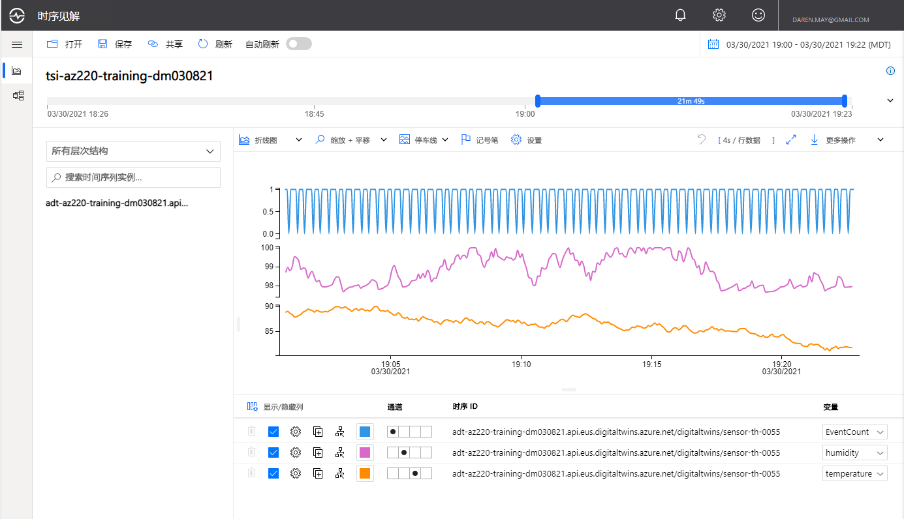

---
lab:
    title: '实验室 19：开发 Azure 数字孪生 (ADT) 解决方案'
    module: '模块 11：使用 Azure 数字孪生进行开发'
---

# 开发 Azure 数字孪生 (ADT) 解决方案

## 实验室场景

Contoso 管理层决定在他们的数字化发展进程中迈出新的一步，利用 Azure 数字孪生 (ADT) 为他们的奶酪制作设施开发模型。利用 Azure 数字孪生，可以创建真实环境的实况模型并与之交互。首先，将每个单独的元素建模为一个数字孪生。然后将它们连接到一个知识图，该图可以响应实时事件并用于查询信息。

为了更好地理解如何以最佳方式利用 ADT，公司要求你构建一个概念验证原型，展示如何将现有的奶酪储藏室设备传感器遥测合并到一个简洁的模型层次结构中：

* 奶酪工厂
* 奶酪储藏室
* 奶酪储藏室设备

公司要求你通过这第一个原型来展示以下场景的解决方案：

* 如何将设备遥测从 IoT 中心映射到 ADT 中的适当设备
* 如何使用子级数字孪生属性的更新来更新父级孪生属性（从奶酪储藏室设备到奶酪储藏室）
* 如何通过 ADT 将设备遥测路由到时序见解

将创建以下资源：



## 本实验室概览

在本实验室中，你将完成以下活动：

* 验证是否满足实验室先决条件（具有必需的 Azure 资源）
* 设计和开发数字孪生体模型
  * 创建并配置 Azure 数字孪生 (ADT) 实例
  * 将 IoT 设备数据映射到 ADT 模型和关系中
  * 创建数字孪生模型并验证模型
* 创建和配置数字孪生体
  * 通过使用 DTDL 来创建数字孪生
  * 使用数字孪生实例生成 ADT 图
* 实现 ADT 图交互（ADT Explorer)
  * 安装并运行 ADT Explorer
  * 查询 ADT 图
  * 更新图中 ADT 实体上的属性
* 将 ADT 与上游和下游系统集成
  * 引入 IoT 设备消息并将消息转换为 ADT
  * 配置 ADT 路由和终结点，用于将遥测发布到时序见解 (TSI)

## 实验室说明

### 练习 1：验证实验室先决条件

#### 任务 1 - 创建资源

本实验室假定以下 Azure 资源可用：

| 资源类型  | 资源名称                |
| :------------- | :--------------------------- |
| 资源组 | rg-az220                     |
| IoT 中心        | iot-az220-training-{your-id} |
| TSI            | tsi-az220-training-{your-id} |
| TSI 访问策略 | access1                   |

> **备注**： 写入 **lab19-setup.azcli** 脚本，在 **Bash** shell 环境中运行 - 在 Azure Cloud Shell 中执行此操作最简便。

1. 使用浏览器，打开 [Azure Cloud Shell](https://shell.azure.com/)，并使用本课程使用的 Azure 订阅登录。

1. 如果系统提示设置 Cloud Shell 的存储，请接受默认设置。

1. 验证 Cloud Shell 是否在使用 **Bash**。

    Azure Cloud Shell 页面左上角的下拉菜单用于选择环境。验证所选的下拉值是否为 **Bash**。

1. 在 Cloud Shell 工具栏上，单击 **“上传/下载文件”** （从右数第四个按钮）。

1. 在下拉菜单中，单击 **“上传”**。

1. 在“文件选择”对话框中，导航到配置开发环境时下载的 GitHub 实验室文件的文件夹位置。

    在本课程的实验室 3（“设置开发环境”）中，通过下载 ZIP 文件并在本地提取内容来克隆包含实验室资源的 GitHub 存储库。提取的文件夹结构包括以下文件夹路径：

    * Allfiles
      * 实验室
          * 19-Azure 数字孪生
            * 设置

    lab19-setup.azcli 脚本文件位于实验室 19 的 Setup 文件夹中。

1. 选择 **“lab19-setup.azcli”** 文件，然后单击 **“打开”**。

    文件上传完成后，系统将显示一条通知。

1. 要验证是否上传了正确的文件，请输入以下命令：

    ```bash
    ls
    ```

    使用 `ls` 命令列出当前目录的内容。你应该会看到列出的 lab19-setup.azcli 文件。

1. 若要为此实验室创建一个包含安装脚本的目录，然后移至该目录，请输入以下 Bash 命令：

    ```bash
    mkdir lab19
    mv lab19-setup.azcli lab19
    cd lab19
    ```

    这些命令将为此实验室创建一个目录，将 **lab19-setup.azcli** 文件放入该目录，然后将当前工作目录更改为该新目录。

1. 为确保 **“lab19-setup.azcli”** 具有执行权限，请输入以下命令：

    ```bash
    chmod +x lab19-setup.azcli
    ```

1. 在“Cloud Shell”工具栏上，请单击 **“打开编辑器”** （右侧的第二个按钮 - **{ }**）以启用对 lab19-setup.azcli 文件的访问。

1. 在 **“文件”** 列表中，要展开 lab19 文件夹并打开脚本文件，请先单击 **“lab19”**，再单击 **“lab19-setup.azcli”**。

    编辑器现在将显示 **lab19-setup.azcli** 文件的内容。

1. 在编辑器中，更新 `{your-id}` 和 `{your-location}` 变量的值。

    以下面的示例为例，需要将 `{your-id}` 设置为在本课程开始时创建的唯一 ID（即 **cah191211**），然后将 `{your-location}` 设置为对你的资源有意义的位置。

    ```bash
    #!/bin/bash

    # Change these values!
    YourID="{your-id}"
    Location="{your-location}"
    ```

    > **备注**： 应将 `{your-location}` 变量设置为要部署所有资源的区域的短名称。输入以下命令，可以看到可用位置及其短名称的列表（**“名称”** 列）：

    ```bash
    az account list-locations -o Table

    DisplayName           Latitude    Longitude    Name
    --------------------  ----------  -----------  ------------------
    East Asia             22.267      114.188      eastasia
    Southeast Asia        1.283       103.833      southeastasia
    Central US            41.5908     -93.6208     centralus
    East US               37.3719     -79.8164     eastus
    East US 2             36.6681     -78.3889     eastus2
    ```

1. 要保存对文件所做的更改并关闭编辑器，请单击编辑器窗口右上角的 **...**，然后单击 **“关闭编辑器”**。

    如果提示保存，请单击 **“保存”**，编辑器将会关闭。

    > **备注**： 可以使用 **Ctrl+S** 随时保存，使用 **Ctrl+Q** 关闭编辑器。

1. 要创建本实验室所需的资源，请输入以下命令：

    ```bash
    ./lab19-setup.azcli
    ```

    运行将花费几分钟时间。每个步骤完成时，你都会看到输出。

#### 任务 2 - 验证工具

1. 打开命令提示符，输入以下命令，验证本地是否安装了 Azure CLI：

    ```powershell
    az --version
    ```

1. 验证列出的 azure-cli 版本是否为 2.4.0 或更高版本

    如果未安装 Azure CLI，需要先安装它，然后才能继续操作。

### 练习 2：创建 Azure 数字孪生资源的实例

在本练习中，将使用 Azure 门户创建 Azure 数字孪生 (ADT) 实例。Azure 数字孪生的连接数据将存储在一个文本文件中供以后使用。最后，将为当前用户分配一个角色，以便能够访问 ADT 资源。

#### 任务 1：使用 Azure 门户创建资源（Azure 数字孪生）

1. 在新的浏览器窗口中打开 [Azure 门户](https://portal.azure.com)。

1. 在 Azure 门户菜单上，单击 **“+ 创建资源”**。

    随即打开 **“新建”** 边栏选项卡，这是 Azure 市场的前端，该市场是可以在 Azure 中创建的所有资源的集合。市场包含来自 Microsoft 和社区的资源。

1. 在 **“搜索市场”** 文本框中，键入 **“Azure 数字孪生”**。

1. 当 **“Azure 数字孪生”** 选项出现时，将其选中，然后单击 **“创建”**。

1. 在 **“创建资源”** 窗格的 **“订阅”** 下，确保选择了本课程要使用的订阅。

    > **备注**： 帐户必须具有订阅的管理员角色

1. 为 **“资源组”** 选择 **“rg-az220”**。

1. 在 **“位置”** 下拉列表中，选择预配 Azure IoT 中心的区域。

1. 为 **“资源名称”** 输入 **“adt-az220-training-{your-id}”**。

1. 要查看输入的值，单击 **“查看 + 创建”**。

1. 要启动部署过程，单击 **“创建”**。

    显示 **“正在进行部署”** 时，请稍候。

1. 选择 **“转到资源”**。

    应会看到 ADT 资源的“概述”窗格，其中包含一个标题为 **“Azure 数字孪生入门”** 的正文部分。

#### 任务 2：将连接数据保存到参考文件

1. 使用 **“记事本”** 或类似的文本编辑器，创建名为 **“adt-connection.txt”** 的文件。

1. 将 Azure 数字孪生实例的名称添加到文件 - **adt-az220-training-{your-id}** 中

1. 将资源组添加到文件 - **rg-az220** 中

1. 在浏览器中，返回“数字孪生”实例的 **“概述”** 窗格。

1. 在窗格的 **“概要信息”** 部分中，找到 **“主机名称”** 字段。

1. 将鼠标指针悬停在 **“主机名称”** 字段上，使用该值右侧的图标将主机名复制到剪贴板，然后将其粘贴到文本文件中。

1. 在文本文件中，通过在主机名的开头添加 **“https://”**，将主机名转换为数字孪生实例的连接 url。

    修改后的 url 类似于：

    ```http
    https://adt-az220-training-dm030821.api.eus.digitaltwins.azure.net
    ```

1. 保存 **adt-connection.txt** 文件。

#### 任务 3：配置“ADT 角色分配”

1. 要更新用户角色，请在左侧菜单中单击 **“访问控制(IAM)”**。

1. 若要查看当前用户的访问权限，单击 **“查看我的访问权限”**。

    随即显示一个窗格，其中列出了当前用户分配。当前，用户具有 **“服务管理员”** 角色。此角色是在 ADT 创建期间分配的。

1. 关闭 **“分配”** 窗格。

1. 若要查看所有用户的现有角色分配，请选择 **“角色分配”** 选项卡。

    当前帐户用户应会列在 **“所有者”** 角色下面。

    > **备注**： 如果显示以下错误，可以忽略。此实验室不需要用于查看其他角色分配的访问权限。
    > 

1. 若要添加新的分配，请单击 **“+ 添加”** 然后单击 **“添加角色分配”**。

1. 在 **“添加角色分配”** 窗格的 **“角色”** 下拉列表中，选择 **“Azure 数字孪生数据所有者”**

1. 确保 **“访问权限的分配对象”** 字段值为 **“用户、组或服务主体”**。

    **备注**： 有很多类型的安全主体可供选择，包括 **“函数应用”**、 **“逻辑应用”**、 **“虚拟机”** 等。

    应提供可用用户的列表。

1. 若要筛选用户列表，可在 **“选择”** 字段中，输入足够的姓名字符串或电子邮件，以便在搜索结果列表中显示完整的姓名和电子邮件地址。

1. 选择与你的用户帐户对应的条目。

    如果不确定正在使用哪个帐户，可打开 **Azure Shell** 并运行以下命令：

    ```bash
    az ad signed-in-user show --query "userPrincipalName" -o tsv
    ```

    输出将显示应选择哪个帐户。

    > **备注**： Azure Active Directory 中托管的用户帐户的格式与外部机构（如为 Skype、Xbox 等创建的 Microsoft 帐户）中托管的用户帐户的格式不同。请确保为登录的帐户选择了正确的条目。例如：
    > * **joe@contoso.com**  -  由 AAD 管理的具有自定义域的帐户
    > * **Joe@joesazure.onmicrosoft.com**  -  由 AAD 管理的具有默认域的帐户
    > * **joe.smith_gmail.com#EXT#@joesazure.onmicrosoft.com**  -  由外部 Microsoft 帐户管理机构管理的用户帐户，该帐户作为具有默认域的来宾添加到的 AAD

1. 若要分配角色，请单击 **“保存”**。

    稍后，将分配角色，当前用户应会在 **“Azure 数字孪生数据所有者”** 角色下列出。

    > **备注**： 外部用户的显示可能需要更长时间。可以尝试单击工具栏中的 **“刷新”**，或导航到 **“概述”** 窗格，然后返回 **“访问控制(IAM)”** 窗格。

Azure 数字孪生资源现在已创建，用户帐户已更新，已可通过 API 访问该资源。

### 练习 3 - 将 IoT 设备数据映射到 ADT 模型和关系中

在本练习中，将使用数字孪生定义语言 (DTDL) 定义代表 Contoso 奶酪工厂的模型的子集。模型定义真实世界对象的特性，例如奶酪生产线的特征。详细程度和对象的大小取决于业务需要。对象可以小到一个温度传感器，大到一栋建筑物或一个工厂，也可以对应于一个传感器、一个人、一辆车、一个过程。它可以是与操作相关的一切事物。模型具有名称，稍后在本实验室中，你将创建模型的数字孪生实例。

> **备注：** 有关 DTDL 的详细信息、必需/可选条目的完整列表以及有效单位的完整列表，请参阅 [DTDL 规范](https://github.com/Azure/opendigitaltwins-dtdl/blob/master/DTDL/v2/dtdlv2.md)。

如前所述，当涉及到通过模型表示业务时，许多分类标准和细节将由业务需求来确定：这些需求包括要解决的问题和要创建的模拟。但模型的某些方面将由构成解决方案一部分的 IoT 设备来确定 - 具体而言，就是这些设备执行的属性、遥测和操作。

在本练习中，将考虑奶酪储藏室设备和奶酪储藏室之间的关系，并创建模型层次结构。然后考虑奶酪储藏室设备的特性，并将其映射为一个数字孪生模型的功能。

> **备注：** 将使用本课程前面开发的奶酪储藏室设备模拟器（代码项目）来定义本练习中的设备特性。源代码包含在此实验室的 **Starter** 文件夹中。

#### 任务 1 - 考虑设备功能

与所有类型的设计工作一样，设计 ADT 模型需要制定一些计划。如要使用 ADT 模型表示 loT 设备，计划内容应包括调研如何将 IoT 设备的特性映射为相应 ADT 模型的字段。应为每个类型的 IoT 设备完成以下步骤。

1. 评估 IoT 中心设备孪生。

    奶酪储藏室设备使用设备孪生（不要与数字孪生混淆）指定以下设置：

    * 所需温度（华氏度）
    * 所需湿度，范围介于 0 - 100

1. 评估 IoT 设备消息的内容。

    奶酪储藏室设备向 IoT 中心发送包含以下内容的消息：

    * 属性
        * sensorID - 当前传感器的 ID（设置为 **S1**）
        * fanAlert - 如果风扇为故障状态，则为 **true**，否则为 **false**。
        * temperatureAlert - 仅当为 true 时出现 - 如果温度与所需温度相差 +/-5 度，则设置为 **true**
        * humidityAlert - 仅当为 true 时出现 - 如果湿度与所需湿度百分比相差 +/-10，则设置为 **true**
    * 遥测
        * 温度 - 当前温度（华氏度）
        * 湿度 - 当前湿度，范围介于 0 - 100

1. 评估任何额外的云到设备或设备到云的交互。

    奶酪储藏室设备支持以下直接方法：

    * SetFanState - 尝试打开或关闭奶酪储藏室风扇（风扇可能会故障）

    对于设备，如果应用了任何消息增强功能，可能还需要考虑这些增强功能。

    下一步是考虑如何在 ADT 模型中表示 IoT 设备特性。

1. 回想一下，ADT 模型在 DTDL 中有四个主要字段：*属性*、*遥测*、*组件*和*关系*。

1. 考虑将 IoT 设备孪生和设备到云消息中指定的属性都映射为 ADT 模型的属性。

    你可能希望将所有 IoT 设备属性都直接映射到 ADT 模型中，也可能会选择其中适合业务需求的部分映射。当前版本的 Azure 数字孪生不提供 IoT 中心（设备属性）和 ADT 模型属性之间的自动集成。

1. 考虑将 IoT 设备遥测度量指标映射为相应的 ADT 模型遥测字段。

1. 考虑可能需要在 ADT 模型中表示的任何其他设备特性或交互。

    IoT 设备的某些特性可能无法直接映射到 ADT 模型中。在奶酪储藏室设备的例子中，当涉及到直接方法调用 **SetFanState** 时，存在一个缺口。没有可用于直接方法的直接映射 - DTDL 规范中确实包含命令的定义，但 ADT 当前不支持这些定义。因此，无法映射直接方法，需要为某些业务逻辑编写代码 - 这些代码通常在 Azure Function 中实现。

#### 任务 2 - 为奶酪储藏室设备属性构造 DTDL 代码

> **备注**： 在本任务中，你将构造可在 ADT 模型中使用的 DTDL 代码。将由你决定使用哪种工具，建议使用 Visual Studio Code 或记事本，这些工具都可以在本练习中发挥很好的作用。

1. 构造与 IoT 设备消息属性 **sensorID** 对应的 DTDL 代码。

    此属性是 string 值，可在 DTDL 片段中表示为：

    ```json
    {
        "@type": "Property",
        "name": "sensorID",
        "schema": "string",
        "description": "Manufacturer Sensor ID",
        "writable": true
    }
    ```

    根据 Property（属性）字段的 DTDL 规范，**@type** （类型）是必需的属性，且必须至少具有一个 **Property** 值，可以是定义语义类型的数组：

    > **提示**： 可以返回参考以下资源，了解可用的语义类型：
    > * [数字孪生定义语言 (DTDL)](https://github.com/Azure/opendigitaltwins-dtdl/blob/master/DTDL/v2/dtdlv2.md#semantic-types)

    **Name** （名称）属性是必需的，且必须在当前模型定义中唯一标识相关属性。在本例中， **name** 与从设备消息中映射的属性匹配 - 这不是必需的，但这可以简化映射过程。

    **Schema** （架构）属性是必需的，它定义属性的数据类型 - 在本例中是 **string** （字符串）。Schema 可以定义为[基元架构](https://github.com/Azure/opendigitaltwins-dtdl/blob/master/DTDL/v2/dtdlv2.md#primitive-schemas)或[复杂架构](https://github.com/Azure/opendigitaltwins-dtdl/blob/master/DTDL/v2/dtdlv2.md#complex-schemas) - ，但不能是 Array（数组）或包含数组的复杂架构。

    **Description** （描述）属性是可选属性，是可本地化的用于显示的描述。

    > **提示**： 可查看以下资源了解有关本地化的详细信息：
    > * [显示字符串本地化](https://github.com/Azure/opendigitaltwins-dtdl/blob/master/DTDL/v2/dtdlv2.md#display-string-localization)。

    **Writable** （可写）属性是可选属性，用于指示相关属性可由外部源写入。例如，如果该值将从设备消息更新，则 **writable** 的值应为 **true**。其默认值为 false（即只读）。

    > **提示**： 这些只是用于定义数字孪生属性的一部分可用属性。可参阅以下资源，查看完整列表：
    > * [DTDL 属性](https://github.com/Azure/opendigitaltwins-dtdl/blob/master/DTDL/v2/dtdlv2.md#property)

1. 构造与 IoT 设备消息属性 **desiredTemperature** 对应的 DTDL 代码。

    此属性是双精度值，可在 DTDL 片段中表示为：

    ```json
    {
        "@type": ["Property", "Temperature"],
        "name": "desiredTemperature",
        "schema": "double",
        "unit": "degreeFahrenheit",
        "description": "Cave desired temperature in Fahrenheit",
        "writable": true
    }
    ```

    注意，**@type** 值声明为数组，并且包含所需的 **Property** 值以及 **Temperature** （温度）语义类型。通过添加语义类型，可以添加 **unit** （温度）值，并指定属性值的单位为华氏度。

    根据预设，**schema** 的值是 **double**。

1. 使用其余设备属性更新 DTDL：

    ```json
    {
        "@type": "Property",
        "name": "sensorID",
        "schema": "string",
        "description": "Manufacturer Sensor ID",
        "writable": true
    },
    {
        "@type": ["Property", "Temperature"],
        "name": "desiredTemperature",
        "schema": "double",
        "unit": "degreeFahrenheit",
        "description": "Cave desired temperature in Fahrenheit",
        "writable": true
    },
    {
        "@type": "Property",
        "name": "desiredHumidity",
        "schema": "double",
        "description": "Cave desired humidity in percent",
        "writable": true
    },
    {
        "@type": "Property",
        "name": "fanAlert",
        "schema": "boolean",
        "description": "Fan failure alert",
        "writable": true
    },
    {
        "@type": "Property",
        "name": "temperatureAlert",
        "schema": "boolean",
        "description": "Over/Under desired temperature alert",
        "writable": true
    },
    {
        "@type": "Property",
        "name": "humidityAlert",
        "schema": "boolean",
        "description": "Over/Under desired humidity alert",
        "writable": true
    },
    ```

    可以看到，其他属性遵循相同的模式。

#### 任务 3 - 为奶酪储藏室设备遥测构造 DTDL 代码

1. 构造与 IoT 设备遥测 **temperature** 值对应的 DTDL 代码。

    考虑设备消息遥测值 **temperature**。这是一个 double 值，包含以华氏度为单位的温度读数，可在 DTDL 片段中表示为：

    ```json
    {
        "@type": ["Telemetry", "Temperature"],
        "name": "temperature",
        "schema": "double",
        "unit": "degreeFahrenheit",
        "description": "Current measured temperature"
    }
    ```

    **Telemetry** （遥测）字段的定义方式与 **Property** （属性）类似。**@type** 是必需的属性，且必须至少具有一个 **Telemetry** 值，与 **Property** 类似，这可以是定义语义类型的数组。

    **name** （名称）属性是必需的，且必须在当前模型定义中唯一标识该字段。在本例中，**name** 与从设备消息中映射的值匹配 - 这不是必需的，但这可以简化映射过程。

   **schema** 属性是必需的，它定义遥测值的数据类型 - 在本例中为 **double**。Schema 可以定义为[基元架构](https://github.com/Azure/opendigitaltwins-dtdl/blob/master/DTDL/v2/dtdlv2.md#primitive-schemas)或[复杂架构](https://github.com/Azure/opendigitaltwins-dtdl/blob/master/DTDL/v2/dtdlv2.md#complex-schemas) - ，但不能是 Array（数组）或包含数组的复杂架构。

    **description** （描述）属性是可选属性，是可本地化的用于显示的描述。

    请注意，上面的代码段或规范中没有 **writable** 值 - **Telemetry** 值预期从外部源写入。

    > **提示**： 这些只是用于定义 ADT 模型中 Telemetry 字段的一部分可用属性。可参阅以下资源，查看完整列表：
    > * [DTDL 遥测](https://github.com/Azure/opendigitaltwins-dtdl/blob/master/DTDL/v2/dtdlv2.md#telemetry)

1. 为设备消息遥测 **humidity** （湿度）值构造 DTDL 代码。

    > **提示**： 回想一下，指定的湿度值没有任何单位（是一个介于 0 和 100 之间的相对湿度度量指标）。

1. 将完成的 DTDL 代码与以下代码进行比较：

    ```json
    {
        "@type": ["Telemetry", "Temperature"],
        "name": "temperature",
        "unit": "degreeFahrenheit",
        "description": "Current measured temperature",
        "schema": "double"
    },
    {
        "@type": "Telemetry",
        "name": "humidity",
        "description": "Current measured humidity",
        "schema": "double"
    }
    ```

### 练习 4 - 创建数字孪生模型并验证模型

在上一个练习中，我们将奶酪储藏室设备消息内容映射到 DTDL **Property** 和 **Telemetry** 字段定义。为了使用这些 DTDL 代码片段，必须将其合并到一个 **Interface** （接口） （模型的顶层代码项）中。奶酪储藏室设备模型的 **Interface** 只是 Contoso 奶酪工厂 Azure 数字孪生环境的一小部分。但为代表整个工厂的环境建模超出了本课程的范围。鉴于这一点，我们将考虑构建一个简化的环境，该环境主要使用奶酪储藏室设备模型、关联的奶酪储藏室模型和工厂模型。模型的层次结构如下：

* 奶酪工厂接口
* 奶酪储藏室接口
* 奶酪储藏室设备接口

考虑上述接口定义的层次结构以及它们之间的关系，可以这样考虑：**奶酪工厂有奶酪储**藏室，**奶酪储藏室有奶酪储**藏室设备。

在为 ADT 环境设计数字孪生模型时，最好使用一致的方法来创建用于“接口”、“架构”和“关系”的 ID。环境中的每个实体都有一个 **@id** 属性（接口需要该属性），且该属性应唯一标识相关实体。ID 值的格式采用**数字孪生标识符 (DTMI)** 的格式。DTMI 有三个构成部分：架构、路径和版本。架构和路径之间用冒号 `:` 分隔，路径和版本之间用分号 `;` 分隔。格式如下所示：`<scheme> : <path> ; <version>`。DTMI 格式的 ID 中 scheme 的值始终是 **dtmi**。

Contoso 奶酪工厂 ID 值的一个示例是：`dtmi:com:contoso:digital_factory:cheese_factory;1`.

在本例中，scheme 值与预期一致，为 **dtmi**，版本设置为 **1**。此 ID 值中的 `<path>` 部分使用以下分类法：

* 模型的来源 - **com:contoso**
* 模型类别 - **digital_factory**
* 类别中的类型 - **cheese_factory**

> **提示**： 可参阅以下资源，了解 DTMI 格式的详细信息：
> * [数字孪生模型标识符](https://github.com/Azure/opendigitaltwins-dtdl/blob/master/DTDL/v2/dtdlv2.md#digital-twin-model-identifier)

回顾前面确定的模型层次结构和关系，可使用的 ID 的一个示例是：

| 接口                      | ID                                                                     |
| :----------------------------- | :--------------------------------------------------------------------- |
| 奶酪工厂接口       | dtmi:com:contoso:digital_factory:cheese_factory;1                      |
| 奶酪储藏室接口        | dtmi:com:contoso:digital_factory:cheese_factory:cheese_cave;1        |
| 奶酪储藏室设备接口 | dtmi:com:contoso:digital_factory:cheese_factory:cheese_cave_device;1 |

ID 之间的关系可以是：

| 关系 | ID                                                                | 自 ID                                                         | 到 ID                                                                  |
| :----------- | :---------------------------------------------------------------- | :-------------------------------------------------------------- | :--------------------------------------------------------------------- |
| 有储藏室  | dtmi:com:contoso:digital_factory:cheese_factory:rel_has_caves;1 | dtmi:com:contoso:digital_factory:cheese_factory;1               | dtmi:com:contoso:digital_factory:cheese_factory:cheese_cave;1        |
| 有设备  | dtmi:com:contoso:digital_factory:cheese_cave:rel_has_devices;1  | dtmi:com:contoso:digital_factory:cheese_factory:cheese_cave;1 | dtmi:com:contoso:digital_factory:cheese_factory:cheese_cave_device;1 |

> **备注：** 在“实验室 3：_设置开发环境_，你可以通过下载 ZIP 文件并从本地提取内容来克隆包含实验室资源的 GitHub 存储库。提取的文件夹结构包括以下文件夹路径：
>
> * Allfiles
>   * 实验室
>       * 19-Azure 数字孪生
>           * 最后
>               * 模型
>
>  可在此文件夹位置获取本练习中引用的模型的完整版。

#### 任务 1 - 创建工厂接口

Contoso 奶酪公司的业务分析师认为奶酪工厂模型应简洁并具有以下属性：

| Name        | 架构 | Description                                                                                              |
| :---------- | :----- | :------------------------------------------------------------------------------------------------------- |
| FactoryName | String | 工厂名称                                                                                  |
| GeoLocation | Object | 工厂的位置 - 一个复杂属性，具有 Latitude（纬度）和 Longitude（经度）值，且类型为 double |

此外，Factory（工厂）与 Cheese Caves（奶酪储藏室）之间应具有关系。

1. 若要开始创建奶酪工厂模型，请打开 Visual Studio Code。

    > **备注：** Microsoft 提供了一个 Visual Studio Code 的扩展，即 **Visual Studio Code 的 DTDL 编辑器**，借助该扩展，通过充分利用以下关键功能，可更加高效地使用 DTDL：
    >
    > * 使用预定义或自定义模板，通过命令面板创建接口。
    > * Intellisense 可提供语法帮助（包括自动完成）。
    > * 使用预定义的代码段高效开发 DTDL。
    > * 语法验证。

1. 若要使用 DTDL 扩展创建新的接口文件，请打开 VS Code 命令面板，然后选择 **DTDL： 创建接口**。

    可通过“视图”菜单访问命令面板。

1. 当提示 **“选择文件夹”** 时，浏览到要用于存储接口文件的位置。

1. 当提示输入 **“接口名称”** 时，输入 **“CheeseFactoryInterface”**。

    Visual Studio Code 会打开所选文件夹位置，并创建一个文件 **“CheeseFactoryInterface.json”**

1. 选择 **“CheeseFactoryInterface.json”** 将其打开并进行编辑 - 内容类似于：

    ```json
    {
        "@context": "dtmi:dtdl:context;2",
        "@id": "dtmi:com:example:CheeseFactoryInterface;1",
        "@type": "Interface",
        "displayName": "CheeseFactoryInterface",
        "contents": [
            {
                "@type": "Telemetry",
                "name": "temperature",
                "schema": "double"
            },
            {
                "@type": "Property",
                "name": "deviceStatus",
                "schema": "string"
            },
            {
                "@type": "Command",
                "name": "reboot",
                "request": {
                    "name": "delay",
                    "schema": "integer"
                }
            }
        ]
    }
    ```

    此起始模板展示了接口文件所需的内容和结构。当然，需要定制该模板，使其满足 Contoso 奶酪工厂的要求。

    **@context** 属性是必需项，并且对于这个版本的 DTDL，必需设置为 **dtmi:dtdl:context;2**。

    **@type** 属性是必需项并且必须设置为 **Interface**。

    其余属性将在后续步骤中讨论。

1. 找到 **@id** 属性并将值更新为 **"dtmi:com:contoso:digital_factory:cheese_factory;1"**。

    **@id** 属性是必需项并且应唯一标识 Interface。上面使用的值为 `<path>` 使用了以下分类法：

    * 模型的来源 - **com:contoso**
    * 模型类别 - **digital_factory**
    * 类别中的类型 - **cheese_factory**

    模型的版本是 **1**

1. 为了改进显示名称，找到 **displayName** 属性并将值更新为 **"Cheese Factory - Interface 模型"**。

    > **备注**： **displayName** 值可以本地化。

1. 要删除示例属性，找到 **contents** 数组并删除 contents。

    编辑之后，你的 CheeseFactoryInterface.json 文件应该类似于以下内容：

    ```json
    {
        "@context": "dtmi:dtdl:context;2",
        "@id": "dtmi:com:contoso:digital_factory:cheese_factory;1",
        "@type": "Interface",
        "displayName": "Cheese Factory - Interface Model",
        "contents": [
        ]
    }
    ```

1. 要为 **FactoryName** 添加一个 DTDL Property，请按以下方式更新 **contents** 属性：

    ```json
    "contents": [
        {
            "@type": "Property",
            "name": "FactoryName",
            "schema": "string",
            "writable": true
        }
    ]
    ```

    因为 **contents** 属性被定义为 JSON 数组，所以 DTDL Properties 和 Telemetry 作为对象添加到数组中。

1. 若要准备添加另一个 Property，请将光标放在上面的右大括号 `}` 后面，添加一个逗号 **,** 并按回 Enter 键。

1. 要使用代码片段来创建 **Property**，请输入 **dtp** 并选择**添加 DTDL Property** 代码片段（或按 **TAB** 键）：

    

    展开代码片段后，代码将类似于：

    

1. 将 **name** 属性值设置为 **GeoLocation**。

    根据业务要求，**GeoLocation** DTDL 属性应是一个由 Latitude 和 Longitude 组成的复杂属性。指定此属性的一种方法是加入内联架构。架构用于描述数字孪生体接口中数据的线上或序列化格式。

    > **提示**： 若要了解有关架构的详细信息，请参阅以下资源：
    > * [DTDL 架构](https://github.com/Azure/opendigitaltwins-dtdl/blob/master/DTDL/v2/dtdlv2.md#schemas)

1. 要为 **GeoLocation** 添加一个复杂架构定义，请按以下方式更新 **schema** 属性值。

    ```json
    {
        "@type": "Property",
        "name": "GeoLocation",
        "schema": {
            "@id": "dtmi:com:contoso:digital_factory:custom_schema:GeoCord;1",
            "@type": "Object",
            "fields": [
                {
                    "@id": "dtmi:com:contoso:digital_factory:custom_schema:GeoCord:lat;1",
                    "name": "Latitude",
                    "schema": "double"
                },
                {
                    "@id": "dtmi:com:contoso:digital_factory:custom_schema:GeoCord:lon;1",
                    "name": "Longitude",
                    "schema": "double"
                }
            ]
        }
    },
    ```

    请注意，架构有一个 **@id** 值（如果没有添加值，则会自动生成一个），该值遵循 DTMI 规范，并扩展了用于定义 Factory 的分类法。

    **@type** 属性指定了复杂架构的类型 - 目前提供了以下复杂架构： **Array**、**Enum**、**Map** 和 **Object**。在本示例中，使用 **Object** 类型。 **Object** 描述由命名字段组成的数据类型（类似于 C 语言中的结构体）。Object 映射中的字段可以是基元架构，也可以复杂架构。

    **fields** 属性设置为一个字段描述数组，在 **Object** 中每个字段对应一个描述。每个字段都有一个可选的 **@id**，一个必需的 **name** 和一个必需的 **type**。

    > **提示**： 若要了解有关可用复杂类型的详细信息，请参阅以下资源：
    >
    > * [Array](https://github.com/Azure/opendigitaltwins-dtdl/blob/master/DTDL/v2/dtdlv2.md#array)
    > * [Enum](https://github.com/Azure/opendigitaltwins-dtdl/blob/master/DTDL/v2/dtdlv2.md#enum)
    > * [Map](https://github.com/Azure/opendigitaltwins-dtdl/blob/master/DTDL/v2/dtdlv2.md#map)
    > * [Object](https://github.com/Azure/opendigitaltwins-dtdl/blob/master/DTDL/v2/dtdlv2.md#object)

1. 为了添加 Factory 和 Cave 之间的关系（Cave 接口将在下一个任务中定义），将以下 JSON 对象添加到 **content** 数组中：

    ```json
    {
        "@type": "Relationship",
        "@id": "dtmi:com:contoso:digital_factory:cheese_factory:rel_has_caves;1",
        "name": "rel_has_caves",
        "displayName": "Has caves",
        "target": "dtmi:com:contoso:digital_factory:cheese_cave;1"
    }
    ```

    **@type** 属性是必需项并且必须设置为 **Relationship**。

    **@id** 是可选项 - 如果没有添加值，则会自动生成一个。这里所用的值使用一个表明该关系属于 **cheese_factory** 的结构。

    **name** 属性是必需项，也是关系的“编程”名称 - 在查询等过程中，通过该值引用关系。

    **displayName** 属性是可选项，并且可本地化。

    最后，**target** 属性虽然是可选项，但它指定了目标的接口 **@id** 值。**target** 缺失意味着关系可以针对任何接口。这里使用的值 **"dtmi:com:contoso:digital_factory:cheese_cave;1"** 针对将在下一个任务中创建的 Cave 模型。

    > **提示**： 还有更多的可选属性，包括两个可以约束这种关系的最小和最大实例数的属性，等等。要了解详细信息，请查阅下面的文档：
    > * [DTDL 关系](https://github.com/Azure/opendigitaltwins-dtdl/blob/master/DTDL/v2/dtdlv2.md#relationship)

1. 完成后，Interface 定义应如下所示：

    ```json
    {
        "@context": "dtmi:dtdl:context;2",
        "@id": "dtmi:com:contoso:digital_factory:cheese_factory;1",
        "@type": "Interface",
        "displayName": "Cheese Factory - Interface Model",
        "contents": [
            {
                "@type": "Property",
                "name": "FactoryName",
                "schema": "string",
                "writable": true
            },
            {
                "@type": "Property",
                "name": "GeoLocation",
                "schema": {
                    "@id": "dtmi:com:contoso:digital_factory:custom_schema:GeoCord;1",
                    "@type": "Object",
                    "fields": [
                        {
                            "@id": "dtmi:com:contoso:digital_factory:custom_schema:GeoCord:lat;1",
                            "name": "Latitude",
                            "schema": "double"
                        },
                        {
                            "@id": "dtmi:com:contoso:digital_factory:custom_schema:GeoCord:lon;1",
                            "name": "Longitude",
                            "schema": "double"
                        }
                    ]
                }
            },
            {
                "@type": "Relationship",
                "@id": "dtmi:com:contoso:digital_factory:cheese_factory:rel_has_caves;1",
                "name": "rel_has_caves",
                "displayName": "Has caves",
                "target": "dtmi:com:contoso:digital_factory:cheese_factory:cheese_cave;1"
            }
        ]
    }
    ```

#### 任务 2 - 查看 Cheese Cave 接口

Contoso Cheese 公司的业务分析师已经确定，Cheese Cave 模型将有可以跟踪储藏室的当前状态以及理想温度和湿度的属性。通常情况下，这些值将与连接的 Cheese Cave Device 报告的值重复 - 然而，这些设备可能会被更换或重新安置到另一个储藏室中。将这些值从设备上转移到储藏室中可以确保获得储藏室的最新状态。

Cheese Cave 模型中识别出的全部属性如下所示：

| Name               | 架构  | Description                                   |
| :----------------- | :------ | :-------------------------------------------- |
| inUse              | boolean | Indicates whether the Cheese Cave is in use |
| temperatureAlert   | boolean | Over/under desired temperature alert          |
| humidityAlert      | boolean | Over/under desired humidity alert             |
| fanAlert           | boolean | Fan failure alert                             |
| temperature        | double  | Last measured temperature in Fahrenheit       |
| humidity           | double  | Last measured humidity                        |
| desiredTemperature | double  | Cave desired temperature in Fahrenheit      |
| desiredHumidity    | double  | Cave desired humidity in percent            |

1. 查看 **Cheese Cave 接口的** Interface 定义。

    ```json
    {
        "@id": "dtmi:com:contoso:digital_factory:cheese_factory:cheese_cave;1",
        "@type": "Interface",
        "displayName": "Cheese Cave - Interface Model",
        "@context": "dtmi:dtdl:context;2",
        "contents": [
            {
                "@type": "Property",
                "name": "inUse",
                "schema": "boolean",
                "description": "Indicates whether the Cheese Cave is in use",
                "writable": true
            },
            {
                "@type": "Property",
                "name": "temperatureAlert",
                "schema": "boolean",
                "description": "Over/under desired temperature alert",
                "writable": true
            },
            {
                "@type": "Property",
                "name": "humidityAlert",
                "schema": "boolean",
                "description": "Over/under desired humidity alert",
                "writable": true
            },
            {
                "@type": "Property",
                "name": "fanAlert",
                "schema": "boolean",
                "description": "Fan failure alert",
                "writable": true
            },
            {
                "@type": ["Property", "Temperature"],
                "name": "temperature",
                "schema": "double",
                "unit": "degreeFahrenheit",
                "description": "Last measured temperature",
                "writable": true
            },
            {
                "@type": "Property",
                "name": "humidity",
                "schema": "double",
                "description": "Last measured humidity",
                "writable": true
            },
            {
                "@type": ["Property", "Temperature"],
                "name": "desiredTemperature",
                "schema": "double",
                "unit": "degreeFahrenheit",
                "description": "Cave desired temperature in Fahrenheit",
                "writable": true
            },
            {
                "@type": "Property",
                "name": "desiredHumidity",
                "schema": "double",
                "description": "Cave desired humidity in percent",
                "writable": true
            },
            {
                "@type": "Relationship",
                "@id": "dtmi:com:contoso:digital_factory:cheese_cave:rel_has_devices;1",
                "name": "rel_has_devices",
                "displayName": "Has devices",
                "target": "dtmi:com:contoso:digital_factory:cheese_cave:cheese_cave_device;1"
            }
        ]
    }
    ```

    注意属性定义是如何与要求保持一致的。另外还提供了 Cheese Cave Device 的 Relationship。

    > **备注**： 已完成的模型文件 **CheeseCaveInterface.json** 位于与本实验相关的 **Final\Models** 文件夹中。

#### 任务 3 - 查看 Cheese Cave Device 接口

在此任务中，将“练习 2 - 将 IoT 设备数据映射到 ADT 模型和关系中”确定的映射属性和遥测值纳入 Interface 定义。

| 属性名称      | 架构  | Description                              |
| :----------------- | :------ | :--------------------------------------- |
| sensorID           | string  | Manufacturer Sensor ID                   |
| desiredTemperature | double  | Cave desired temperature in Fahrenheit |
| desiredHumidity    | double  | Cave desired humidity in percent       |
| fanAlert           | boolean | Fan failure alert                        |
| temperatureAlert   | boolean | Over/under desired temperature alert     |
| humidityAlert      | boolean | Over/under desired humidity alert        |

| Telemetry Name | 架构 | Description                  |
| :------------- | :----- | :--------------------------- |
| temperature    | double | Current measured temperature |
| humidity       | double | Current measured humidity    |

1. 查看 **Cheese Cave Device 接口的** Interface 定义。

    ```json
    {
        "@context": "dtmi:dtdl:context;2",
        "@id": "dtmi:com:contoso:digital_factory:cheese_factory:cheese_cave_device;1",
        "@type": "Interface",
        "displayName": "Cheese Cave Device - Interface Model",
        "contents": [
            {
                "@type": "Property",
                "name": "sensorID",
                "schema": "string",
                "description": "Manufacturer Sensor ID",
                "writable": true
            },
            {
                "@type": ["Property", "Temperature"],
                "name": "desiredTemperature",
                "schema": "double",
                "unit": "degreeFahrenheit",
                "description": "Cave desired temperature in Fahrenheit",
                "writable": true
            },
            {
                "@type": "Property",
                "name": "desiredHumidity",
                "schema": "double",
                "description": "Cave desired humidity in percent",
                "writable": true
            },
            {
                "@type": "Property",
                "name": "fanAlert",
                "schema": "boolean",
                "description": "Fan failure alert",
                "writable": true
            },
            {
                "@type": "Property",
                "name": "temperatureAlert",
                "schema": "boolean",
                "description": "Over/under desired temperature alert",
                "writable": true
            },
            {
                "@type": "Property",
                "name": "humidityAlert",
                "schema": "boolean",
                "description": "Over/under desired humidity alert",
                "writable": true
            },
            {
                "@type": ["Telemetry", "Temperature"],
                "name": "temperature",
                "schema": "double",
                "unit": "degreeFahrenheit",
                "description": "Current measured temperature",
            },
            {
                "@type": "Telemetry",
                "name": "humidity",
                "schema": "double",
                "description": "Current measured humidity"
            }
        ]
    }
    ```

    注意属性定义是如何与要求保持一致的。

    > **备注**： 已完成的模型文件 **CheeseCaveDeviceInterface.json** 位于与本实验相关的 **Final\Models** 文件夹中。

#### 任务 4 - 安装 DTDL Validator

虽然 **DTDL Editor for Visual Studio Code** 扩展在验证单个模型的语法方面表现出色，但是它不能验证模型的层次结构，即确保存在 Relationship 中确定的 **target**。为了帮助应对该挑战，Microsoft 开发了一个命令行工具 **DTDL Validator**，该工具可用于验证 DTDL 文件的目录树。此工具利用 **Microsoft.Azure.DigitalTwins.Parser** NuGet 包来解析和验证文件。

1. 要安装 **DTDL Validator**，请打开浏览器并导航到 [DTDL Validator](https://docs.microsoft.com/samples/azure-samples/dtdl-validator/dtdl-validator/) 页面。

1. 要下载源文件压缩包，请单击 **“Download ZIP”**。

1. 将 **DTDL_Validator.zip** 解压缩到你选择的位置。

1. 打开命令提示符，导航到 **{UnZip-Location}\DTDLValidator-Sample\DTDLValidator** 文件夹。

1. 要查看 **DTDL Validator** 的命令行选项，请输入以下命令：

    ```powershell
    dotnet run -- --help
    ```

    输出结果会类似于：

    ```cmd
    DTDLValidator 1.0.0
    Copyright (C) 2021 DTDLValidator

    -e, --extension      (Default: json) File extension of files to be processed.

    -d, --directory      (Default: .) Directory to search files in.

    -r, --recursive      (Default: true) Search given directory (option -d) only (false) or subdirectories too (true)

    -i, --interactive    (Default: false) Run in interactive mode

    --help               Display this help screen.

    --version            Display version information.
    ```

#### 任务 5 - 使用 DTDL Validator 验证模型

1. 要验证文件夹和子文件夹中的模型文件，请输入以下命令。

    ```powershell
    dotnet run -- --directory {model-location}
    ```

    将 **{model-location}** 标记替换为模型所在的文件夹 - 例如， **Allfiles\Labs\19-Azure Digital Twins\Final\Models** 文件夹。

    以下是运行本实验室随附模型的输出示例：

    ```cmd
    dotnet run -- --directory "D:\D-Repos\AZ220-DeveloperLabs\Allfiles\Labs\19-Azure Digital Twins\Final\Models"
    Simple DTDL Validator (dtdl parser library version 3.12.5.0)
    Validating *.json files in folder 'D:\D-Repos\AZ220-DeveloperLabs\Allfiles\Labs\19-Azure Digital Twins\Final\Models'.
    Recursive is set to True

    Read 3 files from specified directory
    Validated JSON for all files - now validating DTDL

    **********************************************
    ** Validated all files - Your DTDL is valid **
    **********************************************
    ```

1. 若要查看有错误的文件的输出示例，**Allfiles\Labs\19-Azure Digital Twins\Final\Models** 文件夹包含一个具有 **CheeseCaveDeviceInterface.json.bad** 错误的文件。要对此文件运行 **DTDL Validator** 工具，可以像这样使用 **--extension** 参数：

    ```powershell
    dotnet run -- --extension bad --directory "D:\Az220\Allfiles\Labs\19-Azure Digital Twins\Final\Models"
    ```

    从此输出中可以发现 JSON 中的一个错误。

    ```cmd
    Simple DTDL Validator (dtdl parser library version 3.12.5.0)
    Validating *.bad files in folder 'D:\Az220\Allfiles\Labs\19-Azure Digital Twins\Final\Models'.
    Recursive is set to True

    Read 1 files from specified directory
    Invalid json found in file D:\Az220\Allfiles\Labs\19-Azure Digital Twins\Final\Models\CheeseCaveDeviceInterface.json.bad.
    Json parser error
    The JSON object contains a trailing comma at the end which is not supported in this mode. Change the reader options. LineNumber: 55 | BytePositionInLine: 8.

    Found  1 Json parsing errors
    ```

1. 要更正该错误，请在 Visual Studio Code 中打开该文件，删除第 55 行末尾的多余逗号 `,`。

1. 保存文件并重新运行以下命令：

    ```powershell
    dotnet run -- --extension bad --directory "D:\Az220\Allfiles\Labs\19-Azure Digital Twins\Final\Models"
    ```

    该验证器这次报告了一个错误，指出 **@context** 被设置为 DTDL Version 1。

1. 返回 Visual Studio Code，找到 **@context** 属性并将其设置为 **dtmi:dtdl:context;2**。

1. 保存文件并重新运行以下命令：

    ```powershell
    dotnet run -- --extension bad --directory "D:\Az220\Allfiles\Labs\19-Azure Digital Twins\Final\Models"
    ```

    该验证器这次报告，*顶级元素 dtmi:com:contoso:digital_factory:cheese_factory:cheese_cave_device;1 没有 Array、Command、CommandPayload、Component、Enum、EnumValue、Field、Interface、Map、MapKey、MapValue、Object、Property、Relationship 或 Telemetry 的 @type 。请提供可允许的类型集中的一个 @type。*

1. 返回 Visual Studio Code 并找到第 4 行。请注意，属性的名称不是 **@type**，而是 **@typo** - 请更正此错误。

1. 保存文件并重新运行以下命令：

    ```powershell
    dotnet run -- --extension bad --directory "D:\Az220\Allfiles\Labs\19-Azure Digital Twins\Final\Models"
    ```

    该验证器这次报告了 2 个与 **desiredTemperature** 属性有关的错误： **schema** 设置为 **byte** 而不是 **double**。

正如你所看到的，**DTDL Validator** 在识别问题方面非常有用，然而必须运行多次才能识别所有问题。

### 练习 5 - 创建模型图

我们已经为每个数字孪生体定义了用于概念验证的接口，现在该构造实际的数字孪生体图了。图的构建流程非常简单：

* 导入模型定义
* 根据相应模型创建孪生体实例
* 使用定义的模型关系在创建孪生体实例之间创建关系

有多种方法可以实现此流程：

* 在命令行或脚本中使用 Azure CLI 命令
* 以编程方式使用 SDK 或直接使用 REST API
* 使用 ADT Explorer 样本等工具

由于 ADT Explorer 包括丰富的 ADT 图可视化效果，非常适合增建用于概念验证的简单模型。然而，也支持更大、更复杂的模型，并且全面的批量导入/导出功能有助于迭代设计。在本练习中，将完成以下任务：

* 在本地安装 ADT Explorer
* 将其连接到 ADT 实例
* 导入 Contoso Cheese 模型
* 使用这些模型来创建数字孪生体
* 向图中添加关系
* 了解如何在 ADT 中删除孪生体、关系和模型
* 将图批量导入 ADT

#### 任务 1 - 安装 ADT Explorer

**ADT Explorer** 是 Azure 数字孪生服务的一个示例应用程序。该应用程序连接到 Azure 数字孪生实例，提供以下功能：

* 上传和探索模型
* 上传和编辑孪生体图
* 使用多种布局技术可视化孪生体图
* 编辑孪生体的属性
* 对孪生体图运行查询

ADT Explorer 被编写为一个单页的 JavaScript 应用程序。你可以将其作为一个 node.js 应用程序在本地运行 - 请参阅下面的说明。

1. 为了验证 **node.js** 是否已安装，请打开命令行界面并输入以下命令：

    ```powershell
    node --version
    ```

    如果已安装 node，确保显示的版本是 10+。如果未安装，[请下载并安装 node.js](https://nodejs.org/en/#home-downloadhead)。

1. 要下载 ADT Explorer 源代码，请打开浏览器并单击以下链接 [Azure Digital Twins (ADT) explorer Release zip](https://github.com/Azure-Samples/digital-twins-explorer/releases/download/235622/Azure_Digital_Twins__ADT__explorer.zip)。

    该浏览器将下载 **Azure_Digital_Twins__ADT__explorer.zip** 文件。

1. 将文件从 **Azure_Digital_Twins__ADT__explorer.zip** 提取到你所选的位置。

1. 在命令行界面中，导航到 **Azure_Digital_Twins__ADT__explorer.zip** 被提取到的位置。

    此文件夹结构包含相关文档以及含有该应用程序的文件夹。

1. 导航到 **client\src** 文件夹。

1. 要还原应用程序的依赖关系，请输入以下命令：

    ```powershell
    npm install
    ```

    这需要一些时间。

1. 为了访问 Azure 数字孪生实例，用户必须使用 Azure CLI 登录到 Azure。要确保当前用户已经登录，请输入以下命令：

    ```powershell
    az login
    ```

    像往常一样通过浏览器登录。

1. 打开 **adt-connection.txt** 文件（你在本实验室初期创建 ADT 实例后保存了该文件），获得 ADT URL 的副本。

    要将 **ADT Explorer** 连接到在 Azure 中运行的 ADT 实例，需要 ADT URL。它应该包含在 **adt-connection.txt** 文件中。但是，如果没有该文件，可以在命令行中输入以下命令来确定主机名：

    ```powershell
    az dt list --query "[].hostName" -o tsv
    ```

    > **备注**： 记得在 hostname 值前加上 **https://** 前缀  -  例如：
    > ```http
    > https://adt-az220-training-dm030821.api.eus.digitaltwins.azure.net
    > ```

1. 要启动应用程序，请输入以下命令：

    ```powershell
    npm run start
    ```

    启动后，应该会打开一个浏览器页面，地址为 [http://localhost:3000](http://localhost:3000)

1. 在浏览器页面的右上角，使用 ADT URL 图标打开 **“Azure 数字孪生 URL”** 对话框。

1. 在 **“Azure 数字孪生 URL”** 对话框中，在 **“ADT URL”** 下，输入你的 ADT URL 值。

1. 单击 **“保存”**，将信息添加到浏览器应用的本地存储中，然后连接 ADT 实例。

    > **备注**： 如果出现 **“请求的权限”** 弹出窗口，则必须对应用授予同意。

**ADT Explorer** 示例应用程序现在已经可以使用了。下一个任务是加载模型，如果看到一个错误信息提示你没有可用的模型，请不要惊慌。

#### 任务 2 - 导入模型

为了在 ADT 中创建数字孪生体，首先需要上传模型。有多种方法可以上传模型。

* [数据平面 SDK](https://docs.microsoft.com/azure/digital-twins/how-to-use-apis-sdks)
* [数据平面 REST API](https://docs.microsoft.com/rest/api/azure-digitaltwins/)
* [Azure CLI](https://docs.microsoft.com/cli/azure/ext/azure-iot/dt?view=azure-cli-latest)
* [ADT Explorer](https://docs.microsoft.com/samples/azure-samples/digital-twins-explorer/digital-twins-explorer/) 的重要功能

前两个选项更适合编程场景，而 Azure CLI 在 **“配置即代码”** 场景或“一次性”要求中可能会更适用。**ADT Explorer** 应用提供了一种与 ADT 交互的直观方式。

> **提示**： 什么是配置即代码？由于配置是以源代码的形式编写的（例如，包含 Azure CLI 命令的脚本），你可以使用所有最佳开发做法来进行优化，例如：创建可重复使用的模型上传定义、参数化、使用循环来创建大量不同的模型实例等等。然后，这些脚本可以存储在源代码管理中，以确保可以保留脚本或对脚本进行版本控制等。

在此任务中，你将使用 Azure CLI 命令和 ADT Explorer 示例应用程序上传 **Allfiles\Labs\19-Azure Digital Twins\Final\Models** 文件夹中包含的模型。

1. 打开新的命令提示符窗口。

    你需要让 ADT-explorer 在开放的命令行工具中运行。

1. 为确保使用正确的 Azure 帐户凭据，请使用以下命令登录 Azure：

    ```powershell
    az login
    ```

1. 要上传 **Cheese Factory Interface**，请输入以下命令：

    ```powershell
    az dt model create --models "{file-root}\Allfiles\Labs\19-Azure Digital Twins\Final\Models\CheeseFactoryInterface.json" -n adt-az220-training-{your-id}
    ```

    确保将 **{file-root}** 替换为本实验室的配套文件所在的文件夹，并将 **{your-id}** 替换为你的唯一标识符。

    如果成功，将显示类似以下内容的输出。

    ```json
    [
        {
            "decommissioned": false,
            "description": {},
            "displayName": {
            "en": "Cheese Factory - Interface Model"
            },
            "id": "dtmi:com:contoso:digital_factory:cheese_factory;1",
            "uploadTime": "2021-03-24T19:56:53.8723857+00:00"
        }
    ]
    ```

1. 在浏览器中，返回 **ADT Explorer**，地址为：[http://localhost:3000](http://localhost:3000)。

    > **提示**： 如果应用程序已经在运行，刷新浏览器可刷新 **“模型视图”**。

    此时应该会列出上传的 **Cheese Factory - Interface 模型**：

    

1. 要使用 **ADT Explorer** 导入其余两个模型，在 **“模型视图”** 中，单击 **“上传模型”** 图标

    

1. 在 **“打开”** 对话框中，导航到 **Models** 文件夹，选择 **CheeseCaveInterface.json** 和 **CheeseCaveDeviceInterface.json** 文件，然后单击 **“打开”**。

    然后这两个文件会上传到 ADT，并添加模型。完成后，**模型视图**会更新并列出所有三个模型。

模型现已上传，可以创建数字孪生体。

#### 任务 3 - 创建孪生体

在 Azure 数字孪生解决方案中，环境中的实体由数字孪生体表示。数字孪生体是你的一个自定义模型的实例。它可以通过关系连接到其他数字孪生体，形成一个孪生体图：这个孪生体图代表了你的整个环境。

与模型类似，数字孪生体和关系可以通过多种方式创建：

* [数据平面 SDK](https://docs.microsoft.com/azure/digital-twins/how-to-use-apis-sdks)
* [数据平面 REST API](https://docs.microsoft.com/rest/api/azure-digitaltwins/)
* [Azure CLI](https://docs.microsoft.com/cli/azure/ext/azure-iot/dt?view=azure-cli-latest)
* [ADT Explorer](https://docs.microsoft.com/samples/azure-samples/digital-twins-explorer/digital-twins-explorer/) 的重要功能

前两个选项照旧更适合编程场景，而 Azure CLI 在 **“配置即代码”** 场景或 “一次性”要求中仍更适用。创建数字孪生体和关系最直观的方式是使用 **ADT Explorer**，但在初始化属性时会有一些限制。

1. 打开用于上传 CheeseFactoryInterface 模型的命令行窗口。

1. 要使用 Azure CLI 根据 Cheese Factory 模型创建一个数字孪生体，请输入以下命令：

    ```powershell
    az dt twin create --dt-name adt-az220-training-{your-id} --dtmi "dtmi:com:contoso:digital_factory:cheese_factory;1" --twin-id factory_1 --properties "{file-root}\Allfiles\Labs\19-Azure Digital Twins\Final\Properties\FactoryProperties.json"
    ```

    确保将 **{file-root}** 替换为本实验室的配套文件所在的文件夹，并将 **{your-id}** 替换为你的唯一标识符。

    请注意以下内容：

    * **--dt-name** 值指定 ADT 孪生体实例。
    * **--dtmi** 值指定先前上传的 Cheese Factory 模型
    * **--twin-id** 指定赋予数字孪生体的 ID
    * **--properties** 值提供用于初始化孪生体的 JSON 文档的文件路径。另外，还可以内联方式指定简单的 JSON。

    如果成功，则命令的输出类似于：

    ```json
    {
        "$dtId": "factory_1",
        "$etag": "W/\"09e781e5-c31f-4bf1-aed4-52a4472b0c5b\"",
        "$metadata": {
            "$model": "dtmi:com:contoso:digital_factory:cheese_factory;1",
            "FactoryName": {
                "lastUpdateTime": "2021-03-24T21:51:04.1371421Z"
            },
            "GeoLocation": {
                "lastUpdateTime": "2021-03-24T21:51:04.1371421Z"
            }
        },
        "FactoryName": "Contoso Cheese 1",
        "GeoLocation": {
            "Latitude": 47.64319985218156,
            "Longitude": -122.12449651580214
        }
    }
    ```

    请注意，**$metadata** 属性包含一个用于跟踪属性上次更新时间的对象。

1. **FactoryProperties.json** 文件包含以下 JSON：

    ```json
    {
        "FactoryName": "Contoso Cheese 1",
        "GeoLocation": {
            "Latitude": 47.64319985218156,
            "Longitude": -122.12449651580214
        }
    }
    ```

    这些属性名称与 Cheese Factory Interface 中声明的 DTDL Property 值匹配。

    > **备注**： 复杂属性 **GeoLocation** 通过 JSON 对象分配，包含 **Latitude** 属性和 **Longitude** 属性。目前， **ADT Explorer** 不能使用 UI 初始化这些复杂属性。

1. 在浏览器中，返回 **ADT Explorer**，地址为：[http://localhost:3000](http://localhost:3000)。

1. 要显示到目前为止创建的数字孪生体，请单击 **“运行查询”**。

    > **备注**： 我们很快会讨论查询和查询语言。

    片刻之后，**factory_1** 数字孪生体应显示在**图视图**中。

    

1. 要查看数字孪生体的属性，在 **“图视图”** 中，单击 **“factory_1”**。

    **factory_1** 的属性在属性视图中显示为**树状视图**中的节点。

1. 要查看经度和维度属性值，请单击 **“GeoLocation”**。

    注意，这些值与 **FactoryProperties.json** 文件中的值一致。

1. 要根据 Cheese Factory 模型创建另一个数字孪生体模型，在模**型视图**中，找到 **Cheese Factory** 模型，然后单击 **“创建孪生体”**

    

1. 当提示输入 **“新建孪生体名称”** 时，输入 **“factory_2”**，然后单击 **“保存”**。

1. 要查看 **factory_2** 的数字孪生体属性，在**图视图**中，单击 **“factory_2”**。

    注意，**FactoryName** 和 **GeoLocation** 属性没有进行初始化。

1. 要设置 **factoryName**，将鼠标光标放在该属性的右侧，此时应该会出现一个文本框控件。输入 **“Cheese Factory 2”**。

    

1. 在“属性资源管理器”窗格中，要保存对该属性的更新，请选择 **“修补孪生体”** 图标。

    > **备注**：“修补孪生体”图标看起来与“运行查询”按钮右侧的“保存查询”图标相同。你不需要“保存查询”图标。

    选择“修补孪生体”会导致创建和发送 JSON 补丁，以更新数字孪生体。**补丁信息**将显示在一个对话框中。注意，由于这是第一次设置值，**op**（操作）属性为 **add**。该值后面的更改将是 **replace** 操作 - 要看到此更改，请单击 **“运行查询”** 以刷新**图视图**，再进行其他更新。

   > **提示**： 若要详细了解 JSON 补丁文档，请参阅以下资源：
   > * [JavaScript 对象表示法 (JSON) 补丁](https://tools.ietf.org/html/rfc6902)
   > * [什么是 JSON 补丁？](http://jsonpatch.com/)

1. 在 **“属性资源管理器”** 中，展开 **“GeoLocation”** 节点 - 请注意，其值为 **“{empty object}”**

    **ADT Explorer** 当前无法向未初始化的属性添加复杂对象。

1. 通过在 **“模型视图”** 中选择相应的模型然后单击 **“添加孪生体”**，添加以下数字孪生体：

    | 模型名称                             | 数字孪生体名称 |
    | :------------------------------------- | :---------------- |
    | 奶酪储藏室 - 接口模型        | cave_1          |
    | 奶酪储藏室 - 接口模型        | cave_2          |
    | 奶酪储藏室设备 - 接口模型 | device_1          |
    | 奶酪储藏室设备 - 接口模型 | device_2          |

    

现在已将创建了一些孪生体，接下来可以添加一些关系。

#### 任务 4 - 添加关系

孪生体通过其关系连接到孪生体图。孪生体可以拥有的关系定义为其模型的一部分。

例如，**“奶酪工厂”** 模型定义了“包含”关系，该关系的目标是类型为 **“奶酪储藏室”** 的孪生体。有了此定义，你就可以通过 Azure 数字孪生创建从任何 **“奶酪工厂”** 孪生体到任何 **“奶酪储藏室”** 孪生体（包括属于 **“奶酪储藏室”** 子类型的任何孪生体 - 例如特定奶酪的专用**奶酪储藏室**）的 **“rel_has_caves”** 关系。

此过程的结果是一组节点（数字孪生体），它们通过图中的边（它们的关系）连接在一起。

与模型和孪生体类似，可通过多种方法创建关系。

1. 要通过 Azure CLI 创建关系，请返回到命令提示符，并执行以下命令：

    ```powershell
    az dt twin relationship create -n adt-az220-training-{your-id} --relationship-id factory_1_has_cave_1 --relationship rel_has_caves --twin-id factory_1 --target cave_1
    ```

    确保将 **{your-id}** 替换为唯一标识符。

    如果成功，则命令的输出类似于：

    ```json
    {
        "$etag": "W/\"cdb10516-36e7-4ec3-a154-c050afed3800\"",
        "$relationshipId": "factory_1_has_cave_1",
        "$relationshipName": "rel_has_caves",
        "$sourceId": "factory_1",
        "$targetId": "cave_1"
    }
    ```

1. 要直观显示关系，请在浏览器中返回到 **ADT Explorer** [http://localhost:3000](http://localhost:3000)。

1. 要显示更新后的数字孪生体，请单击 **“运行查询”**。

    示意图将会刷新，并将显示新关系。

    

    如果未看到关系，请刷新浏览器窗口，然后运行查询。

1. 要使用 **ADT Explorer** 添加关系，请单击 **“cave_1”**，然后按住 **Ctrl** 键单击 **“device_1”**。

    两个孪生体现在都应处于选中状态，并且将启用 **“添加关系”** 按钮。

1. 要添加关系，请单击 **“添加关系”** 按钮：

    

1. 在 **“创建关系”** 对话框中的 **“源 ID”** 下，确认已显示 **“cave_1”**。

1. 在 **“目标 ID”** 下，确认已显示 **“device_1”**。

1. 在 **“关系”** 下，确认已显示 **“rel_has_devices”**。

    > **备注**： 与使用 Azure CLI 创建的关系不同，没有 UI 来提供 **$relationshipId** 值。而是将分配 GUID。

1. 要创建关系，请单击 **“保存”**。

    将创建关系，并且示意图将会更新以显示该关系。示意图现在显示 **“factory_1”** 具有 **“cave_1”**，而后者又具有 **“device_1”**。

1. 再添加两个关系：

    | 源    | 目标   | 关系    |
    | :-------- | :------- | :-------------- |
    | factory_1 | cave_2 | rel_has_caves |
    | cave_2  | device_2 | rel_has_devices |

    该图现在应类似于：

    

1. 要查看 **“图形视图”** 的布局选项，请单击 **“运行布局”** 按钮右侧的下拉菜单。

    **“图形视图”** 可使用不同的算法来设置图形的布局。默认情况下选择 **“Klay”** 布局。不可以尝试选择其他布局，以查看图形如何变更。

#### 任务 5 - 删除模型、关系和孪生体

在使用 ADT 进行建模的设计流程中，可能会创建许多概念证明，其中许多将被删除。与对数字孪生体执行的其他操作类似，可通过编程方法（API、SDK 和 CLI）来删除模型和孪生体，也可以使用 **ADT Explorer** 进行删除。

> **备注**： 需要注意的一点是，删除操作属于异步操作，例如，虽然 REST API 调用或在 **ADT Explorer** 中进行删除可能看起来是立即完成的，但实际上可能需要几分钟时间才可在 ADT 服务中完成该操作。在后端操作完成前，尝试上传与最近删除的模型同名的修订模型可能会意外失败。

1. 要通过 CLI 删除 **“factory_2”** 数字孪生体，请返回到命令提示符窗口，然后输入以下命令：

    ```powershell
    az dt twin delete -n adt-az220-training-{your-id} --twin-id factory_2
    ```

    与其他命令不同，此命令不会显示输出（除非产生错误）。

1. 要删除 **“factory_1”** 与 **“cave_1”** 之间的关系，请输入以下命令：

    ```powershell
    az dt twin relationship delete -n adt-az220-training-{your-id} --twin-id factory_1 --relationship-id factory_1_has_cave_1
    ```

    请注意，此命令需要关系 ID。你可以查看给定孪生体的关系 ID。例如，要查看 **“factory_1”** 的关系 ID，可以输入以下命令：

    ```powershell
    az dt twin relationship list -n adt-az220-training-{your-id} --twin-id factory_1
    ```

    如果在删除 cave 1 的关系之前运行此命令，则将看到如下所示的输出：

    ```json
    [
        {
            "$etag": "W/\"a6a9f506-3cfa-4b62-bcf8-c51b5ecc6f6d\"",
            "$relationshipId": "47b0754a-25d1-4b71-ac47-c2409bb08535",
            "$relationshipName": "rel_has_caves",
            "$sourceId": "factory_1",
            "$targetId": "cave_2"
        },
        {
            "$etag": "W/\"b5207e88-7c86-498f-a272-7f81dde88dee\"",
            "$relationshipId": "factory_1_has_cave_1",
            "$relationshipName": "rel_has_caves",
            "$sourceId": "factory_1",
            "$targetId": "cave_1"
        }
    ]
    ```

1. 要删除模型，请输入以下命令：

    ```powershell
    az dt model delete -n adt-az220-training-{your-id} --dtmi "dtmi:com:contoso:digital_factory:cheese_factory;1"
    ```

    此命令同样不会显示输出。

    > **重要说明**： 此命令删除了工厂模型并成功完成，即使数字孪生体 **“factory_1”** 仍然存在。仍可通过查询图形查找使用已删除的模型创建的数字孪生体，但是无法再更新没有模型的孪生体的属性。完成模型管理任务（版本控制、删除等）时请格外小心，以避免创建不一致的图形。

1. 要显示最近对数字孪生体进行的更改，请返回到 **ADT Explorer** [http://localhost:3000](http://localhost:3000)。

1. 要更新显示的内容，请刷新浏览器页面，然后单击 **“运行查询”**。

    **“模型视图”** 中应缺少 **“奶酪工厂”** 模型，并且在 **“图形视图”** 中，**“factory_1”** 和 **“cave_1”** 之间应该没有关系。

1. 要选择 **“cave_1”** 和 **“device_1”** 之间的关系，请单击这两个孪生体之间的直线。

    该直线应该加粗，以指示其处于选中状态，并且将启用 **“删除关系”** 按钮。

    

1. 要删除关系，请单击 **“删除关系”**，然后再单击 **“删除”** 进行确认。

    关系将被删除，且图形将更新。

1. 要选择删除 **“device_1”** 数字孪生体，请单击 **“device_1”**。

    将启用 **“删除所选孪生体”** 按钮。

    

    > **备注**： 通过使用 **Ctrl**，可选择和删除多个孪生体。

1. 要删除 **“device_1”**，请单击 **“删除所选孪生体”**，然后再单击 **“删除”** 进行确认。

    该孪生体将被删除，且图形将更新。

1. 在 ADT Explorer 页面的右上角，单击 **“删除所有孪生体”**，然后再单击 **“删除”** 进行确认，以删除图中的所有数字孪生体。

    

    > **重要说明**： 请谨慎使用 - 没有撤消功能！

    > **备注**： 删除所有孪生体后，**“模型视图”** 可能显示为空白 - 尚**未**删除模型。请刷新浏览器，模型将重新显示。

1. 要从 **“模型视图”** 中删除 **“奶酪储藏室设备”** 模型。请单击关联的 **“删除模型”** 按钮，然后单击 **“删除”** 进行确认。

1. 要删除所有模型，请单击 **“模型视图”** 顶部的 **“删除所有模型”**。

    > **重要说明**： 请谨慎使用 - 没有撤消功能！

此时，应已清除 ADT 示例的所有模型、孪生体和关系。不必担心 - 在下一个任务中，将使用 **“导入图形”** 功能来创建新的图形。

#### 任务 6 - 使用 ADT Explorer 批量导入

**ADT Explorer** 支持导入和导出数字孪生体图。**“导出”** 功能将最近的查询结果序列化为基于 JSON 的格式（包括模型、孪生体和关系）。 **“导入”** 功能从基于 Excel 的自定义格式或在导出时生成的基于 JSON 的格式进行反序列化。在执行导入之前，将显示图形预览用于进行验证。

Excel 导入格式基于以下列：

* **ModelId**： 应实例化的模型的完整 DTMI。
* **ID**： 要创建的孪生体的唯一 ID
* **关系**： 具有到新孪生体的传出关系的孪生体 ID
* **关系名**： 起源于前一列中的孪生体的传出关系的名称
* **初始化数据**： 包含要创建的孪生体的 **“属性”** 设置的 JSON 字符串

> **备注**： Excel 的导入功能**不导入**模型定义，而是仅导入孪生体和关系。JSON 格式还支持模型。

下表显示了将在此任务中创建的孪生体和关系（为了方便阅读，删除了 **“初始化数据”** 值：

| ModelID                                                                | ID             | 关系（起源） | 关系名 | 初始化数据 |
| :--------------------------------------------------------------------- | :------------- | :------------------ | :---------------- | :-------- |
| dtmi:com:contoso:digital_factory:cheese_factory;1                      | factory_1      |                     |                   |           |
| dtmi:com:contoso:digital_factory:cheese_factory:cheese_cave;1        | cave_1       | factory_1           | rel_has_caves   |           |
| dtmi:com:contoso:digital_factory:cheese_factory:cheese_cave;1        | cave_2       | factory_1           | rel_has_caves   |           |
| dtmi:com:contoso:digital_factory:cheese_factory:cheese_cave;1        | cave_3       | factory_1           | rel_has_caves   |           |
| dtmi:com:contoso:digital_factory:cheese_factory:cheese_cave_device;1 | sensor-th-0055 | cave_1            | rel_has_devices   |           |
| dtmi:com:contoso:digital_factory:cheese_factory:cheese_cave_device;1 | sensor-th-0056 | cave_2            | rel_has_devices   |           |
| dtmi:com:contoso:digital_factory:cheese_factory:cheese_cave_device;1 | sensor-th-0057 | cave_3            | rel_has_devices   |           |

电子表格 **cheese-factory-scenario.xlsx** 位于 **{file-root}\Allfiles\Labs\19-Azure Digital Twins\Final\Models** 文件夹中。

1. 在浏览器中，返回 **ADT Explorer**，地址为：[http://localhost:3000](http://localhost:3000)。

1. 要使用 ADT Explorer 导入模型，请在 **“模型视图”** 中单击 **“上传模型”** 图标

1. 在 **“打开”** 文件夹中，导航到 **Models** 文件夹，选择 **CheeseFactoryInterface.json**、 **CheeseCaveInterface.json** 和 **CheeseCaveDeviceInterface.json** 文件，然后单击 **“打开”**。

    这将重新上传所有模型。

1. 要导入 **cheese-factory-scenario.xlsx** 电子表格，请单击 **“导入图形”**。

    

1. 在 **“打开”** 文件夹中，导航到 **Models** 文件夹，选择 **cheese-factory-scenario.xlsx** 文件，然后单击 **“打开”**。

    **“导入”** 视图中会显示要导入的图形的预览：

    

1. 要完成导入，请单击 **“开始导入”**。

    将显示 **“导入成功”** 对话框，详细说明已导入 7 个孪生体和 6 个关系。单击 **“关闭”** 以继续。

    **“导入”** 窗格关闭，并显示 **“图形视图”**。

1. 要导入 **“图形视图”**，请单击 **“运行查询”**。

    现在应显示导入的图形。可单击每个孪生体以查看属性（每个孪生体已使用值初始化）。

1. 要将当前图形导出为 JSON，请单击 **“导出图形”** （位于之前使用的 **“导入图形”** 按钮旁边）。

    **“导出”** 视图的左上角会显示 **“下载”** 链接。

1. 要以 JSON 格式下载模型，请单击 **“下载”** 链接。

    浏览器将下载模型。

1. 要查看 JSON，请在 Visual Studio Code 中打开已下载的文件。

    如果 JSON 显示为单行，请通过命令面板使用 **“设置文档格式”** 命令或通过按 **Shift+Alt+F** 来重新设置 JSON 的格式。

    JSON 有三个主要部分：

    * **digitalTwinsFileInfo** - 包含导出的文件格式的版本
    * **digitalTwinsGraph** - 包含导出的图形上显示的每个孪生体和关系（即仅根据查询显示的孪生体和关系）的实例数据
    * **digitalTwinsModels** - 模型定义

    > **备注**： 与 Excel 格式不同，JSON 文件包含模型定义，这意味着可仅通过一个文件导入所有内容。

1. 要导入 JSON 文件，请按照之前的任务中的说明使用 **ADT Explorer** 删除模型和孪生，然后导入刚刚创建的 JSON 导出文件。请注意，重新创建了模型、孪生体及其属性，以及关系。

此孪生体图将用作练习查询的基础。

### 练习 6 - 使用 ADT Explorer 查询图像

>**备注**： 此练习需要练习 5 中导入的图形。

现在，我们来看看数字孪生体图查询语言。

你可以查询刚才构建的数字孪生体图，以获取有关数字孪生体及其包含的关系的信息。请采用类似于 SQL 的自定义查询语言编写这些查询，该语言称为 Azure 数字孪生查询语言。此语言也类似于 Azure IoT 中心的查询语言。

可通过数字孪生体 REST API 和 SDK 进行查询。在本练习中，你将使用 Azure Digital Twins Explorer 示例应用来处理 API 调用。本实验室中稍后将探讨其他工具。

> **备注**： **ADT Explorer** 专用于直观显示图形，并且只能显示整个孪生体，而无法只显示从孪生体中选择的单个值（例如名称）。

#### 任务 1 - 使用 ADT Explorer 进行查询

在此任务中，ADT Explorer 将用于执行图形查询并以图形的形式呈现结果。可以按属性、模型类型和关系查询孪生体。可以使用合并运算符将查询合并到复合查询中，该复合查询可一次查询多种类型的孪生体描述符。

1. 在浏览器中，返回 **ADT Explorer**，地址为：[http://localhost:3000](http://localhost:3000)。

1. 确保 **“查询资源管理器”** 查询设置为以下内容：

    ```sql
    SELECT * FROM digitaltwins
    ```

    如果你已经非常熟悉 SQL，你可以确信这将返回数字孪生体的所有信息。

1. 要运行此查询，请单击 **“运行查询”**。

    正如预期的一样，将显示整张图。

1. 要将此查询保存为命名查询，请单击 **“保存”** 图标（就在 **“运行查询”** 按钮的右侧）。

1. 在 **“保存查询”** 对话框中，输入名称 **“所有孪生体”**，然后单击  **“保存”**。

    然后，此查询将保存在本地，并在查询文本框左侧的 **“保存的查询”** 下拉列表中显示。要删除保存的查询，请在 **“保存的查询”** 下拉列表处于打开状态时单击查询名称旁边的 **X** 图标。

    > **提示**： 随时都可运行 **“所有孪生体”** 查询以返回到完整视图。

1. 要筛选图形以便仅显示 **“奶酪储藏室”** 孪生体，请输入并运行以下查询：

    ```sql
    SELECT * FROM digitaltwins
    WHERE IS_OF_MODEL('dtmi:com:contoso:digital_factory:cheese_factory:cheese_cave;1')
    ```

    图形中现在将仅显示 3 个 **“奶酪储藏室”** 孪生体。

    将此查询保存为 **“仅储藏室”**。

1. 要仅显示状态为 **“inUse”** 的 **“奶酪储藏室”** 孪生体，请输入并运行以下查询：

    ```sql
    SELECT * FROM digitaltwins
    WHERE IS_OF_MODEL('dtmi:com:contoso:digital_factory:cheese_factory:cheese_cave;1')
    AND inUse = true
    ```

    图形中现在应仅显示 **“cave_3”** 和 **“cave_1”**。

1. 要仅显示状态为 **“inUse”** 并且具有 **“temperatureAlert”** 的 **“奶酪储藏室”** 孪生体，请输入并运行以下查询：

    ```sql
    SELECT * FROM digitaltwins
    WHERE IS_OF_MODEL('dtmi:com:contoso:digital_factory:cheese_factory:cheese_cave;1')
    AND inUse = true
    AND temperatureAlert = true
    ```

    图形中现在应仅显示 **“cave_3”** 和。

1. 要使用关系通过联接来查找设备 **sensor-th-0055** 的父级，请输入以下查询：

    ```sql
    SELECT Parent FROM digitaltwins Parent
    JOIN Child RELATED Parent.rel_has_devices
    WHERE Child.$dtId = 'sensor-th-0055'
    ```

    应显示 **“cave_1”** 孪生体。

    熟悉 SQL JOIN 的用户会发现，此处使用的语法与之前可能经常使用的语法有所不同。请注意，指定了关系的名称 **“rel_has_devices”**，而不是将此 JOIN 与 WHERE 子句中的键值关联，或根据 JOIN 定义指定键值。此关联是自动计算的，因为关系属性本身标识目标实体。以下是关系定义：

    ```json
    {
        "@type": "Relationship",
        "@id": "dtmi:com:contoso:digital_factory:cheese_cave:rel_has_devices;1",
        "name": "rel_has_devices",
        "displayName": "Has devices",
        "target": "dtmi:com:contoso:digital_factory:cheese_factory:cheese_cave_device;1"
    }
    ```

#### 任务 2 - 使用 ADT Explorer 查询属性

**ADT Explorer** 的一个重要限制是它专用于呈现图形，主显示屏上不能显示仅返回属性的查询的结果。在此任务中，你将了解如何在不借助编码解决方案的情况下查看此类查询的结果。

1. 要运行仅返回属性的有效查询，请输入以下代码：

    ```sql
    SELECT Parent.desiredTemperature FROM digitaltwins Parent
    JOIN Child RELATED Parent.rel_has_devices
    WHERE Child.$dtId = 'sensor-th-0055'
    AND IS_PRIMITIVE(Parent.desiredTemperature)
    ```

    尽管查询将完成运行且不出错，但不会显示图形。但这是一种在 **ADT Explorer** 中查看结果的方法，而在下一个任务中，你将打开 **“输出”** 窗格来查看程序结果。

    > **重要说明**： 请注意，上面的查询中使用了 **IS_PRIMITIVE** 函数。ADT 查询不支持复杂属性（复杂属性的一个示例是 **“奶酪工厂”** 的 **“GeoLocation”** 属性）。要确保投影属性有效，ADT 查询需要包含 IS_PRIMITIVE 检查。在本例中，`IS_PRIMITIVE(Parent.desiredTemperature)` 函数返回 true，并确认 **“Parent.desiredTemperature”** 属性是一个基元属性。忽略此检查将导致错误和查询失败。

1. 要打开 **“输出”** 窗格，请单击页面右上方的 **“设置”** 图标。

1. 在出现的对话框上，在 **“视图”** 下启用 **“输出”**，然后关闭对话框。

    页面底部应显示 **“输出”** 窗格。

1. 重新运行上面的查询，并查看 **“输出”** 窗格的内容。

    “输出”窗格应显示 **“请求的查询”**，然后显示返回的 JSON。JSON 应如下所示：

    ```json
    {
        "queryCharge": 20.259999999999998,
        "connection": "close",
        "content-encoding": "gzip",
        "content-type": "application/json; charset=utf-8",
        "date": "Thu, 25 Mar 2021 21:34:40 GMT",
        "strict-transport-security": "max-age=2592000",
        "traceresponse": "00-182f5e54efb95c4b8b3e2a6aac15499f-9c5ffe6b8299584e-01",
        "transfer-encoding": "chunked",
        "vary": "Accept-Encoding",
        "x-powered-by": "Express",
        "value": [
            {
            "desiredTemperature": 50
            }
        ],
        "continuationToken": null
    }
    ```

    除了额外的结果元数据外，请注意 **“value”** 属性包含选定的 **“desiredTemperature”** 属性和值。

### 练习 7 - 配置和启动设备模拟器

前面的练习中创建了用于概念证明的数字孪生体模型和图形。为了演示如何将设备消息流量从 IoT 中心传递到 ADT，可以使用设备模拟器。在本练习中，你将配置在实验室 15 中开发的模拟设备应用，将其配置为将遥测发送到 IoT 中心。

#### 任务 1：打开设备模拟器项目

在此任务中，将在 Visual Studio Code 中打开奶酪储藏室设备模拟器应用，以便进行配置。

1. 打开 **Visual Studio Code**。

1. 在 **“文件”** 菜单上，单击 **“打开文件夹”**

1. 在“打开文件夹”对话框中，导航到实验室 19 的 Starter 文件夹。

    在“实验室 3：_设置开发环境_，你可以通过下载 ZIP 文件并从本地提取内容来克隆包含实验室资源的 GitHub 存储库。提取的文件夹结构包括以下文件夹路径：

    * Allfiles
        * 实验室
            * 19-Azure 数字孪生
                * 入门
                    * cheesecavedevice

1. 单击 **“cheesecavedevice”**，然后单击 **“选择文件夹”**。

    你应该会在 Visual Studio Code 的资源管理器窗格中看到以下文件：

    * cheesecavedevice.csproj
    * Program.cs

1. 若要打开代码文件，请单击 **“Program.cs”**。

    粗略地看上一眼即可发现，此应用程序与你在之前的实验中使用过的模拟设备应用程序非常相似。此版本使用对称密钥身份验证，将遥测和日志记录消息发送到 IoT 中心，并且具有更复杂的传感器实现。

1. 在 **“终端”** 菜单中，单击 **“新建终端”**。

    注意命令提示符中指示的目录路径。你无需在上一个实验室项目的文件夹结构中开始构建此项目。

1. 在终端命令提示符下，请输入以下命令以验证应用程序版本：

    ```bash
    dotnet build
    ```

    输出结果会类似于：

    ```text
    > dotnet build
    Microsoft (R) Build Engine version 16.5.0+d4cbfca49 for .NET Core
    Copyright (C) Microsoft Corporation. All rights reserved.

    Restore completed in 39.27 ms for D:\Az220\AllFiles\Labs\19-Azure Digital Twins\Starter\CheeseCaveDevice\CheeseCaveDevice.csproj.
    CheeseCaveDevice -> D:\Az220\AllFiles\Labs\19-Azure Digital Twins\Starter\CheeseCaveDevice\bin\Debug\netcoreapp3.1\CheeseCaveDevice.dll

    Build succeeded.
        0 Warning(s)
        0 Error(s)

    Time Elapsed 00:00:01.16
    ```

在下一个任务中，你将配置连接字符串并查看应用程序。

#### 任务 2：配置连接并查看代码

你在此任务中构建的模拟设备应用将模拟监视温度和湿度的 IoT 设备。该应用与在实验室 15 中构建的应用相同，将模拟传感器读数，并每两秒传达一次传感器数据。

1. 在 **Visual Studio Code** 中，确保已打开 Program.cs 文件。

1. 在代码编辑器中，找到以下代码行：

    ```csharp
    private readonly static string deviceConnectionString = "<your device connection string>";
    ```

1. 将 **“\<your device connection string\>”** 替换为你在实验室设置练习结束时保存的设备连接字符串。

    这是在将遥测发送到 IoT 中心之前唯一需要实现的更改。

    > **备注**： 你已保存设备连接字符串和服务连接字符串。请务必提供设备连接字符串。

1. 在 **“文件”** 菜单中，单击 **“保存”**。

#### 任务 3：测试你的代码以发送遥测

在此任务中，将启动已配置的模拟器应用，并验证已成功传输遥测。

1. 在 Visual Studio Code 中，确保“终端”仍处于打开状态。

1. 在终端命令提示符下，输入以下命令以运行模拟设备应用：

    ```bash
    dotnet run
    ```

   此命令将在当前文件夹中运行 **“Program.cs”** 文件。

1. 注意输出已发送到终端。

    你应该很快就能看到控制台输出，类似于：

    

    > **备注**： 绿色文本表示一切正常。红色文本表示存在异常。如果你看到的屏幕与上图并不相似，请首先检查设备连接字符串。

1. 保持此应用持续运行。

    在本实验的后部分，你需要将遥测发送到 IoT 中心。

### 练习 8 - 设置 Azure 函数以引入数据

概念证明的一个关键部分是演示如何将设备中的数据提交到 Azure 数字孪生。可通过外部计算资源（例如虚拟机、Azure Functions 和逻辑应用）将数据引入 Azure 数字孪生。在此练习中，将通过 IoT 中心的内置事件网格调用函数应用。函数应用接收数据并使用 Azure 数字孪生 API 设置相应数字孪生体实例的属性。

#### 任务 1 - 创建并配置函数应用

为了将 IoT 中心事件网格终结点配置为将遥测传递到 Azure 函数，需要先创建 Azure 函数。在此任务中，创建了一个 Azure 函数应用，用于提供各 Azure 函数运行的执行上下文。

为了访问 Azure 数字孪生及其 API，需要利用具有相应权限的服务主体。在此任务中，为函数应用创建了服务主体，然后为该服务主体分配了相应权限。函数应用具有相应权限后，在函数应用上下文内执行的任何 Azure 函数都将使用该服务主体，因此具有访问 ADT 的权限。

函数应用上下文还提供用于管理一个或多个函数的应用设置的环境。此功能将用于定义包含 ADT 连接字符串的设置，Azure Functions 随后可读取该字符串。与在函数代码中硬编码值相比，通常认为在应用设置中封装连接字符串和其他配置是更好的做法。

1. 打开包含 Azure 门户的浏览器窗口，然后打开 Azure Cloud Shell。

1. 在 Cloud Shell 命令提示符处，请输入以下命令以创建 Azure 函数应用：

    ```bash
    az functionapp create --resource-group rg-az220 --consumption-plan-location {your-location} --name func-az220-hub2adt-training-{your-id} --storage-account staz220training{your-id} --functions-version 3
    ```

    > **备注**： 请记住替换上面的 **{your-location}** 和 **{your-id}** 令牌。

    Azure 函数需要传递持有者令牌才能向 Azure 数字孪生进行身份验证。为了确保传递此令牌，你需要为函数应用创建托管标识。

1. 要为函数应用创建（分配）系统关联的标识并显示关联的主体 ID，请输入以下命令：

    ```bash
    az functionapp identity assign -g rg-az220 -n func-az220-hub2adt-training-{your-id} --query principalId -o tsv
    ```

    > **备注**： 请记住替换上面的 **{your-id}** 令牌。

    输出将如下所示：

    ```bash
    1179da2d-cc37-48bb-84b3-544cbb02d194
    ```

    这是分配给函数应用的主体 ID - 你需要在下一步中使用该主体 ID。

1. 要向函数应用主体分配 **“Azure 数字孪生数据所有者”** 角色，请输入以下命令：

    ```bash
    az dt role-assignment create --dt-name adt-az220-training-{your-id} --assignee {principal-id} --role "Azure Digital Twins Data Owner"
    ```

    > **备注**： 请记住替换上面的 **{your-id}** 和 **{principal-id}** 令牌。 **{principal-id}** 值显示为上一步的输出。

    现在已将主体分配给 Azure 函数应用，必须向该主体分配 **“Azure 数字孪生数据所有者”** 角色，以便其能够访问 Azure 数字孪生实例。

1. 要向 Azure 函数应用提供 Azure 数字孪生实例 URL，请输入以下命令：

    ```bash
    az functionapp config appsettings set -g rg-az220 -n func-az220-hub2adt-training-{your-id} --settings "ADT_SERVICE_URL={adt-url}"
    ```

    > **备注**： 请记住替换上面的 **{your-id}** 和 **{adt-url}** 令牌。 **{adt-url}** 值已在之前的任务中保存到 **adt-connection.txt** 文件，类似于 `https://adt-az220-training-dm030821.api.eus.digitaltwins.azure.net`。

    完成后，命令会列出所有可用设置。Azure 函数将不能通过读取 **ADT_SERVICE_URL** 值获取 ADT 服务 URL。

#### 任务 2 - 在 Visual Studio Code 中创建 Azure 函数项目

在此任务中，你将使用 Visual Studio Code 创建本地 Azure Functions 项目，该项目将使用以上创建的 Function App。该项目将被配置为使用 C#，初始函数将被配置为由事件网格事件触发。在此联系的后面部分，你会将函数代码发布到上面创建的 Azure Function App。

1. 打开 **Visual Studio Code**。

1. 选择“活动”栏中的 Azure 图标，然后在 **“Azure: Functions”** 区域中，选择 **“新建项目”** 图标。

    

1. 创建新的文件夹，将其命名为 **“Contoso.AdtFunctions”**，选择该文件夹，然后单击 **“选择”**。

    > **备注**： 此目录应该是新的、空的，并且对于此 Azure Functions 项目是唯一的。

1. 根据提示提供以下信息：

   * **选择函数项目的语言**： 选择 **“C#”**。
   * 如果提示 **“选择 .NET 运行时”**，选择 **“NET Core 3”**。
   * **为项目的第一个函数选择模板：** 选择 **“更改模板筛选器”**。
   * **选择模板筛选器：** 选择 **“全部”**。
   * **为项目的第一个函数选择模板：** 选择“**Azure 事件网格触发器**”。
   * **提供函数名称：** 键入 **“HubToAdtFunction”**。
   * **提供命名空间：** 键入 **“Contoso.AdtFunctions”**。
   * **提示选择存储帐户时**，单击 **“暂时跳过”**。
   * **选择所需的项目打开方式：** 选择 **“添加到工作区”**。

    Visual Studio Code 将随即创建项目并打开已选文件夹。

#### 任务 3 - 添加 NuGet 包

该 Azure 函数会利用各种 NuGet 包与 ADT 和 Azure Identity 交互。在此任务中，你会将其添加到项目。

1. 在 Visual Studio Code 的 **“视图”** 菜单中，选择 **“终端”**。

    此时将打开 **“终端”** 窗格。

1. 在 **“终端”** 窗格中，输入以下命令以安装所需的 NuGet 包：

    ```powershell
    dotnet add package Azure.DigitalTwins.Core
    dotnet add package Azure.identity
    dotnet add package System.Net.Http
    ```

    * **Azure.DigitalTwins.Core** 包包含 Azure Digital Twins 服务的 SDK。此库提供到 Azure Digital Twins 服务的访问权限，以便管理孪生体、模型、关系等。
    * **Azure.identity** 包包含 Azure Identity 的 Azure SDK 客户端库。 Azure Identity 库提供跨 Azure SDK 的 Azure Active Directory 令牌身份验证支持。它提供一组 TokenCredential 实现，可用于构建 Azure SDK 客户端以支持 AAD 令牌身份验证
    * **System.Net.Http** 包为现代 HTTP 应用程序提供编程接口，包括允许应用程序通过 HTTP 使用 web 服务的 HTTP 客户端组件，以及可供客户端和数据库用于解析 HTTP 表头的 HTTP 组件。

#### 任务 4 - 使用事件网格触发器来编写 Azure 函数

在此任务中，你将开发一个 Azure 函数，每当相关事件网格上发生事件时就会执行该函数。将处理事件，并将消息和遥测路由到 ADT。

1. 在 Visual Studio Code 中，打开 **HubToAdtFunction.cs** 文件。

1. 将此文件的内容替换为以下代码：

    ```csharp
    using System;
    using Microsoft.Azure.WebJobs;
    using Microsoft.Azure.EventGrid.Models;
    using Microsoft.Azure.WebJobs.Extensions.EventGrid;
    using Microsoft.Extensions.Logging;
    using Azure.DigitalTwins.Core;
    using Azure.Identity;
    using System.Net.Http;
    using Azure.Core.Pipeline;
    using Newtonsoft.Json;
    using Newtonsoft.Json.Linq;
    using System.Text;

    namespace Contoso.AdtFunctions
    {
        public static class HubToAdtFunction
        {
            // INSERT member variables below here

            // INSERT Run method below here
        }
    }
    ```

1. 若要为函数添加成员变量，请定位到 `// INSERT member variables below here` 注释，并在其下方插入以下代码：

    ```csharp
    //Your Digital Twins URL is stored in an application setting in Azure Functions.
    private static readonly string adtInstanceUrl = Environment.GetEnvironmentVariable("ADT_SERVICE_URL");
    private static readonly HttpClient httpClient = new HttpClient();
    ```

    请注意， **adtInstanceUrl** 变量分配到了此前在本练习中定义的 **ADT_SERVICE_URL** 环境变量的值。 代码还遵循最佳做法：使用 **HttpClient** 的单个静态实例。

1. 若要添加 **Run** 方法声明，请定位到 `// INSERT Run method below here` 注释，并在其下方插入以下代码：

    ```csharp
    [FunctionName("HubToAdtFunction")]
    public async static void Run([EventGridTrigger] EventGridEvent eventGridEvent, ILogger log)
    {
        // INSERT log statement below here

        // INSERT environment variable check below here

        // INSERT try/catch block below here
    }
    ```

    请注意，使用 **FunctionName** 属性将 **Run** 方法标记为 **HubToAdtFunction** 的入口点 **Run**。 此方法还被 `async` 声明为异步更新 Azure 数字孪生运行的代码。

    **eventGridEvent** 参数被分配给触发了函数调用的事件网格事件； **log** 参数提供对可用于调试的日志记录程序的访问权限。

    > **提示**：若要详细了解适用于 Azure Functions 的 Azure 事件网格触发器，请查看以下资源：
    > * [Azure Functions 的 Azure 事件网格触发器](https://docs.microsoft.com/azure/azure-functions/functions-bindings-event-grid-trigger?tabs=csharp%2Cbash)

1. 若要记录有关事件网格事件数据的信息数据，请定位到 `// INSERT log statement below here` 注释，并在其下方插入以下代码：

    ```csharp
    log.LogInformation(eventGridEvent.Data.ToString());
    ```

    **ILogger** 接口在 **Microsoft.Extensions.Logging** 命名空间中定义，它将大多数日志记录模式聚合到单个方法调用中。在本例中，在 **Information** 级别创建了日志条目 - 存在适用于各种级别（包括关键、错误等）的方法。由于 Azure 函数在云中运行，日志记录在开发和生产期间非常重要。

    > **提示：** 若要详细了解 **Microsoft.Extensions.Logging**，请参阅以下资源：
    > * [登录 .NET](https://docs.microsoft.com/dotnet/core/extensions/logging?tabs=command-line)
    > * [Microsoft.Extensions.Logging 命名空间](https://docs.microsoft.com/dotnet/api/microsoft.extensions.logging?view=dotnet-plat-ext-5.0&viewFallbackFrom=netcore-3.1)
    > * [ILogger 接口](https://docs.microsoft.com/zh-cn/dotnet/api/microsoft.extensions.logging.ilogger?view=dotnet-plat-ext-5.0&viewFallbackFrom=netcore-3.1)

1. 若要检查是否已定义 **ADT_SERVICE_URL** 环境变量，请定位到 `// INSERT environment variable check below here` 注释，并在其下方插入以下代码：

    ```csharp
    if (adtInstanceUrl == null)
    {
        log.LogError("Application setting \"ADT_SERVICE_URL\" not set");
        return;
    }
    ```

    此代码会检查是否设置了 **adtInstanceUrl** 环境变量 - 如果没有，则记录错误，且函数已存在。 这演示了日志记录的价值：捕捉到函数配置错误的事实。

1. 若要确保记录了任何异常，请定位到 `// INSERT try/catch block below here`，并在其下方插入以下代码：

    ```csharp
    try
    {
        // INSERT authentication code below here

        // INSERT event processing code below here
    }
    catch (Exception e)
    {
        log.LogError(e.Message);
    }
    ```

    注意，已记录了异常消息。

1. 若要使用函数应用主体向 ADT 进行身份验证并创建客户端实例，请定位到 `// INSERT authentication code below here` 注释，并在其下方插入以下代码：

    ```csharp
    ManagedIdentityCredential cred = new ManagedIdentityCredential("https://digitaltwins.azure.net");
    DigitalTwinsClient client = new DigitalTwinsClient(new Uri(adtInstanceUrl), cred, new DigitalTwinsClientOptions { Transport = new HttpClientTransport(httpClient) });
    log.LogInformation($"Azure digital twins service client connection created.");
    ```

    注意 **ManagedIdentityCredential** 类的使用。 此类会使用之前分配给部署环境的托管标志进行身份验证。返回凭据后，会使用它构造 **DigitalTwinsClient** 的实例。 该客户端包含用于检索和更新数字孪生信息（例如模型、组件、属性和关系）的方法。

1. 要开始处理事件网格事件，请找到 `// INSERT event processing code below here` 注释并在它下方插入以下代码：

    ```csharp
    if (eventGridEvent != null && eventGridEvent.Data != null)
    {
        // Read deviceId and temperature for IoT Hub JSON.
        JObject deviceMessage = (JObject)JsonConvert.DeserializeObject(eventGridEvent.Data.ToString());
        string deviceId = (string)deviceMessage["systemProperties"]["iothub-connection-device-id"];
        var fanAlert = (bool)deviceMessage["properties"]["fanAlert"]; // cast directly to a bool
        var temperatureAlert = deviceMessage["properties"].SelectToken("temperatureAlert") ?? false; // JToken object
        var humidityAlert = deviceMessage["properties"].SelectToken("humidityAlert") ?? false; // JToken object
        log.LogInformation($"Device:{deviceId} fanAlert is:{fanAlert}");
        log.LogInformation($"Device:{deviceId} temperatureAlert is:{temperatureAlert}");
        log.LogInformation($"Device:{deviceId} humidityAlert is:{humidityAlert}");

        var bodyJson = Encoding.ASCII.GetString((byte[])deviceMessage["body"]);
        JObject body = (JObject)JsonConvert.DeserializeObject(bodyJson);
        log.LogInformation($"Device:{deviceId} Temperature is:{body["temperature"]}");
        log.LogInformation($"Device:{deviceId} Humidity is:{body["humidity"]}");
        // INSERT ADT update code below here
    }
    ```

    注意使用 JSON 反序列化来访问事件数据。事件数据 JSON 会类似于：

    ```JSON
    {
        "properties": {
            "sensorID": "S1",
            "fanAlert": "false",
            "temperatureAlert": "true",
            "humidityAlert": "true"
        },
        "systemProperties": {
            "iothub-connection-device-id": "sensor-th-0055",
            "iothub-connection-auth-method": "{\"scope\":\"device\",\"type\":\"sas\",\"issuer\":\"iothub\",\"acceptingIpFilterRule\":null}",
            "iothub-connection-auth-generation-id": "637508617957275763",
            "iothub-enqueuedtime": "2021-03-11T03:27:21.866Z",
            "iothub-message-source": "Telemetry"
        },
        "body": "eyJ0ZW1wZXJhdHVyZSI6OTMuOTEsImh1bWlkaXR5Ijo5OC4wMn0="
    }
    ```

    可使用索引器方法轻松访问消息 **properties** 和 **systemProperties**，但在属性可选的位置（例如 **temperatureAlert** 和 **humidityAlert**），需要使用 `SelectToken` 和 null 联结操作来防止引发异常。

    > **提示**： 若要详细了解 null 联结操作符 `??`，请参阅以下内容：
    > * [?? 和 ??= 操作符（C# 参考）](https://docs.microsoft.com/dotnet/csharp/language-reference/operators/null-coalescing-operator)

    消息**正文**包含遥测有效负载，是 ASCII 编码的 JSON。因此，必须先对齐进行解码，然后反序列化，才能访问遥测属性。

    > **提示**： 若要详细了解事件架构，请参阅以下资源：
    > * [事件架构](https://docs.microsoft.com/azure/azure-functions/functions-bindings-event-grid-trigger?tabs=csharp%2Cbash#event-schema)

1. 若要添加更新 ADT 孪生体的代码，请定位到 `// INSERT ADT update code below here` 注释，并在其下方插入以下代码：

    ```csharp
    //Update twin
    var patch = new Azure.JsonPatchDocument();
    patch.AppendReplace<bool>("/fanAlert", fanAlert); // already a bool
    patch.AppendReplace<bool>("/temperatureAlert", temperatureAlert.Value<bool>()); // convert the JToken value to bool
    patch.AppendReplace<bool>("/humidityAlert", humidityAlert.Value<bool>()); // convert the JToken value to bool

    await client.UpdateDigitalTwinAsync(deviceId, patch);

    // publish telemetry
    await client.PublishTelemetryAsync(deviceId, null, bodyJson);
    ```

    现在有两种方法可将数据应用到数字孪生体 - 第一种是通过使用 JSON 补丁进行属性更新，第二种是通过发布遥测数据。

    ADT 客户端利用 JSON 补丁文档来添加或更新数字孪生体属性。JSON 补丁定义了 JSON 文档结构，用于表达要应用到 JSON 文档的一系列操作。各种值作为追加或替换操作添加到补丁，然后异步更新 ADT。

   > **提示**： 若要详细了解 JSON 补丁文档，请参阅以下资源：
   > * [JavaScript 对象表示法 (JSON) 补丁](https://tools.ietf.org/html/rfc6902)
   > * [什么是 JSON 补丁？](http://jsonpatch.com/)
   > * [JsonPatchDocument 类](https://docs.microsoft.com/dotnet/api/azure.jsonpatchdocument?view=azure-dotnet)

   > **重要说明**： 在使用 `AppendReplace` 操作之前，数字孪生实例必须具有现有值。

   注意遥测数据的处理方式与属性不同 - 不是用于设置数字孪生体属性，而是被发布为遥测事件。此机制可确保遥测可被任何下游订阅者用于数字孪生事件路由。

   > **备注**： 必须先定义数字孪生事件路由，再发布遥测消息，否则就不会路由消息供使用。

1. 在 Visual Studio Code 的 **“文件”** 菜单上，单击 **“保存”**。

#### 任务 5 - 将函数应用发布到 Azure

现已编写 Azure 函数，必须将其发布到 Azure。

1. 在适用于 Visual Studio Code 的 Azure Functions 扩展中，选择 **“部署到函数应用”**：

    

1. 系统提示时，作出以下选择：

    * **选择订阅**： 选择要用于此课程的订阅。
    * **选择 Azure 中的函数应用**： 选择 **“func-az220-hub2adt-training-{your-id}”**。

    当系统提示确认部署时，请单击 **“部署”**。

    随后将编译函数，如果编译成功则部署它。这可能需要一小段时间。

1. 部署完成后，将显示以下提示：

    

    在确认对话中单击 **“流式传输日志”** 以启用应用程序记录，然后单击 **“是”**。

    **“输出”** 窗格现在会显示已部署函数的日志流 - 这将在 2 小时后超时。 将显示一些状态信息，但在启动函数前，不会显示来自该函数本身的任何诊断信息。这将在下一个练习中介绍。

    可随时在 Visual Studio Code 中右键单击 Azure 函数，并选择 **“开始流式传输日志”** 或 **“停止流式传输日志”**，以开始或停止流式传输：

    

### 练习 9 - 将IoT 中心连接到 Azure 函数

在此练习中，设置脚本创建的 IoT 中心将被配置为发布事件，就像对于上一练习中创建的 Azure 函数一样。然后，将之前创建的设备模拟器的遥测路由到 ADT 实例。

1. 打开浏览器并导航到 [Azure 门户](https://portal.azure.com/)。

1. 导航到 **iot-az220-training-{your-id}** IoT 中心。

1. 在左侧导航区域中，选择 **“事件”**。

1. 若要添加事件订阅，请单击 **“+ 事件订阅”**。

1. 在 **“事件订阅详细信息”** 部分的 **“名称”** 字段中，输入 **“device-telemetry”**。

1. 在 **“事件网格架构”** 下拉列表中，确保选择了 **“事件网格架构”**。

1. 在 **“主题详细信息”** 部分，验证 **“主题类型”** 已设置为 **“IoT 中心”**， **“源资源”** 已设置为 **“iot-az220-training-{your-id}”**。

1. 在 **“系统主题名称”** 字段，输入 **“Twin-Topic”**

1. 在 **“事件类型”** 部分的 **“筛选事件类型”** 下拉列表中，_仅_选择 **“设备遥测”**。

1. 在 **“终结点详细信息”** 部分的 **“终结点类型”** 下拉列表中，选择 **“Azure 函数”**。

    注意 UI 更新以提供终结点的选择。

1. 在 **“终结点”** 字段中，单击 **“选择终结点”**。

1. 在 **“选择 Azure 函数”** 窗格中的 **“订阅”** 之下，确保选择了正确的订阅。

1. 在 **“资源组”** 下方，确保选择 **“rg-az220”**。

1. 在 **“函数应用”** 下，选择 **“func-az220-hub2adt-training-{your-id}”**。

1. 在 **“槽位”** 下，确认已选择 **“生产”**。

1. 在 **“函数”** 下，确认选择了 **“HubToAdtFunction”**。

1. 要选择此终结点，请单击 **“确认选择”**。

1. 验证 **“HubToAdtFunction”** 现在是指定的终结点。

    在 **“创建事件订阅”** 窗格上的 **“终结点详细信息”** 部分， **“终结点”** 字段现在应会显示 **“HubToAdtFunction”**。

1. 要创建此事件订阅，请单击 **“创建”**。

    创建订阅后，应该能在上一个练习中配置的 Azure Functions 日志流中看到消息。Azure Functions 日志流显示了从事件网格接收到的遥测数据。它还显示了在连接到 Azure 数字孪生或更新孪生体时出现的任何错误。

    成功函数调用的日志输出应类似于：

    ```log
    2021-03-12T19:14:17.180 [Information] Executing 'HubToAdtFunction' (Reason='EventGrid trigger fired at 2021-03-12T19:14:17.1797847+00:00', Id=88d9f9e8-5cfa-4a20-a4cb-36e07a78acd6)
    2021-03-12T19:14:17.180 [Information] {
    "properties": {
        "sensorID": "S1",
        "fanAlert": "false",
        "temperatureAlert": "true",
        "humidityAlert": "true"
    },
    "systemProperties": {
        "iothub-connection-device-id": "sensor-th-0055",
        "iothub-connection-auth-method": "{\"scope\":\"device\",\"type\":\"sas\",\"issuer\":\"iothub\",\"acceptingIpFilterRule\":null}",
        "iothub-connection-auth-generation-id": "637508617957275763",
        "iothub-enqueuedtime": "2021-03-12T19:14:16.824Z",
        "iothub-message-source": "Telemetry"
    },
    "body": "eyJ0ZW1wZXJhdHVyZSI6NjkuNDcsImh1bWlkaXR5Ijo5Ny44OX0="
    }
    2021-03-12T19:14:17.181 [Information] Azure digital twins service client connection created.
    2021-03-12T19:14:17.181 [Information] Device:sensor-th-0055 fanAlert is:False
    2021-03-12T19:14:17.181 [Information] Device:sensor-th-0055 temperatureAlert is:true
    2021-03-12T19:14:17.181 [Information] Device:sensor-th-0055 humidityAlert is:true
    2021-03-12T19:14:17.181 [Information] Device:sensor-th-0055 Temperature is:69.47
    2021-03-12T19:14:17.181 [Information] Device:sensor-th-0055 Humidity is:97.89
    2021-03-12T19:14:17.182 [Information] Executed 'HubToAdtFunction' (Succeeded, Id=88d9f9e8-5cfa-4a20-a4cb-36e07a78acd6, Duration=2ms)
    ```

    未找到数字孪生实例时的示例日志如下：

    ```log
    2021-03-11T16:35:43.646 [Information] Executing 'HubToAdtFunction' (Reason='EventGrid trigger fired at 2021-03-11T16:35:43.6457834+00:00', Id=9f7a3611-0795-4da7-ac8c-0b380310f4db)
    2021-03-11T16:35:43.646 [Information] {
    "properties": {
        "sensorID": "S1",
        "fanAlert": "false",
        "temperatureAlert": "true",
        "humidityAlert": "true"
    },
    "systemProperties": {
        "iothub-connection-device-id": "sensor-th-0055",
        "iothub-connection-auth-method": "{\"scope\":\"device\",\"type\":\"sas\",\"issuer\":\"iothub\",\"acceptingIpFilterRule\":null}",
        "iothub-connection-auth-generation-id": "637508617957275763",
        "iothub-enqueuedtime": "2021-03-11T16:35:43.279Z",
        "iothub-message-source": "Telemetry"
    },
    "body": "eyJ0ZW1wZXJhdHVyZSI6NjkuNzMsImh1bWlkaXR5Ijo5OC4wOH0="
    }
    2021-03-11T16:35:43.646 [Information] Azure digital twins service client connection created.
    2021-03-11T16:35:43.647 [Information] Device:sensor-th-0055 fanAlert is:False
    2021-03-11T16:35:43.647 [Information] Device:sensor-th-0055 temperatureAlert is:true
    2021-03-11T16:35:43.647 [Information] Device:sensor-th-0055 humidityAlert is:true
    2021-03-11T16:35:43.647 [Information] Device:sensor-th-0055 Temperature is:69.73
    2021-03-11T16:35:43.647 [Information] Device:sensor-th-0055 Humidity is:98.08
    2021-03-11T16:35:43.648 [Information] Executed 'HubToAdtFunction' (Succeeded, Id=9f7a3611-0795-4da7-ac8c-0b380310f4db, Duration=2ms)
    2021-03-11T16:35:43.728 [Error] Service request failed.
    Status: 404 (Not Found)

    Content:
    {"error":{"code":"DigitalTwinNotFound","message":"There is no digital twin instance that exists with the ID sensor-th-0055. Please verify that the twin id is valid and ensure that the twin is not deleted. See section on querying the twins http://aka.ms/adtv2query."}}

    Headers:
    Strict-Transport-Security: REDACTED
    traceresponse: REDACTED
    Date: Thu, 11 Mar 2021 16:35:43 GMT
    Content-Length: 267
    Content-Type: application/json; charset=utf-8
    ```

1. 在浏览器中返回到 **“ADT 资源管理器”** 实例，并查询图表。

    应可看到 **fanAlert**、**temperatureAlert** 和 **humidityAlert** 属性已更新。

此时，演示了从设备（在本例中为设备模拟器）到 ADT 的数据引入。在接下来的几个练习中，将探索 ADT REST API。但是，练习 12 和 13 将返回到概念证明实现，并演示如何能够更新父孪生体，以及如何将遥测流式传输到时序见解 (TSI)。

### 练习 10 - 创建应用服务主体以访问 ADT API

暂时离开原型，你被任命调查 ADT REST API 作为与 ADT 交互的替代方式。

为了访问 ADT REST API，有必要使用具有适当权限和角色的服务主体向 Azure Active Directory 进行身份验证。以下任务将演练创建可用于 REST 调用的应用注册和服务主体的过程。然后，将向该服务主体授予对 ADT API 的读取/写入访问权限，并向其分配 **“Azure 数字孪生所有者”** 角色。

#### 任务 1 - 创建应用注册以便用于 Azure 数字孪生

如果身份验证策略需要**客户端 ID** 和 **租户 ID** 才能进行身份验证（例如通过 REST API 使用 OAuth 风格的身份验证），则必须在 Azure Active Directory (AAD) 中创建应用注册。创建应用注册还会创建可用于访问 ADT 的服务主体。

1. 在浏览器中，导航到 [Azure 门户](https://portal.azure.com)。

1. 在 **“搜索资源、服务和文档”** 字段中，输入 **“Azure Active Directory”** 并单击 **“Azure Active Directory”** 搜索结果。

    将显示 **“默认目录概述”**。

1. 在左侧导航区域的 **“管理”** 下，单击 **“应用注册”**。

1. 要添加新应用注册以用于 REST API，请单击 **“+ 新建注册”**。

1. 在 **“名称”** 下，输入 **“app-az220-rest”**。

1. 在 **“受支持的帐户类型”** 下方，确保选中 **“仅此组织目录中的帐户(仅默认目录 - 单个租户)”**。

    > **提示**： 不同的帐户类型为：
    > * **仅此组织目录中的帐户(仅默认目录 - 单个租户)** - 你的目录中的所有用户或来宾帐户都可以使用你的应用程序或 API。如果目标受众在组织内部，请使用此选项。
    > * **任意组织目录中的帐户(任意 Azure AD 目录 - 多租户)** - 具有 Microsoft 提供的工作或学校帐户的所有用户都可以使用你的应用程序或 API。这包括使用 Office 365 的学校和企业。如果目标受众是企业或教育行业客户，或者要启用多租户，请使用此选项。
    > * **任意组织目录中的帐户(任意 Azure AD 目录 - 多租户)和个人 Microsoft 帐户(例如 Skype、Xbox)** - 具有 Microsoft 工作或学校帐户或个人帐户的所有用户都可以使用你的应用程序或 API。这包括使用 Office 365 的学校和企业以及用来登录 Xbox 和 Skype 等服务的个人帐户。若要面向最广泛的 Microsoft 标识并启用多租户，请使用此选项。
    > * **仅个人 Microsoft 帐户** - 用于登录 Xbox 和 Skype 等服务的个人帐户。若要面向最广泛的 Microsoft 标识，请使用此选项。

1. 在 **“重定向 URI”** 下，将下拉列表值更改为 **“公共客户端/本机(移动和桌面)”** 并输入 **http://localhost**

1. 要创建注册，请单击 **“注册”**。

    注册完成后，将显示 **“app-az220-rest”** 注册详细信息页。

1. 在你选择的文本编辑器中，创建文件 **appid-details.txt**，并记录应**用程序（客户端） ID** 和 **目录（租户）ID**。

    保存文件以便稍后访问详细信息。

#### 任务 2 - 添加 ADT API 权限

为访问 Azure 数字孪生 API，必须向应用注册授予 **“Azure 数字孪生”** 权限。

1. 在 **“app-az220-rest”** 注册详细信息页上的左导航区域，单击 **“API 权限”**。

1. 若要启动 **“请求 API 权限”** 活动，请单击 **“+添加权限”**。

1. 在 **“请求 API 权限”** 页面上，切换到 **“我的组织使用的 API”** 选项卡，并搜索 **“azure 数字孪生”**。

    > **备注**： Azure 数字孪生具有特定的应**用程序（客户端）ID** - `0b07f429-9f4b-4714-9392-cc5e8e80c8b0`.你可能在其他实验室中看到引用了此值。

1. 从搜索结果中选择 **“Azure 数字孪生”**， 以继续为 Azure 数字孪生 API 分配权限。

    > **备注**： 如果你的订阅仍有来自该服务的早期公共预览版（早于 2020 年 7 月）的 Azure 数字孪生实例，则需要搜索并选择 **“Azure Smart Spaces Service”**。 这是同一组 API 的较旧的名称（应用程序[客户端] ID 相同），你的体验在此步骤后不会更改。

1. 若要选择为这些 API 授予哪些权限，请展开 **“读取”** 权限（若已折叠）并选中 **“Read.Write”**。

1. 若要向应用注册授予读取者和写入者权限，请单击 **“添加权限”**。

    完成后，将显示 **“API 权限”** 页面并列出新权限。

1. 审阅管理员同意设置

    应用注册通常需要 **“为 [公司] 授予管理员同意”** 操作。 你的组织可能已经在 Azure Active Directory (Azure AD) 中为你订阅内的所有应用注册全局启用了 **“需要管理员同意”**。 如果是这样，为了使应用注册有效，所有者或管理员必须在应用注册的“API 权限”页上为你的公司选择此按钮：

    

#### 任务 3- 添加基于机密的身份验证

为使用 REST API，需要在 HTTP 标头中传递机密（或密码）。以下步骤将创建应用程序机密。

1. 在 **“app-az220-rest”** 注册详细信息页上的左导航区域，单击 **“证书和机密”**。

1. 在 **“客户端密码”** 部分，选择 **“+ 新建客户端密码”**。

1. 在 **“添加客户端密码”** 弹出窗口中，在 **“描述”** 下输入 **“AZ220 ADT 实验室的机密”**

1. 在“**过期时间**”下，选择“**12 个月内**”。

    > **提示**： 虽然设置 **“永不”** 过期的机密可能很方便，但组织长在安全策略中要求令牌过期。

1. 要创建机密，请单击 **“添加”**。

    > **重要说明**：立即完成下一步以记录生成的 **“值”** 很重要（将其添加到你之前创建的 **appid-details.txt** 文件）- 离开此页后即不可查看该值。 唯一的补救办法是删除机密并添加新机密。

1. 将应用机密信息（分配给“值”和“ID”的值）复制到你之前创建的 **appid-details.txt 文件**。

#### 任务 4 - 向应用服务主体添加 Azure 数字孪生所有者角色

最后，必须向 ADT 角色授予应用注册服务主体。

1. 打开你的 **adt-az220-training-{your-id}** ADT 实例。

    可使用 **“搜索资源、服务和文档”** 字段，输入 **“adt-az220”** 并单击 **“adt-az220-training-{your-id}”** 搜索结果来导航到 ADT 实例。

1. 要更新用户角色，请在左侧菜单中单击 **“访问控制(IAM)”**。

1. 若要添加新的分配，请单击 **“+ 添加”** 然后单击 **“添加角色分配”**。

1. 在 **“角色”** 下拉菜单中，选择 **“Azure 数字孪生数据所有者”**

1. 确保 **“访问权限的分配对象”** 字段值为 **“用户、组或服务主体”**。

    **备注**： 有很多类型的安全主体可供选择，包括 **“函数应用”**、 **“逻辑应用”**、 **“虚拟机”** 等。

    应列出一列可用用户，但不显示应用服务主体。

1. 若要显示应用服务主体，请在 **“选择”** 字段中输入 **“app-az220-rest”**。

    现在显示了应用注册服务主体。

1. 选择 **“app-az220-rest”**，注意它已添加到 **“已选成员”**，然后单击 **“保存”**。

1. 若要确认角色分配，请单击 **“角色分配”**， **“app-az220-rest”** 应会列在 **“Azure 数字孪生所有者”** 角色下。

### 练习 11 - 通过 Postman 调用 REST API

在之前的联系中，创建了服务主体，从而可以探索 Azure 数字孪生 REST API。由于某些应用程序基础结构不支持 Azure 数字孪生 SDK，所以可以使用 Azure 数字孪生 REST API 来执行控制平面操作（例如创建 Azure 数字孪生实例）和数据平面操作（例如引入遥测或修改 Azure 数字孪生实例属性）。

#### 任务 1 - 使用 Postman 检索身份验证令牌

在此任务中，启动了 Postman 应用程序并将其配置为用于 ADT REST API。创建了 GET 请求，它会使用之前创建的服务主体的详细信息来访问全球 Azure Active Directory 身份验证服务。服务调用会返回来自 Azure AAD 身份验证终结点的访问令牌，可在后续对 ADT REST API 的调用中使用它。

1. 启动 **Postman** 应用程序

1. 如果拥有现有 **Postman** 帐户，可以使用当前帐户登录

    **或**

    注册免费帐户。

1. 在 **“文件”** 菜单中，选择 **“新建...”**。

1. 在 **“新建”** 对话框中，单击 **“请求”**。

1. 在 **“请求名称”** 下，输入 **“检索 ADT 令牌”**。

1. 在 **“选择要保存到的集合或文件夹:”** 下，单击 **“+ 创建集合”**。

1. 在 **“命名集合”** 字段下，输入 **“ADT API”**，然后单击复选框以接受该项。

1. 如果要将请求保存到新的集合，单击 **“保存到 ADT API”**。

    新的请求将显示。

1. 在下拉列表中找到 **GET** 值，并将其更改为 **POST**。

1. 在 **“输入请求 URL”** 字段中，输入 **https://login.microsoftonline.com/{tenant-id}/oauth2/v2.0/token**

    此 URL 是 Azure Active Directory 租户的身份验证终结点。

    > **备注**： 将 **“{tenant-id}”** 令牌替换为保存在 **appid-details.txt** 文件中的 **“目录（租户）ID”** 值。

1. 在 URL 下，选择 **“标头”** 选项卡，输入以下内容：

    | 键          | 值                             |
    | :----------- | :-------------------------------- |
    | Content-Type | application/x-www-form-urlencoded |

1. 如需输入要发送的数据，请选择 **“正文”** 选项卡。

1. 要配置键/值对的数据项，请选择 **“x-www-form-urlencoded”** 选项卡，然后输入以下内容：

    | 键           | 值                                   |
    | :------------ | :-------------------------------------- |
    | client_id     | {application-id}                        |
    | scope         | https://digitaltwins.azure.net/.default |
    | client_secret | {secret}                                |
    | grant_type    | client_credentials                      |

    > **备注**： 将 **{application-id}** 令牌替换为 **“应用程序（客户端）ID”** 值，将 **{secret}** 令牌替换为 **appid-details.txt** 文件中保存的 **“机密”** 值。

1. 要检索令牌，请单击 **“发送”**。

    成功的响应将包括类似于以下内容的 JSON 正文：

    ```json
    {
        "token_type": "Bearer",
        "expires_in": 3599,
        "ext_expires_in": 3599,
        "access_token": "eyJ0eXAiOiJKV1QiLCJhbGciOiJSUzI1NiIsIng1dCI6Im5PbzNaRHJPRFhFSzFqS1doWHNsSFJfS1hFZyIsImtpZCI6Im5PbzNaRHJPRFhFSzFqS1doWHNsSFJfS1hFZyJ9.eyJhdWQiOiJodHRwczovL2RpZ2l0YWx0d2lucy5henVyZS5uZXQiLCJpc3MiOiJodHRwczovL3N0cy53aW5kb3dzLm5ldC83ODFkZTliYS05NWI1LTRlZWMtODg4NC02YWMwNWI5MGNhYmIvIiwiaWF0IjoxNjE1NjY2OTg5LCJuYmYiOjE2MTU2NjY5ODksImV4cCI6MTYxNTY3MDg4OSwiYWlvIjoiRTJZQWd1VzZuN1k4RUpPWFRuK3UrWmJQL3dNQSIsImFwcGlkIjoiMzY2NGY4Y2UtZjFhMC00MWY4LTg1NjItMmIyZjEwMTg2N2UxIiwiYXBwaWRhY3IiOiIxIiwiaWRwIjoiaHR0cHM6Ly9zdHMud2luZG93cy5uZXQvNzgxZGU5YmEtOTViNS00ZWVjLTg4ODQtNmFjMDViOTBjYWJiLyIsIm9pZCI6IjViNjExY2I4LTkyZjAtNDg3YS05ZGUyLWQ3YjA0NTBhMmY1OSIsInJoIjoiMC5BUWNBdXVrZGVMV1Y3RTZJaEdyQVc1REt1ODc0WkRhZzhmaEJoV0lyTHhBWVotRUhBQUEuIiwic3ViIjoiNWI2MTFjYjgtOTJmMC00ODdhLTlkZTItZDdiMDQ1MGEyZjU5IiwidGlkIjoiNzgxZGU5YmEtOTViNS00ZWVjLTg4ODQtNmFjMDViOTBjYWJiIiwidXRpIjoiYjNRZFVxVm9hVTJfbGtGd2h5SWhBQSIsInZlciI6IjEuMCJ9.b8epFAPh9SBC-8Scm5elgb2JsjS0HP0Q6kTNOd_dbXA5VYBdWw7xbuXF-yb4CRxyzqK1nyedZfDO43vIxzyLsKKSsq4ebfx3ixdnUMKWkhZMOWl8vBcJ7kZ_Xoyj_GMONgVRjL52iplr2FD9qCMK1S4icoPfW_8ceTgwLtWwHYfsfDh65-6nDw-kJ3AqBGCwjdEZTQrej05j1KdfDrR6PY2gFAwVNDQvkQs7WlZ37NOroCDBRixf1xiEZzjYccjGF4-z3R6hJNDXmMroa6bRwzHCT78Mb5OGcVABXCTS4Hh_UF1iXX0aZE-ESqJRvBhSvuzINT6L1-FHgxlaw2Nxfg"
    }
    ```

    注意 **expires_in** 值 - 此值以秒计，提供的值指示以上令牌将在约 1 小时后到期。

1. 复制请求返回的 **access_token** 值（引号之间的多行字符串）并添加到 **appid-details.txt** 文件。

#### 任务 2 - 使用 REST API 更新 ADT 属性

在此任务中，ADT REST API 将用于更新 Cheese Cave 孪生以及更新 **desiredTemperature** 和 **desiredHumidity** 属性。

1. 在 **Postman** 应用程序的 **“文件”** 菜单中，选择 **“新建”**。

1. 在 **“新建”** 对话框中，单击 **“请求”**。

1. 在 **“请求名称”** 下，输入 **“更新 Cave desired 属性”**。

1. 在 **“选择要保存到的集合或文件夹”** 下，确保选中 **“ADT API”**。

1. 如果要将新请求保存到集合，单击 **“保存到 ADT API”**。

    新的请求将显示。

1. 在下拉列表中找到 **GET** 值，并将其更改为 **PATCH**。

1. 在 **“输入请求 URL”** 字段中，输入 **https://{adt-hostname}/digitaltwins/{twin_id}**

    > **备注**： 将 **{twin_id}** 令牌替换为 **cave_2**，将 **{adt-hostname}** 令牌替换为 Azure 数字孪生实例的主机名。以下 Azure CLI 命令将列出当前订阅中所有 ADT 实例的主机名：`az dt list --query "[].hostName"`.

1. 在 URL 下，选择“**参数**”选项卡并输入以下值：

    | 键         | 值      |
    | :---------- | :--------- |
    | api-version | 2020-10-31 |

1. 在 URL 下，选择 **“标头”** 选项卡，输入以下内容：

    | 键           | 值              |
    | :------------ | :----------------- |
    | Content-Type  | application/json   |
    | 授权 | Bearer {aad_token} |

    > **备注**： 将 **{aad_token}** 令牌替换为保存在 **appid-details.txt** 文件中的 **access_toke** 值。

    值类似于：

    

1. 要提供 JSON 补丁数据，请选择 **“正文”** 选项卡。

1. 要指定数据格式，请选择 **“原始”**，注意会出现格式下拉列表且默认选中 **“JSON”**。

1. 在正文字段中输入以下内容：

    ```json
    [
        {
            "op": "replace",
            "path": "/desiredTemperature",
            "value": 75.0
        },
        {
            "op": "replace",
            "path": "/desiredHumidity",
            "value": 85.0
        }
    ]
    ```

1. 要发送请求，单击 **“发送”**。

    如果调用成功，将返回 **“204 无内容”** HTTP 状态。 但是，如果发生错误，将显示 JSON 文档以及适合的 HTTP 状态。例如，如果尝试更新不存在的属性，将返回以下内容，HTTP 状态为 **“400 错误请求”**：

    ```json
    {
        "error": {
            "code": "JsonPatchInvalid",
            "message": "DesiredMissingHumidity does not exist on component. Please provide a valid patch document. See section on update apis in the documentation http://aka.ms/adtv2twins."
        }
    }
    ```

#### 任务 3 - 使用 REST API 查询 ADT

在此任务中，ADT REST API 将用于运行简单查询。

1. 在 Postman 应用程序的 **“文件”** 菜单中，选择 **“新建”**。

1. 在 **“新建”** 对话框中，单击 **“请求”**。

1. 在 **“请求名称”** 下，输入 **“查询 ADT”**。

1. 在 **“选择要保存到的集合或文件夹”** 下，确保选中 **“ADT API”**。

1. 如果要将请求保存到新的集合，单击 **“保存到 ADT API”**。

    新的请求将显示。

1. 在下拉列表中找到 **GET** 值，并将其更改为 **POST**。

1. 在 **“输入请求 URL”** 字段中，输入 **https://{adt-hostname}/query**

    > **备注**： 将 **{adt-hostname}** 令牌替换为 Azure 数字孪生实例的主机名。以下 Azure CLI 命令将列出当前订阅中所有 ADT 实例的主机名：`az dt list --query "[].hostName"`.

1. 在 URL 下，选择 **“查询参数”** 选项卡，输入以下内容：

    | 键         | 值      |
    | :---------- | :--------- |
    | api-version | 2020-10-31 |

1. 在 URL 下，选择 **“标头”** 选项卡，输入以下内容：

    | 键           | 值              |
    | :------------ | :----------------- |
    | Content-Type  | application/json   |
    | 授权 | Bearer {aad_token} |

    > **备注**： 将 **{aad_token}** 令牌替换为保存在 **appid-details.txt** 文件中的 **access_toke** 值。

    值类似于：

    

1. 要提供 JSON 补丁数据，请选择 **“正文”** 选项卡。

1. 要指定数据格式，请选择 **“原始”**，注意会出现格式下拉列表且默认选中 **“JSON”**。

1. 在正文字段中输入以下内容：

    ```json
    {
        "query": "SELECT desiredTemperature, desiredHumidity FROM DIGITALTWINS where $dtId = 'cave_2' AND IS_PRIMITIVE(desiredTemperature) AND IS_PRIMITIVE(desiredHumidity)"
    }
    ```

    > **备注**： 目前不支持复杂属性。要确保投影属性有效，可以使用 **IS_PRIMITIVE** 复选框合并投影，如下所示。

1. 要发送请求，单击 **“发送”**。

    如果调用成功，将返回 HTTP 状态 **“200 OK”**，JSON 类似于以下内容：

    ```json
    {
        "value": [
            {
                "DesiredTemperature": 75,
                "DesiredHumidity": 85
            }
        ],
        "continuationToken": null
    }
    ```

    > **备注**： **continuationToken** 用于检索上一个查询中的下一个结果集，如果结果数目超过单个调用的限值。 **continuationToken** 键和值会添加到后续查询调用的正文中的键/值列表：
    > ```json
    > {
    >     "query": "SELECT DesiredTemperature, DesiredHumidity FROM DIGITALTWINS where $dtId = 'cave_5' AND IS_PRIMITIVE(DesiredTemperature) AND IS_PRIMITIVE(DesiredHumidity)",
    >     "continuationToken": "{continuation-token}"
    > }
    > ```

### 练习 12 - 为孪生体更新通知创建路由和筛选器

返回概念证明场景，现在可以考虑如何基于对 Cheese Cave 子设备的属性的更改，更新 Cheese Cave 的属性。在 Cheese Factory 场景中，每个 Cheese Cave 设备都有父 Cheese Cave。但是，Cheese Cave 设备孪生和父 Cheese Cave 之间的特定关系是暂时的 - 虽然 Cheese Cave 孪生表示物理位置且不太可能更改，但是 Cheese Cave 设备孪生表示可能发生故障且被替换的设备。如果发生故障，发生故障的设备和 cave 之间的关系将被删除，与替换设备之间的关系将被创建。

考虑此关系时，Contoso 业务分析师决定 Cheese Cave 孪生将被视为 Cheese Cave 的当前状态的记录，查询应仅考虑 Cheese Cave 孪生。因此，要确保 Cheese Cave 孪生保持最新状态，对 Cheese Cave 设备孪生上的属性值的更改应传播到父 Cheese Cave。

作为概念证明的开发者，你决定数字孪生更改通知将被监视 - 如果对 Cheese Cave 设备作出更改，则将发现父 Cheese Cave 数字孪生并作出更新。

生成通知的 Azure 数字孪生中有许多不同事件，这些数字孪生进而会在事件发生时提醒解决方案后端。事件通知随后路由到 Azure 数字孪生内部和外部的不同位置，在这些位置中，信息可用于采取所需操作。

可生成若干类型的通知，通知消息的外观可能不同，具体取决于生成通知的事件类型。

下图显示不同通知类型：

| 通知类型                             | 路由源名称                           | 生成自...                           |
| :-------------------------------------------- | :-------------------------------------------- | :------------------------------------------ |
| 数字孪生体更改通知              | 数字孪生体更改通知              | 任何数字孪生体属性更改            |
| 数字孪生体生命周期通知           | 数字孪生体生命周期通知           | 任何数字孪生体的创建或删除操作 |
| 数字孪生体关系更改通知 | 数字孪生体关系更改通知 | 任何数字孪生体关系更改        |
| 数字孪生体遥测消息               | 遥测消息                            | 任何遥测消息                       |

一般情况下，通知由两个部分构成：标头和正文。

> **备注**： 以下是有关通知的更多详细信息：
> * [了解事件数据](https://docs.microsoft.com//azure/digital-twins/how-to-interpret-event-data)

本课程早些时候实现了一个 Azure 函数，该函数处理 IoT 中心设备消息用于输入 Azure 数字孪生。此 Azure 函数执行以下操作：

* 从设备消息提取属性并更新设备数字孪生上的映射属性 - 风扇、温度和湿度提醒。
* 将设备温度和湿度遥测发布到 ADT

> **备注**：由于对任何数字孪生属性的更新将引发数字孪生更改通知，请务必确保函数仅响应所需事件。

下面是设置此数据流需要完成的操作：

* 在 Azure 数字孪生中创建一个将实例连接到事件网格的事件网格终结点
* 在 Azure 数字孪生中设置路由，将孪生属性更改事件发送到终结点
* 部署（通过事件网格）侦听终结点的 Azure Functions 应用，如果消息源自 Cheese Cave 设备，将更新应用到父 Cheese Cave
* 运行模拟设备并查询 Azure 数字孪生，以查看实时结果

> **提示**： **“事件网格”** 和 **“事件中心”** -  虽然它们听起来类似，两者都处理事件，但两种服务用于不同用途。当应用程序处理不同事件（例如孪生更新）时使用**事件网格**。这意味着需要应用程序在发布者/订阅者模式下工作时使用**事件网格**。而当应用程序处理可能大规模发生的一系列事件（例如来自许多传感器的流式传输遥测）时使用**事件中心**。在此练习中，**事件网格**适用于处理孪生更新事件。在后面的练习中，**事件中心**将用于将设备遥测从 Azure 数字孪生流式传输到时序见解。

#### 任务 1 - 创建事件网格主题

事件网格是一项 Azure 服务，可帮助你将来自 Azure 服务的事件路由和传递到 Azure 中的其他位置。你可以创建一个事件网格主题从源收集特定事件，然后订阅者可以侦听该主题，以便在事件送达时接收事件。

1. 在浏览器中，导航到 [Azure 门户](https://portal.azure.com)。

1. 在 Azure 门户菜单上，单击 **“+ 创建资源”**。

1. 在“搜索”文本框中，键入 **“事件网格主题”**

    搜索结果将更新为显示符合搜索条件的可用服务。

1. 在 **“新建”** 边栏选项卡中，选择 **“事件网格主题”** 搜索结果。

1. 要开始创建事件网格主题的过程，请单击 **“创建”**。

1. 在 **“创建主题”** 边栏选项卡的 **“订阅”** 下拉列表上，确保你打算在本课程中使用的 Azure 订阅已选定。

1. 在 **“资源组”** 的右侧，打开 下拉列表，然后单击 **“rg-az220”**

1. 在 **“主题详细信息”** 部分的 **“名称”** 字段中，输入 **“evgt-az220-adtoutput”**。

1. 在 **“位置”** 下拉菜单中，选择你附近的区域。

1. 单击 **“查看 + 创建”**。

1. 验证是否显示“验证成功”消息，然后单击 **“创建”**。

   成功部署资源后，继续下一个任务。

#### 任务 2 - 设置终结点

为了让 Azure 数字孪生发送事件，必须定义终结点。

1. 在 Azure 门户中，导航到 Azure 数字孪生实例 - **adt-az220-training-{your-id}**.

1. 在左侧导航区域的 **“连接输出”** 下，单击 **“终结点”**。

    此时会显示现有终结点的列表。

1. 要添加新的终结点，单击 **“+ 创建终结点”**。

1. 在 **“创建终结点”** 窗格中的 **“名称”** 下，输入 **“eventgrid-endpoint”**。

1. 在 **“终结点类型”** 下，确保选中 **“事件网格”**。

    > **备注**： 此选择的值会将下方的 UI 更改为与选择相关的字段。

1. 在 **“订阅”** 下，请确保已选择为本课程使用的 Azure 订阅。

1. 在 **“事件网格主题”** 下，打开下拉列表并选择 **“evgt-az220-adtoutput”** （之前创建的事件网格主题）。

1. 要创建终结点，请单击 **“保存”**。

    **“创建终结点”** 窗格将关闭，终结点列表将更新以包括新终结点。请注意，终结点状态为 **“正在预配”**。请稍等片刻，然后单击 **“刷新”** 以更新列表。重复此操作，直到终结点状态为 **“活动”**。

#### 任务 3 - 设置路由

为了让 Azure 数字孪生通过终结点发送事件，必须定义路由。

1. 在左侧导航区域的 **“连接输出”** 下，单击 **“事件路由”**。

    此时会显示现有事件路由的列表。

1. 要添加新的事件路由，单击 **“+ 创建事件路由”**。

1. 在 **“创建事件路由”** 窗格中的 **“名称”** 下，输入 **“eventgrid-updateeventroute”**。

1. 在 **“终结点”** 下，选择 **“eventgrid-endpoint”**。

1. 在 **“添加事件路由筛选器”** 部分，将 **“高级筛选器”** 设置保留为禁用。

    > **备注**：在不筛选的情况下，终结点收到来自 Azure 数字孪生的多种事件：
    > * 使用 Azure 数字孪生服务 API 的数字孪生触发的遥测
    > * 孪生属性更改通知，在 Azure 数字孪生实例中针对任何孪生的属性更改触发
    > * 生命周期事件，创建或删除孪生或关系时触发
    >
    > 可以通过将终结点的筛选器添加到事件路由，限制要发送的事件。借助 **“高级编辑器”**，筛选表达式可以编写为文本。 要详细了解筛选器，请参阅以下资源：
    > * [筛选事件](https://docs.microsoft.com/azure/digital-twins/how-to-manage-routes-apis-cli#filter-events)

1. 要配置路由，确保只有孪生更新事件发送到 **eventgrid-endpoint**，请展开 **“事件类型”** 下拉列表，并仅选择 **“孪生更新”** 选项。

    请注意，当选项更改时，文本会在 **“筛选器”** 更新下显示。启用 **“高级编辑器”** 将允许此文本直接更新。

1. 要保存此路由和筛选器，请单击 **“保存”**。

    **“创建事件路由”** 窗格将关闭，事件路由列表将更新以包括新路由。如有必要，单击 **“刷新”** 以更新列表。

#### 任务 4 - 创建孪生更新函数

在此任务中，新函数将添加到现有 **func-az220-hub2adt-training-{your-id}** 函数应用和相关代码项目。此函数将响应来自 Cheese Cave 设备的路由孪生更新事件，并更新父 Cheese Cave 孪生上的属性。

> **备注**： 由于函数将在现有函数应用中部署，因此它将继承具有访问 ADT 的权限的服务主体。

1. 在 Visual Studio Code 中，打开 **Contoso.AdtFunctions** 项目。

1. 要将新函数添加到现有项目，请在 **“查看”** 菜单上，单击 **“命令面板”**，然后输入 **“Azure Functions： 创建函数”**

1. 根据提示提供以下信息：

   * **选择函数的模板：** 选择 **“更改模板筛选器”**。
   * **选择模板筛选器**： 选择 **“全部”**。
   * **选择函数的模板：** 选择“**Azure 事件网格触发器**”。
   * **提供函数名称：** 键入 **“UpdateTwinFunction”**。
   * **提供命名空间**： 键入 **“Contoso.AdtFunctions”**。
   * **提示选择存储帐户时**: 单击 **“暂时跳过”**。

    你应该会看到 **UpdateTwinFunction.cs** 文件添加到项目并打开以供编辑。

1. 将文件顶部的 `using` 语句替换为以下内容：

    ```csharp
    using Azure;
    using Azure.Core.Pipeline;
    using Azure.DigitalTwins.Core;
    using Azure.Identity;
    using Microsoft.Azure.EventGrid.Models;
    using Microsoft.Azure.WebJobs;
    using Microsoft.Azure.WebJobs.Extensions.EventGrid;
    using Microsoft.Extensions.Logging;
    using Newtonsoft.Json;
    using Newtonsoft.Json.Linq;
    using System;
    using System.Linq;
    using System.Net.Http;
    using System.Threading.Tasks;
    ```

1. 将 **UpdateTwinFunction** 类定义替换为以下代码：

    ```csharp
    public static class UpdateTwinFunction
    {
        //Your Digital Twins URL is stored in an application setting in Azure Functions.
        private static readonly string adtInstanceUrl = Environment.GetEnvironmentVariable("ADT_SERVICE_URL");
        private static readonly HttpClient httpClient = new HttpClient();

        private static string[] mappedProperties = new string[] {
                                "/fanAlert",
                                "/humidityAlert",
                                "/temperatureAlert"
                            };

        [FunctionName("UpdateTwinFunction")]
        public async static void Run([EventGridTrigger] EventGridEvent eventGridEvent, ILogger log)
        {
            log.LogInformation(eventGridEvent.Data.ToString());

            if (adtInstanceUrl == null)
            {
                log.LogError("Application setting \"ADT_SERVICE_URL\" not set");
                return;
            }

            try
            {
                // INSERT authentication code below here
                ManagedIdentityCredential cred = new ManagedIdentityCredential("https://digitaltwins.azure.net");
                DigitalTwinsClient client = new DigitalTwinsClient(new Uri(adtInstanceUrl), cred, new DigitalTwinsClientOptions { Transport = new HttpClientTransport(httpClient) });
                log.LogInformation($"Azure digital twins service client connection created.");

                // INSERT event processing code below here
            }
            catch (Exception e)
            {
                log.LogError(e.Message);
            }
        }
    }
    ```

    此代码与之前创建的 **HubToAdtFunction** 中的代码几乎相同。 **mappedProperties** 数组是将读取并应用到父 Cheese Cave 上的匹配的属性的 Cheese Cave 设备属性列表。

1. 要开始处理事件网格事件，请找到 `// INSERT event processing code below here` 注释并在它下方插入以下代码：

    ```csharp
    if (eventGridEvent != null && eventGridEvent.Data != null)
    {
        string twinId = eventGridEvent.Subject.ToString();
        JObject message = (JObject)JsonConvert.DeserializeObject(eventGridEvent.Data.ToString());

        log.LogInformation($"Reading event from {twinId}: {eventGridEvent.EventType}: {message["data"]}");

        if (message["data"]["modelId"] != null && (string)message["data"]["modelId"] == "dtmi:com:contoso:digital_factory:cheese_factory:cheese_cave_device;1")
        {
            // INSERT Find the device parent model (the Cheese Cave)

        }
        else
        {
            log.LogInformation($"Source model is not a Cheese Cave Device: {(message["data"]["modelId"] != null ? (string)message["data"]["modelId"] : "null")}");
        }
    }
    ```

    在之前的函数中，确保 **eventGridEvent** 具有数据后，会处理事件。 请注意源孪生 ID 作为主题存在。

    > **备注**： 要详细了解数字孪生更改通知的格式，请查看以下资源：
    >
    > * [数字孪生体更改通知](https://docs.microsoft.com/azure/digital-twins/how-to-interpret-event-data#digital-twin-change-notifications)

    消息随后从 **eventGridEvent** 数据反序列化。 下面是消息数据 JSON 的示例：

    ```json
    {
        "modelId": "dtmi:com:contoso:digital_factory:cheese_factory:cheese_cave_device;1",
        "patch": [
            {
                "value": false,
                "path": "/fanAlert",
                "op": "replace"
            },
            {
                "value": true,
                "path": "/temperatureAlert",
                "op": "replace"
            },
            {
                "value": true,
                "path": "/humidityAlert",
                "op": "replace"
            }
        ]
    }
    ```

    如以上代码所示，消息数据中的 modelId 属性确定源模型。函数在处理事件前检查源模型是否是 Cheese Cave 设备，如果不是，则它将记录消息，指示该源不是 Cheese Cave 设备。

    > **备注**：这将作为信息性消息记录而不是错误，正如其他模型中的事件那样。存在以下情况：函数将被增强以处理许多不同模型的更新，每个更新都会导致不同操作。

1. 要找到源 Cheese Cave 设备的父 Cheese Cave，请找到 `// INSERT Find the device parent model (the Cheese Cave)` 注释并在它下方插入以下代码：

    ```csharp
    AsyncPageable<IncomingRelationship> rels = client.GetIncomingRelationshipsAsync(twinId);

    string parentId = null;
    await foreach (IncomingRelationship ie in rels)
    {
        if (ie.RelationshipName == "rel_has_devices")
        {
            parentId = ie.SourceId;
            break;
        }
    }

    if (parentId == null)
    {
        log.LogError($"Unable to find parent for {twinId}");
    }
    else
    {
        // INSERT Update the parent
    }
    ```

    要找到父 Cheese Cave，代码会检索针对数字孪生的所有关系。结果实际封装在 **AsyncPageable** 集合中。 这是可能让多个服务请求迭代的值的集合，可大大简化分页异步数据调用的使用。简言之， **GetIncomingRelationshipsAsync** 的实现返回具有以下特征的对象：

    * 异步检索结果的第一页
    * 提供可通过结果页面检索的枚举，如果在达到页面末尾时还未显示最后一条结果，则自动检索下一页。然后迭代会继续到新的页面，以此类推，直到达到最后一条结果。

    > **提示**： **AsyncPageable** 集合是 Azure SDK for .NET 的一部分，并记录在下方资源处：
    >
    > * [AsyncPageable<T> Class](https://docs.microsoft.com/dotnet/api/azure.asyncpageable-1?view=azure-dotnet)

    请注意使用 `await foreach (IncomingRelationship ie in rels)` 来迭代 **GetIncomingRelationshipsAsync** 返回的关系。

    然后代码查找具有以下所需名称的关系： **rel_has_devices**。这必须是数字孪生模型中定义的关系名称。如果找到关系，则关系源 ID 是父 ID。

    如果没找到关系，则记录错误，否则会处理消息以更新父 ID。

1. 要更新父 Cheese Cave，请找到 `// INSERT Update the parent` 注释并在它下方插入以下代码：

    ```csharp
    // Read properties which values have been changed in each operation
    var patch = new Azure.JsonPatchDocument();
    foreach (var operation in message["data"]["patch"])
    {

        string opValue = (string)operation["op"];
        if (opValue.Equals("replace"))
        {
            string propertyPath = ((string)operation["path"]);

            if (mappedProperties.Contains(propertyPath))
            {
                var value = operation["value"].Value<bool>();
                patch.AppendReplace<bool>(propertyPath, value);
                log.LogInformation($"Updating parent {parentId}: {propertyPath} = {value}");
            }
        }
    }

    await client.UpdateDigitalTwinAsync(parentId, patch);
    ```

    此代码创建新的 **JsonPatchDocument**，然后在事件数据的 **patch** 属性中迭代每个对象：

    ```json
    {
        "modelId": "dtmi:com:contoso:digital_factory:cheese_factory:cheese_cave_device;1",
        "patch": [
            {
                "value": false,
                "path": "/fanAlert",
                "op": "replace"
            },
            {
                "value": true,
                "path": "/temperatureAlert",
                "op": "replace"
            },
            {
                "value": true,
                "path": "/humidityAlert",
                "op": "replace"
            }
        ]
    }
    ```

    如果对象操作是 **“替换”**，且 **path** （属性）包含在函数顶部声明的 **mappedProperties** 列表中，则对属性的更改会添加到新 **JsonPatchDocument**：

    ```csharp
    private static string[] mappedProperties = new string[] {
                            "/fanAlert",
                            "/humidityAlert",
                            "/temperatureAlert"
                        };
    ```

    检查所有操作后，数字孪生会更新。

#### 任务 5 - 将函数应用部署到 Azure

现在函数已编写，可以将整个函数应用重新部署到 Azure。

1. 在适用于 Visual Studio Code 的 Azure Functions 扩展中，选择 **“部署到函数应用”**：

    

1. 系统提示时，作出以下选择：

    * **选择订阅**： 选择要用于此课程的订阅。
    * **选择 Azure 中的函数应用**： 选择 **“func-az220-hub2adt-training-{your-id}”**。

    当系统提示确认部署时，请单击 **“部署”**。

    随后将编译函数，如果编译成功则部署它。这可能需要一小段时间。

1. 部署完成后，将显示以下提示：

    

    在确认对话中单击 **“流式传输日志”** 以启用应用程序记录，然后单击 **“是”**。

    **“输出”** 窗格现在会显示已部署函数的日志流 - 这将在 2 小时后超时。 将显示一些状态信息，但在启动函数前，不会显示来自该函数本身的任何诊断信息。这将在下一个练习中介绍。

    可随时在 Visual Studio Code 中右键单击 Azure 函数，并选择 **“开始流式传输日志”** 或 **“停止流式传输日志”**，以开始或停止流式传输：

    

#### 任务 6 - 将函数连接到事件网格

函数已部署，但仍需要订阅事件。

1. 在浏览器中，返回 Azure 门户并导航到 **evgt-az220-adtoutput** 事件网格主题。

1. 在 **“概述”** 窗格中，单击 **“+ 事件订阅”**。

    创建此事件订阅的步骤与之前在本模块中将第一个 Azure 函数订阅到 IoT 中心的步骤类似。这次不需要将设备遥测指定为要侦听的事件类型，而且会连接到其他 Azure 函数。

1. 在 **“创建事件订阅”** 页面的 **“名称”** 字段内，输入 **“twin-updates”**。

1. 在 **“事件架构”** 列表中，确保选中 **“事件网格架构”**。

1. 在 **“主题详细信息”** 部分中，注意 **“主题类型”** 和 **“源资源”** 均预填充且为只读。

1. 在 **“事件类型”** 部分中，注意可以添加筛选器以限制可通过此订阅发布的 事件类型。对于此练习，请将其保留为空。

    > **备注**： 默认情况下，事件源的所有事件类型都会被发送到终结点。你可以决定仅向终结点发送某些事件类型。例如，你可以收到资源更新的通知，但收不到其他操作（如删除）的通知。在这种情况下，请按 **Microsoft.Resources.ResourceWriteSuccess** 事件类型进行筛选。要详细了解事件类型筛选，请查看以下资源：
    >
    > * [了解事件网格订阅的事件筛选](https://docs.microsoft.com/azure/event-grid/event-filtering)

1. 在 **“终结点详细信息”** 部分中，对于 **“终结点类型”**，选择 **“Azure 函数”**。

1. 对于 **“终结点”**，单击 **“选择终结点”**。

1. 在 **“选择 Azure 函数”** 窗格中的 **“订阅”** 下，确保已选择正确订阅。

1. 在 **“资源组”** 下， 确保 **“rg-az220”** 已选定。

1. 在 **“函数应用”** 下，选择 **“func-az220-hub2adt-training-{your-id}”**。

1. 在 **“槽位”** 下，确认已选择 **“生产”**。

1. 在 **“函数”** 下，选择 **“UpdateTwinFunction”**。

1. 要选择此终结点，请单击 **“确认选择”**。

1. 在 **“创建事件订阅”** 窗格的 **“终结点详细信息”** 部分中，验证 **“终结点”** 字段现在显示 **“UpdateTwinFunction”**。

1. 要创建订阅，请单击 **“创建”**。

创建订阅后，对数字孪生的任何更新将流到 **UpdateTwinFunction**。

#### 任务 7 - 运行模拟器

在本实验室的练习 7 中，已配置和启动 **CheeseCaveDevice** 模拟器。__如果此应用仍在运行，请跳到下一个任务 - 否则，返回练习 7，完成启动模拟器的任务和步骤__。

#### 任务 8 - 确认应用到 cave_1 的更新

确保 **CheeseCaveDevice** 模拟器正在运行且 **TwinUpdateFunction** 是流式传输日志。

1. 在流式传输函数日志的 Visual Studio Code 实例中，查看函数输出。 **UpdateTwinFunction** 的输出实例如下所示。

    ```log
    2021-03-26T16:42:47.983 [Information] Executing 'UpdateTwinFunction' (Reason='EventGrid trigger fired at 2021-03-26T16:42:47.9834088+00:00', Id=b3a742e7-c2bd-4e42-af8d-759c416af238)
    2021-03-26T16:42:47.984 [Information] Azure digital twins service client connection created.
    2021-03-26T16:42:47.984 [Information] Reading event from sensor-th-0055: Microsoft.DigitalTwins.Twin.Update: {
        "modelId": "dtmi:com:contoso:digital_factory:cheese_factory:cheese_cave_device;1",
        "patch": [
            {
                "value": false,
                "path": "/fanAlert",
                "op": "replace"
            },
            {
                "value": true,
                "path": "/temperatureAlert",
                "op": "replace"
            },
            {
                "value": true,
                "path": "/humidityAlert",
                "op": "replace"
            }
        ]
    }
    2021-03-26T16:42:47.984 [Information] Executed 'UpdateTwinFunction' (Succeeded, Id=b3a742e7-c2bd-4e42-af8d-759c416af238, Duration=1ms)
    2021-03-26T16:42:48.002 [Information] Updating parent cave_1: /fanAlert = False
    2021-03-26T16:42:48.003 [Information] Updating parent cave_1: /temperatureAlert = True
    2021-03-26T16:42:48.003 [Information] Updating parent cave_1: /humidityAlert = True
    ```

    正如预期的一样，来自 **sensor-th-0055** 的孪生更新通知被处理，更新被应用到 **cave_1**。

    对 **cave_1** 的已忽略的更新示例如下所示：

    ```log
    2021-03-26T16:42:48.175 [Information] Executing 'UpdateTwinFunction' (Reason='EventGrid trigger fired at 2021-03-26T16:42:48.1754078+00:00', Id=03e26a1d-e2df-477c-ac49-0039d87450ad)
    2021-03-26T16:42:48.176 [Information] Azure digital twins service client connection created.
    2021-03-26T16:42:48.176 [Information] Reading event from cave_1: Microsoft.DigitalTwins.Twin.Update: {
        "modelId": "dtmi:com:contoso:digital_factory:cheese_factory:cheese_cave;1",
        "patch": [
            {
                "value": false,
                "path": "/fanAlert",
                "op": "replace"
            },
            {
                "value": true,
                "path": "/temperatureAlert",
                "op": "replace"
            },
            {
                "value": true,
                "path": "/humidityAlert",
                "op": "replace"
            }
        ]
    }
    2021-03-26T16:42:48.176 [Information] Source model is not a Cheese Cave Device: dtmi:com:contoso:digital_factory:cheese_factory:cheese_cave;1
    2021-03-26T16:42:48.176 [Information] Executed 'UpdateTwinFunction' (Succeeded, Id=03e26a1d-e2df-477c-ac49-0039d87450ad, Duration=1ms)
    ```

1. 在浏览器中，返回 **ADT Explorer**，地址为：[http://localhost:3000](http://localhost:3000)。

1. 确保 **“查询资源管理器”** 查询设置为以下内容：

    ```sql
    SELECT * FROM digitaltwins
    ```

1. 要运行此查询，请单击 **“运行查询”**。

1. 选择 **cave_1** 设备并查看 **PROPERTY EXPLORER** 中的属性。

    初始化 **cave_1** 孪生时，**temperatureAlert** 和 **humidityAlert** 设置为 false。 应用许多更新后，**temperatureAlert** 和 **humidityAlert** 属性现在设置为 true。

1. 要确定 **cave_1** 孪生上的属性的上次更新时间，请扩展 **$metadata** 属性。

    **lastUpdateTime** 值（以 UTC 格式显示）应指出最近已更新属性。

1. 通过单击 **“运行查询”** 重新运行查询并验证 **temperatureAlert** 和 **humidityAlert** 属性 **lastUpdateTime** 值将更改。

    如果 **lastUpdateTime** 值未更新，请刷新浏览器窗口，然后重新运行查询。

### 练习 13 - 将 ADT 连接到 TSI

在此练习中，你将完成概念验证的最后一个部分 - 使用模拟器流式传输从 Cheese Cave 设备传感器发送的设备遥测（通过 Azure 数字孪生到时序见解）。

> **备注**： 此实验室的设置脚本创建了将在此练习中使用的 Azure 存储帐户、时序见解环境和访问策略。

从 ADT 到 TSI 的事件数据路由由以下基本流程实现：

* ADT 将通知事件发送到事件中心 (adt2func)
* Azure 函数由来自 adt2func 事件中心的事件触发，为 TSI 创建新事件，添加分区键并发布到其他事件中心 (func2tsi)
* TSI 订阅发布到 func2tsi 事件中心的事件。

为了实现此流，必须创建以下资源（除 ADT 和 TSI 外）：

* Azure 函数
* 事件中心命名空间
* 两个事件中心 - 一个用于从 ADT 到 Azure 函数的事件，另一个用于针对 TSI 的 Azure 函数的事件。

Azure 函数可用于许多用途：

* 将特定于设备的遥测消息格式（属性名称、数据类型等）映射到 TSI 的单个格式。这可以提供跨不同设备的合并视图，以及将 TSI 解决方案与对解决方案的其他部分的更改隔离开。
* 从其他源扩充消息
* 将一个字段添加到每个事件，用作 TSI 中的时序 ID 属性。

#### 任务 1 - 创建事件中心命名空间

事件中心命名空间提供集成了 DNS 的网络终结点和一系列访问控制和网络集成管理功能（例如 IP 筛选、虚拟网络服务终结点和专用链接），并且是多个事件中心实例（如果以 Kafka 用语来说是主题）中其中一个的管理容器。此解决方案所需的两个事件中心将在此命名空间中创建。

1. 使用你的 Azure 帐户凭据登录到 [portal.azure.com](https://portal.azure.com)。

1. 在 Azure 门户菜单上，单击 **“+ 创建资源”**。

1. 在 **“搜索”** 文本框中，键入 **“事件中心”**，然后单击 **“事件中心”** 搜索结果。

1. 要创建 **“事件中心”**，请单击 **“创建”**。

    随即将打开 **“创建命名空间”** 页面。

1. 在 **“创建命名空间”** 边栏选项卡的 **“订阅”** 下拉列表上，确保已选择用于此课程的 Azure 订阅。

1. 在 **“资源组”** 的右侧，打开 下拉列表，然后单击 **“rg-az220”**

1. 在 **“Namespace 名称”** 字段，输入 **evhns-az220-training-{your-id}**。

    此资源公开可访问，且必须具有唯一名称。

1. 在 **“位置”** 的右侧，打开下拉列表并选择为资源组所选的相同位置。

1. 在 **“定价层”** 右侧，打开下拉列表并选择 **“标准”**。

    > **提示**： 在此练习中， **“基本”** 层也会发挥作用，但在大多数生产场景中， **“标准”** 将会是更好的选择：
    >
    > * **基本**
    >   * 1 个使用者组
    >   * 100 个中转连接
    >   * 入口事件 - 0.028 美元/百万（编写本文时）
    >   * 消息保留 - 1 天
    > * **标准**
    >   * 20 使用者组
    >   * 1000 个中转连接
    >   * 入口事件 - 0.028 美元/百万（编写本文时）
    >   * 消息保留 - 1 天
    >   * 额外存储 - 多达 7 天
    >   * 发布者策略

1. 在 **“吞吐量单位”** 右侧，将选择保留为 **“1”**。

    > **提示**：事件中心的吞吐量容量由吞吐量单位控制。吞吐量单位为预购容量单位。单个吞吐量可让你：
    >
    > * 流入量：每秒最多 1 MB 或 1000 次事件（以先到者为准）。
    > * 流出量：每秒最多 2 MB 或 4096 次事件。

1. 要开始输入的数据验证，请单击 **“查看 + 创建”**。

1. 验证成功后，单击 **“创建”**。

    资源将在几分钟后部署。单击 **“转到资源”**。

此命名空间将包含用于将数字孪生遥测与 Azure 函数集成的事件中心，以及将采用 Azure 函数的输出并将其与时序见解集成的事件中心。

#### 任务 2 - 为 ADT 添加事件中心

此任务会创建将订阅孪生遥测事件并将其传递到 Azure 函数的事件中心。

1. 在 **“evhns-az220-training-{your-id}”** 命名空间的 **“概述”** 页面上，单击 **“+ 事件中心”**。

1. 在 **“创建事件中心”** 页面上的 **“名称”** 下，输入 **“evh-az220-adt2func”**。

1. 在 **“分区计数”** 下，将值保留为 **“1”**。

    > **提示**： 分区是一种与使用应用程序所需的下游并行性有关的数据组织机制。事件中心中的分区数直接与你期望拥有的并发读取器数相关。

1. 在 **“消息保留”** 下，将值保留为 **“1”**。

    > **提示**： 这是事件的保留期。你可以将保留期设置为 1 到 7 天。

1. 在 **“捕获”** 下，将值设置保留为 **“关”**。

    > **提示**： 通过 Azure 事件中心捕获，你可自动向所选的 Azure Blob 存储或 Azure Data Lake Store 帐户传送事件中心的流数据，可更灵活地指定时间或大小间隔。设置捕获很快，运行它没有管理成本，且会随着事件中心吞吐量单位自动扩展。事件中心捕获是将流数据加载至 Azure 最简单的方法，使你可以专注于数据处理而非数据捕获。

1. 要创建事件中心，请单击 **“创建”**。

    一段时间后，会创建事件中心且显示事件中心命名空间 **“概述”**。 如有必要，滚动到页面底部，**evh-az220-adt2func** 事件中心会列出。

#### 任务 3 - 将授权规则添加到事件中心

每个事件中心命名空间和每个事件中心实体（事件中心实例或 Kafka 主题）具有由规则组成的共享访问授权策略。命名空间级别的策略应用到该命名空间中的所有实体，不管这些实体各自的策略配置如何。对于每个授权策略规则，需要确定三个信息片段：名称、范围和权限。名称是该范围内的唯一名称。范围是相关资源的 URI。对于事件中心命名空间，范围是完全限定的域名 (FQDN)，例如 `https://evhns-az220-training-{your-id}.servicebus.windows.net/`。

策略规则提供的权利可以是以下项的组合：

* “发送”- 授予向实体发送消息的权限
* “侦听”- 授予向实体侦听或接收的权限
* “管理”- 授予管理命名空间的拓扑的权限，包括创建和删除实体

在此任务中，将创建 **“侦听”** 和 **“发送”** 权限的授权规则。

1. 在 **“evhns-az220-training-{your-id}”** 命名空间的 **“概述”** 页面上，单击 **“evh-az220-adt2func 事件中心”**。

1. 在左侧导航区域的 **“设置”** 下，单击 **“共享访问策略”**。

    随即显示特定于此事件中心的策略的空列表。

1. 要创建新的授权规则，单击 **“+ 添加”**。

1. 在 **“添加 SAS 策略”** 窗格的策略名称下，输入 **“ADTHubPolicy”**。

1. 在权限的列表中，仅勾选 **“发送”** 和 **“侦听”**。

1. 单击 **“创建”** 保存授权规则。

    片刻之后，窗格关闭，策略列表刷新。

1. 要检索授权规则的主要连接字符串，单击列表中的 **ADTHubPolicy**。

    **SAS 策略： ADTHubPolicy** 窗格将打开。

1. 复制 **“连接字符串主键”** 值并将其添加到名为 **telemetry-function.txt** 的新的文本文件。

1. 关闭 **SAS 策略： ADTHubPolicy** 窗格。

#### 任务 4 - 将事件中心终结点添加到 ADT 实例

现在已创建事件中心，它必须添加为 ADT 实例可用作输出以发送事件的终结点。

1. 导航到 **adt-az229-training-{your-id}** 实例。

1. 在左侧导航区域的 **“连接输出”** 下，单击 **“终结点”**。

    随即显示终结点列表，包括之前创建的 **ventgrid-endpoint**。

1. 要添加新的终结点，单击 **“+ 创建终结点”**。

1. 在 **“创建终结点”** 窗格中的 **“名称”** 下，输入 **“eventhub-endpoint”**。

1. 在 **“终结点类型”** 下，选择 **“事件中心”**。

    UI 会更新以包括用于指定事件中心详细信息的字段。

1. 在 **“订阅”** 下拉列表中，请确保已选择为本课程使用的 Azure 订阅。

1. 在 **“事件中心命名空间”** 下拉列表中，选择 **“evhns-az220-training-{your-id}”**。

1. 在 **“事件中心”** 下拉列表中，选择 **“evh-az220-adt2func”**。

1. 在 **“授权规则”** 下拉列表中，选择 **“ADTHubPolicy”**。

   这是之前创建的授权规则。

1. 要创建终结点，请单击 **“保存”**。

    窗格关闭，片刻后，终结点列表会刷新以包括新终结点。

#### 任务 5 - 添加将遥测发送到事件中心的路由

将事件中心终结点添加到 ADT 实例后，现在有必要创建将孪生遥测事件发送到此终结点的路由。

1. 在左侧导航区域的 **“连接输出”** 下，单击 **“事件路由”**。

    随即显示现有路由列表，包括之前创建的 **eventgrid-updateeventroute**。

1. 要添加新的事件路由，单击 **“+ 创建事件路由”**。

1. 在 **“创建事件路由”** 窗格中的 **“名称”** 下，输入 **“eventhub-telemetryeventroute”**。

1. 在 **“终结点”** 下拉列表中，选择 **“eventhub-endpoint”**。

1. 在 **“事件类型”** 下拉列表中，仅选择 **“遥测”**。

1. 要创建事件路由，请单击 **“保存”**。

    窗格关闭，片刻后，事件路由列表会刷新以包括新路由。

#### 任务 6 - 创建 TSI 事件中心和策略

此时将使用 Azure CLI 创建事件中心和授权规则。

1. 返回命令提示符并通过输入以下内容验证会话是否仍处于登录状态：

    ```powershell
    az account list
    ```

    如果系统提示运行 `az login`，请执行此操作并登录。

1. 要在 Azure 函数和 TSI 之间创建事件中心，请输入以下命令：

    ```powershell
    az eventhubs eventhub create --name evh-az220-func2tsi --resource-group rg-az220 --namespace-name evhns-az220-training-{your-id}
    ```

    记得替换 **{your-id}**。

1. 要在新的事件中心上创建具有侦听和发送权限的授权规则，请输入以下命令：

    ```powershell
    az eventhubs eventhub authorization-rule create --rights Listen Send --resource-group rg-az220  --eventhub-name evh-az220-func2tsi --name TSIHubPolicy --namespace-name evhns-az220-training-{your-id}
    ```

    记得替换 **{your-id}**。

1. 要检索授权规则的主要连接字符串，输入以下命令：

    ```powershell
    az eventhubs eventhub authorization-rule keys list --resource-group rg-az220 --eventhub-name evh-az220-func2tsi --name TSIHubPolicy --namespace-name evhns-az220-training-{your-id} --query primaryConnectionString -o tsv
    ```

    记得替换 **{your-id}**。

    输出结果会类似于：

    ```text
    Endpoint=sb://evhns-az220-training-dm030821.servicebus.windows.net/;SharedAccessKeyName=TSIHubPolicy;SharedAccessKey=x4xItgUG6clhGR9pZe/U6JqrNV+drIfu1rlvYHEdk9I=;EntityPath=evh-az220-func2tsi
    ```

1. 复制 **“连接字符串主键”** 值并将其添加到名为 **telemetry-function.txt** 的文本文件。

    下一个文本任务中将需要两个连接字符串。

#### 任务 7 - 将终结点地址添加为 Azure 函数的应用设置

为了让 Azure 函数连接到事件中心，它必须可以通过适当的权限访问策略的连接字符串。在此场景中，涉及两个事件中心：发布来自 ADT 的事件的中心以及将由 Azure 函数转换的数据发送到 TSI 的中心。

1. 要将事件中心授权规则连接字符串作为环境变量提供，请在 Azure 门户中，导航到 **func-az220-hub2adt-training-{your-id}** 实例。

1. 在左侧导航区域的 **“设置”** 下，单击 **“配置”**。

1. 在 **“配置”** 页面上的 **“应用程序设置”** 选项卡上，查看列出的当前的 **“应用程序设置”**。

    应列出之前通过 CLI 添加的 **ADT_SERVICE_URL**。

1. 要添加 adt2func 规则连接字符串的环境变量，请单击 **“+ 新建应用程序设置”**。

1. 在 **“添加/编辑应用程序设置”** 窗格上的 **“名称”** 字段中，输入 **“ADT_HUB_CONNECTIONSTRING”**

1. 在 **“值”** 字段中，输入保存到之前任务中的 **“telemetry-function.txt”** 文件中的授权规则连接字符串值（结尾为 `EntityPath=evh-az220-adt2func`）。

    此值应类似于 `Endpoint=sb://evhns-az220-training-dm030821.servicebus.windows.net/;SharedAccessKeyName=ADTHubPolicy;SharedAccessKey=fHnhXtgjRGpC+rR0LFfntlsMg3Z/vjI2z9yBb9MRDGc=;EntityPath=evh-az220-adt2func`。

1. 要关闭该窗格，请单击 **“确定”**。

    > **备注**： 设置尚未保存。

1. 要添加 func2tsi 规则连接字符串的环境变量，请单击 **“+ 新建应用程序设置”**。

1. 在 **“添加/编辑应用程序设置”** 窗格上的“名称”字段中，输入 **“TSI_HUB_CONNECTIONSTRING”**

1. 在 **“值”** 字段中，输入保存到之前任务中的 **“telemetry-function.txt”** 文件中的授权规则连接字符串值（结尾为 `EntityPath=evh-az220-func2tsi`）。

    此值应类似于 `Endpoint=sb://evhns-az220-training-dm030821.servicebus.windows.net/;SharedAccessKeyName=TSIHubPolicy;SharedAccessKey=x4xItgUG6clhGR9pZe/U6JqrNV+drIfu1rlvYHEdk9I=;EntityPath=evh-az220-func2tsi`

1. 要关闭该窗格，请单击 **“确定”**。

    > **备注**： 设置尚未保存。

1. 要保存两个新设置，单击 **“保存”** 和 **“继续”**。

    > **备注**： 任何对应用设置的更改将重启函数。

#### 任务 8 - 添加遥测 Azure 函数

在此任务中，另一个 Azure 函数将添加到 **func-az220-hub2adt-training-{your-id}** 函数应用中。 此函数负责将设备遥测消息映射到 TSI 的其他格式。此方法的优点是可以处理对设备遥测格式的更改，而无需更改 TSI 解决方案。

1. 在 Visual Studio Code 中，打开 **Contoso.AdtFunctions** 项目。

1. 要将新函数添加到现有项目，请在“查看”菜单上，单击 **“命令面板”**，然后输入 **“Azure Functions： 创建函数”**

1. 根据提示提供以下信息：

   * **选择函数的模板：** 选择 **“更改模板筛选器”**。
   * **选择模板筛选器**： 选择 **“全部”**。
   * **选择函数的模板：** 选择 **“EventHubTrigger”**。
   * **提供函数名称：** 键入 **“TelemetryFunction”**。
   * **提供命名空间**： 键入 **“Contoso.AdtFunctions”**。
   * **从 local.settings.json 选择设置：** 按 Enter。
   * **选择订阅：** 选择要使用的订阅。
   * **选择事件中心命名空间：** 选择 **“evhns-az220-training-{your-id}”**。
   * **选择事件中心：** 选择 **“evh-az220-adt2func”**。
   * **选择事件中心策略：** 选择 **“ADTHubPolicy”**。
   * **当系统提示输入存储帐户时：** 选择“暂时跳过”。

    你应该会看到 **TelemetryFunction.cs** 文件添加到项目并打开以供编辑。

    > **提示**： 检查确认选择的是 **EventHubTrigger**，而不是 **EventGridTrigger**。

1. 将文件顶部的 `using` 语句替换为以下内容：

    ```csharp
    using System;
    using System.Collections.Generic;
    using System.Linq;
    using System.Text;
    using System.Threading.Tasks;
    using Microsoft.Azure.EventHubs;
    using Microsoft.Azure.WebJobs;
    using Microsoft.Extensions.Logging;
    using Newtonsoft.Json;
    using Newtonsoft.Json.Linq;
    ```

1. 将 **TelemetryFunction** 类定义替换为以下代码：

    ```csharp
    public static class TelemetryFunction
    {
        [FunctionName("TelemetryFunction")]
        public static async Task Run(
            [EventHubTrigger("evh-az220-adt2func", Connection = "ADT_HUB_CONNECTIONSTRING")] EventData[] events,
            [EventHub("evh-az220-func2tsi", Connection = "TSI_HUB_CONNECTIONSTRING")] IAsyncCollector<string> outputEvents,
            ILogger log)
        {
            var exceptions = new List<Exception>();

            foreach (EventData eventData in events)
            {
                try
                {
                    // INSERT check telemetry below here
                }
                catch (Exception e)
                {
                    // We need to keep processing the rest of the batch - capture this exception and continue.
                    // Also, consider capturing details of the message that failed processing so it can be processed again later.
                    exceptions.Add(e);
                }
            }

            // Once processing of the batch is complete, if any messages in the batch failed processing throw an exception so that there is a record of the failure.

            if (exceptions.Count > 1)
                throw new AggregateException(exceptions);

            if (exceptions.Count == 1)
                throw exceptions.Single();
        }
    }
    ```

    花一点时间查看 **Run **方法定义。 **events** 参数使用 **EventHubTrigger** 属性 - 属性的构造函数采用事件中心的名称、使用者组**的可选**名称（如果省略则使用 **$Default**）和包含连接字符串的应用设置的名称。这会配置函数触发器以响应发送到事件中心事件流的事件。事件定义为一系列 **Event** Data，可使用事件批次填充。

    > **提示**： 要详细了解 **EventHubTrigger**，请查看以下资源：
    > [适用于 Azure Functions 的 Azure 事件中心触发器](https://docs.microsoft.com/azure/azure-functions/functions-bindings-event-hubs-trigger?tabs=csharp)

    下一个参数 **outputEvents** 具有 **EventHub** 属性 - 该属性的构造函数使用事件中心的名称和包含连接字符串的应用设置的名称。 将数据添加到 **outputEvents** 变量会将其发布到相关的事件中心。

    由于此函数会处理事件批次，处理错误的方式是创建用于保留异常的集合。随后函数将迭代批次中的每个事件，从而捕获异常并将其添加到集合。在函数结束时，如果有多个异常，则会创建带有集合的 **AggregaeException**，如果生成了单个异常，则会引发单个异常。

1. 如果要添加用于检查事件是否包含 Cheese Cave 设备遥测的代码，请找到 `// INSERT check telemetry below here` 注释并在它下方插入以下代码：

    ```csharp
    if ((string)eventData.Properties["cloudEvents:type"] == "microsoft.iot.telemetry" &&
        (string)eventData.Properties["cloudEvents:dataschema"] == "dtmi:com:contoso:digital_factory:cheese_factory:cheese_cave_device;1")
    {
        // INSERT TSI Event creation below here
    }
    else
    {
        log.LogInformation($"Not Cheese Cave Device telemetry");
        await Task.Yield();
    }
    ```

    此代码检查当前事件是否是来自 Cheese Cave 设备 ADT 孪生的遥测 - 如果不是，记录下来，然后强制该方法异步完成 - 这样能更好地利用资源。

    > **提示**： 要详细了解 `await Task.Yield();` 的使用，请查看以下资源：
    > * [Task.Yield 方法](https://docs.microsoft.com/dotnet/api/system.threading.tasks.task.yield?view=net-5.0)

1. 如果要添加用于处理事件并创建 TSI 的消息的代码，找到 `// INSERT TSI Event creation below here` 注释并在它下方插入以下代码：

    ```csharp
    // The event is Cheese Cave Device Telemetry
    string messageBody = Encoding.UTF8.GetString(eventData.Body.Array, eventData.Body.Offset, eventData.Body.Count);
    JObject message = (JObject)JsonConvert.DeserializeObject(messageBody);

    var tsiUpdate = new Dictionary<string, object>();
    tsiUpdate.Add("$dtId", eventData.Properties["cloudEvents:source"]);
    tsiUpdate.Add("temperature", message["temperature"]);
    tsiUpdate.Add("humidity", message["humidity"]);

    var tsiUpdateMessage = JsonConvert.SerializeObject(tsiUpdate);
    log.LogInformation($"TSI event: {tsiUpdateMessage}");

    await outputEvents.AddAsync(tsiUpdateMessage);
    ```

    由于 **eventData.Body** 定义为 **ArraySegment** （而不是仅仅是数组），必须提取包含 **messageBody** 的基础数组的部分，然后进行反序列化。

    > **提示**： 要详细了解 **ArraySegment**，请查看以下内容：
    > * [ArraySegment&lt;T&gt; Struct](https://docs.microsoft.com/dotnet/api/system.arraysegment-1?view=net-5.0)

    **字典**随后被实例化以保留组成在 TSI 事件中发送的属性的键/值对。 请注意 **cloudEvents:source** 属性（包含完全限定的孪生 ID，与 `adt-az220-training-dm030821.api.eus.digitaltwins.azure.net/digitaltwins/sensor-th-0055` 类似）被分配给 **$dtId** 键。此键具有与设置过程中创建的时序见解环境相同的含义，将 **\$dtId** 用作**时序 ID 属性**。

    **温度**和**湿度**值从消息中提取并添加到 TSI 更新。

    随后更新序列化为 JSON，并添加到 **outputEvents**，outputEvents 将更新发布到事件中心。

    现在可以发布函数。

#### 任务 9 - 将函数应用发布到 Azure

1. 在适用于 Visual Studio Code 的 Azure Functions 扩展中，选择 **“部署到函数应用”**：

    

1. 系统提示时，作出以下选择：

    * **选择订阅：** 选择要用于此课程的订阅。
    * **选择 Azure 中的函数应用：** 选择 **“func-az220-hub2adt-training-{your-id}”**。

    当系统提示确认部署时，请单击 **“部署”**。

    随后将编译函数，如果编译成功则部署它。这可能需要一小段时间。

1. 部署完成后，将显示以下提示：

    

    在确认对话中单击 **“流式传输日志”** 以启用应用程序记录，然后单击 **“是”**。

    **“输出”** 窗格现在会显示已部署函数的日志流 - 这将在 2 小时后超时。 将显示一些状态信息，但在启动函数前，不会显示来自该函数本身的任何诊断信息。这将在下一个练习中介绍。

    可随时在 Visual Studio Code 中右键单击 Azure 函数，并选择 **“开始流式传输日志”** 或 **“停止流式传输日志”**，以开始或停止流式传输：

    

#### 任务 10 - 配置 TSI

1. 在浏览器中，连接到 Azure 门户并找到 **tsi-az220-training-{your-id}** 资源。

    > **备注**： 此资源由设置脚本创建。如果尚未运行，请运行 - 脚本不会影响现有资源。

1. 在 **“概述”** 窗格的 **“概要”** 部分中，找到 **“时序 ID 属性”** 字段和值 **“$dtid”**。 此值在创建 TSI 环境时指定，应与流式传输到 TSI 的事件数据中的一个字段匹配。

    > **重要说明**： **“时序 ID 属性”** 值在创建 TSI 环境时指定，此后不能更改。

1. 在左侧导航区域的 **“设置”** 下，单击 **“事件源”**。

    随即显示 **“事件源”** 列表 - 此时，它应该是空的。

1. 若要添加新事件源，请单击 **“+ 添加”**。

1. 在 **“新建事件源”** 窗格中的 **“事件源名称”** 下，输入 **“adt-telemetry”**

1. 在 **“源”** 下，选择 **“事件中心”**。

1. 在 **“导入选项”** 下，选择 **“使用来自可用订阅的事件中心”**。

1. 在 **“订阅 ID”** 下，选择要用于此课程的订阅。

1. 在 **“事件中心命名空间”** 下，选择 **“echns-az220-training-{your-id}”**。

1. 在 **“事件中心名称”** 下，选择 **“evh-az220-func2tsi”**。

1. 在 **“事件中心策略值”** 下，选择 **“TSIHubPolicy”**。

    请注意，只读字段 **“事件中心策略键”** 会自动填充。

1. 在 **“事件中心使用者组”** 下，选择 **“$Default”**。

    > **提示**： 由于 **evh-az220-func2tsi** 事件中心只有一个事件读取者，因此可以使用 **$Default** 使用者组。如果添加了更多读取者，则建议针对每个读取者使用一个使用者组。使用者组在事件中心上创建。

1. 在 **“事件序列化格式”** 下，请注意只读值是 JSON。

1. 在 **“时间戳属性名称”** 下，将值留空。

    > **提示**：应用作事件时间戳的事件属性的名称。如果不指定，则事件源中的“事件排队时间”将用作事件时间戳。

1. 要创建事件源，请单击 **“保存”**。

#### 任务 11 - 可视化时序见解中的遥测数据

数据现在应流向时序见解实例并且可供分析。请按照以下步骤来浏览传入的数据。

1. 在浏览器中，返回 **tsi-az220-training-{your-id}** 资源的 **“概述”** 窗格。

1. 要导航到 **“TSI 资源管理器”**，单击 **“转到 TSI 资源管理器”**。

    **“TSI 资源管理器”** 将在浏览器中的新选项卡中打开。

1. 在资源管理器中，你将看到左侧显示 Azure 数字孪生。

    

1. 要将遥测添加到图，单击孪生并选择 **“EventCount”**、 **“湿度”** 和 **“温度”**。

    选择合适的时间范围，显示的数据将类似于：

    

默认情况下，数字孪生存储在时序见解的平层次结构中，但是它们可以通过模型信息和组织的多级别层次结构扩充。可以使用 Azure 数字孪生中已存储的模型和图数据，写入自定义逻辑以自动提供此信息。
