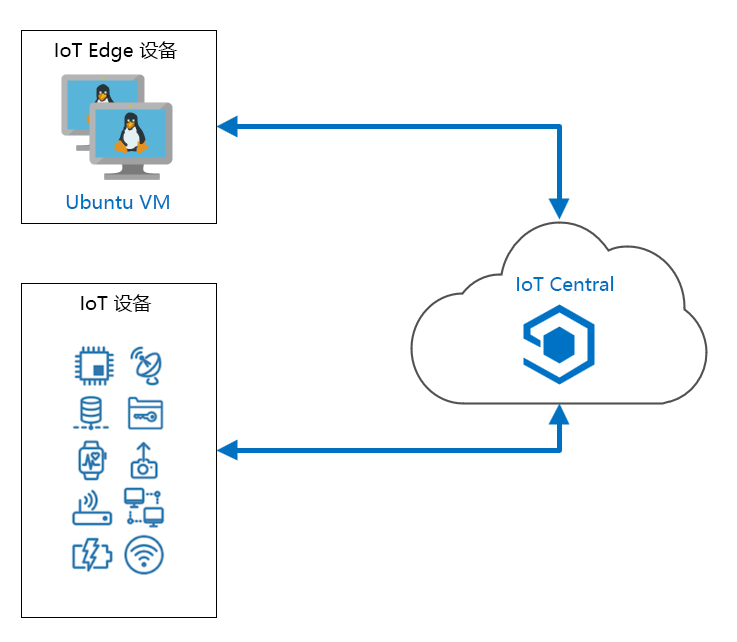

---
lab:
    title: '实验室 20：创建你的第一个 Azure IoT Central 应用'
    module: '模块 12：使用 IoT Central 生成'
---

# 创建你的第一个 Azure IoT Central 应用

当你拥有一个团队时，Azure IoT 服务和技术可以互相协作且易于管理，但是对于一个规模较小、专业程度较低的团队来说，完整的 IoT 解决方案体系结构的实现和支持复杂得多。Azure IoT Central 是一个 SaaS 应用程序，涵盖一整套基础 IoT 技术，包括 Azure IoT 中心、Azure 设备预配系统 (DPS)、Azure 地图、Azure 时序见解、Azure IoT Edge 等。虽然 IoT Central 无法提供直接实现这些技术时所能达到的粒度级别，但它让小规模团队可以轻松管理和监视一组远程设备。

除其他目的之外，本实验室将帮助你确定 IoT Central 在哪种情况下才是支持特定方案的正确工具。因此，请做好准备，好了解 IoT Central 有什么功能。

## 实验室场景

Contoso 经营一个冷藏卡车车队，这些冷藏卡车用于在市内和周边地区运输奶酪。你在该区域拥有大量客户，在市内的一个集中位置运营车队。每天都会在卡车上装载产品，调度员会为驾驶员指定运输路线。该系统运行良好，几乎没有问题。但是，如果一个卡车上的制冷系统发生故障，驾驶员和调度员需要讨论最佳解决方案。调度员将把产品调度回仓库进行检查，或者运输到接近车辆当前位置的客户位置。卡车上仍未交付的产品数量以及冷藏区域的温度都是影响决策的因素。

为了做出合理决策，驾驶员和调度员需要有关卡车及其运输的产品的最新信息。他们需要知道每辆卡车在地图上的位置、卡车制冷系统的状态以及卡车上货物的状态。

IoT Central 提供了处理这种情况所需的一切信息。

将创建以下资源：



## 本实验室概览

在本实验室中，你将完成以下活动：

* 使用 IoT Central 门户创建 Azure IoT Central 自定义应用
* 使用 IoT Central 门户为自定义设备创建设备模板
* 使用 Visual Studio Code 或 Visual Studio 创建一个编程项目来模拟冷藏卡车，并使用 Azure Maps 选择的路线
* 从 IoT Central 仪表板监视和命令模拟设备

## 实验室说明

### 练习 1：创建和配置 Azure IoT Central

#### 任务 1：创建初始 IoT Central 应用

1. 导航到 [Azure IoT Central](https://apps.azureiotcentral.com/?azure-portal=true)。

    最好将此 URL 添加为书签，因为它是所有 IoT Central 应用的主页。

1. 花点时间向下滚动并阅读该主页的目录。

1. 在左侧导航菜单上，单击 **“生成”**。

    请注意，对于某些场景，有几个选项可以提供更高级的起点。

1. 在 **“特别推荐”** 下，单击 **“自定义应用”**。

1. 在 **“新建应用程序”** 页面，在 **“应用程序名称”** 下，输入 **“Refrigerated-Trucks-{your-id}”**。

    请注意，你输入的应用程序名称将用作应用程序 URL 的根（已转换为小写）。

    虽然应用程序名称可以是任何易记名称，但是 **URL** 必须__具有唯一性。两者无需完全匹配，但是匹配时不易混淆。

    将 `{your-id}` 追加到应用程序名称中有助于确保 URL 的唯一性。

1. 在 **“应用程序模板”** 下，保留 **“自定义应用程序”** 的默认值。

1. 花一分钟查看 **“账单信息”** 下面的字段。

    **“目录”** 字段用于指定 Azure Active Directory 租户。如果你的组织使用 AAD 租户，则应在此处指定。在本课程中，我们将保留默认值。

    如果选择包含成本的定价选项，需要指定一个 Azure 订阅。

1. 在 **“定价计划”** 下，单击 **“免费”**。

    请注意，免费选项提供 7 天试用期，包括 5 个免费设备。 **“账单信息”** 部分也已更新为 **“联系信息”**。

1. 在 **“联系信息”** 下，在每个必填字段中提供你的联系信息。

    > **备注：** 没有与计划相关的承诺费用或终止费用。如果你有兴趣了解有关 IoT Central 定价的更多信息， **“版本”** 页面包含一个 [“获取定价详细信息”](https://aka.ms/iotcentral-pricing-chs)的链接。

1. 在屏幕底部，单击 **“创建”**。

    生成应用资源时等待几秒钟，然后会看到一个带有几个默认链接的**仪表板**。

1. 关闭“Azure IoT Central”浏览器选项卡。

    下次打开 Azure IoT Central 主页时，在左侧的导航菜单中选择 **“我的应用”**，将会列出你的 **Refrigerated-Trucks-{your-id}** 应用。

1. 使用浏览器打开 [Azure IoT Central](https://apps.azureiotcentral.com/?azure-portal=true)。

1. 在左侧导航菜单上，单击 **“我的应用”**，然后单击 **“Refrigerated-Trucks-{your-id}”**。

    下一步是指定一个设备模板__。

#### 任务 2：创建设备模板

在设备模板__中指定远程设备与 IoT Central 之间通信的数据。设备模板封装数据的所有详细信息，因此设备和 IoT Central 都具有理解通信所需的全部信息。

1. 在 Azure IoT Central 应用的 **“仪表板”** 页面，在左侧导航菜单中的 **“应用设置”** 下，单击 **“设备模板”**。

1. 在 **“设备模板”** 下，单击 **“+ 新建”**。

    你可以看到一系列自定义和预配置的设备模板选项。

    > **提示**： 记下预配置选项。如果你有关联硬件，你可能想要在将来的项目中使用其中一个预配置设备模板。

1. 在 **“创建自定义设备模板”** 下，单击 **“IoT 设备”**。

1. 在页面底部，单击 **“下一步: 自定义”**

1. 在 **“输入设备模板名称”** 文本框中，输入 **“RefrigeratedTruck”**，然后按 **Enter** 键。

    > **备注**： 不要选择 **“网关设备”**。

1. 在页面底部，单击 **“下一步: 查看”**。

    验证所示的 **“基本信息”**。

1. 在 **“查看”** 页面的底部，单击 **“创建”**。

    创建模板后，会显示 **“RefrigeratedTruck”** 页面。

1. 在 **“RefrigeratedTruck”** 页面，在 **“创建功能模型”** 下，单击 **“自定义”**。

    现在可以添加设备模板的详细信息。

#### 任务 3：添加传感器遥测

遥测是由传感器传输的数据值。在我们的冷藏卡车中，最重要的传感器用于监视货物的温度。

1. 在 **“RefrigeratedTruck”** 设备模板页面，单击 **“+ 添加界面”**，然后单击 **“自定义”**

    一个界面定义一组功能__。要定义冷藏卡车的功能，需要添加大量界面。

    自定义界面允许你从空白界面开始生成。

1. 在 **“功能”** 下，单击 **“+ 添加功能”**

1. 花点时间检查可用字段的类型。

1. 要定义卡车温度传感器的能力，请输入以下字段值：

    | 字段 | 值 |
    | --- | --- |
    | 显示名称 | 货物温度 |
    | 名称 | ContentsTemperature |
    | 功能类型 | 遥测 |
    | 语义类型 | 温度 |
    | 架构 | Double |
    | 单元 | <sup>o</sup>C |

1. 花一分钟时间再次检查你输入的信息。

    > **重要说明**：
    > 你稍后在本实验室中添加的代码使用上面列出的名称，因此为界面输入的名称必须与所示名称完全相同__。

#### 任务 4：添加状态和事件遥测

状态很重要，可以让操作员知道发生的情况。IoT Central 中的状态是与一系列值相关联的名称。在本实验室的后续过程中，你将选择一种颜色与每个状态值相关联，使其易于识别。

1. 在 **“功能”** 下，单击 **“+ 添加功能”**。

1. 要定义卡车货物状态的功能，请输入以下字段值：

    | 字段 | 值 |
    | --- | --- |
    | 显示名称 | 货物状态 |
    | 名称 | ContentsState |
    | 功能类型 | 遥测 |
    | 语义类型 | 状态 |
    | 值架构 | String |

1. 在 **“值架构”** 下，请注意提示你 **“必须定义复杂类型”** 的消息。

    为了简化实验室方案，你将卡车的货物状态定义为以下状态的其中之一：“空”__、“满”__或“融化”__。

1. 在 **“必须定义复杂类型”** 消息下，单击 **“+”**。

1. 在 **“显示名称”** 下，输入 **“空”**

    **“名称”** 字段应自动填充 **“空”**。

1. 在 **“值”** 下，输入 **“空”**

    三个字段都应包含 **“空”**。

1. 在你刚输入的字段下方，单击 **“+”**。

1. 使用上述流程添加另外两个状态值： **“满”** 和 **“融化”**。

    同样，每个其他状态值选项的 **“显示名称”**、 **“名称”** 和 **“值”** 字段中应包含相同的文本。

1. 在继续操作之前，请仔细检查每项功能。

    现在，为了在模拟中增加不确定性，我们为卡车的制冷系统添加一个故障状态。如果制冷系统出现故障（将在本实验室的后续过程中看到），货物“融化”的可能性会大幅增加！你将为卡车的制冷系统添加“开”__、“关”__ 和“故障”__条目。

1. 在 **“RefrigeratedTruck”** 设备模板页面，在 **“RefrigeratedTruck”** 下，单击 **“+ 添加功能”**。

1. 要定义卡车制冷系统状态的功能，请输入以下字段值：

    | 字段 | 值 |
    | --- | --- |
    | 显示名称 | 冷却系统状态 |
    | 名称 | CoolingSystemState |
    | 功能类型 | 遥测 |
    | 语义类型 | 状态 |
    | 值架构 | String |

1. 在 **“必须定义复杂类型”** 消息下，单击 **“+”**，然后使用上述流程添加以下状态值选项：

    * 开
    * 关
    * failed

    确保 **“显示名称”**、 **“名称”** 和 **“值”** 三个字段都重复了三个状态值选项（开、关、故障）。

    卡车本身需要定义更复杂的状态。如果一切正常，卡车的正常路线可能是：_就绪_、_途中_、_交付_、_返回_、_装货_，然后再次回到_就绪_。但是，需要将融化的货物运回仓库进行检查（还可能需要处置）时，你应添加一个适合这种情况的“废弃”__状态。

1. 使用与定义之前的状态功能相同的流程，创建以下新功能：

    | 字段 | 值 |
    | --- | --- |
    | 显示名称 | 卡车状态 |
    | 名称 | TruckState |
    | 功能类型 | 遥测 |
    | 语义类型 | 状态 |
    | 值架构 | String |

    请使用以下状态值选项：

    * 就绪
    * 途中
    * 交付
    * 返回
    * 装货
    * dumping

    你需要指定的下一个功能类型是事件。事件是由设备触发的问题，且会传递到 IoT Central 应用。事件分为以下三种类型：错误__、警告__或信息__。

1. 要创建事件功能，请单击 **“+ 添加功能”**，然后创建以下新功能：

    | 字段 | 值 |
    | --- | --- |
    | 显示名称 | 事件 |
    | 名称 | 事件 |
    | 功能类型 | 遥测 |
    | 语义类型 | 事件 |
    | 架构 | String |

    命令冲突是设备可能触发的一个事件。例如，一辆空卡车正从某位客户处返回基地，但收到一条让其将货物交付给另一客户的命令。如果发生冲突，设备最好触发事件以向 IoT Central 应用的操作员发出警告。

    另一个事件可能只是确认并记录卡车要将货物交付到的客户 ID。

#### 任务 5：添加位置遥测

位置可能是最重要的，但也是最容易添加到设备模板的度量之一。具体来说，它由设备的纬度、经度和可选海拔组成。

1. 要创建位置功能，请单击 **“+ 添加功能”**，然后创建以下新功能：

    | 字段 | 值 |
    | --- | --- |
    | 显示名称 | 位置 |
    | 名称 | 位置 |
    | 功能类型 | 遥测 |
    | 语义类型 | 位置 |
    | 架构 | 地理位置 |

#### 任务 6：添加属性

设备的属性通常是常数值，在首次启动通信时，它们会传递到 IoT Central 应用。在冷藏卡车场景中，卡车的车牌或类似的唯一卡车 ID 就是属性的一个很好的例子。

属性也可以用于设备配置数据。你将卡车货物的最佳温度__定义为一个属性。此最佳温度可能会随不同类型的货物、不同天气条件或任何恰当的因素而变化。设置具有初始默认值。默认值可能不需要更改，但如果需要，也可以轻松快速地实现更改。这种属性称为“可写属性”__。

属性是单个值。如果需要将更复杂的数据集传输到设备，则使用命令（如下所示）是更合适的处理方法。

1. 要为卡车 ID 创建属性功能，请单击 **“+ 添加功能”**，然后创建以下新功能：

    | 字段 | 值 |
    | --- | --- |
    | 显示名称 | 卡车 ID |
    | 名称 | TruckID |
    | 功能类型 | 属性 |
    | 语义类型 | 无 |
    | 架构 | String |
    | 可写 | 关 |
    | 单元 | 无 |

1. 要为最佳温度创建属性功能，请单击 **“+ 添加功能”**，然后创建以下新功能：

    | 字段 | 值 |
    | --- | --- |
    | 显示名称 | 最佳温度 |
    | 名称 | OptimalTemperature |
    | 功能类型 | 属性 |
    | 语义类型 | 无 |
    | 架构 | Double |
    | 可写 | 开 |
    | 单元 |  <sup>o</sup>C  |

#### 任务 7：添加命令

命令由 IoT Central 应用的操作员发送到远程设备。命令类似于可写属性，但命令可以包含任意数量的输入字段，而可写属性限制为单个值。

对于冷藏卡车，应添加两个命令：一个命令用于将货物交付给客户，另一个命令用于将卡车召回基地。

1. 要创建将货物交付给客户的命令功能，请单击 **“+ 添加功能”**，然后创建新以下新功能：

    | 字段 | 值 |
    | --- | --- |
    | 显示名称 | 前往客户处 |
    | 名称 | GoToCustomer |
    | 功能类型 | 命令 |
    | 命令 | 同步 |

1. 在 **“命令”** 下，单击 **“请求”**。

    打开 **“请求”** 选项时，可以输入该命令的更多详细信息。

1. 要完成命令功能的 **“请求”** 部分，请输入以下字段值：

    | 字段 | 值 |
    | --- | --- |
    | 请求 | 开 |
    | 显示名称 | 客户 ID |
    | 名称 | CustomerID |
    | 架构 | 整数 |
    | 单元 | 无 |

1. 要创建召回卡车的命令功能，请单击 **“添加功能”**，然后创建以下新功能：

    | 字段 | 值 |
    | --- | --- |
    | 显示名称 | 召回 |
    | 名称 | 召回 |
    | 功能类型 | 命令 |
    | 命令 | 同步 |

    此命令没有其他参数，因此将 **“请求”** 保留在关闭状态。

1. 在靠近页面顶部的位置，单击 **“保存”**。

    在进一步执行任何操作之前，请仔细检查你的界面。界面发布后，编辑选项将非常有限。请务必在发布之前正确设置界面。

    如果单击设备模板的名称，在以 **“视图”** 选项结尾的菜单中，可以看到功能摘要。

#### 任务 8：发布模板

1. 如果在上次保存以后进行了任何更改，请单击 **“保存”**。

1. 在 **“RefrigeratedTruck”** 设备模板的右上角，单击 **“发布”**。

    > **备注：** 如果弹出要求你确认的对话框，请单击 **“发布”**。

    你可以看到注释从 **“草稿”** 更改为 **“已发布”**。

准备设备模板确实需要一些耐心和时间。

在下一个练习中，你将使用设备模板的功能准备控制器仪表板。可以在发布设备模板之前或之后完成视图准备工作。

### 练习 3：监视模拟设备

要开始本练习，你需要创建一个显示设备模板所有能力的仪表板。之后，你将使用设备模板创建设备，并记录远程设备应用所需的连接设置。

#### 任务 1：创建一个内容丰富的仪表板

1. 在 **“RefrigeratedTruck”** 设备模板的左侧菜单上，单击 **“视图”**，然后单击 **“可视化设备”**。

1. 花一点时间查看可用的**遥测**、**属性**和**命令**列表。

    这些是你创建的功能，每个功能都有一个选择复选框。

1. 在 **“遥测数据”** 下，单击 **“位置”**，然后单击 **“添加磁贴”**。

    仪表板由磁贴组成，你可以排列所选磁贴并调整其大小。“位置”磁贴将显示卡车在世界地图上的位置，首先创建该磁贴，你可以有足够的空间来调整地图大小。

1. 将鼠标指针悬停在磁贴的右下角，然后拖动这个角，使磁贴的高度和宽度约为默认大小的两倍。

1. 在 **“视图名称”** 下，输入 **“卡车视图”**。

1. 在 **“遥测数据”** 下，单击 **“货物状态”**，然后单击 **“添加磁贴”**。

1. 对剩下的每一个遥测功能，从上到下重复之前的步骤。

    回想一下，你已经添加了“位置”磁贴。

1. 使用相同的从上到下的流程添加“属性”能力。

    在实验室的后续部分，你将有机会在仪表板上排列磁贴。现在，你只想通过仪表板确认所有遥测数据均由远程设备发送。

    无需向仪表板添加命令，尽管确实存在该选项。

1. 花一分钟查看仪表板。

    滚动查看你的仪表板。检查磁贴的内容，并考虑如何使用这些信息。

1. 快速排列磁贴的位置。

    现在不要在这一步花费太多时间，但是请注意，你可以拖动磁贴，门户将尝试将其重新排列整齐。

1. 单击 **“保存”**，然后单击 **“发布”**。

    请注意，“发布”对话框现在在 **“视图”** 旁边显示 **“是”**。

1. 在“发布”对话框上，单击 **“发布”**。

你可以根据需要创建多个视图，并为每个视图起一个易记名称。

在下一个任务中，你将在设备模板中创建设备。

#### 任务 2：创建真实设备

IoT Central 可以连接到具有真实传感器的物理设备，也可以连接到基于算法生成数据的模拟设备。在这两种情况下，IoT Central 均知晓远程应用正在生成遥测数据，无论是哪种情况，它都将连接的设备视为“真实”设备。

1. 在左侧导航菜单上，单击 **“设备”**。

1. 在 **“设备”** 菜单上，在 **“所有设备”** 下，单击 **“RefrigeratedTruck”**

    请注意，屏幕已刷新，且所选的设备模板现在以粗体文本显示。如果你有大量设备模板，这有助于确保你使用正确的设备模板。

1. 在顶部菜单中，单击 **“+ 新建”**。

1. 在 **“创建新设备”** 对话框上，在 **“设备名称”** 下，验证 **“RefrigeratedTruck”** 是否为前缀。

    这是确保你选择正确设备模板的另一个方法。

1. 在 **“设备 ID”** 下，输入 **“RefrigeratedTruck1”**

1. 在 **“设备名称”** 下，输入 **“RefrigeratedTruck - 1”**

1. 在 **“模拟”** 下，确保已选中 **“关”**。

    回想一下，IoT Central 将物理设备和模拟设备的连接同等对待。两者都是远程应用，而且都是真实应用。你将在这里生成一辆真实的卡车。模拟的_真实_卡车！

    将该模拟值设置为 **“开”**，会指示 IoT Central 从你的遥测数据中提取随机值。这些随机值适用于验证设备模板，但是在本实验室中，你将使用自己的模拟设备（卡车）来模拟遥测数据。

1. 在 **“创建新设备”** 对话框中，单击 **“创建”**。

    等待几秒钟后，你的设备列表应该会填充一个条目。

    请注意将 **“设备状态”** 设置为 **“已注册”**。在 **“设备状态”** 为 **“已预配”** 时，IoT Central 应用才会接受与设备的连接。在本实验室的后续部分，有一个向你介绍如何预配设备的编码任务。

1. 在 **“设备名称”** 下，单击 **“RefrigeratedTruck - 1”**。

    将显示你的实时仪表板（有很多 **“正在等待数据”** 消息）。

1. 在设备仪表板的 **“RefrigeratedTruck - 1”** 标题下方，单击 **“命令”**

    请注意，你输入的两个命令已经列出，并且可以运行。

下一步将是创建密钥，使远程设备可以与 IoT Central 应用进行通信。

#### 任务 3：记录连接密钥

1. 在顶部菜单中，单击 **“连接”**。

    _请勿_单击 **“附加到网关”**。

1. 在 **“设备连接”** 对话框中，谨慎复制 **“ID 范围”**、 **“设备 ID”** 和 **“主键”** 的值，并将其保存到名为 **“Truck-connections.txt”** 的文本文件中。

    使用记事本（或其他文本编辑器）将值保存到文本文件，提供有意义的名称，例如 Truck-connections.txt。

1. 在 **“连接方式”** 下，确保已选中 **“共享访问签名 (SAS)”**。

1. 在对话框底部，单击 **“关闭”**

让 IoT 门户在浏览器中保持打开状态，就这样等着。

### 练习 4：创建免费 Azure Maps 帐户

如果你还没有 Azure Maps 帐户，则需创建一个。

1. 打开一个新的浏览器选项卡，然后导航到 [Azure Maps](https://azure.microsoft.com/services/azure-maps/?azure-portal=true)。

1. 要创建免费帐户，请单击右上角的 **“开始免费试用”**，然后按照提供的说明进行操作。

    > **备注：** 你可以使用在本课程中一直使用的订阅和资源组来创建 Azure Maps 帐户，使用 AZ-220-MAPS 作为帐户名，并使用标准 S1 作为定价层。

1. 创建 Azure 地图帐户后，将 Azure 地图帐户订阅密钥（主密钥）复制到 Truck-connections.txt 文本文件。

    如果使用本课程中使用的 Azure 订阅创建 Azure 地图帐户，可以在 Azure 门户中找到该帐户的主密钥，如下所示：打开“Azure 地图 (AZ-220-MAPS)”边栏选项卡，然后打开“身份验证”窗格。你将看到已列出的主密钥。

    > **备注：** 如果你想验证你的主键（用于 Azure Maps）是否正确/工作。将以下 HTML 保存到 .html 文件。用主键的值替换 `'<your Azure Maps subscription key>'` 占位符，然后将文件加载到 Web 浏览器中。你可以看到显示的世界地图。

    ```html
    <!DOCTYPE html>
    <html>

    <head>
        <title>Map</title>
        <meta charset="utf-8">
        <meta name="viewport" content="width=device-width, initial-scale=1, shrink-to-fit=no">

        <!-- Add references to the Azure Maps Map control JavaScript and CSS files. -->
        <link rel="stylesheet" href="https://atlas.microsoft.com/sdk/javascript/mapcontrol/2/atlas.min.css" type="text/css">
        <script src="https://atlas.microsoft.com/sdk/javascript/mapcontrol/2/atlas.min.js"></script>

        <!-- Add a reference to the Azure Maps Services lab JavaScript file. -->
        <script src="https://atlas.microsoft.com/sdk/javascript/mapcontrol/2/atlas-service.min.js"></script>

        <script>
            function GetMap() {
                //实例化地图对象
                var map = new atlas.Map("myMap", {
                    //将你的 Azure 地图订阅密钥添加到地图 SDK 中。访问 https://azure.com/maps 获取 Azure 地图密钥
                    authOptions: {
                        authType: 'subscriptionKey',
                        subscriptionKey: '<your Azure Maps subscription key>'
                    }
                });
            }
        </script>
        <style>
            html,
            body {
                width: 100%;
                height: 100%;
                padding: 0;
                margin: 0;
            }

            #myMap {
                width: 100%;
                height: 100%;
            }
        </style>
    </head>

    <body onload="GetMap()">
        <div id="myMap"></div>
    </body>

    </html>
    ```

现在已完成将你的第一个 IoT Central 应用连接到真实设备的准备步骤。干得好！

下一步是创建设备应用。

### 练习 5：为真实设备创建编程项目

在此任务中，你将创建一个编程项目来模拟冷藏卡车中的传感器设备。此模拟使你能够在需要物理设备之前测试代码。

IoT Central 将这种模拟视为“真实”，因为设备应用与 IoT Central 应用之间的通信代码与物理设备/卡车的通信代码相同。换句话说，如果你经营一家冷藏卡车公司，你将从与本任务中的代码类似的模拟代码开始。验证代码工作正常后，模拟专用代码将被替换为用于接收传感器数据的代码。此有限更新使编写以下代码成为宝贵的经验。

#### 任务 1：创建设备应用

使用 Visual Studio Code 生成设备传感器应用。

1. 打开一个新的 Visual Studio Code 实例。

1. 在 **“文件”** 菜单上，单击 **“打开文件夹”**。

1. 在 **“打开文件夹”** 对话框顶部，单击 **“新建文件夹”**，输入 **“RefrigeratedTruck”**，然后按 **Enter**。

    你可以在本课程的“实验室 20”文件夹下或你选择的其他位置创建“RefrigeratedTruck”文件夹。

1. 单击 **“RefrigeratedTruck”**，然后单击 **“选择文件夹”**。

    此时将打开“Visual Studio Code 资源管理器”窗格。

1. 要打开集成终端，在 **“视图”** 菜单上单击 **“终端”**。

    你可以看到终端命令提示符中列出的“RefrigeratedTruck”文件夹。由于以下命令将在当前文件夹中运行，因此这一点很重要。

1. 要创建新的控制台应用，在终端命令提示符下输入以下命令：

    ```cmd/sh
    dotnet new console
    ```

    此命令将在文件夹中创建一个 Program.cs 文件以及一个项目文件。

1. 为了确保你的应用有权访问所需的 .NET 软件包，请在终端命令提示符下输入以下命令：

    ```cmd/sh
    dotnet restore
    ```

1. 要安装所需的库，请在终端命令提示符下输入以下命令：

    ```CLI
    dotnet add package AzureMapsRestToolkit
    dotnet add package Microsoft.Azure.Devices.Client
    dotnet add package Microsoft.Azure.Devices.Provisioning.Client
    dotnet add package Microsoft.Azure.Devices.Provisioning.Transport.Mqtt
    dotnet add package System.Text.Json
    ```

1. 在 **“资源管理器”** 窗格中，单击 **“Program.cs”**

1. 在“代码编辑器”窗格中，删除 Program.cs 文件的内容。

你现在可以添加下面的代码了。

#### 任务 2：编写设备应用

在此任务中，你将为冷藏卡车一次一个部分生成模拟设备应用。提供每个部分的简要说明。

为了尽可能简化此过程，应按此处列出的顺序将每个附加代码部分追加到文件末尾。

> **备注：**
>  如果你想跳过此任务，并将所有代码加载到你的应用中，请下载 Program.cs 的所有内容，并将其复制到项目的 Program.cs 文件中。如果复制此代码（并替换连接和订阅字符串），将直接转到下一个任务，然后开始测试！在本课程的实验室 3（“设置开发环境”）中，通过下载 ZIP 文件并在本地提取内容来克隆包含实验室资源的 GitHub 存储库。提取的文件夹结构包括以下文件夹路径：

    * Allfiles
      * 实验室
          * 20 - 使用 IoT Central 生成
            * 最后

1. 要添加所需的 `using` 语句，请在“代码编辑器”窗格中输入以下代码：

   ```cs
    using System;
    using System.Text.Json;
    using System.Text;
    using System.Threading;
    using System.Threading.Tasks;
    using Microsoft.Azure.Devices.Client;
    using Microsoft.Azure.Devices.Shared;
    using Microsoft.Azure.Devices.Provisioning.Client;
    using Microsoft.Azure.Devices.Provisioning.Client.Transport;
    using AzureMapsToolkit;
    using AzureMapsToolkit.Common;
    ```

    通过这些 `using` 语句可以轻松访问代码使用的资源，例如 Azure IoT Central 和 Azure Maps。

1. 要添加命名空间、类和全局变量，请在“代码编辑器”窗格中输入以下代码：

   ```cs
    namespace refrigerated_truck
    {
        class Program
        {
            enum StateEnum
            {
                ready,
                enroute,
                delivering,
                returning,
                loading,
                dumping
            };
            enum ContentsEnum
            {
                full,
                melting,
                empty
            }
            enum FanEnum
            {
                on,
                off,
                failed
            }

            // Azure 地图服务全局变量。
            static AzureMapsServices azureMapsServices;

            // 遥测数据全局变量。
            const int intervalInMilliseconds = 5000;        // Time interval required by wait function.

            // 冷藏卡车全局变量。
            static int truckNum = 1;
            static string truckIdentification = "Truck number " + truckNum;

            const double deliverTime = 600;                 // Time to complete delivery, in seconds.
            const double loadingTime = 800;                 // Time to load contents.
            const double dumpingTime = 400;                 // Time to dump melted contents.
            const double tooWarmThreshold = 2;              // Degrees C that is too warm for contents.
            const double tooWarmtooLong = 60;               // Time in seconds for contents to start melting if temps are above threshold.


            static double timeOnCurrentTask = 0;            // 当前任务的时间（单位为秒）。
            static double interval = 60;                    // 模拟时间间隔（单位为秒）。
            static double tooWarmPeriod = 0;                // 货物过热的持续时间（单位为秒）。
            static double tempContents = -2;                // 货物的当前温度（单位为摄氏度）。
            static double baseLat = 47.644702;              // Base position latitude.
            static double baseLon = -122.130137;            // Base position longitude.
            static double currentLat;                       // Current position latitude.
            static double currentLon;                       // Current position longitude.
            static double destinationLat;                   // Destination position latitude.
            static double destinationLon;                   // Destination position longitude.

            static FanEnum fan = FanEnum.on;                // Cooling fan state.
            static ContentsEnum contents = ContentsEnum.full;    // Truck contents state.
            static StateEnum state = StateEnum.ready; // 卡车已装满，可以出发！
            static double optimalTemperature = -5; // 设置 - 可由操作员在 IoT Central 中更改。

            const string noEvent = "none";
            static string eventText = noEvent;              // 发送到 IoT Central 的事件文本。

            static double[,] customer = new double[,]
            {
                // 客户的经度/维度位置。
                // Gasworks Park
                {47.645892, -122.336954},

                // Golden Gardens 公园
                {47.688741, -122.402965},

                // Seward 公园
                {47.551093, -122.249266},

                // Sammamish 湖公园
                {47.555698, -122.065996},

                // Marymoor 公园
                {47.663747, -122.120879},

                // Meadowdale 海滩公园
                {47.857295, -122.316355},

                // 林肯公园
                {47.530250, -122.393055},

                // Gene Coulon 公园
                {47.503266, -122.200194},

                // Luther Bank 公园
                {47.591094, -122.226833},

                // Pioneer 公园
                {47.544120, -122.221673 }
            };

            static double[,] path;                          // 路线的纬度/经度步骤。
            static double[] timeOnPath;                     // 路线每个部分的时间（单位为秒）。
            static int truckOnSection;                      // 卡车所处的当前路线部分。
            static double truckSectionsCompletedTime;       // 卡车在之前完成的部分花费的时间。
            static Random rand;

            // IoT Central 全局变量。
            static DeviceClient s_deviceClient;
            static CancellationTokenSource cts;
            static string GlobalDeviceEndpoint = "global.azure-devices-provisioning.net";
            static TwinCollection reportedProperties = new TwinCollection();

            // 用户 ID。
            static string ScopeID = "<your Scope ID>";
            static string DeviceID = "<your Device ID>";
            static string PrimaryKey = "<your device Primary Key>";
            static string AzureMapsKey = "<your Azure Maps Subscription Key>";
    ```

    虽然还要添加更多代码，但是现在可以替换刚才输入的占位符值。可以在实验室中添加的文本文件中找到这些占位符值。

1. 打开包含之前保存的 RefrigeratorTruck1 和 Azure 地图帐户信息的文本文件。

1. 在“代码编辑器”窗格中，将占位符值替换为文本文件中的对应值。

    在代码中更新这些值之后，你可以重新生成应用。

1. 在“代码编辑器”窗格中，若要添加用于通过 Azure 地图获取路线的方法，请输入以下代码：

   ```cs
            static double Degrees2Radians(double deg)
            {
                return deg * Math.PI / 180;
            }

            // 返回地球上两个位置之间的距离（单位为米）。
            static double DistanceInMeters(double lat1, double lon1, double lat2, double lon2)
            {
                var dlon = Degrees2Radians(lon2 - lon1);
                var dlat = Degrees2Radians(lat2 - lat1);

                var a = (Math.Sin(dlat / 2) * Math.Sin(dlat / 2)) + Math.Cos(Degrees2Radians(lat1)) * Math.Cos(Degrees2Radians(lat2)) * (Math.Sin(dlon / 2) * Math.Sin(dlon / 2));
                var angle = 2 * Math.Atan2(Math.Sqrt(a), Math.Sqrt(1 - a));
                var meters = angle * 6371000;
                return meters;
            }

            static bool Arrived()
            {
                // 如果卡车在距离目的地 10 米的范围内，则称其为“良”。
                if (DistanceInMeters(currentLat, currentLon, destinationLat, destinationLon) < 10)
                    return true;
                return false;
            }

            static void UpdatePosition()
            {
                while ((truckSectionsCompletedTime + timeOnPath[truckOnSection] < timeOnCurrentTask) && (truckOnSection < timeOnPath.Length - 1))
                {
                    // 卡车已移动到下一部分。
                    truckSectionsCompletedTime += timeOnPath[truckOnSection];
                    ++truckOnSection;
                }

                // 由于间隔的计数可能会超过所需值，请确保余数为 0 到 1。
                var remainderFraction = Math.Min(1, (timeOnCurrentTask - truckSectionsCompletedTime) / timeOnPath[truckOnSection]);

                // The path should be one entry longer than the timeOnPath array.
                // 查找卡车已在该部分移动了多长距离。
                currentLat = path[truckOnSection, 0] + remainderFraction * (path[truckOnSection + 1, 0] - path[truckOnSection, 0]);
                currentLon = path[truckOnSection, 1] + remainderFraction * (path[truckOnSection + 1, 1] - path[truckOnSection, 1]);
            }

            static void GetRoute(StateEnum newState)
            {
                // 将状态设置为“就绪”，直到制定新路线为止。
                state = StateEnum.ready;

                var req = new RouteRequestDirections
                {
                    Query = FormattableString.Invariant($"{currentLat},{currentLon}:{destinationLat},{destinationLon}")
                };
                var directions = azureMapsServices.GetRouteDirections(req).Result;

                if (directions.Error != null || directions.Result == null)
                {
                    // 处理所有错误。
                    redMessage("Failed to find map route");
                }
                else
                {
                    int nPoints = directions.Result.Routes[0].Legs[0].Points.Length;
                    greenMessage($"Route found. Number of points = {nPoints}");

                    // 清除路线。为起点和目的地添加两个点。
                    path = new double[nPoints + 2, 2];
                    int c = 0;

                    // 从当前位置开始。
                    path[c, 0] = currentLat;
                    path[c, 1] = currentLon;
                    ++c;

                    // 检索路线并将点推送到数组上。
                    for (var n = 0; n < nPoints; n++)
                    {
                        var x = directions.Result.Routes[0].Legs[0].Points[n].Latitude;
                        var y = directions.Result.Routes[0].Legs[0].Points[n].Longitude;
                        path[c, 0] = x;
                        path[c, 1] = y;
                        ++c;
                    }

                    // 以目的地结束。
                    path[c, 0] = destinationLat;
                    path[c, 1] = destinationLon;

                    // Store the path length and time taken, to calculate the average speed.
                    var meters = directions.Result.Routes[0].Summary.LengthInMeters;
                    var seconds = directions.Result.Routes[0].Summary.TravelTimeInSeconds;
                    var pathSpeed = meters / seconds;

                    double distanceApartInMeters;
                    double timeForOneSection;

                    // 清除路线数组上的时间。路线数组比点数组小 1。
                    timeOnPath = new double[nPoints + 1];

                    //计算路径的每个部分需要多少时间。
                    for (var t = 0; t < nPoints + 1; t++)
                    {
                        // 计算两个路线点之间的距离（单位为米）。
                        distanceApartInMeters = DistanceInMeters(path[t, 0], path[t, 1], path[t + 1, 0], path[t + 1, 1]);

                        // 计算路径每个部分的时间。
                        timeForOneSection = distanceApartInMeters / pathSpeed;
                        timeOnPath[t] = timeForOneSection;
                    }
                    truckOnSection = 0;
                    truckSectionsCompletedTime = 0;
                    timeOnCurrentTask = 0;

                    // 立即更新状态，已制定路线。“途中”或“返回”的其中之一。
                    state = newState;
                }
            }
    ```

    > **备注：**
    > 以上代码中的关键调用代码是 `var directions = azureMapsServices.GetRouteDirections(req).Result;`。`directions` 结构很复杂。应考虑在此方法中设置断点，并检查 `directions` 的内容。

1. 要添加交付给客户的直接方法，请在“代码编辑器”窗格中输入以下代码：

   ```cs
        static Task<MethodResponse> CmdGoToCustomer(MethodRequest methodRequest, object userContext)
        {
            try
            {
                // Pick up variables from the request payload, with the name specified in IoT Central.
                var payloadString = Encoding.UTF8.GetString(methodRequest.Data);
                int customerNumber = Int32.Parse(payloadString);

                // 检查密钥和客户 ID 是否有效。
                if (customerNumber >= 0 && customerNumber < customer.Length)
                {
                    switch (state)
                    {
                        case StateEnum.dumping:
                        case StateEnum.loading:
                        case StateEnum.delivering:
                            eventText = "Unable to act - " + state;
                            break;

                        case StateEnum.ready:
                        case StateEnum.enroute:
                        case StateEnum.returning:
                            if (contents == ContentsEnum.empty)
                            {
                                eventText = "Unable to act - empty";
                            }
                            else
                            {
                                // 仅在一切正常时设置事件。
                                eventText = "New customer: " + customerNumber.ToString();

                                destinationLat = customer[customerNumber, 0];
                                destinationLon = customer[customerNumber, 1];

                                // 查找从当前位置到目的地的路线，并存储路线。
                                GetRoute(StateEnum.enroute);
                            }
                            break;
                    }

                    // 通过 200 成功消息确认直接方法调用结果。
                    string result = "{\"result\":\"Executed direct method: " + methodRequest.Name + "\"}";
                    return Task.FromResult(new MethodResponse(Encoding.UTF8.GetBytes(result), 200));
                }
                else
                {
                    eventText = $"Invalid customer: {customerNumber}";

                    // 通过 400 错误消息确认直接方法调用结果。
                    string result = "{\"result\":\"Invalid customer\"}";
                    return Task.FromResult(new MethodResponse(Encoding.UTF8.GetBytes(result), 400));
                }
            }
            catch
            {
                // 通过 400 错误消息确认直接方法调用结果。
                string result = "{\"result\":\"Invalid call\"}";
                return Task.FromResult(new MethodResponse(Encoding.UTF8.GetBytes(result), 400));
            }
        }
    ```

    > **备注：**
    > 如果设备未处于正确状态，则会以冲突形式作出响应。在方法结束时会确认命令本身。下一步中执行的召回命令的处理方式与之类似。

1. 要添加直接方法重新调用命令，请在“代码编辑器”窗格中输入以下代码：

   ```cs
        static void ReturnToBase()
        {
            destinationLat = baseLat;
            destinationLon = baseLon;

            // 查找从当前位置到基地的路线，并存储路线。
            GetRoute(StateEnum.returning);
        }
        static Task<MethodResponse> CmdRecall(MethodRequest methodRequest, object userContext)
        {
            switch (state)
            {
                case StateEnum.ready:
                case StateEnum.loading:
                case StateEnum.dumping:
                    eventText = "Already at base";
                    break;

                case StateEnum.returning:
                    eventText = "Already returning";
                    break;

                case StateEnum.delivering:
                    eventText = "Unable to recall - " + state;
                    break;

                case StateEnum.enroute:
                    ReturnToBase();
                    break;
            }

            // 确认命令。
            if (eventText == noEvent)
            {
                // 通过 200 成功消息确认直接方法调用结果。
                string result = "{\"result\":\"Executed direct method: " + methodRequest.Name + "\"}";
                return Task.FromResult(new MethodResponse(Encoding.UTF8.GetBytes(result), 200));
            }
            else
            {
                // 通过 400 错误消息确认直接方法调用结果。
                string result = "{\"result\":\"Invalid call\"}";
                return Task.FromResult(new MethodResponse(Encoding.UTF8.GetBytes(result), 400));
            }
        }
    ```

1. 要添加在每个时间间隔内更新卡车模拟信息的方法，请在“代码编辑器”窗格中输入以下代码：

   ```cs
        static double DieRoll(double max)
        {
            return rand.NextDouble() * max;
        }

        static void UpdateTruck()
        {
            if (contents == ContentsEnum.empty)
            {
                // 如果货物已空，关闭制冷系统（如果可能）。
                if (fan == FanEnum.on)
                {
                    fan = FanEnum.off;
                }
                tempContents += -2.9 + DieRoll(6);
            }
            else
            {
                // 货物已满或融化。
                if (fan != FanEnum.failed)
                {
                    if (tempContents < optimalTemperature - 5)
                    {
                        // 由于货物温度过低，关闭制冷系统。
                        fan = FanEnum.off;
                    }
                    else
                    {
                        if (tempContents > optimalTemperature)
                        {
                            // 由于温度升高，重新打开制冷系统。
                            fan = FanEnum.on;
                        }
                    }

                    // 随机关闭制冷系统。
                    if (DieRoll(100) < 1)
                    {
                        fan = FanEnum.failed;
                    }
                }

                // 设置货物温度。如果制冷系统已打开，保持较低温度。
                if (fan == FanEnum.on)
                {
                    tempContents += -3 + DieRoll(5);
                }
                else
                {
                    tempContents += -2.9 + DieRoll(6);
                }

                // 如果温度高于阈值，计算该情况持续的秒数，如果持续时间过长，货物会融化。
                if (tempContents >= tooWarmThreshold)
                {
                    // 货物温度正在升高。
                    tooWarmPeriod += interval;

                    if (tooWarmPeriod >= tooWarmtooLong)
                    {
                        // 货物正在融化。
                        contents = ContentsEnum.melting;
                    }
                }
                else
                {
                    // 货物温度正在降低。
                    tooWarmPeriod = Math.Max(0, tooWarmPeriod - interval);
                }
            }

            timeOnCurrentTask += interval;

            switch (state)
            {
                case StateEnum.loading:
                    if (timeOnCurrentTask >= loadingTime)
                    {
                        // 完成装货。
                        state = StateEnum.ready;
                        contents = ContentsEnum.full;
                        timeOnCurrentTask = 0;

                        // 打开冷却风扇。
                        // 如果风扇处于故障状态，由于处于基地，假定已修理。
                        fan = FanEnum.on;
                        tempContents = -2;
                    }
                    break;

                case StateEnum.ready:
                    timeOnCurrentTask = 0;
                    break;

                case StateEnum.delivering:
                    if (timeOnCurrentTask >= deliverTime)
                    {
                        // 完成交付。
                        contents = ContentsEnum.empty;
                        ReturnToBase();
                    }
                    break;

                case StateEnum.returning:

                    // 更新卡车位置。
                    UpdatePosition();

                    // 检查卡车是否已回到基地。
                    if (Arrived())
                    {
                        switch (contents)
                        {
                            case ContentsEnum.empty:
                                state = StateEnum.loading;
                                break;

                            case ContentsEnum.full:
                                state = StateEnum.ready;
                                break;

                            case ContentsEnum.melting:
                                state = StateEnum.dumping;
                                break;
                        }
                        timeOnCurrentTask = 0;
                    }
                    break;

                case StateEnum.enroute:

                    // 移动卡车。
                    UpdatePosition();

                    // 检查卡车是否已到达客户位置。
                    if (Arrived())
                    {
                        state = StateEnum.delivering;
                        timeOnCurrentTask = 0;
                    }
                    break;

                case StateEnum.dumping:
                    if (timeOnCurrentTask >= dumpingTime)
                    {
                        // 完成废弃。
                        state = StateEnum.loading;
                        contents = ContentsEnum.empty;
                        timeOnCurrentTask = 0;
                    }
                    break;
            }
        }
    ```

    > **备注：**
    > 每个时间间隔都会调用此函数。实际时间间隔设置为 5 秒，而已模拟时间__（你指定的每次调用此函数时已经过的模拟秒数）通过全局变量 `static double interval = 60` 设置。将该值设置为 60 意味着模拟以 60 除以 5（也就是以实际时间速度的 12 倍）的速率运行。为了减少已模拟时间，将 `interval` 减小到 30（实时运行六次的模拟）。将 `interval` 设置为 5 可以实时运行模拟。考虑到到达客户目的地的实际行驶时间，这个速度虽然真实，但稍微有点慢。

1. 要添加将发送卡车遥测数据（如果发生任何事件，还会发送事件）的方法，请在“代码编辑器”窗格中输入以下代码：

   ```cs
        static void colorMessage(string text, ConsoleColor clr)
        {
            Console.ForegroundColor = clr;
            Console.WriteLine(text);
            Console.ResetColor();
        }
        static void greenMessage(string text)
        {
            colorMessage(text, ConsoleColor.Green);
        }

        static void redMessage(string text)
        {
            colorMessage(text, ConsoleColor.Red);
        }

        static async void SendTruckTelemetryAsync(Random rand, CancellationToken token)
        {
            while (true)
            {
                UpdateTruck();

                // 创建遥测 JSON 消息。
                var telemetryDataPoint = new
                {
                    ContentsTemperature = Math.Round(tempContents, 2),
                    TruckState = state.ToString(),
                    CoolingSystemState = fan.ToString(),
                    ContentsState = contents.ToString(),
                    Location = new { lon = currentLon, lat = currentLat },
                    Event = eventText,
                };
                var telemetryMessageString = JsonSerializer.Serialize(telemetryDataPoint);
                var telemetryMessage = new Message(Encoding.ASCII.GetBytes(telemetryMessageString));

                // 清除事件，因为消息已发送。
                eventText = noEvent;

                Console.WriteLine($"\nTelemetry data: {telemetryMessageString}");

                // 如果需要，向外排水。
                token.ThrowIfCancellationRequested();

                // 发送遥测消息。
                await s_deviceClient.SendEventAsync(telemetryMessage);
                greenMessage($"Telemetry sent {DateTime.Now.ToShortTimeString()}");

                await Task.Delay(intervalInMilliseconds);
            }
        }
    ```

    > **备注：**
    > `SendTruckTelemetryAsync` 是一个重要函数，用于处理向 IoT Central 发送遥测数据、状态和事件的过程。注意使用 JSON 字符串发送数据。

1. 要添加处理设置和属性的代码，请在“代码编辑器”窗格中输入以下代码：

   ```cs
        static async Task SendDevicePropertiesAsync()
        {
            reportedProperties["TruckID"] = truckIdentification;
            await s_deviceClient.UpdateReportedPropertiesAsync(reportedProperties);
            greenMessage($"Sent device properties: {JsonSerializer.Serialize(reportedProperties)}");
        }
        static async Task HandleSettingChanged(TwinCollection desiredProperties, object userContext)
        {
            string setting = "OptimalTemperature";
            if (desiredProperties.Contains(setting))
            {
                BuildAcknowledgement(desiredProperties, setting);
                optimalTemperature = (int) desiredProperties[setting];
                greenMessage($"Optimal temperature updated: {optimalTemperature}");
            }
            await s_deviceClient.UpdateReportedPropertiesAsync(reportedProperties);
        }

        static void BuildAcknowledgement(TwinCollection desiredProperties, string setting)
        {
            reportedProperties[setting] = new
            {
                value = desiredProperties[setting],
                status = "completed",
                desiredVersion = desiredProperties["$version"],
                message = "Processed"
            };
        }
    ```

    你的应用中仅添加了一种设置和一种属性。如果需要更多设置和属性，可以轻松添加。

    > **备注：**
    > 对于大多数与 IoT Central 通信的 C# 应用，此代码段是通用的。要添加其他属性或设置，请添加到 `reportedProperties`，或在 `desiredProperties` 中单独创建一个新的设置字符串，然后检查。通常不需要其他代码更改。

1. 要添加 `Main` 函数，请在“代码编辑器”窗格中输入以下代码：

   ```cs
            static void Main(string[] args)
            {

                rand = new Random();
                colorMessage($"Starting {truckIdentification}", ConsoleColor.Yellow);
                currentLat = baseLat;
                currentLon = baseLon;

                // Connect to Azure Maps.
                azureMapsServices = new AzureMapsServices(AzureMapsKey);

                try
                {
                    using (var security = new SecurityProviderSymmetricKey(DeviceID, PrimaryKey, null))
                    {
                        DeviceRegistrationResult result = RegisterDeviceAsync(security).GetAwaiter().GetResult();
                        if (result.Status != ProvisioningRegistrationStatusType.Assigned)
                        {
                            Console.WriteLine("Failed to register device");
                            return;
                        }
                        IAuthenticationMethod auth = new DeviceAuthenticationWithRegistrySymmetricKey(result.DeviceId, (security as SecurityProviderSymmetricKey).GetPrimaryKey());
                        s_deviceClient = DeviceClient.Create(result.AssignedHub, auth, TransportType.Mqtt);
                    }
                    greenMessage("Device successfully connected to Azure IoT Central");

                    SendDevicePropertiesAsync().GetAwaiter().GetResult();

                    Console.Write("Register settings changed handler...");
                    s_deviceClient.SetDesiredPropertyUpdateCallbackAsync(HandleSettingChanged, null).GetAwaiter().GetResult();
                    Console.WriteLine("Done");

                    cts = new CancellationTokenSource();

                    // 为直接方法的调用创建一个处理程序。
                    s_deviceClient.SetMethodHandlerAsync("GoToCustomer", CmdGoToCustomer, null).Wait();
                    s_deviceClient.SetMethodHandlerAsync("Recall", CmdRecall, null).Wait();

                    SendTruckTelemetryAsync(rand, cts.Token);

                    Console.WriteLine("Press any key to exit...");
                    Console.ReadKey();
                    cts.Cancel();
                }
                catch (Exception ex)
                {
                    Console.WriteLine();
                    Console.WriteLine(ex.Message);
                }
            }


            public static async Task<DeviceRegistrationResult> RegisterDeviceAsync(SecurityProviderSymmetricKey security)
            {
                Console.WriteLine("Register device...");

                using (var transport = new ProvisioningTransportHandlerMqtt(TransportFallbackType.TcpOnly))
                {
                    ProvisioningDeviceClient provClient =
                              ProvisioningDeviceClient.Create(GlobalDeviceEndpoint, ScopeID, security, transport);

                    Console.WriteLine($"RegistrationID = {security.GetRegistrationID()}");

                    Console.Write("ProvisioningClient RegisterAsync...");
                    DeviceRegistrationResult result = await provClient.RegisterAsync();

                    Console.WriteLine($"{result.Status}");

                    return result;
                }
            }
        }
    }
    ```

    > **备注：**
    > 使用 `s_deviceClient.SetMethodHandlerAsync("cmdGoTo", CmdGoToCustomer, null).Wait();` 等语句在客户端中设置直接方法。

1. 在 **“文件”** 菜单中，单击 **“保存”**。

    模拟设备应用完成后，可以开始考虑测试代码。

### 练习 6：测试你的 IoT Central 设备

在本练习中，你最后将检查你创建的所有可变部分是否都能按预期运行。

若要全面测试冷藏卡车设备，可以将测试细分为若干谨慎的检查：

* 设备应用连接到 Azure IoT Central。

* 遥测函数按指定的时间间隔发送数据。

* IoT Central 正确选取数据。

* 用于将卡车发送给指定客户的命令按预期方式工作。

* 用于召回卡车的命令按预期方式工作。

* 检查客户事件和冲突事件是否已正确传输。

* 检查卡车属性，并更改最佳温度。

除了此列表外，你还可以研究一些极端案例。例如，卡车所装货物开始融化时会发生什么情况？我们在上一个任务的代码中使用了随机数，因此这种状态在我们的模拟中是偶然情况。

#### 任务 1：准备 IoT Central 和你的模拟设备

1. 确保已在浏览器中打开 Azure IoT Central 应用。

    在开始测试 IoT Central 与你的设备之间的连接之前，请确保已在浏览器中打开 Azure IoT Central 应用。使应用保持打开到 RefrigeratedTruck - 1 仪表板的“命令”选项卡。如果需要，可以重新在浏览器中打开 [Azure IoT Central](https://apps.azureiotcentral.com/?azure-portal=true)。

1. 在 Visual Studio Code 中的“终端”命令提示符下，输入以下命令：

    ```cmd/sh
    dotnet run
    ```

1. 检查发送到“终端”窗格的输出。

    你将看到显示到终端控制台的输出，其中包含以下文本： **“1 号卡车出发”**。

1. 验证文本： **“1 号卡车出发”** 已显示。

    > **备注：** 如果一切按预期进行，你可以快速检查几个已定义的测试用例。

    你将继续监控“终端”窗格中即将执行的任务。

#### 任务 2：确认设备应用是否连接到 Azure IoT Central

1. 验证“终端”窗格中出现 **“设备已成功连接到 Azure IoT Central”**。

    如果控制台后续的一行是 **“设备已成功连接到 Azure IoT Central”**，表明你已建立连接。如果未收到此消息，这通常意味着 IoT Central 应用未运行，或者连接密钥字符串不正确。

1. 验证“已连接”消息后面是否有验证设置和属性是否已成功发送的文本。

    如果一切正常，请继续进行第二项测试（任务 3）。

#### 任务 3：确认遥测函数是否按指定时间间隔发送数据

1. 验证正在发送遥测数据。

    控制台消息应每五秒出现一次，并显示货物温度。

1. 短暂观察遥测数据，并为该实验室的主测试做好心理准备！

#### 任务 4：确认 IoT Central 是否正确选取了数据

1. 切换到包含 Azure IoT Central 应用的浏览器窗口。

1. 在 **“RefrigeratedTruck - 1”** 仪表板上，单击 **“卡车视图”**。

    如果未在 IoT Central 中选择 RefrigeratedTruck 设备，请执行以下操作：

    * 在左侧导航菜单上，单击 **“设备”**。
    * 在设备列表中，双击 **“RefrigeratedTruck - 1”**。
    * 在仪表板上，确保已选中 **“卡车视图”**。

1. 验证数据是否在 **“RefrigeratedTruck - 1”** 仪表板上。

    例如，“卡车 ID”磁贴应显示“卡车编号 1”，“卡车状态”磁贴应显示“就绪”和时间值。

1. 在仪表板上，找到 **“货物温度”** 磁贴。

    > **备注：** 经过一段时间的通常可接受的温度（接近零摄氏度）后，数字将开始向上循环。

1. 验证设备应用发送的温度是否与 IoT Central 应用的遥测视图中显示的数据匹配。

    将 Visual Studio Code “终端”窗格中的最新值与“货物温度”图表上显示的最新值进行比较。

1. 要验证卡车及其货物是否处于预期状态，请检查状态磁贴：**卡车状态**、**冷却系统状态**和**内容状态**。

1. 检查设备的**位置**地图视图。

    美国西雅图附近的蓝色圆圈显示我们的卡车已准备就绪。可能需要将图缩小一点。

    卡车应以位于其底部，状态正确，并等待命令。

    在下一个任务中，你将完成应用测试。

#### 任务 5。确认用于将卡车发送给指定客户的命令是否按预期方式工作

1. 在 **“RefrigeratedTruck - 1”** 仪表板上，在仪表板标题下方，单击 **“命令”**。

1. 在 **“客户 ID”** 下，输入 **“1”**

    从“0”到“9”的任何值都是有效的客户 ID

1. 要发出命令，单击 **“运行”**。

1. 切换回**卡车视图**。

    在设备应用的控制台中，你应该会看到一条**新客户**事件和一条**已找到路由**消息。

   > **备注：**
   > 如果你看到一条包含 **“由于订阅密钥无效而拒绝访问”** 文本的消息，请检查你对 Azure Maps 的订阅密钥。

1. 在仪表板的 **“位置”** 磁贴上，验证卡车正在行驶中。

    可能需要等待片刻才能使两个应用同步。

1. 验证事件文本正在事件磁贴中更新。

1. 花点时间观看地图更新和卡车交付其内容。

#### 任务 6。确认用于召回卡车的命令是否按预期方式工作

1. 验证卡车返回基地并重新装载完内容时，卡车状态已更新为 **“就绪”**。

    尝试发出另一个运输命令。选择一个不同的客户 ID。

1. 在卡车到达客户之前发出召回命令。

1. 验证卡车对此命令作出响应。

#### 任务 7。检查客户事件和冲突事件是否已正确传输

要测试冲突事件，可以发送你认为没有意义的命令。

1. 将卡车停在基地，发出召回命令。

1. 验证卡车是否响应“已在基地”事件。

#### 任务 8。检查卡车属性，并更改最佳温度

1. 验证 **“卡车 ID”** 磁贴是否显示 **“卡车编号 1”**。

    该属性是最简单的测试对象之一。

    可写属性的测试更加复杂，**OptimalTemperature** 属性是可写属性，因此是下一个测试对象。

1. 在左侧导航菜单上，单击 **“作业”**。

1. 在 **“作业”** 下，单击 **“+ 新建”**。

1. 在 **“作业”** 下，请输入 **“将最佳温度设置为 -10”**，代替 **“输入新作业名称”**

1. 在 **“设备组”** 下拉列表中，单击 **“RefrigeratedTruck - 所有设备”**。

1. 在 **“作业类型”** 下拉列表中，单击 **“属性”**。

1. 在 **“名称”** 下拉列表中，单击 **“最佳温度”**。

1. 在 **“值”** 文本框中，输入 **“-10”**。

    在运行此作业时，应为设备组中的所有卡车设定最佳温度，在本例中仅有一辆卡车。

1. 在窗口顶部，单击 **“运行”**。

1. 请注意，短时间后作业 **“状态”** 会从 **“挂起”** 变为 **“已完成”**。

    此更改只需几秒钟。

1. 通过 **“设备”** 回到仪表板。

1. 在仪表板的 **“最佳温度”** 磁贴中，验证 **“最佳温度”** 已设为 -10。

完成对一辆卡车的测试后，就该考虑扩展我们的 IoT Central 系统了。

### 练习 7：创建多个设备

在本练习中，你将完成向车队添加多辆卡车所需的步骤。

#### 任务 1：将多个设备添加到 IoT Central 应用

1. 确保你的 IoT Central 应用已打开。

    如有必要，请打开[“Azure IoT Central”](https://apps.azureiotcentral.com/?azure-portal=true)应用

1. 在左侧导航菜单上，单击 **“设备”**。

1. 在 **“设备”** 下，单击 **“RefrigeratedTruck”**。

    这样可以确保你创建的设备将使用此设备模板。选定的设备模板将以粗体文本显示。

1. 在 **“RefrigeratedTruck”** 下，单击 **“+ 新建”**。

    验证默认设备名称是否包含 **RefrigeratedTruck** 文本。如果不包含，则表示未选择正确的设备模板。

1. 在 **“新建设备”** 对话框的 **“设备 ID”** 下，输入 **“RefrigeratedTruck2”**

1. 在 **“设备名称”** 下，输入 **“RefrigeratedTruck - 2”**

1. 在 **“新建设备”** 对话框底部，单击 **“创建”**。

    如果需要，可以对其他卡车重复上述过程。

#### 任务 2：预配新设备

1. 在 **“设备名称”** 下，双击 **“RefrigeratedTruck - 2”**。

1. 在页面右上角，单击 **“连接”**。

1. 在 **“设备连接”** 对话框中，将 **“设备 ID”** 和 **“主密钥”** 复制到文本文件，请注意它们属于第二辆卡车。

    无需复制 **“ID 范围”**，因为该值与第一辆卡车相同（它用来标识应用，而非单个设备）。

1. 在 **“设备连接”** 对话框底部，单击 **“关闭”**。

1. 回到 **“设备”** 页面，对你创建的任何其他设备重复该过程，然后将这些设备的 **“设备 ID”** 和 **“主键”** 复制到文本文件。

1. 完成所有对新卡车的连接后，注意 **“预配状态”** 仍是 **“已注册”**。

    除非你建立连接，否则这不会发生变化。

#### 任务 3：为每个新设备创建新应用

每辆卡车都将通过一个独立运行的模拟设备应用实例进行模拟。因此，你需要同时运行多个版本的应用。

1. 要新建模拟设备应用，请为你在 IoT Central 应用中创建的每辆新卡车重复**为真实设备创建编程项目**的任务。

1. 确认已将 **“设备 ID”** 和 **“主键”** 替换为新卡车的值。

   **所有设备的范围 ID** 和 **Azure Maps 帐户主键**都应是相同的。

1. 记得为每个新项目加载必要的库。

1. 将每个项目中的 `truckNum` 更改为不同的值。

1. 对于每个项目，使用终端命令 `dotnet run` 启动应用。

#### 任务 4：验证所有设备的遥测

1. 确保你创建的一个仪表板适用于所有卡车。

1. 通过为每辆卡车使用该仪表板，尝试将这些卡车安排给不同的客户。

1. 使用每个仪表板上的 **“位置”** 地图，验证这些卡车正朝着正确的方向行驶。

    恭喜你完成本实验室的内容！

1. 清理你的资源。
